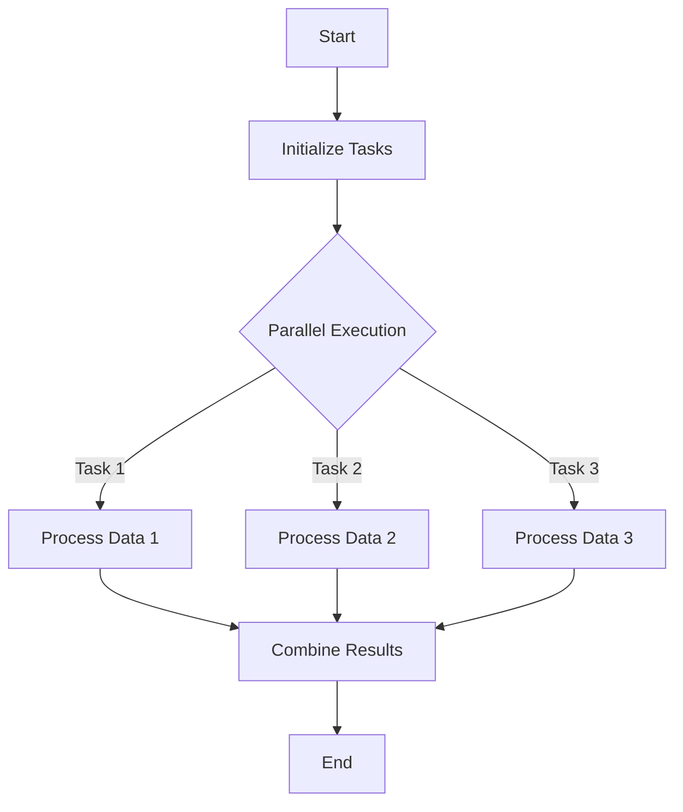

## 19.4 Optimizing Asynchronous and Parallel Code

In the modern landscape of software development, optimizing asynchronous and parallel code is crucial for achieving high performance and responsiveness in applications. This section will guide you through the intricacies of enhancing the performance of asynchronous and parallel code in F#. We will explore strategies to write efficient concurrent programs that maximize resource utilization while avoiding common concurrency pitfalls.

### Understanding Concurrency in F#

Concurrency in F# is primarily handled through asynchronous workflows and the Task Parallel Library (TPL). Let's briefly recap these concepts:

#### Asynchronous Workflows

F# provides a powerful abstraction for asynchronous programming through `async` workflows. These workflows allow you to write non-blocking code that can perform IO-bound operations efficiently. The `async` keyword is used to define asynchronous computations, and the `Async.RunSynchronously` function can be used to execute them.

```fsharp
let asyncComputation = async {
    // Perform some asynchronous operation
    let! result = Async.Sleep 1000
    return result
}

// Run the asynchronous computation
let result = Async.RunSynchronously asyncComputation
```

#### Task Parallel Library (TPL)

The Task Parallel Library (TPL) in .NET provides a rich set of APIs for parallel programming. F# can leverage TPL to perform CPU-bound operations concurrently. The `Parallel` class in TPL offers methods like `Parallel.For` and `Parallel.ForEach` to execute loops in parallel.

```fsharp
open System.Threading.Tasks

let numbers = [| 1; 2; 3; 4; 5 |]
Parallel.For(0, numbers.Length, fun i ->
    // Perform parallel computation
    printfn "Processing number: %d" numbers.[i]
)
```

### Performance Challenges

When dealing with concurrent code, several performance challenges can arise. Identifying and mitigating these issues is key to optimizing performance:

- **Contention**: Occurs when multiple threads compete for shared resources, leading to performance degradation.
- **Overhead from Excessive Task Creation**: Creating too many tasks can overwhelm the system's task scheduler, leading to inefficiencies.
- **Improper Synchronization**: Can lead to race conditions, deadlocks, and inconsistent data states.

### Optimizing Asynchronous Code

To optimize asynchronous code in F#, consider the following strategies:

#### Efficient Use of `async` Workflows

Efficiently using `async` workflows involves minimizing blocking calls and leveraging asynchronous sequences (`AsyncSeq`) for data streams.

```fsharp
open FSharp.Control

let asyncSeqExample = asyncSeq {
    for i in 1..5 do
        // Yield each number asynchronously
        yield! Async.Sleep 1000
        yield i
}

// Process the asynchronous sequence
asyncSeqExample
|> AsyncSeq.iter (printfn "Received: %d")
|> Async.RunSynchronously
```

#### Avoid Blocking Calls

Blocking calls within `async` workflows can negate the benefits of concurrency. Ensure that all IO-bound operations are performed asynchronously.

```fsharp
let fetchDataAsync url = async {
    use client = new System.Net.Http.HttpClient()
    let! data = client.GetStringAsync(url) |> Async.AwaitTask
    return data
}
```

### Optimizing Parallel Code

Parallel code optimization involves selecting appropriate parallel constructs and balancing workloads effectively.

#### Using Parallel Constructs

F# provides several constructs for parallel execution, such as `Parallel.For`, `Array.Parallel`, and `PSeq`. Choose the right construct based on the nature of your task.

```fsharp
open System.Threading.Tasks

let parallelComputation() =
    Parallel.For(0, 10, fun i ->
        printfn "Processing item: %d" i
    )
```

#### Choosing Degrees of Parallelism

The degree of parallelism determines how many tasks can run concurrently. It should be set based on the number of available CPU cores and the nature of the tasks.

```fsharp
let options = ParallelOptions(MaxDegreeOfParallelism = Environment.ProcessorCount)
Parallel.For(0, 10, options, fun i ->
    printfn "Processing item: %d" i
)
```

#### Balancing Workloads

Ensure that workloads are evenly distributed across tasks to prevent resource underutilization. This can be achieved by partitioning data effectively.

### Avoiding Common Pitfalls

Concurrency pitfalls can severely impact performance and reliability. Here are some common issues and how to avoid them:

#### Improper Synchronization

Improper synchronization can lead to race conditions and deadlocks. Use synchronization primitives like locks and semaphores judiciously.

```fsharp
let lockObj = obj()
let mutable sharedResource = 0

let updateResource() =
    lock lockObj (fun () ->
        sharedResource <- sharedResource + 1
    )
```

#### Thread Pool Starvation

Thread pool starvation occurs when all threads are busy, preventing new tasks from starting. Mitigate this by limiting task creation and using asynchronous programming.

### Tools for Analyzing Concurrent Code

Profiling and diagnostic tools are invaluable for identifying concurrency issues. Here are some tools you can use:

#### Concurrency Visualizer in Visual Studio

The Concurrency Visualizer helps you analyze thread activity and identify bottlenecks in your concurrent code.

#### dotTrace for Thread Analysis

dotTrace is a powerful tool for profiling .NET applications. It provides insights into thread activity and helps identify performance bottlenecks.

### Best Practices

Adhering to best practices can significantly enhance the performance of your concurrent code:

- **Minimize Shared State**: Use immutable data structures to reduce contention.
- **Design Independent Tasks**: Ensure tasks can run independently to maximize concurrency.
- **Thorough Testing**: Conduct stress tests and concurrent execution tests to validate performance.

### Advanced Techniques

For more advanced concurrency management, consider using actors and agents:

#### Actors and Agents (`MailboxProcessor`)

Actors and agents provide a message-passing model for concurrency, reducing the need for explicit synchronization.

```fsharp
let agent = MailboxProcessor.Start(fun inbox ->
    let rec loop() = async {
        let! msg = inbox.Receive()
        printfn "Received message: %s" msg
        return! loop()
    }
    loop()
)

agent.Post("Hello, Agent!")
```

#### Concurrent Collections and Synchronization Primitives

When shared state is necessary, use concurrent collections and synchronization primitives to manage access safely.

### Real-World Examples

Let's explore some real-world examples where optimizing asynchronous and parallel code resulted in significant performance gains:

#### Case Study: Web Server Optimization

A web server handling thousands of concurrent requests was optimized by replacing blocking IO operations with asynchronous workflows, reducing response times by 50%.

#### Case Study: Data Processing Pipeline

A data processing pipeline was optimized by parallelizing CPU-bound tasks using TPL, resulting in a 3x increase in throughput.

### Try It Yourself

Experiment with the provided code examples by modifying parameters, such as the degree of parallelism or the size of data sets, to observe the impact on performance.

### Visualizing Concurrency

To better understand the flow of concurrent operations, let's visualize a simple parallel computation using a flowchart:



This diagram illustrates the parallel execution of tasks and the subsequent combination of results, highlighting the flow of operations in a concurrent program.

### Knowledge Check

Before we conclude, let's reinforce the key concepts covered in this section:

- How does F# handle asynchronous and parallel programming?
- What are common performance challenges in concurrent code?
- How can you optimize asynchronous workflows in F#?
- What are the best practices for optimizing parallel code?
- How can you avoid common concurrency pitfalls?

### Embrace the Journey

Remember, optimizing asynchronous and parallel code is an ongoing journey. As you gain experience, you'll develop a deeper understanding of concurrency patterns and techniques. Keep experimenting, stay curious, and enjoy the process of crafting high-performance applications!

## Quiz Time!



### What is the primary abstraction for asynchronous programming in F#?

- [x] `async` workflows
- [ ] Task Parallel Library (TPL)
- [ ] Threads
- [ ] Locks

> **Explanation:** F# uses `async` workflows as the primary abstraction for asynchronous programming, allowing for non-blocking IO operations.

### Which tool can help you analyze thread activity and identify bottlenecks in concurrent code?

- [ ] F# Interactive
- [x] Concurrency Visualizer
- [ ] NUnit
- [ ] Paket

> **Explanation:** The Concurrency Visualizer in Visual Studio helps analyze thread activity and identify bottlenecks in concurrent code.

### What is a common issue that arises from creating too many tasks?

- [ ] Increased parallelism
- [x] Overhead from excessive task creation
- [ ] Improved performance
- [ ] Reduced contention

> **Explanation:** Creating too many tasks can lead to overhead and inefficiencies, as the system's task scheduler may become overwhelmed.

### How can you mitigate thread pool starvation?

- [ ] Increase shared state
- [ ] Use more locks
- [x] Limit task creation and use asynchronous programming
- [ ] Decrease the number of threads

> **Explanation:** Thread pool starvation can be mitigated by limiting task creation and using asynchronous programming to free up threads.

### What is the purpose of the `MailboxProcessor` in F#?

- [ ] To manage shared state
- [x] To provide a message-passing model for concurrency
- [ ] To perform blocking IO operations
- [ ] To increase task creation

> **Explanation:** The `MailboxProcessor` in F# provides a message-passing model for concurrency, reducing the need for explicit synchronization.

### Which of the following is NOT a common concurrency pitfall?

- [ ] Race conditions
- [ ] Deadlocks
- [ ] Thread pool starvation
- [x] Immutable data structures

> **Explanation:** Immutable data structures are not a concurrency pitfall; they help minimize shared state and reduce contention.

### What should you consider when choosing the degree of parallelism?

- [x] The number of available CPU cores
- [ ] The amount of shared state
- [ ] The number of locks
- [ ] The size of the task queue

> **Explanation:** The degree of parallelism should be set based on the number of available CPU cores and the nature of the tasks.

### Which construct is used for parallel execution in F#?

- [ ] `async`
- [x] `Parallel.For`
- [ ] `lock`
- [ ] `MailboxProcessor`

> **Explanation:** `Parallel.For` is a construct used for parallel execution in F#, allowing loops to run concurrently.

### What is a benefit of using immutable data structures in concurrent code?

- [ ] Increased contention
- [x] Reduced contention
- [ ] More race conditions
- [ ] Increased deadlocks

> **Explanation:** Immutable data structures reduce contention by minimizing shared state, leading to fewer concurrency issues.

### True or False: Blocking calls within `async` workflows can negate the benefits of concurrency.

- [x] True
- [ ] False

> **Explanation:** Blocking calls within `async` workflows can negate the benefits of concurrency by causing delays and reducing responsiveness.




