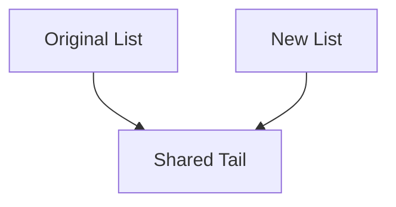

## 2.1 Immutability and Persistent Data Structures

In the world of functional programming, immutability and persistent data structures are foundational concepts that enable developers to write more predictable, reliable, and maintainable code. In this section, we will delve into these concepts, exploring their significance, benefits, and practical applications in F#. By the end of this guide, you will have a comprehensive understanding of how to leverage immutability and persistent data structures to enhance your software development practices.

### Understanding Immutability

**Immutability** refers to the concept of data that cannot be changed once it has been created. In functional programming, immutability is a core principle that underpins many of the advantages associated with this paradigm. By ensuring that data remains unchanged, we can eliminate side effects, making our code easier to reason about and inherently thread-safe.

#### Significance of Immutability

1. **Easier Reasoning About Code**: When data is immutable, you can be confident that it will not change unexpectedly. This predictability simplifies reasoning about code behavior, especially in complex systems.

2. **Thread Safety**: Immutability naturally leads to thread-safe code. Since immutable data cannot be altered, concurrent threads can safely share data without the risk of race conditions.

3. **Elimination of Side Effects**: Functions that operate on immutable data are pure, meaning they do not produce side effects. This purity allows for more reliable and testable code.

### Benefits of Immutability

Immutability offers several benefits that contribute to the robustness and maintainability of software systems:

- **Predictability**: Immutable data structures provide a stable foundation for building applications, reducing the likelihood of bugs caused by unexpected state changes.

- **Simplified Debugging**: With immutable data, you can trace the flow of data through your application with confidence, knowing that it remains unchanged.

- **Enhanced Modularity**: Immutability encourages a functional style of programming, promoting the use of small, composable functions that are easier to test and reuse.

### Persistent Data Structures

**Persistent data structures** are a class of data structures that preserve the previous version of themselves when modified. In contrast to traditional mutable data structures, persistent data structures enable efficient updates without altering the original data.

#### How Persistent Data Structures Differ

- **Structural Sharing**: Persistent data structures achieve efficiency through structural sharing, where new versions of the structure share parts of the old structure rather than duplicating it entirely.

- **Immutable Updates**: Updates to persistent data structures produce new structures, leaving the original unchanged. This characteristic aligns with the principles of immutability.

### Common Persistent Data Structures in F#

F# provides several built-in persistent data structures that are commonly used in functional programming:

#### Immutable Lists

Immutable lists in F# are a fundamental data structure that supports efficient operations like head and tail access. Here's how you can create and use an immutable list:

```fsharp
// Creating an immutable list
let numbers = [1; 2; 3; 4; 5]

// Accessing elements
let firstElement = List.head numbers
let remainingElements = List.tail numbers

// Adding elements (produces a new list)
let newNumbers = 0 :: numbers

// Printing the lists
printfn "Original List: %A" numbers
printfn "New List: %A" newNumbers
```

#### Immutable Arrays

Immutable arrays provide a fixed-size collection of elements, offering efficient random access:

```fsharp
// Creating an immutable array
let numbersArray = [|1; 2; 3; 4; 5|]

// Accessing elements
let thirdElement = numbersArray.[2]

// Creating a new array with an updated element
let updatedArray = numbersArray |> Array.mapi (fun i x -> if i = 2 then x * 2 else x)

// Printing the arrays
printfn "Original Array: %A" numbersArray
printfn "Updated Array: %A" updatedArray
```

#### Immutable Maps

Immutable maps are key-value collections that provide efficient lookups:

```fsharp
// Creating an immutable map
let capitals = Map.ofList [("USA", "Washington, D.C."); ("France", "Paris"); ("Japan", "Tokyo")]

// Accessing values
let capitalOfFrance = capitals.["France"]

// Adding a new key-value pair
let updatedCapitals = capitals.Add("Germany", "Berlin")

// Printing the maps
printfn "Original Map: %A" capitals
printfn "Updated Map: %A" updatedCapitals
```

#### Immutable Sets

Immutable sets are collections of unique elements:

```fsharp
// Creating an immutable set
let numbersSet = Set.ofList [1; 2; 3; 4; 5]

// Adding an element
let updatedSet = numbersSet.Add(6)

// Checking membership
let containsThree = numbersSet.Contains(3)

// Printing the sets
printfn "Original Set: %A" numbersSet
printfn "Updated Set: %A" updatedSet
```

### Efficient Updates with Structural Sharing

Persistent data structures achieve efficient updates through **structural sharing**, where new versions of the structure share parts of the old structure. This approach minimizes memory usage and enhances performance.

#### Example of Structural Sharing

Consider a scenario where we update an immutable list:

```fsharp
let originalList = [1; 2; 3]
let newList = 0 :: originalList

// Both lists share the tail [2; 3]
```

In this example, `newList` shares the tail `[2; 3]` with `originalList`, demonstrating structural sharing.

### Performance Considerations

While persistent data structures offer numerous benefits, they also come with performance considerations. F# handles these efficiently through techniques like lazy evaluation and optimized data structures.

#### Lazy Evaluation

Lazy evaluation defers computation until the result is needed, reducing unnecessary calculations and improving performance.

#### Optimized Data Structures

F#'s built-in data structures are optimized for performance, leveraging techniques like hash tables for efficient lookups in maps.

### Scenarios for Immutability

Immutability is particularly beneficial in scenarios where:

- **Concurrency**: Multiple threads access shared data, eliminating the need for synchronization mechanisms.
- **Functional Programming**: Encourages a declarative style, focusing on what to do rather than how to do it.
- **Code Maintenance**: Immutable codebases are easier to maintain and extend, reducing the risk of introducing bugs.

### Common Misconceptions

Despite its advantages, immutability is sometimes perceived as inefficient or inflexible. However, these misconceptions can be addressed:

- **Efficiency**: Persistent data structures use structural sharing to minimize memory usage and improve performance.
- **Flexibility**: Immutability encourages a functional style that promotes flexibility through composition and higher-order functions.

### Encouraging Immutability

Adopting immutability as a default approach in F# programming can lead to safer, more maintainable code. By leveraging persistent data structures and embracing functional principles, you can build robust applications that stand the test of time.

### Try It Yourself

Experiment with the code examples provided in this section. Try modifying the lists, arrays, maps, and sets to see how immutability and structural sharing work in practice. Consider the following challenges:

- Modify an immutable list by adding and removing elements.
- Create a new map with additional key-value pairs and observe the sharing.
- Implement a function that processes an immutable set and returns a new set with filtered elements.

### Visualizing Immutability and Structural Sharing

To better understand how immutability and structural sharing work, let's visualize these concepts using a diagram:



**Diagram Description**: This diagram illustrates how the original list and the new list share the same tail, demonstrating structural sharing.

### References and Further Reading

- [MDN Web Docs on Immutability](https://developer.mozilla.org/en-US/docs/Glossary/Immutable)
- [F# Documentation on Collections](https://docs.microsoft.com/en-us/dotnet/fsharp/language-reference/fsharp-collections)

### Knowledge Check

Before moving on, consider the following questions:

- What are the main benefits of immutability in functional programming?
- How do persistent data structures achieve efficient updates?
- Why is structural sharing important in the context of immutability?

### Embrace the Journey

Remember, immutability and persistent data structures are powerful tools in your F# programming arsenal. As you continue your journey, keep experimenting with these concepts, and you'll discover new ways to build efficient, reliable, and maintainable applications. Stay curious, and enjoy the process of mastering functional programming in F#!

## Quiz Time!



### What is immutability in the context of functional programming?

- [x] Data that cannot be changed once created
- [ ] Data that can be changed frequently
- [ ] Data that is stored in a mutable structure
- [ ] Data that is always stored in memory

> **Explanation:** Immutability refers to data that cannot be changed once it has been created, a core principle in functional programming.

### What is a key benefit of immutability?

- [x] Easier reasoning about code
- [ ] Increased memory usage
- [ ] More complex code
- [ ] Slower performance

> **Explanation:** Immutability makes it easier to reason about code, as data does not change unexpectedly.

### How do persistent data structures differ from traditional mutable data structures?

- [x] They preserve previous versions of themselves when modified
- [ ] They are always slower
- [ ] They use more memory
- [ ] They cannot be used in functional programming

> **Explanation:** Persistent data structures preserve previous versions of themselves when modified, unlike traditional mutable data structures.

### What is structural sharing?

- [x] Sharing parts of the old structure in new versions
- [ ] Duplicating the entire structure
- [ ] Using mutable data
- [ ] Storing data in a database

> **Explanation:** Structural sharing involves sharing parts of the old structure in new versions, minimizing memory usage.

### Which of the following is a common persistent data structure in F#?

- [x] Immutable List
- [ ] Mutable Array
- [ ] Dynamic Object
- [ ] Variable Tuple

> **Explanation:** Immutable lists are a common persistent data structure in F#.

### What is a misconception about immutability?

- [x] It is inefficient
- [ ] It is thread-safe
- [ ] It simplifies debugging
- [ ] It eliminates side effects

> **Explanation:** A common misconception is that immutability is inefficient, but persistent data structures are optimized for performance.

### What technique does F# use to handle performance considerations in persistent data structures?

- [x] Lazy Evaluation
- [ ] Immediate Execution
- [ ] Mutable State
- [ ] Synchronous Processing

> **Explanation:** F# uses lazy evaluation to defer computation until necessary, improving performance.

### Why is immutability beneficial in concurrent programming?

- [x] It eliminates the need for synchronization mechanisms
- [ ] It increases the complexity of code
- [ ] It requires more memory
- [ ] It slows down execution

> **Explanation:** Immutability eliminates the need for synchronization mechanisms, making concurrent programming safer.

### What is an example of an immutable data structure in F#?

- [x] Immutable Map
- [ ] Mutable List
- [ ] Dynamic Array
- [ ] Variable Dictionary

> **Explanation:** Immutable maps are an example of immutable data structures in F#.

### True or False: Immutability encourages a functional style that promotes flexibility through composition and higher-order functions.

- [x] True
- [ ] False

> **Explanation:** True. Immutability encourages a functional style that promotes flexibility through composition and higher-order functions.


