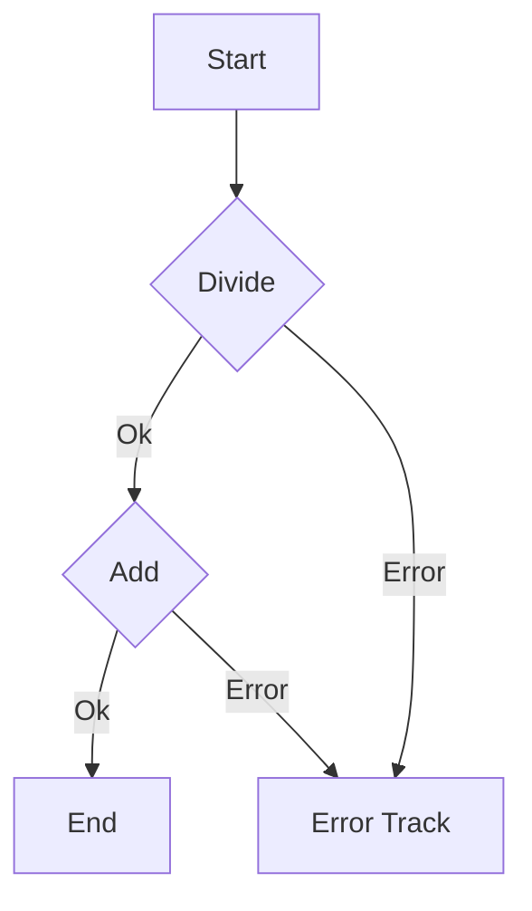

## 2.10 Error Handling in Functional Programming

In the realm of functional programming, error handling is a crucial aspect that significantly influences the robustness and maintainability of applications. F# provides powerful constructs such as `Option` and `Result` types, along with the Railway-Oriented Programming (ROP) pattern, to manage errors effectively. This section delves into these constructs and patterns, offering insights and practical examples to help you master error handling in F#.

### Challenges of Error Handling in Functional Programming

Error handling in functional programming poses unique challenges compared to imperative programming. In functional languages, the emphasis is on immutability and pure functions, which means side effects, including error handling, must be managed explicitly. This requires a shift from traditional exception-based error handling to more declarative approaches.

Functional programming encourages the use of types to represent the possibility of failure, making the handling of errors explicit and type-safe. This approach not only improves code clarity but also enhances reliability by ensuring that all potential error cases are considered at compile time.

### Introducing the `Option` Type

The `Option` type in F# is a fundamental construct for representing the presence or absence of a value. It is akin to nullable types in other languages but offers a more robust and type-safe way to handle optional values.

```fsharp
type Option<'T> =
    | Some of 'T
    | None
```

The `Option` type is a discriminated union with two cases: `Some`, which contains a value, and `None`, which represents the absence of a value. This type is particularly useful for functions that may not return a meaningful result for every input.

#### Handling `Some` and `None` Cases Using Pattern Matching

Pattern matching is a powerful feature in F# that allows you to deconstruct and analyze data structures. When working with `Option` types, pattern matching enables you to handle `Some` and `None` cases elegantly.

```fsharp
let divide x y =
    if y = 0 then None
    else Some (x / y)

let result = divide 10 2

match result with
| Some value -> printfn "Result: %d" value
| None -> printfn "Division by zero is not allowed."
```

In this example, the `divide` function returns an `Option<int>`. The pattern matching construct is used to handle both `Some` and `None` cases, providing a clear and concise way to manage potential errors.

### Introducing the `Result` Type

While the `Option` type is suitable for representing the presence or absence of a value, the `Result` type is more appropriate for computations that can succeed or fail, carrying success or error information.

```fsharp
type Result<'T, 'Error> =
    | Ok of 'T
    | Error of 'Error
```

The `Result` type is a discriminated union with two cases: `Ok`, which contains a success value, and `Error`, which contains error information. This type is ideal for functions that can fail in various ways, providing a mechanism to capture and propagate errors.

#### Using `Result` with Examples

Let's explore how to use the `Result` type in F# through practical examples.

```fsharp
let parseNumber input =
    match System.Int32.TryParse(input) with
    | (true, number) -> Ok number
    | (false, _) -> Error "Invalid number format."

let result = parseNumber "123"

match result with
| Ok number -> printfn "Parsed number: %d" number
| Error errMsg -> printfn "Error: %s" errMsg
```

In this example, the `parseNumber` function attempts to parse a string into an integer, returning a `Result<int, string>`. The pattern matching construct is used to handle both `Ok` and `Error` cases, allowing for clear and explicit error handling.

### Railway-Oriented Programming (ROP)

Railway-Oriented Programming (ROP) is a design pattern that simplifies error handling by chaining computations that can fail. The pattern is inspired by the metaphor of a railway track, where computations are represented as tracks, and errors cause the computation to switch to an error track.

#### Implementing ROP with `bind` and Computation Expressions

In F#, ROP can be implemented using the `bind` function or computation expressions. The `bind` function allows you to chain computations while handling errors gracefully.

```fsharp
let bind f result =
    match result with
    | Ok value -> f value
    | Error err -> Error err

let divide x y =
    if y = 0 then Error "Division by zero."
    else Ok (x / y)

let add x y = Ok (x + y)

let result = 
    divide 10 2
    |> bind (add 5)

match result with
| Ok value -> printfn "Final result: %d" value
| Error errMsg -> printfn "Error: %s" errMsg
```

In this example, the `bind` function is used to chain the `divide` and `add` functions. If any computation fails, the error is propagated, and subsequent computations are skipped.

F# also supports computation expressions, which provide a more concise syntax for implementing ROP.

```fsharp
let result = result {
    let! quotient = divide 10 2
    let! sum = add quotient 5
    return sum
}

match result with
| Ok value -> printfn "Final result: %d" value
| Error errMsg -> printfn "Error: %s" errMsg
```

The `result` computation expression allows you to chain computations using the `let!` syntax, automatically handling errors and propagating them as needed.

#### Practical Examples of ROP

Let's consider a practical example where ROP simplifies complex error handling logic.

```fsharp
let validateInput input =
    if String.IsNullOrWhiteSpace(input) then Error "Input cannot be empty."
    else Ok input

let parseAndDivide input divisor =
    result {
        let! validatedInput = validateInput input
        let! number = parseNumber validatedInput
        let! quotient = divide number divisor
        return quotient
    }

let result = parseAndDivide "100" 5

match result with
| Ok value -> printfn "Quotient: %d" value
| Error errMsg -> printfn "Error: %s" errMsg
```

In this example, the `parseAndDivide` function chains multiple computations using ROP, handling errors at each step. The use of computation expressions makes the code concise and easy to read.

### Best Practices for Choosing Between `Option`, `Result`, and Exceptions

When deciding between `Option`, `Result`, and exceptions, consider the following best practices:

- **Use `Option`** when a value may be absent but there is no error information to convey.
- **Use `Result`** when a computation can fail in multiple ways, and you need to capture error information.
- **Use exceptions** for unexpected errors that cannot be handled at the point of occurrence, such as system-level failures.

### Encouraging Functional Error Handling Patterns

Adopting functional error handling patterns in F# leads to more reliable and maintainable code. By using types to represent errors, you make error handling explicit and type-safe, reducing the likelihood of runtime errors and improving code clarity.

### Try It Yourself

Experiment with the code examples provided in this section. Try modifying the `divide` and `add` functions to handle different types of errors. Explore how changes in one part of the computation affect the overall result. This hands-on approach will deepen your understanding of error handling in F#.

### Visualizing Railway-Oriented Programming

To further illustrate Railway-Oriented Programming, let's visualize the flow of computations and error handling using a Mermaid.js diagram.



This diagram represents the flow of computations in ROP, where each step can either succeed and continue on the main track or fail and switch to the error track.

### Knowledge Check

Before we conclude, let's summarize the key takeaways from this section:

- **`Option` and `Result` types** provide a type-safe way to handle errors in F#.
- **Pattern matching** is essential for handling `Some`, `None`, `Ok`, and `Error` cases.
- **Railway-Oriented Programming** simplifies error handling by chaining computations and propagating errors.
- **Choosing the right error handling construct** depends on the nature of the computation and the need for error information.

Remember, mastering error handling in functional programming is a journey. Keep experimenting, stay curious, and enjoy the process of building robust and maintainable applications in F#.

## Quiz Time!



### What is the primary purpose of the `Option` type in F#?

- [x] To represent the presence or absence of a value
- [ ] To handle exceptions
- [ ] To perform asynchronous operations
- [ ] To manage state changes

> **Explanation:** The `Option` type is used to represent the presence or absence of a value, providing a type-safe way to handle optional values.


### How does the `Result` type differ from the `Option` type?

- [x] It carries success or error information
- [ ] It is used for asynchronous operations
- [ ] It represents the presence or absence of a value
- [ ] It is used for state management

> **Explanation:** The `Result` type is used for computations that can succeed or fail, carrying success or error information, unlike the `Option` type, which only represents the presence or absence of a value.


### What is Railway-Oriented Programming (ROP) primarily used for?

- [x] Chaining computations that can fail
- [ ] Managing state changes
- [ ] Performing asynchronous operations
- [ ] Handling exceptions

> **Explanation:** Railway-Oriented Programming is a pattern used for chaining computations that can fail, allowing for clear and concise error handling.


### Which function is commonly used to implement ROP in F#?

- [x] bind
- [ ] map
- [ ] filter
- [ ] reduce

> **Explanation:** The `bind` function is commonly used to implement Railway-Oriented Programming in F#, allowing for chaining computations and handling errors.


### In F#, when should you prefer using `Option` over `Result`?

- [x] When a value may be absent without error information
- [ ] When a computation can fail in multiple ways
- [ ] When handling exceptions
- [ ] When performing asynchronous operations

> **Explanation:** You should prefer using `Option` when a value may be absent, but there is no error information to convey, making it suitable for optional values.


### What is a key benefit of using pattern matching with `Option` and `Result` types?

- [x] It provides a clear and concise way to handle different cases
- [ ] It simplifies asynchronous operations
- [ ] It enhances state management
- [ ] It improves performance

> **Explanation:** Pattern matching provides a clear and concise way to handle different cases, such as `Some`, `None`, `Ok`, and `Error`, making error handling explicit and type-safe.


### What does the `let!` syntax in computation expressions facilitate?

- [x] Chaining computations while handling errors
- [ ] Performing asynchronous operations
- [ ] Managing state changes
- [ ] Handling exceptions

> **Explanation:** The `let!` syntax in computation expressions facilitates chaining computations while handling errors, allowing for concise and readable code.


### What is a best practice for choosing between `Option`, `Result`, and exceptions?

- [x] Use `Option` for optional values, `Result` for computations with error information, and exceptions for unexpected errors
- [ ] Use `Result` for all error handling
- [ ] Use exceptions for all error handling
- [ ] Use `Option` for all error handling

> **Explanation:** A best practice is to use `Option` for optional values, `Result` for computations that can fail with error information, and exceptions for unexpected errors that cannot be handled at the point of occurrence.


### What is the primary goal of adopting functional error handling patterns in F#?

- [x] To write more reliable and maintainable code
- [ ] To improve performance
- [ ] To manage state changes
- [ ] To simplify asynchronous operations

> **Explanation:** The primary goal of adopting functional error handling patterns in F# is to write more reliable and maintainable code by making error handling explicit and type-safe.


### True or False: Railway-Oriented Programming can only be implemented using the `bind` function.

- [ ] True
- [x] False

> **Explanation:** False. Railway-Oriented Programming can be implemented using both the `bind` function and computation expressions, providing flexibility in how computations are chained and errors are handled.


