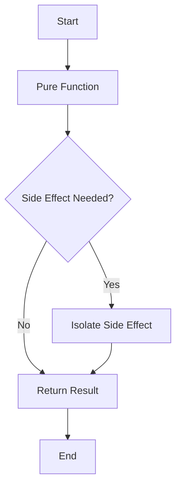

## 2.2 Pure Functions and Side Effects

In the realm of functional programming, pure functions and side effects are fundamental concepts that influence how we design, implement, and reason about our code. Understanding these concepts is crucial for building robust, maintainable, and testable applications in F#. In this section, we will delve into the characteristics of pure functions, explore the nature of side effects, and discuss strategies for managing them effectively.

### Defining Pure Functions

Pure functions are the cornerstone of functional programming. They are defined by two key characteristics:

1. **Deterministic Output**: A pure function always produces the same output given the same input. This predictability makes them easy to reason about and test.

2. **Absence of Side Effects**: Pure functions do not alter any state or interact with the outside world. They do not perform I/O operations, modify global variables, or rely on mutable state.

#### Example of a Pure Function in F#

```fsharp
// A simple pure function that adds two numbers
let add x y = x + y

// Usage
let result = add 3 5  // result is always 8
```

In this example, the `add` function is pure because it consistently returns the same result for the same inputs and does not modify any external state.

### Understanding Side Effects

Side effects occur when a function interacts with the outside world or changes the state of the program. Common side effects include:

- **I/O Operations**: Reading from or writing to files, databases, or network sockets.
- **State Mutations**: Modifying variables or data structures outside the function's scope.
- **Exception Handling**: Throwing or catching exceptions.

Side effects can make programs less predictable and harder to test. They introduce dependencies on external factors, which can lead to bugs and unexpected behavior.

#### Example of a Function with Side Effects in F#

```fsharp
// A function that logs a message to the console
let logMessage message =
    printfn "Log: %s" message

// Usage
logMessage "This is a side effect"
```

The `logMessage` function has a side effect because it interacts with the console, an external system.

### Advantages of Using Pure Functions

Pure functions offer several benefits that enhance the quality and maintainability of code:

- **Ease of Testing**: Pure functions are straightforward to test because they do not depend on external state or cause side effects.
- **Reasoning and Debugging**: Since pure functions are deterministic, it is easier to understand and debug their behavior.
- **Concurrency and Parallelism**: Pure functions can be executed concurrently without concerns about shared state or race conditions.

### Strategies for Managing Side Effects

While pure functions are ideal, side effects are sometimes necessary, especially when interacting with the real world. Here are strategies to manage side effects responsibly:

#### 1. Isolate Side Effects

Encapsulate side effects in specific parts of your codebase, separating them from the pure logic. This separation makes it easier to test and reason about the core functionality.

#### 2. Use Functional Constructs

F# provides constructs like `Async`, `Option`, and `Result` to handle side effects in a controlled manner.

##### Using `Async` for Asynchronous Operations

```fsharp
open System.Net

// An asynchronous function to fetch data from a URL
let fetchDataAsync url =
    async {
        let request = WebRequest.Create(url)
        use! response = request.AsyncGetResponse()
        use stream = response.GetResponseStream()
        use reader = new System.IO.StreamReader(stream)
        return reader.ReadToEnd()
    }

// Usage
let data = fetchDataAsync "http://example.com" |> Async.RunSynchronously
```

In this example, `Async` is used to handle the side effect of network I/O asynchronously, allowing the rest of the program to remain pure.

##### Using `Option` and `Result` for Error Handling

```fsharp
// A function that safely parses an integer from a string
let tryParseInt (s: string) : int option =
    match System.Int32.TryParse(s) with
    | (true, result) -> Some result
    | _ -> None

// Usage
let parsedValue = tryParseInt "123"  // Some 123
let failedParse = tryParseInt "abc"  // None
```

The `Option` type is used to represent the presence or absence of a value, avoiding exceptions and making error handling explicit.

### Refactoring Impure Functions into Pure Ones

Refactoring impure functions involves isolating side effects and extracting pure logic. Let's consider an example:

#### Impure Function

```fsharp
// An impure function that reads a file and processes its content
let processFile filePath =
    let content = System.IO.File.ReadAllText(filePath)
    printfn "Processing file: %s" filePath
    content.Length
```

#### Refactored Pure Function

```fsharp
// A pure function that processes content
let processContent content =
    content.Length

// A function that handles the side effect of reading a file
let readFile filePath =
    System.IO.File.ReadAllText(filePath)

// Usage
let filePath = "example.txt"
let content = readFile filePath
let result = processContent content
```

In this refactored version, the side effect of reading a file is isolated in the `readFile` function, while `processContent` remains pure.

### Best Practices for Maintaining Purity

1. **Strive for Purity**: Aim to write pure functions whenever possible. They are easier to test, reason about, and maintain.

2. **Isolate Side Effects**: Keep side effects at the boundaries of your application, encapsulating them in specific modules or functions.

3. **Use Functional Constructs**: Leverage F#'s functional constructs like `Async`, `Option`, and `Result` to manage side effects and handle errors gracefully.

4. **Refactor Impure Code**: Continuously refactor impure code to isolate side effects and extract pure logic.

5. **Embrace Immutability**: Prefer immutable data structures to avoid unintended state changes and enhance the predictability of your code.

### Try It Yourself

Experiment with the code examples provided. Try modifying the pure functions to introduce side effects and observe how it impacts testability and predictability. Refactor impure functions to isolate side effects and enhance purity.

### Visualizing Pure Functions and Side Effects

To better understand the flow of pure functions and side effects, let's visualize the process using a flowchart.



**Figure 1**: This flowchart illustrates the decision-making process when designing functions. If a side effect is needed, it should be isolated, allowing the core logic to remain pure.

### Conclusion

Pure functions and side effects are foundational concepts in functional programming that significantly impact code quality and maintainability. By striving for purity, isolating side effects, and leveraging functional constructs, we can build robust and testable applications in F#. Remember, this is just the beginning. As you progress, continue to explore and embrace the principles of functional programming to enhance your software development journey.

## Quiz Time!



### What is a characteristic of a pure function?

- [x] Deterministic output
- [ ] Performs I/O operations
- [ ] Modifies global state
- [ ] Relies on mutable state

> **Explanation:** Pure functions produce the same output for the same input and do not have side effects like I/O operations or state modifications.


### Which of the following is a common side effect?

- [x] I/O operations
- [ ] Deterministic output
- [ ] Immutable data structures
- [ ] Function composition

> **Explanation:** I/O operations are a common side effect as they interact with external systems.


### What is an advantage of using pure functions?

- [x] Ease of testing
- [ ] Increased complexity
- [ ] Reliance on global state
- [ ] Unpredictable behavior

> **Explanation:** Pure functions are easier to test due to their deterministic nature and lack of side effects.


### How can side effects be managed in F#?

- [x] Isolate them in specific functions
- [ ] Integrate them into all functions
- [ ] Use mutable variables
- [ ] Avoid using functional constructs

> **Explanation:** Side effects should be isolated to maintain purity in the core logic.


### Which F# construct is used for asynchronous operations?

- [x] Async
- [ ] Option
- [ ] Result
- [ ] List

> **Explanation:** `Async` is used to handle asynchronous operations in F#.


### What does the `Option` type represent?

- [x] Presence or absence of a value
- [ ] A list of values
- [ ] An asynchronous computation
- [ ] A mutable variable

> **Explanation:** The `Option` type is used to represent a value that may or may not be present.


### How can impure functions be refactored?

- [x] By isolating side effects
- [ ] By adding more side effects
- [ ] By using global variables
- [ ] By ignoring functional constructs

> **Explanation:** Refactoring impure functions involves isolating side effects and extracting pure logic.


### What is a benefit of immutability?

- [x] Predictability of code
- [ ] Increased complexity
- [ ] Reliance on mutable state
- [ ] Unpredictable behavior

> **Explanation:** Immutability enhances the predictability of code by preventing unintended state changes.


### Which of the following is a best practice for maintaining purity?

- [x] Embrace immutability
- [ ] Use mutable data structures
- [ ] Integrate side effects everywhere
- [ ] Avoid refactoring impure code

> **Explanation:** Embracing immutability helps maintain purity and predictability in code.


### True or False: Pure functions can modify global state.

- [ ] True
- [x] False

> **Explanation:** Pure functions do not modify global state; they are free of side effects.



