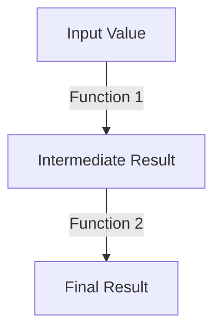

## 2.3 First-Class and Higher-Order Functions

In the realm of functional programming, the concepts of first-class and higher-order functions are pivotal. They enable developers to write more abstract, reusable, and composable code. In this section, we will delve into these concepts, exploring their significance and application in F#.

### Understanding First-Class Functions

First-class functions are a cornerstone of functional programming languages like F#. But what does it mean for functions to be "first-class citizens"? Simply put, it means that functions can be treated like any other data type. They can be:

- **Assigned to variables**: Just as you can assign a number or a string to a variable, you can assign a function.
- **Passed as arguments**: Functions can be passed as parameters to other functions.
- **Returned from functions**: Functions can return other functions as results.

This flexibility allows for powerful abstractions and a high degree of code reuse.

#### Assigning Functions to Variables

In F#, you can assign a function to a variable, allowing you to manipulate and pass it around your program.

```fsharp
let add x y = x + y
let addFunction = add

printfn "Result of addFunction: %d" (addFunction 5 7)
```

In this example, `add` is a function that takes two parameters and returns their sum. We assign `add` to `addFunction`, demonstrating that functions can be treated as values.

#### Passing Functions as Arguments

Passing functions as arguments is a powerful feature that allows you to abstract and generalize your code.

```fsharp
let applyFunction f x = f x

let square x = x * x
let result = applyFunction square 4

printfn "Result of applying function: %d" result
```

Here, `applyFunction` takes a function `f` and a value `x`, applying `f` to `x`. We pass the `square` function to `applyFunction`, illustrating how functions can be passed as parameters.

#### Returning Functions from Functions

Returning functions from other functions can lead to elegant and flexible code structures.

```fsharp
let createAdder x = 
    let adder y = x + y
    adder

let addFive = createAdder 5
printfn "Result of addFive: %d" (addFive 10)
```

In this example, `createAdder` returns a new function `adder` that adds a specific value `x` to its argument `y`. This showcases how functions can be returned from other functions, enabling the creation of specialized functions on the fly.

### Higher-Order Functions: Abstraction and Reusability

Higher-order functions (HOFs) are functions that take other functions as arguments or return them as results. They are crucial for abstracting repetitive patterns and enhancing code reusability.

#### Built-in Higher-Order Functions in F#

F# provides several built-in higher-order functions that are commonly used for data manipulation and transformation:

- **`map`**: Applies a function to each element of a collection, returning a new collection with the results.
- **`filter`**: Selects elements from a collection that satisfy a given predicate.
- **`fold`**: Accumulates a result by applying a function to each element of a collection, starting with an initial value.

##### Example: Using `map`

```fsharp
let numbers = [1; 2; 3; 4; 5]
let squaredNumbers = List.map (fun x -> x * x) numbers

printfn "Squared numbers: %A" squaredNumbers
```

In this example, `map` applies the anonymous function `(fun x -> x * x)` to each element of the `numbers` list, producing a new list of squared numbers.

##### Example: Using `filter`

```fsharp
let evenNumbers = List.filter (fun x -> x % 2 = 0) numbers

printfn "Even numbers: %A" evenNumbers
```

Here, `filter` selects only the even numbers from the `numbers` list, demonstrating how predicates can be used to filter collections.

##### Example: Using `fold`

```fsharp
let sum = List.fold (fun acc x -> acc + x) 0 numbers

printfn "Sum of numbers: %d" sum
```

`fold` accumulates the sum of the `numbers` list, starting with an initial value of `0`. This pattern is useful for reducing collections to a single value.

### Creating Custom Higher-Order Functions

Beyond using built-in HOFs, you can create your own to encapsulate common patterns and logic.

#### Example: Custom Higher-Order Function

```fsharp
let applyTwice f x = f (f x)

let increment x = x + 1
let result = applyTwice increment 5

printfn "Result of applyTwice: %d" result
```

In this example, `applyTwice` is a custom higher-order function that applies a given function `f` to an argument `x` twice. This demonstrates how you can create flexible and reusable abstractions.

### Benefits of Higher-Order Functions

Higher-order functions offer several advantages:

- **Code Reuse**: By abstracting common patterns, you can reuse logic across different parts of your application.
- **Composability**: Functions can be composed to build complex operations from simple ones.
- **Conciseness**: HOFs often lead to more concise and readable code.

#### Practical Use Cases

Higher-order functions are particularly useful in scenarios where you need to perform similar operations on different data sets or when implementing algorithms that can be parameterized with different behaviors.

- **Data Transformation**: Use `map` and `filter` to transform and filter data collections.
- **Event Handling**: Pass functions as callbacks to handle events or asynchronous operations.
- **Algorithm Customization**: Implement algorithms that can be customized with different strategies or behaviors.

### Avoiding Common Pitfalls

While powerful, working with functions as data can introduce challenges:

- **Complexity**: Overuse of HOFs can lead to code that is difficult to understand. Strive for balance and clarity.
- **Performance**: Be mindful of performance implications, especially in performance-critical sections of your code.
- **Debugging**: Debugging higher-order functions can be challenging. Use logging and testing to ensure correctness.

### Experimenting with Function Manipulation

To fully grasp the power of first-class and higher-order functions, experiment with different ways to manipulate and compose functions. Try modifying the examples provided, or create your own scenarios where these concepts can simplify your code.

### Visualizing Function Composition

To better understand how functions can be composed and applied, let's visualize the process using a flowchart.



This diagram illustrates the flow of data through a series of function applications, emphasizing the composability of functions in F#.

### Conclusion

First-class and higher-order functions are powerful tools in the functional programmer's toolkit. They enable abstraction, code reuse, and composability, making your code more flexible and maintainable. By understanding and applying these concepts, you can unlock new levels of expressiveness and efficiency in your F# applications.

Remember, this is just the beginning. As you progress, you'll discover even more ways to leverage these powerful concepts. Keep experimenting, stay curious, and enjoy the journey!

## Quiz Time!



### What does it mean for functions to be first-class citizens in F#?

- [x] Functions can be assigned to variables, passed as arguments, and returned from other functions.
- [ ] Functions can only be used within a specific scope.
- [ ] Functions cannot be manipulated like other data types.
- [ ] Functions are only used for mathematical operations.

> **Explanation:** First-class functions can be treated like any other data type, allowing them to be assigned, passed, and returned.

### Which of the following is an example of a higher-order function?

- [x] A function that takes another function as an argument.
- [ ] A function that performs arithmetic operations.
- [ ] A function that only returns a string.
- [ ] A function that does not accept any parameters.

> **Explanation:** Higher-order functions take other functions as arguments or return them as results.

### How does the `map` function in F# work?

- [x] It applies a given function to each element of a collection, returning a new collection.
- [ ] It filters elements from a collection based on a predicate.
- [ ] It accumulates a result by applying a function to each element.
- [ ] It sorts a collection in ascending order.

> **Explanation:** `map` transforms each element of a collection using a specified function.

### What is the purpose of the `fold` function in F#?

- [x] To accumulate a result by applying a function to each element of a collection, starting with an initial value.
- [ ] To filter elements from a collection.
- [ ] To apply a function to each element of a collection.
- [ ] To sort a collection of elements.

> **Explanation:** `fold` reduces a collection to a single value by applying a function iteratively.

### Which of the following is a benefit of using higher-order functions?

- [x] Code reuse and composability.
- [ ] Increased code complexity.
- [ ] Reduced code readability.
- [ ] Slower performance.

> **Explanation:** Higher-order functions promote code reuse and composability, making code more maintainable.

### What is a common pitfall when working with higher-order functions?

- [x] Overuse can lead to code that is difficult to understand.
- [ ] They cannot be used with collections.
- [ ] They are only applicable in mathematical computations.
- [ ] They do not support recursion.

> **Explanation:** While powerful, excessive use of HOFs can make code complex and hard to read.

### How can you create a custom higher-order function in F#?

- [x] By defining a function that takes another function as a parameter or returns a function.
- [ ] By writing a function that only performs arithmetic operations.
- [ ] By using only built-in functions.
- [ ] By avoiding the use of functions as parameters.

> **Explanation:** Custom HOFs are created by defining functions that accept or return other functions.

### What is a practical use case for higher-order functions?

- [x] Implementing algorithms that can be customized with different strategies.
- [ ] Performing basic arithmetic operations.
- [ ] Writing static HTML content.
- [ ] Creating immutable data structures.

> **Explanation:** HOFs allow for flexible and customizable algorithm implementations.

### How can you visualize function composition in F#?

- [x] By using flowcharts to illustrate the flow of data through function applications.
- [ ] By writing long paragraphs of code.
- [ ] By avoiding the use of diagrams.
- [ ] By using only textual descriptions.

> **Explanation:** Flowcharts can effectively represent the process of function composition.

### True or False: Higher-order functions can only be used with lists in F#.

- [ ] True
- [x] False

> **Explanation:** Higher-order functions can be used with various data structures, not just lists.


