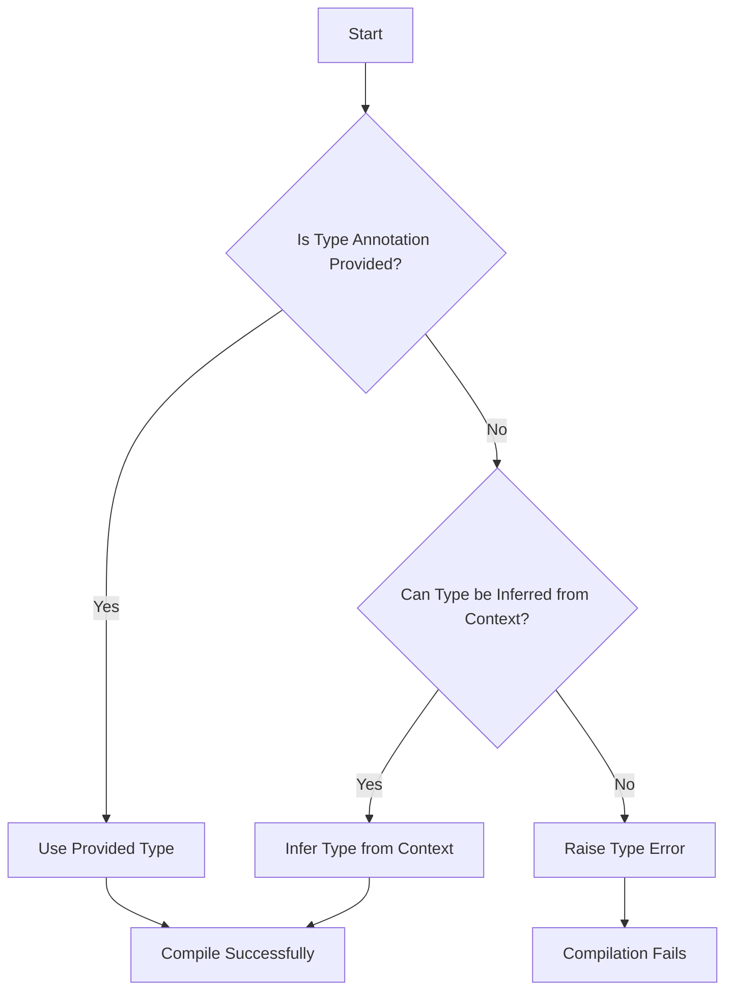

## 2.4 Strong Typing and Type Inference

In the realm of software development, the choice of programming language can significantly impact the reliability and maintainability of the codebase. F#, a functional-first language, is renowned for its strong static type system and powerful type inference capabilities. This section delves into these features, illustrating how they contribute to building robust, error-free applications.

### Understanding F#'s Strong Static Type System

F# is a statically typed language, meaning that type checking is performed at compile time rather than at runtime. This characteristic is pivotal in catching errors early in the development process, thereby reducing the likelihood of runtime exceptions. The strong typing in F# ensures that every expression has a type, and these types are enforced throughout the code.

#### What Does Strong Typing Entail?

Strong typing in F# means that once a variable is assigned a type, it cannot be implicitly converted to another type without explicit conversion. This prevents a host of common programming errors, such as type mismatches and unintended data manipulations. The compiler rigorously checks the types, ensuring that operations on variables are type-safe.

**Example: Strong Typing in Action**

```fsharp
let addNumbers (x: int) (y: int) : int =
    x + y

let result = addNumbers 5 10 // Correct usage
// let errorResult = addNumbers 5.0 10.0 // This will cause a compile-time error
```

In the example above, the function `addNumbers` is explicitly typed to accept integers. Attempting to pass a floating-point number results in a compile-time error, demonstrating the safety provided by strong typing.

### Type Inference: The Compiler's Intelligence

One of F#'s standout features is its ability to infer types without explicit annotations. The F# compiler analyzes the code context to deduce the types of variables and expressions, simplifying the developer's task while maintaining type safety.

#### How Type Inference Works

Type inference in F# leverages the context in which a variable or function is used to determine its type. This reduces the need for verbose type annotations, allowing for more concise and readable code.

**Example: Type Inference in F#**

```fsharp
let multiply x y = x * y

let inferredResult = multiply 3 4 // Inferred as int
let inferredFloatResult = multiply 3.0 4.0 // Inferred as float
```

In this example, the `multiply` function does not have explicit type annotations. The compiler infers the types based on the arguments provided during function calls.

### Benefits of Strong Typing and Type Inference

The combination of strong typing and type inference in F# offers several advantages:

1. **Error Detection at Compile-Time**: By catching type-related errors early, developers can avoid many runtime exceptions, leading to more reliable applications.

2. **Code Clarity and Maintainability**: Type inference reduces boilerplate code, making programs easier to read and maintain.

3. **Flexibility with Safety**: F# strikes a balance between flexibility and safety, allowing developers to write expressive code without sacrificing type safety.

4. **Enhanced Productivity**: With less need for explicit type declarations, developers can focus on logic and functionality, improving productivity.

### Advanced Type System Features

F#'s type system is not only robust but also versatile, offering advanced features such as generic types and constraints. These features enable developers to write more flexible and reusable code.

#### Generic Types and Constraints

Generics allow functions and data structures to operate on any data type, enhancing code reusability. Constraints can be applied to generics to enforce certain behaviors or capabilities.

**Example: Using Generics in F#**

```fsharp
let inline addGeneric<'T when 'T : (static member (+) : 'T * 'T -> 'T)> (a: 'T) (b: 'T) : 'T =
    a + b

let intSum = addGeneric 5 10
let floatSum = addGeneric 5.0 10.0
```

In this example, the `addGeneric` function uses a generic type `'T` with a constraint that ensures the type supports the `+` operation. This allows the function to work with both integers and floating-point numbers.

### Modeling Complex Domains with Types

F#'s type system is a powerful tool for modeling complex domains accurately. By leveraging types, developers can encapsulate business rules and domain logic, preventing invalid states and ensuring data integrity.

#### Example: Domain Modeling with Types

Consider a simple domain model for a banking application:

```fsharp
type AccountType = 
    | Savings
    | Checking

type Account = {
    AccountNumber: string
    AccountType: AccountType
    Balance: decimal
}

let createAccount accountNumber accountType initialBalance =
    { AccountNumber = accountNumber; AccountType = accountType; Balance = initialBalance }
```

In this example, the `AccountType` and `Account` types encapsulate the domain logic, ensuring that only valid account types and balances are used.

### Best Practices for Working with Types in F#

To maximize the benefits of F#'s type system, consider the following best practices:

1. **Leverage Type Inference**: Allow the compiler to infer types where possible, reducing verbosity and improving readability.

2. **Use Explicit Types for Public APIs**: While inference is powerful, explicitly typing public functions and modules can improve code clarity and maintainability.

3. **Model Domains with Types**: Use types to represent domain concepts, encapsulating business rules and preventing invalid states.

4. **Embrace Immutability**: Favor immutable types and data structures to enhance safety and predictability.

5. **Utilize Advanced Type Features**: Explore generics, constraints, and other advanced features to write flexible and reusable code.

### Addressing Misconceptions About Strong Typing

A common misconception is that strong typing is restrictive. In reality, F#'s type system provides a framework for writing expressive and safe code. By embracing the type system, developers can create robust applications that are easier to maintain and extend.

### Encouraging Robust and Maintainable Code

Embracing F#'s strong typing and type inference is a step towards writing more robust and maintainable code. By leveraging the type system, developers can catch errors early, model complex domains accurately, and create applications that stand the test of time.

### Try It Yourself

To truly understand the power of F#'s type system, try modifying the examples provided. Experiment with type inference by removing or adding type annotations, and observe how the compiler responds. Explore the use of generics and constraints to create flexible functions and data structures.

### Visualizing Type Inference

To better understand how type inference works, let's visualize the process using a simple flowchart.



**Figure 1: Visualizing Type Inference in F#**

This flowchart illustrates the decision-making process of the F# compiler when determining types. If a type annotation is provided, it is used directly. If not, the compiler attempts to infer the type from the context. If inference is not possible, a type error is raised, preventing compilation.

### Conclusion

F#'s strong typing and type inference are foundational to writing reliable and maintainable code. By understanding and leveraging these features, developers can create applications that are not only robust but also adaptable to changing requirements. Remember, this is just the beginning. As you progress, you'll discover more advanced ways to harness the power of F#'s type system. Keep experimenting, stay curious, and enjoy the journey!

## Quiz Time!



### What is a key benefit of F#'s strong typing?

- [x] Catching errors at compile-time
- [ ] Allowing implicit type conversions
- [ ] Reducing code verbosity
- [ ] Enabling dynamic typing

> **Explanation:** Strong typing in F# helps catch errors at compile-time, reducing runtime exceptions.

### How does F# handle type inference?

- [x] By analyzing the context of variables and expressions
- [ ] By requiring explicit type annotations
- [ ] By using runtime type checking
- [ ] By ignoring type safety

> **Explanation:** F# uses the context of variables and expressions to infer types, reducing the need for explicit annotations.

### What is a misconception about strong typing?

- [x] It is restrictive
- [ ] It enhances code safety
- [ ] It reduces runtime errors
- [ ] It improves code clarity

> **Explanation:** A common misconception is that strong typing is restrictive, but it actually enhances code safety and clarity.

### What is a best practice for working with types in F#?

- [x] Leverage type inference
- [ ] Avoid using generics
- [ ] Use mutable types
- [ ] Ignore type safety

> **Explanation:** Leveraging type inference is a best practice in F# to reduce verbosity and improve readability.

### What feature allows F# functions to operate on any data type?

- [x] Generics
- [ ] Type inference
- [ ] Strong typing
- [ ] Dynamic typing

> **Explanation:** Generics allow F# functions to operate on any data type, enhancing code reusability.

### What does F#'s type system prevent?

- [x] Invalid states
- [ ] Code flexibility
- [ ] Type inference
- [ ] Code reusability

> **Explanation:** F#'s type system helps prevent invalid states by enforcing type safety.

### How can F#'s type system model complex domains?

- [x] By using types to encapsulate business rules
- [ ] By allowing implicit type conversions
- [ ] By using dynamic typing
- [ ] By ignoring type safety

> **Explanation:** F#'s type system can model complex domains by using types to encapsulate business rules and prevent invalid states.

### What is the role of constraints in F# generics?

- [x] To enforce certain behaviors or capabilities
- [ ] To allow implicit type conversions
- [ ] To ignore type safety
- [ ] To reduce code verbosity

> **Explanation:** Constraints in F# generics enforce certain behaviors or capabilities, ensuring type safety.

### What is a benefit of type inference?

- [x] Reducing boilerplate code
- [ ] Allowing implicit type conversions
- [ ] Enabling dynamic typing
- [ ] Ignoring type safety

> **Explanation:** Type inference reduces boilerplate code, making programs easier to read and maintain.

### True or False: F#'s type system is both robust and versatile.

- [x] True
- [ ] False

> **Explanation:** F#'s type system is both robust and versatile, offering features like strong typing, type inference, and advanced type system capabilities.


