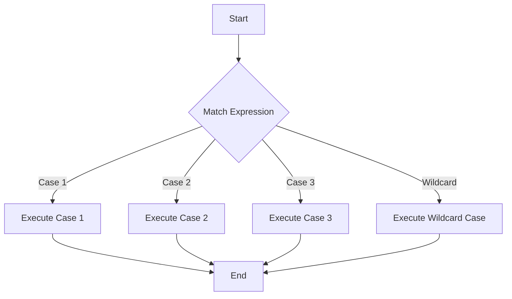

## 2.5 Pattern Matching and Active Patterns

In the realm of functional programming, pattern matching is a cornerstone feature that allows developers to deconstruct data types in a concise and expressive manner. F# elevates this concept with its robust pattern matching capabilities, offering a powerful toolset for managing control flow and enhancing code readability. In this section, we will delve into the intricacies of pattern matching in F#, explore the creation of custom matching logic through active patterns, and provide practical examples to illustrate their application in complex scenarios.

### Understanding Pattern Matching in F#

Pattern matching in F# is more than just a syntactic convenience; it is a fundamental paradigm that enables developers to write clear and maintainable code. At its core, pattern matching allows you to destructure data types, making it easier to work with complex data structures like lists, tuples, and discriminated unions.

#### Basic Pattern Matching

Let's begin with a simple example of pattern matching using lists and option types. Consider the following code snippet that demonstrates basic pattern matching with a list:

```fsharp
let describeList lst =
    match lst with
    | [] -> "The list is empty."
    | [x] -> sprintf "The list has one element: %d" x
    | [x; y] -> sprintf "The list has two elements: %d and %d" x y
    | _ -> "The list has more than two elements."

// Test the function
let result1 = describeList []
let result2 = describeList [1]
let result3 = describeList [1; 2]
let result4 = describeList [1; 2; 3]
```

In this example, the `describeList` function uses pattern matching to determine the structure of the input list and returns a corresponding description. The `match` expression evaluates the list against different patterns, such as an empty list `[]`, a single-element list `[x]`, and a two-element list `[x; y]`. The underscore `_` serves as a wildcard pattern, matching any list with more than two elements.

#### Pattern Matching with Option Types

Option types in F# are a common way to represent values that may or may not exist. Pattern matching provides a natural way to handle these cases:

```fsharp
let describeOption opt =
    match opt with
    | Some value -> sprintf "The option contains: %d" value
    | None -> "The option is empty."

// Test the function
let result5 = describeOption (Some 42)
let result6 = describeOption None
```

Here, the `describeOption` function uses pattern matching to check whether the option contains a value (`Some value`) or is empty (`None`). This approach enhances code readability by clearly expressing the logic for handling optional values.

### Enhancing Control Flow with Pattern Matching

Pattern matching is not only useful for deconstructing data types but also for managing control flow in a concise and expressive manner. By leveraging pattern matching, you can replace complex conditional statements with more readable and maintainable code.

#### Example: Pattern Matching for Control Flow

Consider a scenario where you need to determine the type of a geometric shape and calculate its area. Using pattern matching, you can achieve this in a straightforward way:

```fsharp
type Shape =
    | Circle of float
    | Rectangle of float * float
    | Triangle of float * float

let calculateArea shape =
    match shape with
    | Circle radius -> Math.PI * radius * radius
    | Rectangle (width, height) -> width * height
    | Triangle (base, height) -> 0.5 * base * height

// Test the function
let circleArea = calculateArea (Circle 5.0)
let rectangleArea = calculateArea (Rectangle (4.0, 6.0))
let triangleArea = calculateArea (Triangle (3.0, 4.0))
```

In this example, the `calculateArea` function uses pattern matching to identify the type of shape and compute its area accordingly. This approach not only simplifies the code but also makes it easier to extend with additional shape types in the future.

### Introducing Active Patterns

While pattern matching provides a powerful mechanism for deconstructing data, there are scenarios where you need more flexibility and customization. This is where active patterns come into play. Active patterns allow you to define custom matching logic, enabling you to handle complex data structures and scenarios with ease.

#### Simple Active Patterns

Let's start with a simple example of an active pattern that matches even and odd numbers:

```fsharp
let (|Even|Odd|) input =
    if input % 2 = 0 then Even else Odd

let describeNumber number =
    match number with
    | Even -> "The number is even."
    | Odd -> "The number is odd."

// Test the function
let evenDescription = describeNumber 4
let oddDescription = describeNumber 7
```

In this example, the active pattern `( |Even|Odd| )` defines two cases: `Even` and `Odd`. The `describeNumber` function uses this active pattern to determine whether a number is even or odd, providing a clear and concise description.

#### Parameterized Active Patterns

Active patterns can also be parameterized, allowing you to pass additional arguments to the pattern. This feature is particularly useful when you need to perform complex matching based on external criteria.

```fsharp
let (|DivisibleBy|_|) divisor input =
    if input % divisor = 0 then Some DivisibleBy else None

let describeDivisibility number divisor =
    match number with
    | DivisibleBy divisor -> sprintf "The number is divisible by %d." divisor
    | _ -> sprintf "The number is not divisible by %d." divisor

// Test the function
let divisibleDescription = describeDivisibility 10 2
let notDivisibleDescription = describeDivisibility 10 3
```

In this example, the active pattern `( |DivisibleBy|_| )` takes a divisor as an argument and checks whether the input number is divisible by it. The `describeDivisibility` function uses this pattern to provide a description of the number's divisibility.

### Advanced Active Patterns

For more complex matching scenarios, F# offers advanced active patterns, such as partial patterns and parameterized patterns. These patterns provide greater flexibility and control over the matching process.

#### Partial Active Patterns

Partial active patterns allow you to define patterns that may not match all inputs. They return an option type, indicating whether the pattern matched successfully.

```fsharp
let (|Positive|Negative|Zero|) input =
    if input > 0 then Some Positive
    elif input < 0 then Some Negative
    else Some Zero

let describeSign number =
    match number with
    | Positive -> "The number is positive."
    | Negative -> "The number is negative."
    | Zero -> "The number is zero."

// Test the function
let positiveDescription = describeSign 5
let negativeDescription = describeSign -3
let zeroDescription = describeSign 0
```

In this example, the partial active pattern `( |Positive|Negative|Zero| )` categorizes numbers into positive, negative, or zero. The `describeSign` function uses this pattern to provide a description of the number's sign.

#### Practical Applications of Active Patterns

Active patterns are particularly useful when working with complex data structures or when you need to encapsulate intricate matching logic. They allow you to create modular and reusable code, enhancing both readability and maintainability.

Consider a scenario where you need to parse and validate email addresses. An active pattern can simplify this process:

```fsharp
open System.Text.RegularExpressions

let (|Email|_|) input =
    let pattern = @"^[^@\s]+@[^@\s]+\.[^@\s]+$"
    if Regex.IsMatch(input, pattern) then Some Email else None

let validateEmail email =
    match email with
    | Email -> "The email address is valid."
    | _ -> "The email address is invalid."

// Test the function
let validEmailDescription = validateEmail "example@example.com"
let invalidEmailDescription = validateEmail "invalid-email"
```

In this example, the active pattern `( |Email|_| )` uses a regular expression to validate email addresses. The `validateEmail` function leverages this pattern to provide a clear validation message.

### Best Practices for Active Patterns

When defining and using active patterns, consider the following best practices to ensure your code remains clean and efficient:

1. **Keep Patterns Simple**: Aim for simplicity and clarity in your active pattern definitions. Avoid overly complex logic that may hinder readability.

2. **Use Partial Patterns Judiciously**: Partial patterns are powerful but should be used with care. Ensure that the option type returned by the pattern is handled appropriately in your code.

3. **Encapsulate Complex Logic**: Active patterns are ideal for encapsulating complex matching logic. Use them to abstract away intricate details and provide a clean interface for pattern matching.

4. **Leverage Parameterized Patterns**: When additional context or parameters are needed for matching, consider using parameterized active patterns to enhance flexibility.

5. **Document Patterns Thoroughly**: Provide clear documentation for your active patterns, including their purpose, usage, and any limitations. This will aid in understanding and maintaining the code.

### Experimenting with Pattern Matching

To fully harness the power of pattern matching and active patterns in F#, we encourage you to experiment with different scenarios and data structures. Try modifying the code examples provided in this section to suit your own use cases. By doing so, you'll gain a deeper understanding of how pattern matching can be used to write expressive and concise code.

### Visualizing Pattern Matching

To better understand the flow of pattern matching in F#, let's visualize the process using a simple flowchart. This diagram illustrates how pattern matching evaluates different cases and directs control flow based on the input data.



In this flowchart, the `Match Expression` node represents the pattern matching operation. Depending on the input data, control flow is directed to one of the cases (`Case 1`, `Case 2`, `Case 3`) or the wildcard case, and then proceeds to the end.

### Conclusion

Pattern matching and active patterns are indispensable tools in the F# developer's toolkit, offering a powerful means of deconstructing data and managing control flow. By leveraging these features, you can write code that is both expressive and maintainable, simplifying complex logic and enhancing readability. As you continue your journey in functional programming, remember to experiment with pattern matching and active patterns to unlock their full potential in your applications.

## Quiz Time!



### What is the primary purpose of pattern matching in F#?

- [x] To deconstruct data types and manage control flow
- [ ] To perform arithmetic operations
- [ ] To handle exceptions
- [ ] To define classes and objects

> **Explanation:** Pattern matching in F# is primarily used to deconstruct data types and manage control flow, making code more readable and expressive.

### Which of the following is a basic pattern matching construct in F#?

- [x] Match expression
- [ ] Loop expression
- [ ] Try-catch block
- [ ] Class definition

> **Explanation:** The match expression is a fundamental construct in F# for pattern matching, allowing you to evaluate data against different patterns.

### What is an active pattern in F#?

- [x] A custom pattern that allows for flexible matching logic
- [ ] A pattern that matches only integers
- [ ] A pattern that matches only strings
- [ ] A pattern that matches only lists

> **Explanation:** An active pattern in F# is a custom pattern that allows for flexible matching logic, enabling developers to handle complex data structures.

### How can active patterns improve code modularity?

- [x] By encapsulating complex matching logic
- [ ] By increasing code duplication
- [ ] By making code less readable
- [ ] By removing all pattern matching

> **Explanation:** Active patterns improve code modularity by encapsulating complex matching logic, providing a clean interface for pattern matching.

### Which of the following is a best practice when using active patterns?

- [x] Keep patterns simple and clear
- [ ] Use complex logic without documentation
- [ ] Avoid using parameterized patterns
- [ ] Ignore partial patterns

> **Explanation:** Keeping patterns simple and clear is a best practice when using active patterns, ensuring code readability and maintainability.

### What is the purpose of parameterized active patterns?

- [x] To allow additional arguments for complex matching
- [ ] To match only numeric values
- [ ] To simplify arithmetic operations
- [ ] To handle exceptions

> **Explanation:** Parameterized active patterns allow additional arguments for complex matching, enhancing the flexibility of pattern matching.

### How do partial active patterns differ from complete active patterns?

- [x] Partial patterns may not match all inputs and return an option type
- [ ] Partial patterns match all inputs and return a value
- [ ] Partial patterns are used only for arithmetic operations
- [ ] Partial patterns are used only for string matching

> **Explanation:** Partial active patterns may not match all inputs and return an option type, indicating whether the pattern matched successfully.

### What is a practical application of active patterns?

- [x] Parsing and validating complex data structures
- [ ] Performing basic arithmetic operations
- [ ] Defining classes and objects
- [ ] Handling exceptions

> **Explanation:** Active patterns are practical for parsing and validating complex data structures, simplifying intricate matching logic.

### What does the wildcard pattern (_) represent in pattern matching?

- [x] A match for any input not covered by other patterns
- [ ] A match for only numeric inputs
- [ ] A match for only string inputs
- [ ] A match for only list inputs

> **Explanation:** The wildcard pattern (_) represents a match for any input not covered by other patterns, serving as a catch-all case.

### True or False: Active patterns can only be used with numeric data types.

- [ ] True
- [x] False

> **Explanation:** False. Active patterns can be used with any data type, allowing for flexible and custom matching logic across various scenarios.


