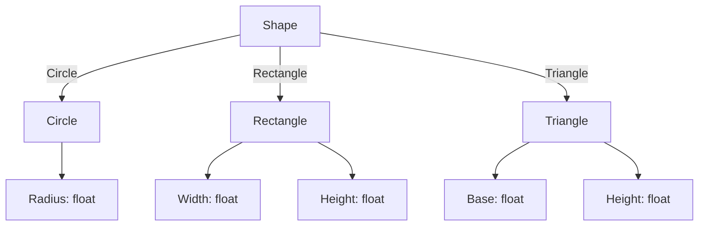

## 2.6 Algebraic Data Types

In the realm of functional programming, algebraic data types (ADTs) are a cornerstone for defining complex data structures. They allow developers to represent data in a way that is both expressive and type-safe. In F#, two primary forms of ADTs are records and discriminated unions. These constructs enable you to model domain-specific data accurately and ensure that only valid states are representable in your programs.

### Understanding Algebraic Data Types

Algebraic data types are a way to define types by combining other types. They are called "algebraic" because they are constructed using algebraic operations like sum and product. In F#, ADTs are primarily realized through records and discriminated unions.

- **Product Types**: These are types that combine multiple values into a single entity. In F#, records are a common way to create product types.
- **Sum Types**: These are types that can be one of several different options. Discriminated unions in F# are used to define sum types.

### Records in F#

Records in F# are used to group related data into a single unit. They are similar to classes in object-oriented languages but are immutable by default and provide a concise syntax for defining data structures.

#### Defining Records

To define a record in F#, you use the `type` keyword followed by the record name and the fields it contains. Here's a simple example:

```fsharp
type Person = {
    FirstName: string
    LastName: string
    Age: int
}
```

In this example, `Person` is a record type with three fields: `FirstName`, `LastName`, and `Age`.

#### Using Records

Records are particularly useful for representing structured data. You can create instances of records and access their fields like this:

```fsharp
let johnDoe = { FirstName = "John"; LastName = "Doe"; Age = 30 }

printfn "Name: %s %s, Age: %d" johnDoe.FirstName johnDoe.LastName johnDoe.Age
```

#### Record Immutability

By default, records in F# are immutable. This means once a record is created, its fields cannot be changed. To create a modified copy of a record, you use the `with` keyword:

```fsharp
let olderJohnDoe = { johnDoe with Age = 31 }
```

This creates a new `Person` record with the `Age` field updated, leaving the original `johnDoe` record unchanged.

### Discriminated Unions in F#

Discriminated unions (DUs) allow you to define a type that can be one of several named cases, each possibly with different values and types. They are ideal for modeling data that can take on multiple forms.

#### Defining Discriminated Unions

Here's how you define a discriminated union in F#:

```fsharp
type Shape =
    | Circle of radius: float
    | Rectangle of width: float * height: float
    | Triangle of base: float * height: float
```

In this example, `Shape` is a discriminated union with three cases: `Circle`, `Rectangle`, and `Triangle`. Each case can have associated data.

#### Using Discriminated Unions

You can create instances of a discriminated union by specifying the case and providing the necessary data:

```fsharp
let myCircle = Circle(5.0)
let myRectangle = Rectangle(4.0, 6.0)
```

#### Pattern Matching with Discriminated Unions

Pattern matching is a powerful feature in F# that allows you to deconstruct and analyze discriminated unions. Here's how you can use pattern matching with the `Shape` type:

```fsharp
let describeShape shape =
    match shape with
    | Circle radius -> printfn "Circle with radius %f" radius
    | Rectangle (width, height) -> printfn "Rectangle with width %f and height %f" width height
    | Triangle (base, height) -> printfn "Triangle with base %f and height %f" base height

describeShape myCircle
describeShape myRectangle
```

### Benefits of Algebraic Data Types

Algebraic data types offer several benefits that make them indispensable in functional programming:

- **Type Safety**: ADTs ensure that only valid states are representable, reducing runtime errors.
- **Expressiveness**: They allow you to model complex data structures succinctly.
- **Pattern Matching**: With pattern matching, you can easily deconstruct and process data.
- **Immutability**: By default, ADTs in F# are immutable, promoting safer and more predictable code.

### Real-World Scenarios

Algebraic data types are particularly useful in scenarios where data can have multiple forms or states. Here are some examples:

- **User Interfaces**: Use discriminated unions to represent different UI states or components.
- **Networking**: Model different types of network messages or protocols.
- **Domain Modeling**: Represent domain-specific concepts with records and discriminated unions.

### Best Practices for Designing ADTs

When designing algebraic data types, consider the following best practices:

- **Use Records for Structured Data**: When you have a fixed set of related data, use records to encapsulate it.
- **Leverage Discriminated Unions for Variants**: When data can be one of several types, use discriminated unions to represent these variants.
- **Favor Immutability**: Embrace the immutability of ADTs to write safer and more reliable code.
- **Utilize Pattern Matching**: Use pattern matching to handle different cases of discriminated unions effectively.

### Encouragement to Leverage ADTs

Algebraic data types are a powerful tool in your F# toolkit. By leveraging records and discriminated unions, you can create expressive and robust data models that accurately represent your domain. Embrace the type safety and expressiveness that ADTs offer, and let them guide you in building reliable and maintainable applications.

### Try It Yourself

To solidify your understanding of algebraic data types, try modifying the examples above. Experiment with adding new fields to records or new cases to discriminated unions. Use pattern matching to handle these new cases and see how F# helps you maintain type safety throughout.

## Visualizing Algebraic Data Types

To better understand the structure of algebraic data types, let's visualize the `Shape` discriminated union using a Mermaid.js diagram:



This diagram illustrates how the `Shape` type can be one of three different forms, each with its own associated data.

## Quiz Time!



### What is an algebraic data type in F#?

- [x] A type that combines other types using sum and product operations.
- [ ] A type that is only used for mathematical calculations.
- [ ] A type that cannot be used with pattern matching.
- [ ] A type that is mutable by default.

> **Explanation:** Algebraic data types in F# are constructed using sum (discriminated unions) and product (records) operations to combine other types.

### How do you define a record in F#?

- [x] Using the `type` keyword followed by the record name and fields.
- [ ] Using the `let` keyword followed by the record name and fields.
- [ ] Using the `class` keyword followed by the record name and fields.
- [ ] Using the `module` keyword followed by the record name and fields.

> **Explanation:** Records in F# are defined using the `type` keyword, specifying the record name and its fields.

### What is the primary benefit of using discriminated unions?

- [x] They allow modeling data with multiple variants.
- [ ] They are always faster than records.
- [ ] They are mutable by default.
- [ ] They cannot be used with pattern matching.

> **Explanation:** Discriminated unions allow you to define types that can be one of several named cases, making them ideal for modeling data with multiple variants.

### How can you modify a field in an immutable record?

- [x] By creating a new record with the `with` keyword.
- [ ] By directly changing the field value.
- [ ] By using the `set` keyword.
- [ ] By using a mutable record.

> **Explanation:** In F#, records are immutable by default. To modify a field, you create a new record using the `with` keyword.

### What is pattern matching used for in F#?

- [x] Deconstructing and analyzing data structures.
- [ ] Creating new data structures.
- [ ] Making data mutable.
- [ ] Optimizing performance.

> **Explanation:** Pattern matching in F# is used to deconstruct and analyze data structures, particularly useful with discriminated unions.

### Which of the following is a real-world scenario where ADTs are beneficial?

- [x] Modeling different types of network messages.
- [ ] Writing low-level hardware drivers.
- [ ] Optimizing database queries.
- [ ] Designing graphical user interfaces.

> **Explanation:** ADTs are beneficial for modeling data that can have multiple forms, such as different types of network messages.

### What is a best practice when designing ADTs in F#?

- [x] Use records for structured data and DUs for variants.
- [ ] Use mutable types whenever possible.
- [ ] Avoid using pattern matching.
- [ ] Use classes instead of records.

> **Explanation:** A best practice is to use records for structured data and discriminated unions for data with multiple variants.

### How do ADTs enhance type safety?

- [x] By representing only valid states explicitly.
- [ ] By allowing any type of data to be stored.
- [ ] By making all data mutable.
- [ ] By removing the need for type annotations.

> **Explanation:** ADTs enhance type safety by ensuring that only valid states are representable, reducing runtime errors.

### What is the default mutability of records in F#?

- [x] Immutable
- [ ] Mutable
- [ ] Semi-mutable
- [ ] It depends on the context

> **Explanation:** Records in F# are immutable by default, meaning their fields cannot be changed after creation.

### True or False: Discriminated unions can be used to represent states with associated data.

- [x] True
- [ ] False

> **Explanation:** Discriminated unions can represent states with associated data, making them ideal for modeling complex data with multiple forms.



Remember, this is just the beginning. As you progress, you'll build more complex and interactive data models. Keep experimenting, stay curious, and enjoy the journey!

---
