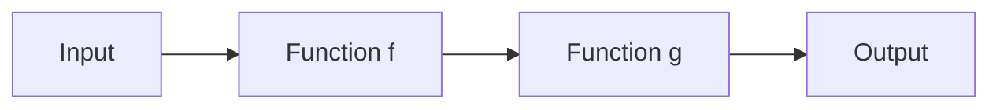
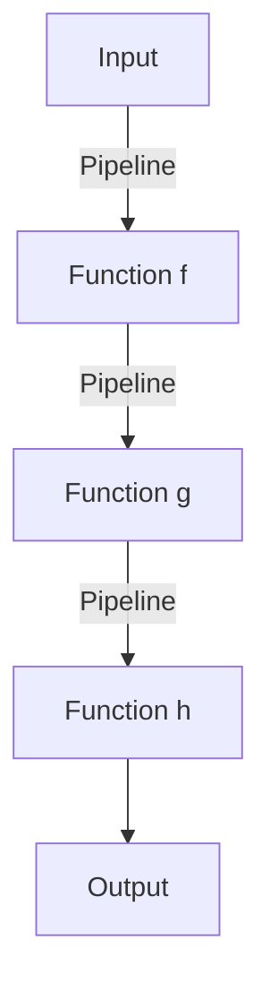

## 2.7 Function Composition and Pipelining

In the realm of functional programming, function composition and pipelining are powerful techniques that allow developers to build complex functions and enhance code readability. These concepts are fundamental in F# and play a crucial role in creating modular, reusable, and expressive code. In this section, we will delve into the intricacies of function composition and pipelining, exploring their syntax, use cases, and benefits.

### Understanding Function Composition

Function composition is the process of combining two or more functions to produce a new function. This new function represents the application of one function to the result of another. In mathematical terms, if we have two functions `f` and `g`, their composition is denoted as `f ∘ g`, which means `f(g(x))`.

In F#, function composition is achieved using the composition operators `>>` and `<<`. These operators allow you to chain functions together, creating a pipeline of operations that are applied in sequence.

#### Composition Operators: `>>` and `<<`

- **Forward Composition Operator (`>>`)**: This operator is used to compose functions from left to right. It takes two functions, `f` and `g`, and creates a new function that applies `f` first, followed by `g`.

- **Backward Composition Operator (`<<`)**: This operator is used to compose functions from right to left. It takes two functions, `f` and `g`, and creates a new function that applies `g` first, followed by `f`.

Let's look at some examples to understand how these operators work in F#.

```fsharp
// Define two simple functions
let addOne x = x + 1
let multiplyByTwo x = x * 2

// Compose functions using the forward composition operator
let addThenMultiply = addOne >> multiplyByTwo

// Compose functions using the backward composition operator
let multiplyThenAdd = multiplyByTwo << addOne

// Test the composed functions
printfn "addThenMultiply 3: %d" (addThenMultiply 3) // Output: 8
printfn "multiplyThenAdd 3: %d" (multiplyThenAdd 3) // Output: 7
```

In the example above, `addThenMultiply` first adds one to the input and then multiplies the result by two. Conversely, `multiplyThenAdd` first multiplies the input by two and then adds one.

### The Concept of Pipelining

Pipelining is a technique that allows you to express a sequence of operations in a clear and readable manner. It is achieved using the pipeline operator (`|>`), which passes the result of one function as the input to the next function. This operator is particularly useful for improving code readability by expressing the flow of data through a series of transformations.

#### Using the Pipeline Operator (`|>`)

The pipeline operator is used to chain function calls in a way that resembles a series of steps. Each step takes the output of the previous step as its input, creating a linear flow of data.

Let's see how the pipeline operator can be used to improve code readability.

```fsharp
// Define a function that applies multiple transformations
let transformData data =
    data
    |> addOne
    |> multiplyByTwo
    |> string

// Test the pipeline function
printfn "Transformed data: %s" (transformData 3) // Output: "8"
```

In this example, the `transformData` function applies a series of transformations to the input data. The pipeline operator makes it easy to follow the sequence of operations, enhancing the readability of the code.

### Comparing Traditional Nested Function Calls with Pipelines

Traditional nested function calls can quickly become difficult to read and maintain, especially when dealing with multiple transformations. Pipelining offers a more elegant solution by flattening the structure and making the flow of data explicit.

Consider the following comparison:

#### Nested Function Calls

```fsharp
let result = string (multiplyByTwo (addOne 3))
```

#### Pipeline Usage

```fsharp
let result = 3 |> addOne |> multiplyByTwo |> string
```

The pipeline version is easier to read and understand, as it clearly shows the order of operations. This clarity is one of the key benefits of using pipelines in F#.

### Promoting Modular and Reusable Code

Function composition and pipelining promote modularity and reusability by encouraging the creation of small, focused functions that can be easily combined. This approach aligns with the principles of functional programming, where functions are treated as first-class citizens and can be passed around and composed freely.

By breaking down complex operations into smaller, reusable functions, you can create a library of building blocks that can be combined in various ways to solve different problems.

### Choosing Between Composition and Pipelining

When deciding whether to use function composition or pipelining, consider the following guidelines:

- **Use Function Composition** when you want to create a new function by combining existing functions. Composition is ideal for defining reusable transformations that can be applied as a single unit.

- **Use Pipelining** when you want to express a sequence of operations in a clear and readable manner. Pipelines are well-suited for scenarios where the flow of data is the primary concern.

In many cases, you may find that a combination of both techniques is the most effective approach. For example, you can use composition to define reusable transformations and then use pipelining to apply those transformations in a specific order.

### Writing Clean and Maintainable Code

To write clean and maintainable code using function composition and pipelining, consider the following tips:

- **Keep Functions Small and Focused**: Aim to create functions that perform a single task. This makes them easier to understand, test, and reuse.

- **Name Functions Clearly**: Use descriptive names that convey the purpose of the function. This helps others (and your future self) understand the code.

- **Document Complex Pipelines**: If a pipeline involves multiple steps or complex logic, consider adding comments to explain the purpose of each step.

- **Avoid Over-Composition**: While composition is powerful, avoid creating overly complex compositions that are difficult to understand. Break them down into smaller, more manageable parts if necessary.

### Combining Composition and Pipelining

There are scenarios where combining function composition and pipelining can be particularly beneficial. For example, you might use composition to define a series of transformations and then use a pipeline to apply those transformations to a data set.

```fsharp
// Define reusable transformations
let increment = addOne
let double = multiplyByTwo

// Compose transformations
let incrementAndDouble = increment >> double

// Apply transformations using a pipeline
let processData data =
    data
    |> incrementAndDouble
    |> string

// Test the combined approach
printfn "Processed data: %s" (processData 3) // Output: "8"
```

In this example, we define reusable transformations (`increment` and `double`) and compose them into a single transformation (`incrementAndDouble`). We then use a pipeline to apply the composed transformation to the input data.

### Practice and Experimentation

To master function composition and pipelining, practice is key. Experiment with different combinations of functions and pipelines to see how they can be used to solve real-world problems. As you become more comfortable with these techniques, you'll find that they enable you to write more expressive and concise F# code.

### Try It Yourself

To reinforce your understanding of function composition and pipelining, try modifying the code examples provided in this section. Experiment with different functions, compositions, and pipelines to see how they affect the output. Consider creating your own functions and pipelines to solve specific problems or tasks.

Remember, this is just the beginning. As you progress, you'll discover new ways to leverage function composition and pipelining to create elegant and efficient solutions. Keep experimenting, stay curious, and enjoy the journey!

## Visualizing Function Composition and Pipelining

To further enhance your understanding of function composition and pipelining, let's visualize these concepts using Mermaid.js diagrams.

### Function Composition Flow



**Description**: This diagram illustrates the flow of data through a composed function, where the output of `Function f` becomes the input to `Function g`.

### Pipelining Flow



**Description**: This diagram represents a pipeline of functions, where data flows from one function to the next, resulting in a final output.

These visualizations provide a clear representation of how data moves through composed functions and pipelines, helping to solidify your understanding of these concepts.

## Quiz Time!



### What is function composition in F#?

- [x] Combining two or more functions to produce a new function.
- [ ] Creating a new function by modifying an existing one.
- [ ] Using a function to transform data.
- [ ] Defining a function that calls other functions.

> **Explanation:** Function composition involves combining two or more functions to create a new function, which applies one function to the result of another.

### Which operator is used for forward function composition in F#?

- [x] >>
- [ ] <<
- [ ] |>
- [ ] <|

> **Explanation:** The `>>` operator is used for forward function composition in F#, allowing functions to be composed from left to right.

### What is the purpose of the pipeline operator (`|>`) in F#?

- [x] To chain function calls and express a sequence of operations.
- [ ] To define a new function by combining existing functions.
- [ ] To create a new data structure.
- [ ] To handle errors in a function.

> **Explanation:** The pipeline operator (`|>`) is used to chain function calls, expressing a sequence of operations in a clear and readable manner.

### How does pipelining improve code readability?

- [x] By expressing the flow of data through a series of transformations.
- [ ] By reducing the number of lines of code.
- [ ] By eliminating the need for comments.
- [ ] By using fewer functions.

> **Explanation:** Pipelining improves code readability by clearly showing the flow of data through a series of transformations, making it easier to understand the sequence of operations.

### When should you choose function composition over pipelining?

- [x] When you want to create a new function by combining existing functions.
- [ ] When you want to express a sequence of operations.
- [ ] When you need to handle errors.
- [ ] When you want to reduce code duplication.

> **Explanation:** Function composition is ideal when you want to create a new function by combining existing functions, allowing for reusable transformations.

### What is a key benefit of using function composition and pipelining?

- [x] Promoting modular and reusable code.
- [ ] Reducing the number of variables.
- [ ] Increasing execution speed.
- [ ] Simplifying error handling.

> **Explanation:** Function composition and pipelining promote modular and reusable code by encouraging the creation of small, focused functions that can be easily combined.

### How can you write clean and maintainable code using function composition and pipelining?

- [x] Keep functions small and focused, and use descriptive names.
- [ ] Avoid using comments.
- [ ] Use as many functions as possible.
- [ ] Minimize the use of operators.

> **Explanation:** To write clean and maintainable code, keep functions small and focused, use descriptive names, and document complex pipelines.

### What is the backward composition operator in F#?

- [x] <<
- [ ] >>
- [ ] |>
- [ ] <|

> **Explanation:** The `<<` operator is used for backward function composition in F#, allowing functions to be composed from right to left.

### Can function composition and pipelining be combined?

- [x] True
- [ ] False

> **Explanation:** Function composition and pipelining can be combined to define reusable transformations and apply them in a specific order, enhancing code modularity and readability.

### What should you do to master function composition and pipelining?

- [x] Practice and experiment with different combinations of functions and pipelines.
- [ ] Memorize all possible function combinations.
- [ ] Avoid using these techniques in real-world projects.
- [ ] Focus only on theoretical knowledge.

> **Explanation:** To master function composition and pipelining, practice and experiment with different combinations of functions and pipelines to solve real-world problems.


