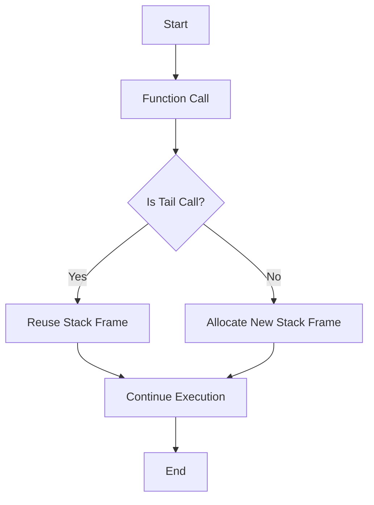

## 2.8 Recursion and Tail Call Optimization

In functional programming, recursion is a fundamental concept that allows us to solve problems by defining functions that call themselves. This approach is particularly powerful in F#, a language that embraces functional paradigms. In this section, we will delve into the intricacies of recursion, explore the significance of tail call optimization, and provide practical guidance on writing efficient recursive functions in F#.

### Understanding Recursion

Recursion is a technique where a function calls itself to solve smaller instances of the same problem. This method is often used to iterate over data structures like lists, trees, or graphs. In functional programming, recursion replaces traditional iterative constructs such as loops, making it a natural fit for processing collections and implementing algorithms.

#### Simple Recursive Functions in F#

Let's begin with a simple example: calculating the factorial of a number. The factorial of a non-negative integer `n` is the product of all positive integers less than or equal to `n`. It is denoted as `n!`.

```fsharp
let rec factorial n =
    if n <= 1 then 1
    else n * factorial (n - 1)

// Example usage
let result = factorial 5 // result is 120
```

In this example, the `factorial` function calls itself with a decremented value of `n` until it reaches the base case (`n <= 1`). This recursive approach is elegant and concise, but it can lead to stack overflow for large values of `n` due to deep recursion.

#### Traversing Lists Recursively

Another common use of recursion is traversing lists. Consider a function that sums all elements in a list:

```fsharp
let rec sumList lst =
    match lst with
    | [] -> 0
    | head :: tail -> head + sumList tail

// Example usage
let total = sumList [1; 2; 3; 4; 5] // total is 15
```

Here, the `sumList` function processes each element by pattern matching on the list. It adds the head of the list to the result of recursively summing the tail.

### The Importance of Tail Recursion

While recursion is powerful, it can be inefficient if not implemented correctly. Each recursive call consumes stack space, and excessive recursion can lead to stack overflow errors. This is where tail recursion comes into play.

#### What is Tail Recursion?

A recursive function is tail-recursive if the recursive call is the last operation in the function. In other words, the function returns the result of the recursive call directly, without further computation. Tail recursion is crucial because it allows the compiler to optimize the function, reusing the current stack frame for the recursive call, thereby preventing stack overflow.

#### Tail Call Optimization (TCO)

Tail call optimization (TCO) is a technique used by compilers to optimize tail-recursive functions. When a function is tail-recursive, the compiler can replace the recursive call with a jump instruction, effectively converting the recursion into iteration. This optimization reduces stack usage and improves performance.

In F#, the compiler automatically applies TCO to tail-recursive functions, making them as efficient as iterative loops.

### Refactoring to Tail Recursion

To illustrate the transformation from non-tail-recursive to tail-recursive functions, let's refactor the `factorial` function:

```fsharp
let factorialTail n =
    let rec loop acc n =
        if n <= 1 then acc
        else loop (acc * n) (n - 1)
    loop 1 n

// Example usage
let resultTail = factorialTail 5 // resultTail is 120
```

In the `factorialTail` function, we introduce an accumulator `acc` to carry the result of the computation. The recursive call `loop (acc * n) (n - 1)` is in tail position, allowing the F# compiler to optimize it.

### Performance Differences and Limitations

To understand the impact of TCO, consider the performance differences between tail-recursive and non-tail-recursive functions. Tail-recursive functions are generally more efficient and can handle larger inputs without risking stack overflow.

#### Example: Fibonacci Sequence

The Fibonacci sequence is another classic example where recursion is often used. Let's compare a non-tail-recursive and a tail-recursive implementation:

**Non-Tail-Recursive Fibonacci:**

```fsharp
let rec fibonacci n =
    if n <= 1 then n
    else fibonacci (n - 1) + fibonacci (n - 2)

// Example usage
let fibResult = fibonacci 10 // fibResult is 55
```

**Tail-Recursive Fibonacci:**

```fsharp
let fibonacciTail n =
    let rec loop a b n =
        if n = 0 then a
        else loop b (a + b) (n - 1)
    loop 0 1 n

// Example usage
let fibResultTail = fibonacciTail 10 // fibResultTail is 55
```

The tail-recursive version `fibonacciTail` uses two accumulators `a` and `b` to store intermediate results, allowing it to be optimized by the compiler.

### Common Pitfalls and How to Avoid Them

When writing recursive functions, it's important to be aware of common pitfalls:

1. **Missing Base Case:** Ensure that every recursive function has a base case to terminate recursion.
2. **Stack Overflow:** Avoid deep recursion by using tail recursion or alternative approaches.
3. **Inefficient Computation:** Use accumulators to store intermediate results and avoid redundant calculations.

### Alternatives to Recursion

In cases where TCO isn't achievable, consider using loops or accumulators to implement the same logic iteratively. F# provides powerful constructs like `Seq.fold` and `List.fold` for processing collections without explicit recursion.

#### Using `Seq.fold` for Factorial

```fsharp
let factorialFold n =
    Seq.fold (fun acc x -> acc * x) 1 {1..n}

// Example usage
let resultFold = factorialFold 5 // resultFold is 120
```

### Best Practices for Recursion in F#

- **Prefer Tail Recursion:** Always aim for tail-recursive functions to leverage TCO.
- **Use Accumulators:** Employ accumulators to carry results and minimize stack usage.
- **Leverage Built-In Functions:** Utilize F#'s rich set of higher-order functions like `map`, `fold`, and `reduce` for common operations.
- **Test for Edge Cases:** Ensure your recursive functions handle edge cases and large inputs gracefully.

### Embracing Recursion in Functional Programming

Recursion is a natural tool for problem-solving in functional programming. It encourages a declarative approach, focusing on what needs to be done rather than how to do it. By mastering recursion and tail call optimization, you can write efficient, elegant, and maintainable code in F#.

### Try It Yourself

Experiment with the code examples provided and try modifying them to deepen your understanding. For instance, refactor the `sumList` function to be tail-recursive or implement a tail-recursive version of a different algorithm.

### Visualizing Tail Call Optimization

To better understand how tail call optimization works, let's visualize the process using a flowchart:



**Caption:** This flowchart illustrates the decision-making process in tail call optimization. If a function call is in tail position, the stack frame is reused, otherwise, a new stack frame is allocated.

### References and Further Reading

- [Tail Call Optimization on Wikipedia](https://en.wikipedia.org/wiki/Tail_call)
- [F# Language Reference: Recursion](https://docs.microsoft.com/en-us/dotnet/fsharp/language-reference/functions/recursive-functions)
- [Functional Programming in F#](https://fsharpforfunandprofit.com/)

## Quiz Time!



### What is recursion in functional programming?

- [x] A technique where a function calls itself to solve smaller instances of the same problem.
- [ ] A technique where a function calls another function to solve a problem.
- [ ] A method of iterating over data structures using loops.
- [ ] A way to optimize functions for better performance.

> **Explanation:** Recursion is a technique where a function calls itself to solve smaller instances of the same problem, commonly used in functional programming.

### Why is tail recursion important?

- [x] It allows the compiler to optimize recursive functions and prevent stack overflow.
- [ ] It makes recursive functions easier to read and understand.
- [ ] It allows functions to call themselves without any limitations.
- [ ] It is a way to write recursive functions without base cases.

> **Explanation:** Tail recursion is important because it allows the compiler to optimize recursive functions by reusing stack frames, preventing stack overflow.

### What is tail call optimization (TCO)?

- [x] A compiler optimization that reuses the current stack frame for tail-recursive calls.
- [ ] A technique to improve the readability of recursive functions.
- [ ] A method to ensure that all recursive functions have base cases.
- [ ] A way to convert recursive functions into iterative ones.

> **Explanation:** Tail call optimization (TCO) is a compiler optimization that reuses the current stack frame for tail-recursive calls, enhancing performance.

### How can you refactor a non-tail-recursive function into a tail-recursive one?

- [x] By introducing an accumulator to carry the result and ensuring the recursive call is the last operation.
- [ ] By removing the base case and allowing the function to call itself indefinitely.
- [ ] By using loops instead of recursion to achieve the same result.
- [ ] By converting the function into an iterative one using a while loop.

> **Explanation:** Refactoring a non-tail-recursive function into a tail-recursive one involves introducing an accumulator and ensuring the recursive call is the last operation.

### What is a common pitfall when writing recursive functions?

- [x] Missing a base case, leading to infinite recursion.
- [ ] Using loops instead of recursion for iteration.
- [ ] Writing functions that are too short and concise.
- [ ] Avoiding the use of accumulators in recursive functions.

> **Explanation:** A common pitfall when writing recursive functions is missing a base case, which can lead to infinite recursion.

### What is an alternative to recursion if TCO isn't achievable?

- [x] Using loops or accumulators to implement the same logic iteratively.
- [ ] Writing longer and more complex recursive functions.
- [ ] Avoiding recursion altogether and using only iterative constructs.
- [ ] Using higher-order functions like map and fold exclusively.

> **Explanation:** If TCO isn't achievable, an alternative to recursion is using loops or accumulators to implement the same logic iteratively.

### What is the role of an accumulator in tail-recursive functions?

- [x] To carry the result of the computation and minimize stack usage.
- [ ] To increase the complexity of the recursive function.
- [ ] To ensure that the function has a base case.
- [ ] To make the function more readable and concise.

> **Explanation:** In tail-recursive functions, an accumulator is used to carry the result of the computation and minimize stack usage.

### How does F# support tail call optimization?

- [x] The F# compiler automatically applies TCO to tail-recursive functions.
- [ ] F# requires explicit annotations to enable TCO.
- [ ] F# does not support TCO and relies on iterative constructs.
- [ ] TCO is only available in F# when using specific libraries.

> **Explanation:** The F# compiler automatically applies TCO to tail-recursive functions, optimizing them for performance.

### What is a benefit of using recursion in functional programming?

- [x] It encourages a declarative approach, focusing on what needs to be done.
- [ ] It simplifies the code by removing the need for base cases.
- [ ] It allows for infinite recursion without any issues.
- [ ] It replaces all iterative constructs with recursive ones.

> **Explanation:** Recursion in functional programming encourages a declarative approach, focusing on what needs to be done rather than how to do it.

### True or False: Tail call optimization allows recursive functions to be as efficient as iterative loops.

- [x] True
- [ ] False

> **Explanation:** True. Tail call optimization allows recursive functions to be as efficient as iterative loops by reusing stack frames.


