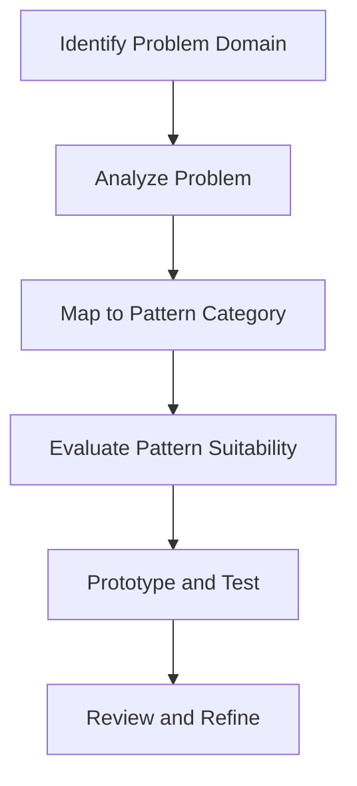

## 21.1 Selecting the Right Pattern

In the world of software development, design patterns serve as time-tested solutions to common problems. They offer a structured approach to solving recurring design challenges, making code more efficient, maintainable, and scalable. Selecting the right pattern is crucial in the software development lifecycle, especially in a language like F# that emphasizes functional programming paradigms. Let's explore how to choose the most suitable design patterns for specific problems in F# development.

### The Importance of Pattern Selection

Selecting the right design pattern is not just about applying a known solution to a problem. It's about understanding the problem deeply and aligning the solution with the project's requirements, constraints, and goals. The right pattern can significantly enhance code clarity, reduce complexity, and improve maintainability. Conversely, the wrong pattern can lead to convoluted code, increased technical debt, and maintenance challenges.

### Criteria for Selecting the Right Pattern

To effectively choose the right design pattern, consider the following criteria:

1. **Problem Context and Requirements**: Understand the specific problem you're trying to solve. Is it a creational, structural, or behavioral issue? Each category of patterns addresses different types of problems.

2. **Project Constraints**: Consider constraints such as time, budget, and resources. Some patterns may require more time and expertise to implement.

3. **Scalability and Performance**: Evaluate how the pattern will impact the system's scalability and performance. Patterns like Singleton can introduce bottlenecks if not implemented correctly.

4. **Maintainability and Flexibility**: Choose patterns that make the codebase easier to maintain and extend. For example, the Strategy pattern allows for easy swapping of algorithms without altering the client code.

5. **Team Expertise**: Consider the team's familiarity with the pattern. Introducing a complex pattern that the team is not familiar with can lead to implementation errors and increased learning curves.

6. **Alignment with Functional Paradigms**: Ensure the pattern aligns with functional programming principles, such as immutability and first-class functions, which are core to F#.

### Decision Framework for Pattern Selection

To aid in selecting the right pattern, use the following decision framework:

1. **Identify the Problem Domain**: Determine if the problem is related to object creation, object structure, or object behavior.

2. **Analyze the Problem**: Break down the problem into smaller components to understand the underlying issues.

3. **Map Problem to Pattern Category**: Match the problem to one of the three main pattern categories: Creational, Structural, or Behavioral.

4. **Evaluate Pattern Suitability**: Assess the suitability of potential patterns based on the criteria outlined above.

5. **Prototype and Test**: Implement a small prototype to test the pattern's effectiveness in solving the problem.

6. **Review and Refine**: Review the implementation with the team and refine as necessary.

### Aligning Patterns with Project Requirements

Aligning patterns with project requirements involves understanding the project's goals and constraints. For instance, if the project requires high scalability, consider patterns that support distributed systems, such as the Microservices or Event-Driven Architecture patterns. If the project demands high maintainability, patterns like the MVU (Model-View-Update) or Clean Architecture can be beneficial.

### Examples of Pattern Usage in Various Scenarios

Let's explore some examples of using different patterns in various scenarios:

#### Example 1: Singleton Pattern in Configuration Management

**Scenario**: You need a centralized configuration manager that is accessible throughout the application.

**Solution**: Use the Singleton pattern to ensure a single instance of the configuration manager.

```fsharp
module ConfigurationManager =
    let instance = lazy (loadConfiguration())

    let getInstance() = instance.Value

let config = ConfigurationManager.getInstance()
```

**Impact**: This pattern ensures that configuration settings are loaded once and reused, reducing overhead and ensuring consistency.

#### Example 2: Strategy Pattern for Algorithm Selection

**Scenario**: You need to implement different sorting algorithms that can be swapped at runtime.

**Solution**: Use the Strategy pattern to encapsulate sorting algorithms.

```fsharp
type ISortStrategy =
    abstract member Sort: int list -> int list

type BubbleSort() =
    interface ISortStrategy with
        member this.Sort(lst) = 
            // Implement bubble sort algorithm
            lst

type QuickSort() =
    interface ISortStrategy with
        member this.Sort(lst) = 
            // Implement quick sort algorithm
            lst

let sortList (strategy: ISortStrategy) (lst: int list) =
    strategy.Sort(lst)

let sortedList = sortList (QuickSort()) [5; 3; 8; 1]
```

**Impact**: This pattern allows for easy swapping of sorting algorithms without modifying the client code, enhancing flexibility and maintainability.

#### Example 3: Observer Pattern for Event Handling

**Scenario**: You need to implement a notification system where multiple components need to react to events.

**Solution**: Use the Observer pattern to manage event subscriptions and notifications.

```fsharp
type IObserver =
    abstract member Update: string -> unit

type Subject() =
    let observers = System.Collections.Generic.List<IObserver>()

    member this.Attach(observer: IObserver) =
        observers.Add(observer)

    member this.Notify(message: string) =
        observers |> List.iter (fun observer -> observer.Update(message))

type ConcreteObserver(name: string) =
    interface IObserver with
        member this.Update(message) =
            printfn "%s received message: %s" name message

let subject = Subject()
let observer1 = ConcreteObserver("Observer1")
let observer2 = ConcreteObserver("Observer2")

subject.Attach(observer1)
subject.Attach(observer2)

subject.Notify("Event occurred")
```

**Impact**: This pattern simplifies event handling by decoupling the event source from the event listeners, improving code organization and scalability.

### Impact of Choosing the Right Pattern

Choosing the right pattern has a profound impact on code maintainability and scalability. It ensures that the codebase is organized, easy to understand, and adaptable to future changes. Patterns like the Composite or Decorator can significantly enhance code flexibility by allowing dynamic composition of objects or behaviors.

### Considering Team Expertise

When selecting a pattern, consider the team's expertise and familiarity with the pattern. Introducing a pattern that the team is not comfortable with can lead to implementation challenges and increased learning curves. It's essential to balance the benefits of a pattern with the team's ability to implement and maintain it effectively.

### Try It Yourself

To deepen your understanding of pattern selection, try modifying the code examples provided:

- **Singleton Pattern**: Experiment with thread-safe initialization techniques.
- **Strategy Pattern**: Implement additional sorting algorithms and test swapping them at runtime.
- **Observer Pattern**: Add more observers and explore different notification mechanisms.

### Visualizing Pattern Selection

To better understand the decision-making process for selecting patterns, consider the following flowchart:



**Caption**: This flowchart illustrates the decision-making process for selecting the right design pattern.

### References and Links

For further reading on design patterns and their applications in F#, consider the following resources:

- [Design Patterns: Elements of Reusable Object-Oriented Software](https://www.amazon.com/Design-Patterns-Elements-Reusable-Object-Oriented/dp/0201633612)
- [Functional Programming Patterns in Scala and Clojure](https://www.amazon.com/Functional-Programming-Patterns-Scala-Clojure/dp/1937785475)
- [F# for Fun and Profit](https://fsharpforfunandprofit.com/)

### Knowledge Check

To reinforce your understanding, consider the following questions:

- What are the key criteria for selecting a design pattern?
- How does the right pattern impact code maintainability?
- Why is it important to consider team expertise when selecting a pattern?

### Embrace the Journey

Remember, selecting the right pattern is an ongoing journey. As you gain more experience, you'll develop an intuition for choosing the most suitable patterns for different scenarios. Keep experimenting, stay curious, and enjoy the process of crafting elegant and efficient solutions with F#.

## Quiz Time!



### What is the primary benefit of selecting the right design pattern?

- [x] Enhances code maintainability and scalability
- [ ] Increases code complexity
- [ ] Reduces the need for documentation
- [ ] Guarantees bug-free code

> **Explanation:** Selecting the right design pattern enhances code maintainability and scalability by providing a structured approach to solving design challenges.

### Which of the following is NOT a criterion for selecting a design pattern?

- [ ] Problem context and requirements
- [ ] Project constraints
- [x] Personal preference
- [ ] Team expertise

> **Explanation:** While personal preference can influence decisions, it is not a formal criterion for selecting a design pattern.

### How does the Strategy pattern enhance flexibility?

- [x] By allowing easy swapping of algorithms without altering client code
- [ ] By enforcing a single algorithm for all scenarios
- [ ] By increasing the number of classes in the system
- [ ] By reducing the need for interfaces

> **Explanation:** The Strategy pattern enhances flexibility by allowing easy swapping of algorithms without altering client code.

### What is the main purpose of the Observer pattern?

- [x] To manage event subscriptions and notifications
- [ ] To create a single instance of a class
- [ ] To encapsulate algorithms
- [ ] To simplify object creation

> **Explanation:** The Observer pattern is used to manage event subscriptions and notifications, decoupling the event source from the event listeners.

### Why is it important to consider team expertise when selecting a pattern?

- [x] To ensure effective implementation and maintenance
- [ ] To increase the complexity of the codebase
- [ ] To reduce the need for documentation
- [ ] To guarantee bug-free code

> **Explanation:** Considering team expertise ensures effective implementation and maintenance of the chosen pattern.

### Which pattern is suitable for centralized configuration management?

- [x] Singleton Pattern
- [ ] Strategy Pattern
- [ ] Observer Pattern
- [ ] Factory Pattern

> **Explanation:** The Singleton pattern is suitable for centralized configuration management as it ensures a single instance of the configuration manager.

### What is the first step in the decision framework for pattern selection?

- [x] Identify the Problem Domain
- [ ] Prototype and Test
- [ ] Evaluate Pattern Suitability
- [ ] Review and Refine

> **Explanation:** The first step in the decision framework is to identify the problem domain.

### How can the right pattern impact code scalability?

- [x] By organizing the codebase and making it adaptable to future changes
- [ ] By increasing the number of lines of code
- [ ] By reducing the need for interfaces
- [ ] By enforcing a single algorithm for all scenarios

> **Explanation:** The right pattern impacts code scalability by organizing the codebase and making it adaptable to future changes.

### What is the benefit of using the Prototype and Test step in the decision framework?

- [x] To test the pattern's effectiveness in solving the problem
- [ ] To increase the complexity of the codebase
- [ ] To reduce the need for documentation
- [ ] To guarantee bug-free code

> **Explanation:** The Prototype and Test step is used to test the pattern's effectiveness in solving the problem.

### True or False: The wrong pattern can lead to increased technical debt.

- [x] True
- [ ] False

> **Explanation:** The wrong pattern can lead to increased technical debt by introducing convoluted code and maintenance challenges.


