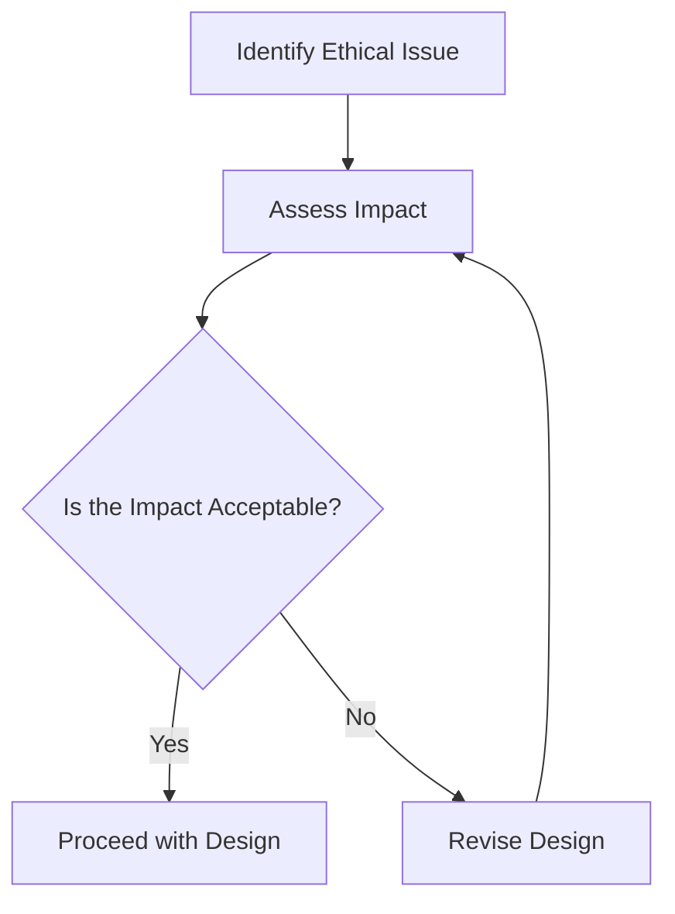

## 21.11 Ethical Considerations in Software Design

In the rapidly evolving world of software engineering, ethical considerations have become paramount. As expert software engineers and architects, we hold the power to shape the digital landscape, influencing how technology interacts with society. This section delves into the ethical responsibilities that come with this power, focusing on designing systems that are fair, transparent, and respectful of user rights.

### The Importance of Ethics in Software Development

Ethics in software development is not just a theoretical concern; it is a practical necessity. Our decisions can have far-reaching consequences, affecting privacy, security, and even societal norms. Ethical software design ensures that we create systems that do not harm users or society and that contribute positively to the world.

#### Why Ethics Matter

- **User Trust**: Ethical practices build trust with users, who are more likely to engage with systems they perceive as fair and transparent.
- **Legal Compliance**: Many jurisdictions have laws governing data protection and privacy, making ethical compliance a legal necessity.
- **Social Responsibility**: As developers, we have a duty to consider the broader impact of our work on society and the environment.

### Common Ethical Issues in Software Design

Understanding common ethical issues is the first step toward addressing them. Let's explore some of the most pressing concerns in software design today.

#### Privacy

Privacy is a fundamental human right, yet it is often compromised in the digital age. As software engineers, we must prioritize user privacy by implementing robust data protection measures.

- **Data Collection**: Collect only the data necessary for the application's functionality. Avoid excessive data collection that could infringe on user privacy.
- **Data Storage and Security**: Use encryption and other security measures to protect user data from unauthorized access.
- **Transparency**: Clearly communicate to users what data is collected and how it will be used.

#### Bias

Bias in software systems can lead to unfair treatment of individuals or groups, often perpetuating existing societal inequalities.

- **Algorithmic Bias**: Ensure that algorithms are trained on diverse datasets to avoid biased outcomes.
- **Inclusive Design**: Design systems that are accessible and usable by people of all backgrounds and abilities.

#### Inclusivity

Inclusivity in software design ensures that systems are accessible to everyone, regardless of their abilities or circumstances.

- **Accessibility**: Implement features that make software usable by people with disabilities, such as screen readers and keyboard navigation.
- **Cultural Sensitivity**: Consider cultural differences in design to ensure that software is respectful and relevant to diverse user groups.

### Guidelines for Ethical Decision-Making in Design and Implementation

Ethical decision-making in software design requires a structured approach. Here are some guidelines to help navigate ethical dilemmas.

#### Adopt an Ethical Framework

An ethical framework provides a structured approach to decision-making, helping to ensure that ethical considerations are consistently applied.

- **Utilitarianism**: Focus on the greatest good for the greatest number, considering the overall impact of design decisions.
- **Deontology**: Adhere to a set of rules or duties, ensuring that actions are inherently ethical.
- **Virtue Ethics**: Emphasize the character and intentions of the decision-maker, promoting integrity and honesty.

#### Conduct Regular Ethical Assessments

Regular assessments help identify potential ethical issues early in the design process.

- **Ethical Audits**: Conduct audits to evaluate the ethical implications of software systems.
- **Stakeholder Analysis**: Consider the perspectives of all stakeholders, including users, developers, and society at large.

#### Foster an Ethical Culture

Creating an ethical culture within development teams encourages ethical behavior and decision-making.

- **Training and Education**: Provide training on ethical issues and best practices.
- **Open Communication**: Encourage open discussions about ethical concerns and dilemmas.

### Case Studies: Ethical Considerations in Action

Examining real-world case studies can provide valuable insights into the impact of ethical considerations in software design.

#### Case Study 1: Facebook and Cambridge Analytica

The Facebook-Cambridge Analytica scandal highlighted the importance of data privacy and transparency. Facebook's failure to protect user data led to widespread criticism and regulatory scrutiny.

- **Lessons Learned**: Implement strict data protection measures and ensure transparency in data usage.

#### Case Study 2: Amazon's AI Recruitment Tool

Amazon's AI recruitment tool was found to be biased against women, as it was trained on historical data that reflected gender biases.

- **Lessons Learned**: Use diverse datasets and regularly test algorithms for bias.

### Regulations and Standards Governing Ethical Software Practices

Several regulations and standards guide ethical software practices, providing a framework for compliance and accountability.

#### General Data Protection Regulation (GDPR)

The GDPR is a comprehensive data protection regulation in the European Union, emphasizing user consent and data privacy.

- **Key Principles**: Data minimization, transparency, and user rights.

#### ISO/IEC 27001

ISO/IEC 27001 is an international standard for information security management, providing guidelines for protecting user data.

- **Key Principles**: Risk management, security controls, and continuous improvement.

### Encouraging Ethical Frameworks and Regular Assessments

Adopting ethical frameworks and conducting regular assessments are crucial steps in ensuring ethical software design.

#### Implementing Ethical Frameworks

Ethical frameworks provide a structured approach to decision-making, helping to ensure that ethical considerations are consistently applied.

- **Example Frameworks**: The IEEE Global Initiative on Ethics of Autonomous and Intelligent Systems, the ACM Code of Ethics.

#### Conducting Regular Ethical Assessments

Regular assessments help identify potential ethical issues early in the design process.

- **Ethical Audits**: Conduct audits to evaluate the ethical implications of software systems.
- **Stakeholder Analysis**: Consider the perspectives of all stakeholders, including users, developers, and society at large.

### The Social and Professional Responsibility of Developers

As software engineers, we have a social and professional responsibility to consider the ethical implications of our work.

#### Social Responsibility

- **Impact on Society**: Consider the broader impact of software systems on society and the environment.
- **Community Engagement**: Engage with communities to understand their needs and concerns.

#### Professional Responsibility

- **Adherence to Standards**: Follow industry standards and best practices to ensure ethical compliance.
- **Continuous Learning**: Stay informed about emerging ethical issues and developments in the field.

### Code Examples: Implementing Ethical Practices in F#

Let's explore some practical examples of how ethical considerations can be implemented in F#.

#### Example 1: Data Privacy with Encryption

```fsharp
open System.Security.Cryptography
open System.Text

let encryptData (plainText: string) (key: string) =
    let aes = Aes.Create()
    aes.Key <- Encoding.UTF8.GetBytes(key)
    aes.IV <- Array.zeroCreate 16 // Initialization vector

    let encryptor = aes.CreateEncryptor(aes.Key, aes.IV)
    use ms = new System.IO.MemoryStream()
    use cs = new CryptoStream(ms, encryptor, CryptoStreamMode.Write)
    use sw = new System.IO.StreamWriter(cs)
    sw.Write(plainText)
    ms.ToArray()

let encryptedData = encryptData "Sensitive Data" "YourEncryptionKeyHere"
```

> **Explanation**: This code demonstrates how to encrypt sensitive data using AES encryption in F#. It highlights the importance of protecting user data through encryption.

#### Example 2: Algorithmic Bias Testing

```fsharp
let testAlgorithmForBias (algorithm: 'a -> 'b) (testData: ('a * 'b) list) =
    testData
    |> List.map (fun (input, expected) ->
        let result = algorithm input
        if result = expected then
            printfn "Test passed for input: %A" input
        else
            printfn "Test failed for input: %A. Expected: %A, Got: %A" input expected result)

let sampleData = [("input1", "expected1"); ("input2", "expected2")]
testAlgorithmForBias yourAlgorithm sampleData
```

> **Explanation**: This code provides a simple framework for testing algorithms for bias by comparing the expected and actual outcomes. It emphasizes the need for regular testing to ensure fairness.

### Try It Yourself

Encourage experimentation by modifying the code examples provided. For instance, try changing the encryption key or testing the algorithm with different datasets to see how these changes affect the outcomes.

### Visualizing Ethical Considerations

Below is a flowchart illustrating the process of ethical decision-making in software design.



> **Description**: This diagram represents the iterative process of ethical decision-making, emphasizing the need to assess and revise designs based on their ethical impact.

### Knowledge Check

- **Question**: Why is it important to test algorithms for bias?
  - **Answer**: To ensure fairness and prevent discrimination against certain groups.

- **Question**: What is the role of encryption in data privacy?
  - **Answer**: Encryption protects sensitive data from unauthorized access.

### Embrace the Journey

Remember, ethical software design is an ongoing journey. As technology evolves, so do the ethical challenges we face. Stay curious, keep learning, and strive to create systems that are not only functional but also fair and respectful of user rights.

## Quiz Time!



### Why is user trust important in ethical software design?

- [x] It builds confidence in the system.
- [ ] It reduces the need for testing.
- [ ] It allows for more data collection.
- [ ] It eliminates the need for privacy policies.

> **Explanation:** User trust is crucial because it builds confidence in the system, encouraging users to engage with it.

### What is a key principle of the GDPR?

- [x] Data minimization
- [ ] Unlimited data collection
- [ ] Ignoring user consent
- [ ] Data sharing without restrictions

> **Explanation:** The GDPR emphasizes data minimization, ensuring that only necessary data is collected.

### How can algorithmic bias be mitigated?

- [x] Using diverse datasets
- [ ] Ignoring test results
- [ ] Collecting more data
- [ ] Using only historical data

> **Explanation:** Algorithmic bias can be mitigated by using diverse datasets to ensure fair outcomes.

### What is the role of ethical audits?

- [x] Evaluate the ethical implications of software systems
- [ ] Increase software complexity
- [ ] Reduce development time
- [ ] Eliminate the need for testing

> **Explanation:** Ethical audits help evaluate the ethical implications of software systems, identifying potential issues early.

### Which ethical framework focuses on the greatest good for the greatest number?

- [x] Utilitarianism
- [ ] Deontology
- [ ] Virtue Ethics
- [ ] Relativism

> **Explanation:** Utilitarianism focuses on achieving the greatest good for the greatest number of people.

### What is the purpose of encryption in software design?

- [x] Protect sensitive data
- [ ] Increase data size
- [ ] Simplify data access
- [ ] Eliminate the need for passwords

> **Explanation:** Encryption protects sensitive data from unauthorized access, ensuring privacy and security.

### How can inclusivity be achieved in software design?

- [x] Implementing accessibility features
- [ ] Ignoring cultural differences
- [ ] Focusing only on majority users
- [ ] Reducing user feedback

> **Explanation:** Inclusivity can be achieved by implementing accessibility features and considering diverse user needs.

### What is a key benefit of adopting an ethical framework?

- [x] Consistent application of ethical considerations
- [ ] Faster development cycles
- [ ] Reduced need for documentation
- [ ] Increased data collection

> **Explanation:** An ethical framework ensures consistent application of ethical considerations in decision-making.

### What is the impact of the Facebook-Cambridge Analytica scandal?

- [x] Highlighted the importance of data privacy
- [ ] Reduced the need for user consent
- [ ] Increased data sharing practices
- [ ] Eliminated the need for transparency

> **Explanation:** The scandal highlighted the importance of data privacy and transparency in software design.

### True or False: Ethical software design is a one-time task.

- [ ] True
- [x] False

> **Explanation:** Ethical software design is an ongoing process, requiring continuous assessment and adaptation.


