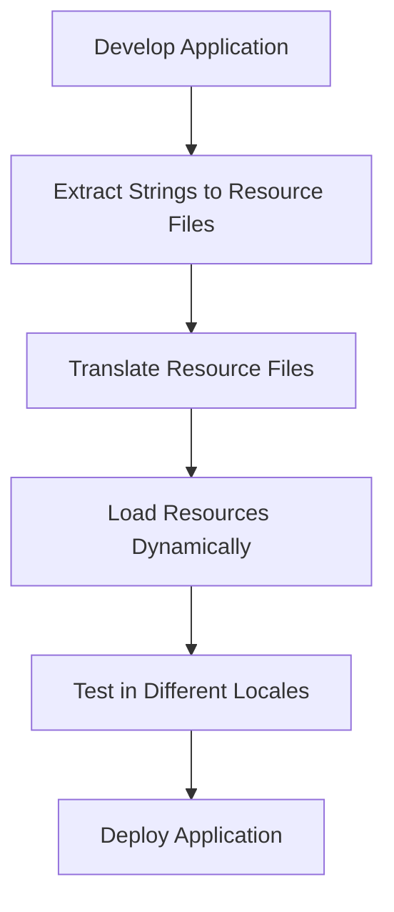

## 21.12 Internationalization and Localization

In today's interconnected world, developing software that caters to a global audience is not just a competitive advantage but often a necessity. This section delves into the intricacies of internationalization (i18n) and localization (l10n) within F# applications, providing expert insights and practical strategies for creating software that transcends linguistic and cultural barriers.

### Understanding Internationalization and Localization

**Internationalization (i18n)** is the process of designing a software application so that it can be adapted to various languages and regions without requiring engineering changes. It involves creating a flexible architecture that supports multiple languages, date formats, currencies, and other locale-specific elements.

**Localization (l10n)**, on the other hand, is the adaptation of the internationalized software for a specific region or language by adding locale-specific components and translating text. This includes translating user interfaces, adjusting date and time formats, and ensuring cultural appropriateness.

### Strategies for Designing Localizable Software

Designing software with localization in mind from the outset is crucial. Here are some strategies to ensure your F# applications are easily localizable:

1. **Separate Content from Code**: Store all user-facing text in external resource files rather than hardcoding them. This separation allows translators to work independently of developers.

2. **Use Resource Files**: Utilize resource files (.resx) in .NET to manage localized strings. These files can be easily edited and expanded to include additional languages.

3. **Design for Expansion**: Anticipate text expansion when translating from one language to another. For instance, German text can be significantly longer than its English counterpart.

4. **Avoid Concatenation**: Concatenating strings can lead to awkward translations. Instead, use placeholders within strings and format them dynamically.

5. **Cultural Sensitivity**: Consider cultural differences in symbols, colors, and images. What is acceptable in one culture might be offensive in another.

6. **Locale-Sensitive Data Handling**: Ensure that dates, times, numbers, and currencies are formatted according to the user's locale settings.

### Best Practices for Handling Locale-Sensitive Data

Handling locale-sensitive data correctly is crucial for user satisfaction. Here are some best practices:

- **Dates and Times**: Use `System.Globalization` namespace to format dates and times according to the user's locale. The `DateTimeFormatInfo` class provides culture-specific information about the format of date and time values.

- **Numbers and Currencies**: Use `NumberFormatInfo` to handle number and currency formatting. This class provides culture-specific information about the format of number values, including currency symbols and decimal separators.

- **String Comparisons**: Use `StringComparer` with a specific culture to perform culture-sensitive string comparisons.

#### Example: Formatting Dates and Numbers in F#

```fsharp
open System
open System.Globalization

let formatDate date culture =
    let cultureInfo = CultureInfo(culture)
    date.ToString("D", cultureInfo)

let formatNumber number culture =
    let cultureInfo = CultureInfo(culture)
    number.ToString("N", cultureInfo)

// Example usage
let date = DateTime.Now
let number = 1234567.89

printfn "US Date: %s" (formatDate date "en-US")
printfn "French Date: %s" (formatDate date "fr-FR")
printfn "US Number: %s" (formatNumber number "en-US")
printfn "French Number: %s" (formatNumber number "fr-FR")
```

### Implementing Localization in F# Applications

Localization in F# involves several steps, from setting up resource files to dynamically loading the appropriate resources at runtime. Here's a step-by-step guide:

1. **Create Resource Files**: For each language, create a `.resx` file containing key-value pairs where keys are identifiers and values are the localized strings.

2. **Access Resource Files**: Use the `ResourceManager` class to load and access resources at runtime.

3. **Dynamic Resource Loading**: Implement logic to load the appropriate resource file based on the user's locale settings.

#### Example: Using Resource Files in F#

```fsharp
open System.Resources
open System.Globalization

let getString (resourceManager: ResourceManager) key culture =
    let cultureInfo = CultureInfo(culture)
    resourceManager.GetString(key, cultureInfo)

// Example usage
let resourceManager = ResourceManager("MyApp.Resources.Strings", typeof<MyApp>.Assembly)

printfn "Hello in English: %s" (getString resourceManager "Hello" "en-US")
printfn "Hello in French: %s" (getString resourceManager "Hello" "fr-FR")
```

### Tools and Libraries for Internationalization and Localization

Several tools and libraries can aid in the internationalization and localization process:

- **.NET ResourceManager**: A powerful tool for managing resource files and accessing localized strings.

- **FSharp.Data**: Provides type providers for working with data formats like JSON and XML, which can be useful for managing translations.

- **Globalize.js**: Although primarily a JavaScript library, it can be used in conjunction with F# for web applications to handle localization on the client side.

### Challenges and Solutions in Multilingual Support

Implementing multilingual support comes with its own set of challenges. Here are some common issues and their solutions:

- **Text Expansion**: As mentioned earlier, translated text can be longer than the original. Design your UI to be flexible and accommodate varying text lengths.

- **Character Encoding**: Ensure your application supports Unicode to handle a wide range of characters and symbols.

- **Testing**: Thoroughly test your application in all supported languages to catch any issues related to text overflow, incorrect formatting, or cultural insensitivity.

- **Continuous Integration**: Integrate localization into your CI/CD pipeline to automate the process of updating and testing translations.

### Visualizing the Localization Workflow

To better understand the localization process, let's visualize the workflow from development to deployment:



**Caption**: This diagram illustrates the workflow for localizing an F# application, from initial development through to deployment.

### Try It Yourself

Experiment with the provided code examples by:

- Adding support for additional languages by creating new resource files.
- Modifying the date and number formatting to see how it changes with different cultures.
- Testing the application with various locale settings to ensure everything displays correctly.

### Knowledge Check

Before we conclude, let's reinforce what we've learned:

- What is the difference between internationalization and localization?
- Why is it important to separate content from code when localizing an application?
- How can you handle locale-sensitive data in F#?
- What tools can assist with internationalization and localization in F#?

### Embrace the Journey

Remember, internationalization and localization are ongoing processes. As your application evolves, so will the need to support new languages and cultural nuances. Keep experimenting, stay curious, and enjoy the journey of making your software accessible to a global audience!

## Quiz Time!



### What is the primary goal of internationalization (i18n)?

- [x] To design software that can be easily adapted to different languages and regions
- [ ] To translate software into multiple languages
- [ ] To ensure software is culturally appropriate
- [ ] To separate content from code

> **Explanation:** Internationalization focuses on designing software that can be easily adapted to various languages and regions without engineering changes.

### Which of the following is a best practice for handling locale-sensitive data?

- [x] Use `System.Globalization` namespace for formatting
- [ ] Hardcode date formats
- [ ] Use concatenation for strings
- [ ] Ignore cultural differences

> **Explanation:** The `System.Globalization` namespace provides tools for formatting data according to locale settings.

### What is the role of resource files in localization?

- [x] To store user-facing text separately from code
- [ ] To compile code into different languages
- [ ] To manage database connections
- [ ] To handle network requests

> **Explanation:** Resource files store user-facing text separately from code, facilitating translation and localization.

### How can you ensure character encoding supports a wide range of symbols?

- [x] Use Unicode
- [ ] Use ASCII
- [ ] Use binary encoding
- [ ] Use hexadecimal encoding

> **Explanation:** Unicode supports a wide range of characters and symbols, making it suitable for multilingual applications.

### Which tool is primarily used for managing resource files in .NET?

- [x] ResourceManager
- [ ] StringBuilder
- [ ] FileStream
- [ ] DataReader

> **Explanation:** The `ResourceManager` class is used to manage resource files and access localized strings in .NET applications.

### What is a common challenge in multilingual support?

- [x] Text expansion
- [ ] Code compilation
- [ ] Network latency
- [ ] Memory allocation

> **Explanation:** Text expansion occurs when translated text is longer than the original, requiring flexible UI design.

### Which library can be used for localization in web applications?

- [x] Globalize.js
- [ ] jQuery
- [ ] Bootstrap
- [ ] AngularJS

> **Explanation:** Globalize.js is a JavaScript library used for handling localization in web applications.

### What is the benefit of separating content from code?

- [x] Easier translation and localization
- [ ] Faster execution
- [ ] Reduced memory usage
- [ ] Improved security

> **Explanation:** Separating content from code allows translators to work independently and makes localization easier.

### What is the purpose of the `CultureInfo` class?

- [x] To provide culture-specific information for formatting
- [ ] To manage database connections
- [ ] To handle network requests
- [ ] To compile code

> **Explanation:** The `CultureInfo` class provides culture-specific information for formatting dates, numbers, and strings.

### True or False: Localization should be considered at the end of the development process.

- [ ] True
- [x] False

> **Explanation:** Localization should be considered from the outset to ensure the application is designed to support multiple languages and cultures.




