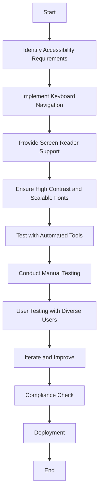

## 21.13 Designing for Accessibility

In today's digital age, accessibility is not just a feature but a fundamental aspect of software development. As expert software engineers and architects, it is our responsibility to ensure that our applications are accessible to everyone, including individuals with disabilities. This section will guide you through the principles of designing accessible applications using F#, the importance of inclusive design, and practical guidelines to implement accessibility features.

### Understanding Accessibility in Software Development

**Accessibility** in software development refers to the practice of making applications usable by people with a wide range of abilities and disabilities. This includes individuals with visual, auditory, motor, and cognitive impairments. By designing accessible software, we ensure that all users, regardless of their abilities, can interact with our applications effectively.

### The Importance of Inclusive Design

**Inclusive design** is a design philosophy that aims to create products that are accessible to as many people as possible. It goes beyond accessibility by considering the full range of human diversity, including ability, language, culture, gender, and age. The benefits of inclusive design include:

- **Broader Audience Reach**: By making applications accessible, we can reach a larger audience, including those with disabilities.
- **Improved User Experience**: Accessible design often leads to a better overall user experience for everyone.
- **Compliance and Legal Obligations**: Many countries have laws and regulations that require digital accessibility, such as the Americans with Disabilities Act (ADA) and the European Accessibility Act.
- **Ethical Responsibility**: As developers, we have an ethical obligation to ensure our applications do not exclude any group of users.

### Guidelines for Implementing Accessible User Interfaces with F#

Designing accessible user interfaces in F# involves adhering to established accessibility standards and leveraging F#'s functional programming features to create clean, maintainable code. Here are some guidelines to consider:

#### 1. Adhere to WCAG Standards

The **Web Content Accessibility Guidelines (WCAG)** provide a comprehensive set of guidelines for making web content more accessible. Although WCAG is primarily for web content, its principles can be applied to software development in general. The guidelines are organized around four principles:

- **Perceivable**: Information and user interface components must be presentable to users in ways they can perceive.
- **Operable**: User interface components and navigation must be operable.
- **Understandable**: Information and the operation of the user interface must be understandable.
- **Robust**: Content must be robust enough to be interpreted by a wide variety of user agents, including assistive technologies.

#### 2. Implement Keyboard Navigation

Ensure that all functionalities of your application are accessible via keyboard. This is crucial for users who cannot use a mouse. In F#, you can handle keyboard events and provide logical navigation order.

```fsharp
open System.Windows.Forms

let form = new Form(Text = "Accessible Form")

let button = new Button(Text = "Click Me", Dock = DockStyle.Top)
button.Click.Add(fun _ -> MessageBox.Show("Button Clicked!") |> ignore)

form.Controls.Add(button)

// Enable keyboard navigation
form.KeyPreview <- true
form.KeyDown.Add(fun args ->
    match args.KeyCode with
    | Keys.Enter -> button.PerformClick()
    | _ -> ())

Application.Run(form)
```

In this example, we create a simple form with a button that can be activated using the Enter key.

#### 3. Provide Screen Reader Support

Screen readers are essential for visually impaired users. Ensure that all UI elements have descriptive labels and that dynamic content updates are announced to screen readers.

```fsharp
let label = new Label(Text = "Name:", AutoSize = true)
let textBox = new TextBox()

// Associate the label with the textbox for screen readers
label.SetBounds(10, 10, 100, 20)
textBox.SetBounds(110, 10, 200, 20)
label.TabIndex <- 0
textBox.TabIndex <- 1

form.Controls.AddRange([| label; textBox |])
```

Here, we associate a label with a textbox to ensure screen readers can announce the purpose of the textbox.

#### 4. Use High Contrast and Scalable Fonts

Ensure that your application supports high contrast modes and allows users to scale fonts. This can be achieved by using relative units for font sizes and ensuring color contrast ratios meet WCAG standards.

```fsharp
let setHighContrast (control: Control) =
    control.BackColor <- Color.Black
    control.ForeColor <- Color.White
    control.Font <- new Font(control.Font.FontFamily, 12.0F, FontStyle.Bold)

setHighContrast(form)
```

This code snippet sets a high contrast theme for a form, making it easier to read for users with visual impairments.

### Testing and Validating Accessibility Features

Testing for accessibility is as important as implementing it. Here are some techniques and tools to help you validate the accessibility of your F# applications:

#### 1. Automated Accessibility Testing Tools

Use tools like **Accessibility Insights** and **axe** to automate the detection of common accessibility issues. These tools can integrate into your development workflow and provide actionable insights.

#### 2. Manual Testing with Assistive Technologies

Test your application with screen readers like **NVDA** or **JAWS** to ensure that all elements are accessible and properly announced. Also, test keyboard navigation to ensure all functionalities are operable without a mouse.

#### 3. User Testing with Diverse Users

Conduct user testing with individuals who have disabilities to gain insights into real-world usage and identify any accessibility barriers that automated tools might miss.

### Common Accessibility Features

Here are some common accessibility features you should consider implementing in your F# applications:

- **Alternative Text for Images**: Provide descriptive text for images to ensure they are accessible to screen readers.
- **Captions and Transcripts for Media**: Ensure that all audio and video content has captions and transcripts.
- **Resizable Text**: Allow users to resize text without breaking the layout.
- **Focus Indicators**: Provide visible focus indicators for all interactive elements.
- **Error Identification and Suggestions**: Clearly identify errors and provide suggestions for correction.

### Ethical and Legal Obligations

Designing accessible applications is not just a technical challenge but also an ethical and legal obligation. Many countries have laws that require digital accessibility, and failing to comply can result in legal consequences. More importantly, by making our applications accessible, we uphold the principle of equality and ensure that no user is left behind.

### Try It Yourself

Experiment with the code examples provided in this section. Try modifying the keyboard navigation logic to include additional keys or implement a different high contrast theme. Test your application with a screen reader to ensure all elements are accessible.

### Visualizing Accessibility Workflow

Let's visualize the workflow of implementing accessibility features in an application:



This diagram outlines the iterative process of designing and testing for accessibility, emphasizing the importance of continuous improvement and compliance.

### Knowledge Check

- **What is the purpose of the WCAG guidelines?**
- **Why is keyboard navigation important for accessibility?**
- **How can you ensure screen reader compatibility in your applications?**
- **What are some common accessibility features you should implement?**
- **What are the ethical implications of designing accessible software?**

### Summary

In this section, we've explored the importance of designing accessible applications and provided guidelines for implementing accessibility features in F#. By adhering to standards like WCAG and leveraging F#'s capabilities, we can create applications that are inclusive and accessible to all users. Remember, accessibility is an ongoing process that requires continuous testing and improvement. Let's embrace the journey towards inclusive design and ensure that our applications are accessible to everyone.

## Quiz Time!



### What is the primary goal of accessibility in software development?

- [x] To make applications usable by people with a wide range of abilities and disabilities.
- [ ] To enhance the aesthetic appeal of software applications.
- [ ] To ensure software applications are compatible with all operating systems.
- [ ] To improve the performance of software applications.

> **Explanation:** Accessibility aims to make applications usable by individuals with various abilities and disabilities, ensuring inclusivity.

### Which principle is NOT part of the WCAG guidelines?

- [ ] Perceivable
- [ ] Operable
- [ ] Understandable
- [x] Configurable

> **Explanation:** The WCAG guidelines are based on four principles: Perceivable, Operable, Understandable, and Robust. Configurable is not one of them.

### Why is keyboard navigation crucial for accessibility?

- [x] It allows users who cannot use a mouse to interact with the application.
- [ ] It improves the application's loading speed.
- [ ] It enhances the visual design of the application.
- [ ] It simplifies the application's codebase.

> **Explanation:** Keyboard navigation is essential for users who rely on keyboards due to disabilities, ensuring they can access all functionalities.

### How can screen reader support be provided in F# applications?

- [x] By associating labels with UI elements and ensuring dynamic content updates are announced.
- [ ] By using only high-contrast colors in the UI.
- [ ] By implementing complex animations in the application.
- [ ] By ensuring the application runs on all devices.

> **Explanation:** Screen reader support involves associating labels with UI elements and announcing dynamic content updates to assist visually impaired users.

### Which of the following is a common accessibility feature?

- [x] Alternative text for images
- [ ] Complex animations
- [ ] High-resolution graphics
- [ ] Custom fonts

> **Explanation:** Alternative text for images is a common accessibility feature that helps screen readers describe images to visually impaired users.

### What is the ethical obligation of designing accessible software?

- [x] To ensure no user is excluded from using the application.
- [ ] To increase the application's market value.
- [ ] To reduce the development time.
- [ ] To enhance the application's visual appeal.

> **Explanation:** Designing accessible software ensures inclusivity, allowing all users, regardless of their abilities, to use the application.

### Which tool can be used for automated accessibility testing?

- [x] Accessibility Insights
- [ ] Photoshop
- [ ] Visual Studio Code
- [ ] GitHub

> **Explanation:** Accessibility Insights is a tool used for automated accessibility testing, helping developers identify accessibility issues.

### What is the benefit of user testing with diverse users?

- [x] It provides insights into real-world usage and identifies accessibility barriers.
- [ ] It speeds up the development process.
- [ ] It reduces the cost of development.
- [ ] It ensures the application is aesthetically pleasing.

> **Explanation:** User testing with diverse users helps identify real-world accessibility barriers that automated tools might miss.

### True or False: High contrast and scalable fonts are essential for accessibility.

- [x] True
- [ ] False

> **Explanation:** High contrast and scalable fonts are crucial for accessibility, aiding users with visual impairments in reading content more easily.

### What is the role of ethical and legal obligations in accessibility?

- [x] They ensure compliance with laws and uphold the principle of equality.
- [ ] They increase the application's aesthetic value.
- [ ] They reduce the application's development time.
- [ ] They simplify the application's architecture.

> **Explanation:** Ethical and legal obligations ensure compliance with accessibility laws and uphold the principle of equality, making applications accessible to all users.


