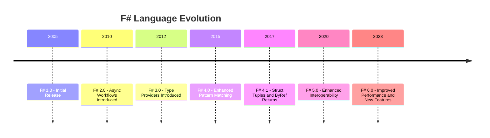

## 21.14 Staying Current with F# Features

In the rapidly evolving world of software development, staying current with the latest features and advancements in programming languages is crucial for maintaining a competitive edge. F#, a robust functional-first language, continuously evolves to incorporate new features and improvements. This section aims to guide you through the importance of keeping your F# skills up-to-date, provide resources for learning about new releases, discuss strategies for integrating new features into existing codebases, and encourage active participation in the F# community.

### The Importance of Staying Updated

In today's fast-paced technological landscape, the ability to adapt and evolve is essential. Staying updated with the latest F# features ensures that you can:

- **Leverage New Capabilities**: New language features often introduce capabilities that can simplify complex tasks, improve performance, or enhance code readability.
- **Maintain Code Quality**: By adopting the latest best practices and language improvements, you can ensure your code remains clean, efficient, and maintainable.
- **Enhance Productivity**: New tools and features can streamline development processes, allowing you to focus on solving business problems rather than dealing with technical debt.
- **Stay Competitive**: Keeping your skills current ensures you remain valuable in the job market and can tackle modern development challenges effectively.

### Resources for Learning About New F# Releases

To stay informed about the latest F# advancements, consider the following resources:

- **Official Documentation**: The [F# Documentation](https://docs.microsoft.com/en-us/dotnet/fsharp/) is a comprehensive resource for learning about new language features, libraries, and tools.
- **F# Blog**: The [F# Blog](https://devblogs.microsoft.com/dotnet/tag/fsharp/) provides updates on new releases, feature highlights, and community news.
- **GitHub Repositories**: Follow the [F# GitHub repository](https://github.com/dotnet/fsharp) to track ongoing development, contribute to discussions, and explore new features.
- **Community Forums**: Engage with the [F# Software Foundation](https://fsharp.org/) and participate in forums like [Stack Overflow](https://stackoverflow.com/questions/tagged/f%23) to exchange knowledge and stay updated.
- **Conferences and Meetups**: Attend events such as [F# eXchange](https://skillsmatter.com/conferences/11622-fsharp-exchange-2024) to learn from experts and network with other F# developers.

### Strategies for Integrating New Features

Integrating new F# features into existing codebases can be challenging but rewarding. Here are some strategies to consider:

- **Incremental Adoption**: Gradually introduce new features into your codebase. Start with non-critical components to minimize risk and gain familiarity.
- **Refactor with Purpose**: Use new features as an opportunity to refactor and improve existing code. This can lead to cleaner, more efficient implementations.
- **Automated Testing**: Ensure robust test coverage before integrating new features. Automated tests can help catch regressions and ensure stability.
- **Documentation and Training**: Update documentation and provide training sessions for your team to ensure everyone is comfortable with the new features.

### Participating in the F# Community

Active participation in the F# community can enhance your learning experience and provide valuable networking opportunities. Consider the following ways to engage:

- **Contribute to Open Source**: Contribute to F# projects on GitHub to gain practical experience and collaborate with other developers.
- **Join User Groups**: Participate in local or virtual F# user groups to share knowledge and learn from others.
- **Write and Share**: Write blog posts or create tutorials to share your experiences with new F# features. This can help solidify your understanding and contribute to the community.
- **Mentor and Teach**: Offer to mentor newcomers to F#, helping them navigate the language and its ecosystem.

### Recent F# Advancements

Let's explore some recent advancements in F# and how they can improve development practices:

#### 1. Enhanced Pattern Matching

F# has always been known for its powerful pattern matching capabilities. Recent updates have introduced even more expressive pattern matching features, allowing for more concise and readable code.

```fsharp
type Shape =
    | Circle of radius: float
    | Rectangle of width: float * height: float

let describeShape shape =
    match shape with
    | Circle radius -> sprintf "A circle with radius %f" radius
    | Rectangle (width, height) -> sprintf "A rectangle with width %f and height %f" width height

// Try It Yourself: Experiment by adding more shapes and patterns.
```

#### 2. Improved Type Providers

Type providers in F# offer a powerful way to access external data sources with minimal code. Recent improvements have made them more efficient and easier to use.

```fsharp
open FSharp.Data

type Weather = JsonProvider<"https://api.weatherapi.com/v1/current.json?key=YOUR_API_KEY&q=London">

let currentWeather = Weather.GetSample()
printfn "The current temperature in London is %f°C" currentWeather.Current.TempC

// Try It Yourself: Use a different API or explore other type providers.
```

#### 3. Enhanced Async Workflows

Asynchronous programming is crucial for building responsive applications. F# continues to enhance its async workflows, making it easier to write non-blocking code.

```fsharp
open System.Net.Http

let fetchAsync url =
    async {
        use client = new HttpClient()
        let! response = client.GetStringAsync(url) |> Async.AwaitTask
        return response
    }

let result = fetchAsync "https://example.com" |> Async.RunSynchronously
printfn "Fetched data: %s" result

// Try It Yourself: Fetch data from different URLs and handle errors gracefully.
```

### Balancing New Feature Adoption with Project Stability

While adopting new features can bring significant benefits, it's important to balance this with the stability of your projects. Here are some tips:

- **Evaluate Impact**: Assess the potential impact of new features on your existing codebase. Consider factors such as compatibility, performance, and maintainability.
- **Prioritize Stability**: For critical systems, prioritize stability over adopting the latest features. Ensure thorough testing and validation before deployment.
- **Stay Informed**: Keep abreast of community feedback and known issues related to new features. This can help you make informed decisions about adoption.
- **Plan for Rollback**: Have a rollback plan in place in case new features introduce unforeseen issues. This ensures you can quickly revert to a stable state if needed.

### Visualizing the Evolution of F# Features

To better understand how F# features have evolved over time, let's visualize the progression of key language features using a timeline diagram.



This timeline highlights the major milestones in F# development, showcasing the continuous evolution of the language to meet modern development needs.

### Conclusion

Staying current with F# features is an ongoing journey that requires dedication and curiosity. By leveraging the resources and strategies outlined in this guide, you can ensure that your skills remain sharp and your projects benefit from the latest advancements. Remember, the F# community is a valuable resource—engage with it, contribute to it, and learn from it. As you continue to explore and adopt new features, you'll not only enhance your own capabilities but also contribute to the growth and success of the F# ecosystem.

### Key Takeaways

- **Continuous Learning**: Stay informed about new F# features and advancements through official documentation, blogs, and community forums.
- **Strategic Integration**: Carefully integrate new features into existing codebases, prioritizing stability and maintainability.
- **Community Engagement**: Participate actively in the F# community to share knowledge, gain insights, and contribute to the language's evolution.
- **Balanced Adoption**: Balance the adoption of new features with the stability and reliability of your projects.

## Quiz Time!



### What is one of the main benefits of staying updated with F# features?

- [x] Leverage new capabilities
- [ ] Increase code complexity
- [ ] Reduce code readability
- [ ] Avoid community engagement

> **Explanation:** Staying updated allows developers to leverage new capabilities that can simplify tasks and improve performance.

### Which resource is NOT recommended for learning about new F# releases?

- [ ] Official Documentation
- [ ] F# Blog
- [x] Random internet forums
- [ ] GitHub Repositories

> **Explanation:** Random internet forums may not provide reliable or accurate information about F# releases.

### What is a strategy for integrating new F# features into existing codebases?

- [x] Incremental Adoption
- [ ] Immediate overhaul
- [ ] Ignore new features
- [ ] Delay adoption indefinitely

> **Explanation:** Incremental adoption allows for gradual integration, minimizing risk and allowing for testing and learning.

### How can you actively participate in the F# community?

- [x] Contribute to open source projects
- [ ] Avoid sharing knowledge
- [ ] Ignore community events
- [ ] Only consume content

> **Explanation:** Contributing to open source projects helps you engage with the community and gain practical experience.

### What recent F# advancement improves pattern matching?

- [x] Enhanced Pattern Matching
- [ ] Reduced Pattern Matching
- [ ] Deprecated Pattern Matching
- [ ] Static Pattern Matching

> **Explanation:** Recent updates have introduced more expressive pattern matching features in F#.

### What is a key consideration when adopting new F# features?

- [x] Evaluate Impact
- [ ] Ignore compatibility
- [ ] Prioritize instability
- [ ] Avoid testing

> **Explanation:** Evaluating the impact of new features on existing codebases is crucial for maintaining stability.

### How can you visualize the evolution of F# features?

- [x] Use a timeline diagram
- [ ] Ignore historical context
- [ ] Avoid visual aids
- [ ] Use random charts

> **Explanation:** A timeline diagram effectively showcases the progression of key language features over time.

### What should you do if new features introduce unforeseen issues?

- [x] Plan for rollback
- [ ] Ignore issues
- [ ] Continue deployment
- [ ] Avoid addressing problems

> **Explanation:** Having a rollback plan ensures you can quickly revert to a stable state if needed.

### Which of the following is NOT a recent F# advancement?

- [ ] Enhanced Async Workflows
- [x] Deprecated Type Providers
- [ ] Improved Type Providers
- [ ] Enhanced Pattern Matching

> **Explanation:** Type providers have been improved, not deprecated, in recent F# advancements.

### Staying current with F# features is a one-time effort.

- [ ] True
- [x] False

> **Explanation:** Staying current is an ongoing journey that requires continuous learning and engagement.


