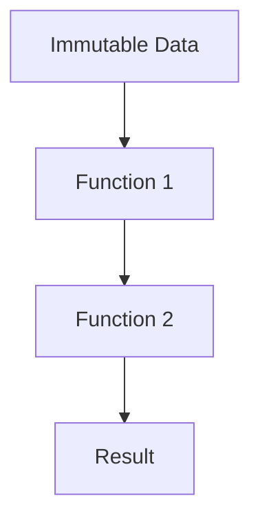
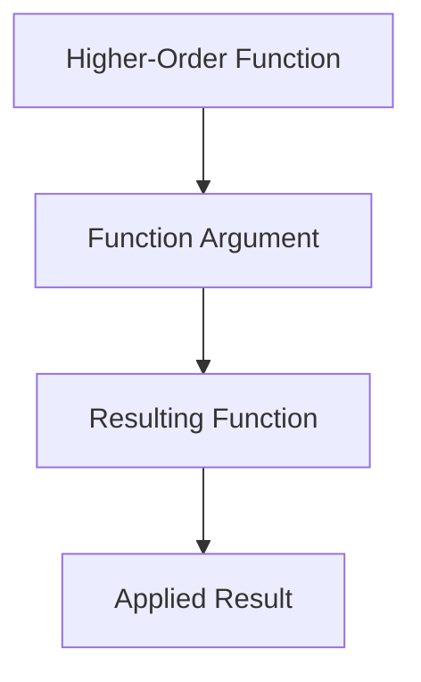

## 21.15 Embracing Functional Paradigms Fully

In the realm of software development, embracing functional paradigms fully can transform the way we approach problem-solving and system design. F#, as a functional-first language, provides a rich set of features that allow developers to harness the power of functional programming. In this section, we will delve into the core principles of functional programming, explore the advantages of adopting these paradigms, and provide practical guidance on transitioning from imperative to functional styles.

### Understanding Core Principles of Functional Programming

Functional programming is a paradigm that treats computation as the evaluation of mathematical functions and avoids changing state or mutable data. Let's explore some of its core principles:

#### Immutability

Immutability is the concept of creating data structures that cannot be modified after they are created. This leads to more predictable and reliable code, as it eliminates side effects caused by changes in state.

```fsharp
// Example of immutable data structure
let originalList = [1; 2; 3]
let newList = 0 :: originalList // Prepend 0 to the list
// originalList remains unchanged
```

#### Pure Functions

Pure functions are functions where the output value is determined only by its input values, without observable side effects. This makes them easier to test and reason about.

```fsharp
// Example of a pure function
let add x y = x + y
// Calling add with the same arguments will always return the same result
```

#### Higher-Order Functions

Higher-order functions are functions that take other functions as arguments or return them as results. They enable powerful abstractions and code reuse.

```fsharp
// Example of a higher-order function
let applyTwice f x = f (f x)
// Usage
let increment x = x + 1
let result = applyTwice increment 5 // result is 7
```

### Advantages of Fully Utilizing Functional Paradigms

Embracing functional paradigms offers several advantages that can significantly enhance the quality and maintainability of your codebase.

#### Improved Code Clarity

Functional programming encourages writing small, composable functions that are easy to understand and reason about. This leads to cleaner and more readable code.

#### Enhanced Testability

Pure functions and immutability make testing more straightforward, as there are no side effects to consider. This results in more reliable and maintainable tests.

#### Concurrency and Parallelism

Functional programming's emphasis on immutability and pure functions makes it inherently suitable for concurrent and parallel execution, as there are no shared states to manage.

### Transitioning from Imperative to Functional Styles

Transitioning from imperative to functional programming can be challenging, but it is a rewarding journey. Let's explore some strategies to ease this transition.

#### Refactoring Imperative Code

Start by identifying parts of your code that can be refactored into pure functions. Focus on eliminating side effects and using immutable data structures.

```fsharp
// Imperative style
let mutable sum = 0
for i in 1..10 do
    sum <- sum + i

// Functional style
let sum = List.sum [1..10]
```

#### Leveraging F# Features

F# provides several features that facilitate functional programming, such as pattern matching, discriminated unions, and computation expressions. Utilize these features to write more expressive and concise code.

```fsharp
// Using pattern matching
let describeNumber x =
    match x with
    | 0 -> "Zero"
    | 1 -> "One"
    | _ -> "Many"
```

#### Encouraging Immutability and Pure Functions

Promote the use of immutable data structures and pure functions within your team. Encourage developers to think about the data flow and dependencies in their code.

### Overcoming Challenges in Adopting Functional Programming

Adopting functional programming paradigms can present challenges, particularly for teams accustomed to imperative styles. Here are some common challenges and strategies to overcome them.

#### Learning Curve

Functional programming requires a shift in mindset, which can be daunting for developers new to the paradigm. Provide training and resources to help your team understand the core concepts and benefits.

#### Performance Concerns

Some developers may worry about the performance implications of immutability and recursion. Address these concerns by demonstrating how F# optimizes tail calls and how persistent data structures can be efficient.

#### Integration with Existing Codebases

Integrating functional code with existing imperative codebases can be challenging. Use F#'s interoperability features to gradually introduce functional paradigms without disrupting existing systems.

### Success Stories and Case Studies

Many organizations have successfully embraced functional programming paradigms, leading to significant improvements in their software systems. Let's explore a few case studies.

#### Case Study: Financial Services

A financial services company transitioned to F# for its trading platform, leveraging functional programming to improve code clarity and reduce bugs. The use of immutability and pure functions resulted in a more robust and maintainable system.

#### Case Study: Real-Time Analytics

A tech company adopted F# for its real-time analytics platform, utilizing functional paradigms to handle large-scale data processing efficiently. The emphasis on concurrency and parallelism enabled them to achieve high performance and scalability.

### Practical Tips for Fostering a Functional Programming Mindset

Fostering a functional programming mindset within your development team requires a combination of education, encouragement, and practical experience. Here are some tips to help you succeed.

#### Encourage Experimentation

Encourage your team to experiment with functional programming concepts in small projects or side tasks. This hands-on experience will help them understand the benefits and challenges of the paradigm.

#### Provide Learning Resources

Offer access to books, online courses, and workshops focused on functional programming and F#. Encourage team members to share their learnings and insights with the group.

#### Celebrate Successes

Celebrate successes and milestones achieved through the adoption of functional programming. Recognize team members who contribute to the transition and share their stories with the organization.

#### Foster a Collaborative Environment

Create an environment where team members feel comfortable discussing challenges and sharing solutions related to functional programming. Encourage collaboration and knowledge sharing.

### Try It Yourself

To solidify your understanding of functional paradigms, try refactoring a small piece of imperative code into a functional style. Focus on using immutable data structures and pure functions. Experiment with higher-order functions and see how they can simplify your code.

### Visualizing Functional Paradigms

To better understand the flow and structure of functional programming, let's visualize some key concepts using Mermaid.js diagrams.

#### Immutability and Data Flow



*Caption: This diagram illustrates the flow of data through a series of functions, emphasizing immutability and the absence of side effects.*

#### Higher-Order Functions



*Caption: This diagram demonstrates how higher-order functions take other functions as arguments and produce new functions.*

### Knowledge Check

Before we conclude, let's reinforce some key takeaways:

- Embrace immutability and pure functions to enhance code clarity and testability.
- Utilize higher-order functions for powerful abstractions and code reuse.
- Overcome challenges by providing training and fostering a collaborative environment.
- Celebrate successes and encourage experimentation to build a functional programming mindset.

Remember, embracing functional paradigms is a journey. As you continue to explore and apply these concepts, you'll discover new ways to improve your code and systems. Stay curious, keep experimenting, and enjoy the journey!

## Quiz Time!



### What is a core principle of functional programming that involves creating data structures that cannot be modified after creation?

- [x] Immutability
- [ ] Mutability
- [ ] Inheritance
- [ ] Polymorphism

> **Explanation:** Immutability is a core principle of functional programming where data structures cannot be changed after they are created, leading to more predictable and reliable code.


### Which of the following is a characteristic of pure functions?

- [x] They do not have side effects.
- [ ] They modify global state.
- [ ] They depend on external variables.
- [ ] They produce different outputs for the same inputs.

> **Explanation:** Pure functions do not have side effects and always produce the same output for the same inputs, making them easier to test and reason about.


### How can higher-order functions enhance code reuse?

- [x] By taking other functions as arguments or returning them as results.
- [ ] By modifying global variables.
- [ ] By using inheritance.
- [ ] By creating mutable data structures.

> **Explanation:** Higher-order functions enhance code reuse by allowing functions to be passed as arguments or returned as results, enabling powerful abstractions.


### What is a common challenge when adopting functional programming?

- [x] Learning curve
- [ ] Lack of libraries
- [ ] Inability to handle concurrency
- [ ] Poor performance

> **Explanation:** The learning curve is a common challenge when adopting functional programming, as it requires a shift in mindset from imperative programming.


### Which F# feature can be used to write more expressive and concise code?

- [x] Pattern matching
- [ ] Global variables
- [ ] Mutable state
- [ ] Inheritance

> **Explanation:** Pattern matching in F# allows for more expressive and concise code by providing a powerful way to deconstruct and analyze data.


### What is a benefit of using immutability in functional programming?

- [x] Predictable code behavior
- [ ] Increased complexity
- [ ] More side effects
- [ ] Harder testing

> **Explanation:** Immutability leads to predictable code behavior as data structures cannot be changed, reducing side effects and making the code easier to reason about.


### How can functional programming improve concurrency and parallelism?

- [x] By eliminating shared states
- [ ] By increasing mutable state
- [ ] By using global variables
- [ ] By relying on inheritance

> **Explanation:** Functional programming improves concurrency and parallelism by eliminating shared states, reducing the need for locks and synchronization.


### What strategy can help overcome the learning curve of functional programming?

- [x] Providing training and resources
- [ ] Avoiding functional concepts
- [ ] Sticking to imperative programming
- [ ] Ignoring immutability

> **Explanation:** Providing training and resources can help overcome the learning curve by helping developers understand the core concepts and benefits of functional programming.


### What is a practical tip for fostering a functional programming mindset within a team?

- [x] Encourage experimentation
- [ ] Discourage collaboration
- [ ] Avoid sharing knowledge
- [ ] Focus on imperative programming

> **Explanation:** Encouraging experimentation helps team members gain hands-on experience with functional programming concepts, fostering a functional programming mindset.


### True or False: Embracing functional paradigms can lead to improved code clarity and testability.

- [x] True
- [ ] False

> **Explanation:** Embracing functional paradigms can lead to improved code clarity and testability by promoting immutability, pure functions, and higher-order functions.


