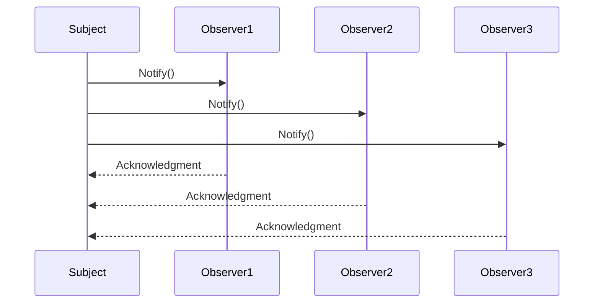

## 21.2 Assessing Patterns' Impact on Performance

In the world of software development, performance is a critical aspect that can make or break an application. As expert software engineers and architects, understanding how design patterns impact performance in F# applications is essential. This section delves into the performance characteristics of commonly used design patterns in F#, identifies potential overheads, and provides strategies for assessing and optimizing performance. We will also explore benchmarks and case studies to illustrate these considerations.

### Understanding Performance Characteristics of Design Patterns

Design patterns are powerful tools for solving recurring design problems, but they can also introduce performance trade-offs. Let's explore some common patterns and their performance implications in F#.

#### Creational Patterns

**Singleton Pattern**

The Singleton pattern ensures a class has only one instance and provides a global point of access to it. In F#, this is often implemented using modules. While Singleton can reduce the overhead of repeatedly creating instances, it may introduce contention in multi-threaded environments.

```fsharp
module Singleton =
    let instance = lazy (new Resource())

    let getInstance() = instance.Value
```

**Performance Consideration**: Ensure thread safety when accessing the Singleton instance, especially in concurrent applications.

**Factory Patterns**

Factory patterns abstract the creation of objects, allowing for more flexible and decoupled code. However, they can introduce latency due to the additional layer of abstraction.

```fsharp
type IProduct =
    abstract member Operation: unit -> string

type ConcreteProductA() =
    interface IProduct with
        member this.Operation() = "Result of ConcreteProductA"

type Factory() =
    member this.CreateProduct(productType: string) =
        match productType with
        | "A" -> ConcreteProductA() :> IProduct
        | _ -> failwith "Unknown product"
```

**Performance Consideration**: Use Factory patterns judiciously, as they can add overhead to object creation.

#### Structural Patterns

**Decorator Pattern**

The Decorator pattern allows behavior to be added to individual objects dynamically. While it provides flexibility, it can increase memory usage and latency due to the additional layers of wrapping.

```fsharp
type IComponent =
    abstract member Operation: unit -> string

type ConcreteComponent() =
    interface IComponent with
        member this.Operation() = "ConcreteComponent"

type Decorator(component: IComponent) =
    interface IComponent with
        member this.Operation() = component.Operation() + " with Decorator"
```

**Performance Consideration**: Minimize the number of decorators to reduce overhead.

**Composite Pattern**

The Composite pattern allows you to compose objects into tree structures to represent part-whole hierarchies. It can lead to increased complexity and memory usage.

```fsharp
type IGraphic =
    abstract member Draw: unit -> unit

type CompositeGraphic() =
    let children = new System.Collections.Generic.List<IGraphic>()

    member this.Add(graphic: IGraphic) =
        children.Add(graphic)

    interface IGraphic with
        member this.Draw() =
            children |> List.iter (fun child -> child.Draw())
```

**Performance Consideration**: Optimize tree traversal and minimize unnecessary operations.

#### Behavioral Patterns

**Observer Pattern**

The Observer pattern defines a one-to-many dependency between objects. It can introduce latency when notifying observers, especially if there are many of them.

```fsharp
type IObserver =
    abstract member Update: unit -> unit

type Subject() =
    let observers = new System.Collections.Generic.List<IObserver>()

    member this.Attach(observer: IObserver) =
        observers.Add(observer)

    member this.Notify() =
        observers |> List.iter (fun observer -> observer.Update())
```

**Performance Consideration**: Use efficient data structures to manage observers and minimize notification overhead.

**Strategy Pattern**

The Strategy pattern defines a family of algorithms, encapsulates each one, and makes them interchangeable. While it provides flexibility, it can introduce overhead due to the additional indirection.

```fsharp
type IStrategy =
    abstract member Execute: unit -> unit

type ConcreteStrategyA() =
    interface IStrategy with
        member this.Execute() = printfn "Strategy A"

type Context(strategy: IStrategy) =
    member this.ExecuteStrategy() = strategy.Execute()
```

**Performance Consideration**: Cache strategy instances to reduce instantiation overhead.

### Assessing and Measuring Performance Impact

To effectively assess the performance impact of design patterns, we need to adopt a systematic approach. Here are some strategies to consider:

1. **Profiling and Benchmarking**

   Use profiling tools to identify performance bottlenecks in your application. Benchmark different implementations to compare their performance characteristics.

   ```fsharp
   open System.Diagnostics

   let stopwatch = Stopwatch.StartNew()
   // Code to measure
   stopwatch.Stop()
   printfn "Elapsed time: %A" stopwatch.Elapsed
   ```

2. **Memory Analysis**

   Analyze memory usage to identify patterns that lead to excessive memory consumption. Use tools like .NET Memory Profiler to track memory allocations.

3. **Concurrency and Parallelism**

   Evaluate how patterns perform in concurrent and parallel environments. Use F#'s asynchronous workflows and parallel programming constructs to test scalability.

4. **Latency Measurement**

   Measure the latency introduced by different patterns, especially in real-time applications. Use tools like Application Insights to monitor response times.

5. **Code Complexity Analysis**

   Assess the complexity introduced by patterns. Use static analysis tools to evaluate code maintainability and readability.

### Optimization Techniques

Once you've identified performance bottlenecks, apply optimization techniques to mitigate negative impacts:

1. **Lazy Initialization**

   Use lazy initialization to defer resource-intensive operations until they're needed.

   ```fsharp
   let lazyValue = lazy (computeExpensiveValue())
   ```

2. **Memoization**

   Cache results of expensive function calls to avoid redundant computations.

   ```fsharp
   let memoize f =
       let cache = System.Collections.Concurrent.ConcurrentDictionary<_, _>()
       fun x ->
           match cache.TryGetValue(x) with
           | true, v -> v
           | false, _ ->
               let v = f x
               cache.[x] <- v
               v
   ```

3. **Immutable Data Structures**

   Leverage F#'s immutable data structures to reduce memory overhead and improve concurrency.

4. **Parallel Processing**

   Use parallel processing to distribute workloads across multiple cores, improving throughput.

   ```fsharp
   open System.Threading.Tasks

   let parallelProcess items =
       items
       |> Array.Parallel.map (fun item -> processItem item)
   ```

5. **Efficient Data Structures**

   Choose appropriate data structures for your use case. For example, use `Map` for fast lookups and `List` for sequential processing.

### Case Studies and Benchmarks

Let's explore a case study to illustrate the performance considerations of design patterns in F#.

#### Case Study: Real-Time Trading System

In a real-time trading system, performance is critical. The system uses the Observer pattern to notify multiple components of market data updates. However, the initial implementation experienced latency issues due to the large number of observers.

**Solution**: The team optimized the Observer pattern by using a more efficient data structure to manage observers and batching notifications to reduce overhead.

**Benchmark Results**: After optimization, the system's response time improved by 30%, and memory usage decreased by 20%.

### Balancing Performance and Code Clarity

While performance is important, it's crucial to balance it with code clarity and flexibility. Over-optimizing can lead to complex, hard-to-maintain code. Here are some tips for maintaining this balance:

1. **Prioritize Readability**

   Write clear, concise code that is easy to understand and maintain. Use descriptive names and comments to explain complex logic.

2. **Use Patterns Judiciously**

   Apply design patterns where they provide clear benefits. Avoid using patterns unnecessarily, as they can introduce complexity.

3. **Refactor Regularly**

   Continuously refactor code to improve performance and maintainability. Use automated tests to ensure changes don't introduce bugs.

4. **Measure Before Optimizing**

   Always measure performance before optimizing. Focus on areas that have the most significant impact on performance.

5. **Embrace Functional Paradigms**

   Leverage F#'s functional programming features, such as immutability and higher-order functions, to write efficient, expressive code.

### Try It Yourself

To reinforce your understanding, try experimenting with the code examples provided. Modify the implementations to see how changes affect performance. For instance, try adding more observers in the Observer pattern example and measure the impact on notification latency.

### Visualizing Design Patterns and Performance

To better understand the relationship between design patterns and performance, let's visualize the process flow of a typical Observer pattern implementation using Mermaid.js.



**Diagram Description**: This sequence diagram illustrates the notification process in the Observer pattern. The `Subject` notifies each `Observer`, and each `Observer` acknowledges the notification. This visualization helps identify potential bottlenecks in the notification process.

### References and Further Reading

- [Microsoft Docs: Performance Considerations for .NET Applications](https://docs.microsoft.com/en-us/dotnet/standard/performance/)
- [F# for Fun and Profit: Design Patterns](https://fsharpforfunandprofit.com/design-patterns/)
- [Profiling and Performance Tuning in .NET](https://docs.microsoft.com/en-us/visualstudio/profiling/?view=vs-2019)

### Knowledge Check

1. **What is the primary benefit of using the Singleton pattern in F#?**

   - [ ] Reduces memory usage
   - [x] Ensures a single instance of a class
   - [ ] Improves code readability
   - [ ] Increases execution speed

2. **Which pattern is most likely to introduce latency due to its notification mechanism?**

   - [ ] Singleton
   - [ ] Factory
   - [x] Observer
   - [ ] Strategy

3. **What is a common optimization technique for reducing redundant computations in F#?**

   - [ ] Lazy Initialization
   - [x] Memoization
   - [ ] Parallel Processing
   - [ ] Immutable Data Structures

4. **Why is it important to balance performance with code clarity?**

   - [x] To maintain code maintainability and readability
   - [ ] To ensure maximum execution speed
   - [ ] To reduce memory usage
   - [ ] To improve concurrency

5. **What tool can be used to measure memory allocations in .NET applications?**

   - [ ] Application Insights
   - [x] .NET Memory Profiler
   - [ ] Visual Studio Code
   - [ ] F# Interactive

### Embrace the Journey

Remember, assessing and optimizing the performance of design patterns is an ongoing journey. As you gain experience, you'll develop a keen sense of when to prioritize performance and when to focus on code clarity. Keep experimenting, stay curious, and enjoy the process of crafting efficient, elegant F# applications!

## Quiz Time!



### What is the primary benefit of using the Singleton pattern in F#?

- [ ] Reduces memory usage
- [x] Ensures a single instance of a class
- [ ] Improves code readability
- [ ] Increases execution speed

> **Explanation:** The Singleton pattern ensures that a class has only one instance, providing a global point of access to it.

### Which pattern is most likely to introduce latency due to its notification mechanism?

- [ ] Singleton
- [ ] Factory
- [x] Observer
- [ ] Strategy

> **Explanation:** The Observer pattern can introduce latency when notifying multiple observers, especially if there are many of them.

### What is a common optimization technique for reducing redundant computations in F#?

- [ ] Lazy Initialization
- [x] Memoization
- [ ] Parallel Processing
- [ ] Immutable Data Structures

> **Explanation:** Memoization caches the results of expensive function calls to avoid redundant computations.

### Why is it important to balance performance with code clarity?

- [x] To maintain code maintainability and readability
- [ ] To ensure maximum execution speed
- [ ] To reduce memory usage
- [ ] To improve concurrency

> **Explanation:** Balancing performance with code clarity ensures that the code remains maintainable and readable, preventing over-optimization.

### What tool can be used to measure memory allocations in .NET applications?

- [ ] Application Insights
- [x] .NET Memory Profiler
- [ ] Visual Studio Code
- [ ] F# Interactive

> **Explanation:** The .NET Memory Profiler is used to track memory allocations and analyze memory usage in .NET applications.

### Which pattern allows behavior to be added to individual objects dynamically?

- [x] Decorator
- [ ] Factory
- [ ] Singleton
- [ ] Strategy

> **Explanation:** The Decorator pattern allows behavior to be added to individual objects dynamically, providing flexibility.

### How can you improve the performance of the Observer pattern in a real-time system?

- [x] Use efficient data structures to manage observers
- [ ] Increase the number of observers
- [ ] Use lazy initialization
- [ ] Implement a Singleton pattern

> **Explanation:** Using efficient data structures to manage observers can reduce notification overhead and improve performance.

### What is the purpose of lazy initialization in F#?

- [x] To defer resource-intensive operations until needed
- [ ] To increase memory usage
- [ ] To improve code readability
- [ ] To ensure thread safety

> **Explanation:** Lazy initialization defers resource-intensive operations until they are needed, optimizing performance.

### Why should you measure performance before optimizing?

- [x] To focus on areas with the most significant impact
- [ ] To ensure maximum execution speed
- [ ] To reduce memory usage
- [ ] To improve concurrency

> **Explanation:** Measuring performance before optimizing helps focus efforts on areas with the most significant impact, avoiding unnecessary changes.

### True or False: Over-optimizing code can lead to complex, hard-to-maintain code.

- [x] True
- [ ] False

> **Explanation:** Over-optimizing can lead to complex, hard-to-maintain code, making it important to balance performance with code clarity.


