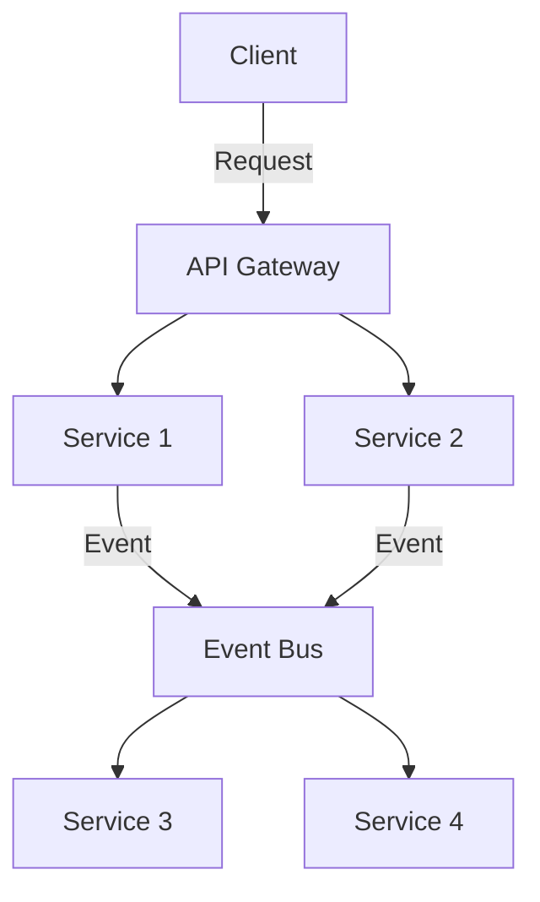

## 21.3 Scalability Considerations

### Introduction to Scalability

Scalability is a critical attribute of software systems, referring to their ability to handle increased loads without compromising performance. As systems grow in complexity and user base, ensuring they can scale effectively becomes paramount. In the context of F#, a functional-first language, scalability involves leveraging its unique features and design patterns to build robust, efficient, and scalable applications.

### Understanding Scalability in Software Systems

Scalability can be broadly categorized into two types:

1. **Vertical Scalability (Scaling Up):** Involves adding more resources, such as CPU or RAM, to a single machine. This approach is limited by the maximum capacity of a single machine.

2. **Horizontal Scalability (Scaling Out):** Involves adding more machines or nodes to a system, distributing the load across multiple servers. This approach is often more cost-effective and can handle larger workloads.

### The Role of Design Patterns in Scalability

Design patterns play a crucial role in determining how well a system can scale. They provide reusable solutions to common problems, allowing developers to build systems that are both efficient and maintainable. However, not all design patterns are inherently scalable. Understanding the impact of different patterns on scalability is essential for making informed architectural decisions.

#### Positive Impact of Design Patterns on Scalability

- **Separation of Concerns:** Patterns like Model-View-Controller (MVC) and Model-View-Update (MVU) promote separation of concerns, making it easier to scale individual components independently.
- **Concurrency Patterns:** Patterns such as the Actor Model and Pipeline allow for concurrent processing, improving throughput and responsiveness.
- **Caching Patterns:** Implementing caching strategies can significantly reduce load on databases and improve response times.

#### Negative Impact of Design Patterns on Scalability

- **Monolithic Patterns:** Monolithic architectures can become bottlenecks as they scale, making it difficult to isolate and scale individual components.
- **Tight Coupling:** Patterns that result in tightly coupled components can hinder scalability, as changes in one component may necessitate changes in others.

### Guidelines for Building Scalable Architectures in F#

#### Embrace Functional Programming Principles

F#'s functional programming paradigm offers several advantages for scalability:

- **Immutability:** Immutable data structures prevent side effects, making it easier to reason about concurrent operations.
- **Pure Functions:** Pure functions with no side effects can be executed in parallel, improving performance.
- **Higher-Order Functions:** These allow for flexible and reusable code, facilitating the implementation of scalable patterns.

#### Utilize Concurrency and Parallelism

Concurrency and parallelism are essential for building scalable systems. F# provides several constructs to facilitate these:

- **Async Workflows:** Use F#'s `async` workflows to manage asynchronous operations efficiently.
- **Parallel Collections:** Leverage parallel collections for data parallelism, processing large datasets concurrently.

```fsharp
open System
open System.Threading.Tasks

let processData (data: int[]) =
    data
    |> Array.Parallel.map (fun x -> x * x)
    |> Array.sum

let result = processData [|1; 2; 3; 4; 5|]
printfn "Sum of squares: %d" result
```

#### Design for Distributed Systems

Distributed systems offer a scalable solution by distributing workloads across multiple nodes. Consider the following when designing distributed systems in F#:

- **Microservices Architecture:** Break down applications into smaller, independent services that can be scaled individually.
- **Event-Driven Architecture:** Use message queues and event streams to decouple components and improve scalability.

#### Implement Caching Strategies

Caching is a powerful technique for improving scalability by reducing the load on backend systems. Consider using:

- **In-Memory Caching:** Store frequently accessed data in memory to reduce database queries.
- **Distributed Caching:** Use distributed caches like Redis to share cached data across multiple nodes.

### Examples of Scalable F# Applications

#### Real-Time Data Processing

Real-time data processing systems require high throughput and low latency. F#'s functional features and design patterns make it well-suited for such applications.

```fsharp
open System
open System.Reactive.Linq

let dataStream = Observable.Interval(TimeSpan.FromSeconds(1.0))

let subscription =
    dataStream
    |> Observable.map (fun x -> x * 2L)
    |> Observable.subscribe (printfn "Processed data: %d")

Console.ReadLine() |> ignore
subscription.Dispose()
```

#### Web Applications

F# can be used to build scalable web applications, leveraging frameworks like Giraffe and Suave.

```fsharp
open Giraffe
open Microsoft.AspNetCore.Builder
open Microsoft.AspNetCore.Hosting
open Microsoft.Extensions.DependencyInjection

let webApp =
    choose [
        route "/" >=> text "Hello, World!"
        route "/ping" >=> text "Pong"
    ]

let configureApp (app: IApplicationBuilder) =
    app.UseGiraffe webApp

let configureServices (services: IServiceCollection) =
    services.AddGiraffe() |> ignore

[<EntryPoint>]
let main _ =
    WebHost.CreateDefaultBuilder()
        .Configure(configureApp)
        .ConfigureServices(configureServices)
        .Build()
        .Run()
    0
```

### Importance of Early Scalability Planning

Planning for scalability should start early in the development process. Consider the following:

- **Identify Bottlenecks:** Use profiling tools to identify potential bottlenecks early on.
- **Load Testing:** Conduct load testing to understand how the system behaves under stress.
- **Scalability Roadmap:** Develop a roadmap for scaling the system as user demand grows.

### Concurrency, Parallelism, and Distributed Systems

#### Concurrency in F#

Concurrency involves executing multiple tasks simultaneously, improving system responsiveness. F# provides several tools for concurrency:

- **Async Workflows:** Manage asynchronous operations with ease.
- **MailboxProcessor:** Implement the Actor Model for safe concurrent processing.

```fsharp
let agent = MailboxProcessor.Start(fun inbox ->
    let rec loop() = async {
        let! msg = inbox.Receive()
        printfn "Received message: %s" msg
        return! loop()
    }
    loop())

agent.Post("Hello, Agent!")
```

#### Parallelism in F#

Parallelism involves dividing a task into smaller sub-tasks that can be executed concurrently. F#'s parallel collections and Task Parallel Library (TPL) facilitate parallelism.

```fsharp
open System.Threading.Tasks

let parallelTask = Task.Run(fun () ->
    printfn "Running in parallel"
)

parallelTask.Wait()
```

#### Distributed Systems in F#

Distributed systems involve multiple nodes working together to achieve a common goal. F#'s functional features make it well-suited for building distributed systems.

- **Microservices:** Use F# to build microservices that can be deployed independently.
- **Event Sourcing:** Implement event sourcing to capture changes as events, improving scalability and resilience.

```fsharp
type Event =
    | UserRegistered of string
    | UserLoggedIn of string

let handleEvent event =
    match event with
    | UserRegistered username -> printfn "User registered: %s" username
    | UserLoggedIn username -> printfn "User logged in: %s" username

let events = [UserRegistered "Alice"; UserLoggedIn "Alice"]
events |> List.iter handleEvent
```

### Key Takeaways

- **Plan for Scalability Early:** Identify potential bottlenecks and develop a scalability roadmap.
- **Leverage F#'s Functional Features:** Use immutability, pure functions, and higher-order functions to build scalable systems.
- **Utilize Concurrency and Parallelism:** Use F#'s async workflows and parallel collections to improve performance.
- **Design for Distributed Systems:** Consider microservices and event-driven architectures for scalable solutions.

### Try It Yourself

Experiment with the provided code examples by modifying them to suit your needs. For instance, try implementing a simple microservice using F# and a message queue for communication. Explore different caching strategies to see how they impact performance.

### Visualizing Scalability in F#

To better understand how scalability can be visualized in F#, let's look at a diagram representing a scalable architecture using microservices and event-driven patterns.



**Diagram Description:** This diagram illustrates a scalable architecture using microservices and an event bus. The API Gateway routes requests to different services, which communicate through an event bus, allowing for decoupled and scalable interactions.

### References and Further Reading

- [Microsoft Docs: F# Asynchronous Programming](https://docs.microsoft.com/en-us/dotnet/fsharp/async/)
- [Reactive Extensions (Rx) Documentation](https://reactivex.io/)
- [Redis Official Documentation](https://redis.io/documentation)

### Knowledge Check

Before moving on, consider the following questions:

- How does immutability contribute to scalability in F#?
- What are the benefits of using an event-driven architecture for scalability?
- How can caching improve the scalability of an application?

### Embrace the Journey

Remember, scalability is an ongoing process. As you continue to develop and refine your F# applications, keep scalability in mind. Experiment with different patterns and techniques, and don't hesitate to iterate on your designs. Stay curious, and enjoy the journey of building scalable systems!

## Quiz Time!



### What is vertical scalability in software systems?

- [x] Adding more resources to a single machine
- [ ] Adding more machines to a system
- [ ] Distributing workloads across multiple nodes
- [ ] Using microservices architecture

> **Explanation:** Vertical scalability involves adding more resources, such as CPU or RAM, to a single machine to handle increased loads.

### How does immutability in F# contribute to scalability?

- [x] Prevents side effects, making concurrent operations easier
- [ ] Increases memory usage
- [ ] Complicates code readability
- [ ] Reduces performance

> **Explanation:** Immutability prevents side effects, making it easier to reason about concurrent operations, which is beneficial for scalability.

### Which pattern is NOT typically associated with scalability?

- [ ] Microservices
- [ ] Event-Driven Architecture
- [x] Monolithic Architecture
- [ ] Caching

> **Explanation:** Monolithic architectures can become bottlenecks as they scale, making it difficult to isolate and scale individual components.

### What is the primary advantage of using an event-driven architecture?

- [x] Decouples components, improving scalability
- [ ] Increases complexity
- [ ] Reduces performance
- [ ] Complicates debugging

> **Explanation:** Event-driven architectures decouple components, allowing them to scale independently and improving overall system scalability.

### How can caching improve scalability?

- [x] Reduces load on backend systems
- [ ] Increases database queries
- [ ] Complicates data retrieval
- [ ] Decreases response times

> **Explanation:** Caching reduces the load on backend systems by storing frequently accessed data, improving response times and scalability.

### What is the role of an API Gateway in a scalable architecture?

- [x] Routes requests to different services
- [ ] Stores data in memory
- [ ] Processes data in parallel
- [ ] Handles user authentication

> **Explanation:** An API Gateway routes requests to different services, providing a single entry point and facilitating scalability.

### Which F# feature is particularly useful for managing asynchronous operations?

- [x] Async Workflows
- [ ] Parallel Collections
- [ ] Immutability
- [ ] Higher-Order Functions

> **Explanation:** F#'s async workflows are designed to manage asynchronous operations efficiently, improving scalability.

### What is horizontal scalability?

- [x] Adding more machines to a system
- [ ] Increasing CPU resources
- [ ] Using a single machine
- [ ] Reducing memory usage

> **Explanation:** Horizontal scalability involves adding more machines or nodes to a system, distributing the load across multiple servers.

### Which of the following is a concurrency pattern in F#?

- [x] Actor Model
- [ ] Monolithic Architecture
- [ ] Singleton Pattern
- [ ] MVC Pattern

> **Explanation:** The Actor Model is a concurrency pattern that allows for safe concurrent processing in F#.

### True or False: Planning for scalability should start early in the development process.

- [x] True
- [ ] False

> **Explanation:** Planning for scalability early in the development process helps identify potential bottlenecks and develop a roadmap for scaling the system as user demand grows.


