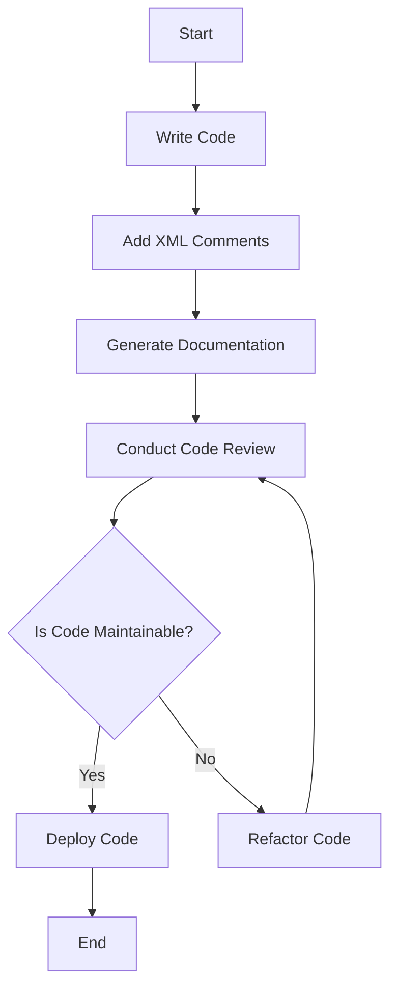

## 21.4 Documentation and Maintainability

In the realm of software development, especially when dealing with complex systems and architectures, the importance of documentation and maintainability cannot be overstated. As expert software engineers and architects, our goal is to ensure that our codebases are not only functional but also understandable, maintainable, and scalable. This section delves into the strategies and best practices for achieving these goals in F# development.

### The Importance of Documentation

Documentation serves as the backbone of any collaborative software development effort. It acts as a guide for developers, providing insights into the design decisions, architecture, and functionality of the code. In F#, where functional programming paradigms can introduce unique challenges, clear documentation becomes even more critical.

#### Why Document?

1. **Facilitates Collaboration**: In a team environment, documentation ensures that all team members have a shared understanding of the codebase. This is crucial for onboarding new developers and for ensuring continuity when team members change.

2. **Enhances Code Comprehension**: Well-documented code helps developers understand the purpose and functionality of different components, reducing the learning curve and minimizing errors.

3. **Supports Maintenance and Refactoring**: As systems evolve, documentation provides a reference point for making informed decisions during maintenance and refactoring.

4. **Improves Code Quality**: By documenting assumptions, constraints, and design decisions, developers can ensure that the code adheres to the intended architecture and design patterns.

### Best Practices for Documenting F# Code

F# offers several tools and techniques for effective documentation. Let's explore some of the best practices for documenting F# code.

#### XML Comments

XML comments are a powerful way to document F# code. They provide a structured format for adding descriptions, parameter explanations, and return values to functions and types.

```fsharp
/// <summary>
/// Calculates the factorial of a given number.
/// </summary>
/// <param name="n">The number for which to calculate the factorial.</param>
/// <returns>The factorial of the number.</returns>
let rec factorial n =
    if n <= 1 then 1 else n * factorial (n - 1)
```

**Benefits**:
- **IntelliSense Support**: XML comments are integrated with IntelliSense in Visual Studio, providing developers with immediate access to documentation as they code.
- **Documentation Generation**: Tools like Sandcastle and DocFX can generate comprehensive documentation from XML comments.

#### Documentation Generators

Documentation generators transform code comments into readable documentation. They are essential for maintaining up-to-date documentation that evolves with the codebase.

- **DocFX**: A popular tool for generating static documentation sites from XML comments and Markdown files. It supports F# and integrates well with .NET projects.
- **FSharp.Formatting**: Specifically designed for F#, it allows for the generation of documentation from F# script files and Markdown.

#### Consistent Coding Standards

Consistency in coding standards is key to maintainability. By adhering to a set of agreed-upon conventions, teams can ensure that code is uniform and predictable.

- **Naming Conventions**: Use descriptive names for variables, functions, and types. Follow F# conventions such as camelCase for values and functions, and PascalCase for types and modules.
- **Code Layout**: Maintain consistent indentation and spacing. Use tools like Fantomas for automatic code formatting.
- **Commenting Style**: Adopt a consistent style for comments. Use comments to explain the "why" rather than the "what" of the code.

### Writing Self-Documenting Code

Self-documenting code is code that is clear and understandable without requiring extensive comments. F#'s idiomatic features lend themselves well to writing self-documenting code.

#### Leveraging F# Idioms

- **Pattern Matching**: Use pattern matching to make control flow explicit and clear. It reduces the need for comments by making the logic self-evident.
  
  ```fsharp
  let describeOption opt =
      match opt with
      | Some value -> sprintf "Value: %A" value
      | None -> "No value"
  ```

- **Algebraic Data Types**: Use discriminated unions and records to model data clearly. They make the structure and intent of data explicit.

  ```fsharp
  type Shape =
      | Circle of radius: float
      | Rectangle of width: float * height: float
  ```

- **Function Composition**: Compose functions to build complex logic from simple, understandable parts.

  ```fsharp
  let add x y = x + y
  let multiply x y = x * y
  let addThenMultiply x y z = x |> add y |> multiply z
  ```

### Regular Code Reviews and Refactoring

Regular code reviews and refactoring are essential practices for maintaining code quality and ensuring that documentation remains relevant.

#### Code Reviews

- **Peer Feedback**: Code reviews provide an opportunity for peer feedback, helping to catch errors and improve code quality.
- **Knowledge Sharing**: They facilitate knowledge sharing among team members, ensuring that everyone understands the codebase.
- **Adherence to Standards**: Reviews ensure that code adheres to established standards and best practices.

#### Refactoring

- **Continuous Improvement**: Regular refactoring helps improve code structure and readability, making it easier to maintain.
- **Documentation Updates**: Ensure that documentation is updated to reflect changes made during refactoring.

### Examples of Well-Documented Code

Let's look at an example of well-documented F# code and its benefits.

```fsharp
/// <summary>
/// Represents a bank account with basic operations.
/// </summary>
type BankAccount(initialBalance: decimal) =
    let mutable balance = initialBalance

    /// <summary>
    /// Deposits an amount into the account.
/// </summary>
/// <param name="amount">The amount to deposit.</param>
    member this.Deposit(amount: decimal) =
        if amount <= 0m then
            invalidArg "amount" "Deposit amount must be positive."
        else
            balance <- balance + amount

    /// <summary>
    /// Withdraws an amount from the account.
/// </summary>
/// <param name="amount">The amount to withdraw.</param>
    member this.Withdraw(amount: decimal) =
        if amount <= 0m then
            invalidArg "amount" "Withdrawal amount must be positive."
        elif amount > balance then
            invalidArg "amount" "Insufficient funds."
        else
            balance <- balance - amount

    /// <summary>
    /// Gets the current balance of the account.
/// </summary>
/// <returns>The current balance.</returns>
    member this.Balance = balance
```

**Benefits**:
- **Clarity**: The code is clear and easy to understand, with descriptive names and XML comments explaining each member.
- **Error Handling**: The use of `invalidArg` provides clear error messages, enhancing code robustness.
- **Maintainability**: The code is structured in a way that makes it easy to extend and modify.

### Try It Yourself

To solidify your understanding, try modifying the `BankAccount` class to include a transaction history. Document your changes using XML comments and ensure that your code remains clear and maintainable.

### Visualizing Documentation and Maintainability

To better understand the flow of documentation and maintainability practices, let's visualize the process using a flowchart.



**Description**: This flowchart illustrates the process of writing maintainable code with proper documentation. It emphasizes the iterative nature of code reviews and refactoring to ensure code quality.

### References and Links

- [F# Documentation](https://docs.microsoft.com/en-us/dotnet/fsharp/)
- [DocFX Documentation](https://dotnet.github.io/docfx/)
- [FSharp.Formatting GitHub](https://github.com/fsprojects/FSharp.Formatting)

### Knowledge Check

1. **What is the primary purpose of documentation in software development?**
   - To facilitate collaboration and enhance code comprehension.

2. **How can XML comments benefit F# developers?**
   - They provide IntelliSense support and enable documentation generation.

3. **What is a key advantage of self-documenting code?**
   - It reduces the need for extensive comments by making the code itself clear and understandable.

4. **Why are regular code reviews important?**
   - They provide peer feedback, facilitate knowledge sharing, and ensure adherence to standards.

5. **What should be done after refactoring code?**
   - Update the documentation to reflect any changes made.

### Embrace the Journey

Remember, documentation and maintainability are ongoing processes. As you continue to develop in F#, keep experimenting with different documentation techniques, stay curious about new tools, and enjoy the journey of creating maintainable and high-quality software.

## Quiz Time!



### What is the primary purpose of documentation in software development?

- [x] To facilitate collaboration and enhance code comprehension.
- [ ] To increase code complexity.
- [ ] To make code execution faster.
- [ ] To reduce the number of developers needed.

> **Explanation:** Documentation helps in collaboration by providing a shared understanding of the codebase and enhances comprehension by explaining the purpose and functionality of the code.

### How can XML comments benefit F# developers?

- [x] They provide IntelliSense support and enable documentation generation.
- [ ] They make code run faster.
- [ ] They reduce the need for testing.
- [ ] They replace the need for code reviews.

> **Explanation:** XML comments are integrated with IntelliSense, providing immediate access to documentation, and can be used to generate comprehensive documentation.

### What is a key advantage of self-documenting code?

- [x] It reduces the need for extensive comments by making the code itself clear and understandable.
- [ ] It increases the complexity of the code.
- [ ] It requires more lines of code.
- [ ] It makes the code execution slower.

> **Explanation:** Self-documenting code is written in a way that its purpose and functionality are clear from the code itself, reducing the need for additional comments.

### Why are regular code reviews important?

- [x] They provide peer feedback, facilitate knowledge sharing, and ensure adherence to standards.
- [ ] They increase the number of bugs in the code.
- [ ] They make the code harder to understand.
- [ ] They slow down the development process.

> **Explanation:** Code reviews help catch errors, improve code quality, and ensure that all team members understand the codebase, promoting adherence to standards.

### What should be done after refactoring code?

- [x] Update the documentation to reflect any changes made.
- [ ] Delete all comments from the code.
- [ ] Increase the code complexity.
- [ ] Remove all error handling.

> **Explanation:** After refactoring, it's important to update the documentation to ensure it accurately reflects the current state of the code.

### Which tool is specifically designed for generating F# documentation?

- [x] FSharp.Formatting
- [ ] Javadoc
- [ ] Doxygen
- [ ] Sphinx

> **Explanation:** FSharp.Formatting is a tool specifically designed for generating documentation from F# script files and Markdown.

### What is a benefit of using consistent coding standards?

- [x] It ensures code is uniform and predictable.
- [ ] It makes code harder to read.
- [ ] It increases the number of bugs.
- [ ] It slows down the development process.

> **Explanation:** Consistent coding standards make code uniform and predictable, which enhances readability and maintainability.

### How does pattern matching in F# contribute to self-documenting code?

- [x] It makes control flow explicit and clear.
- [ ] It increases the need for comments.
- [ ] It complicates the code structure.
- [ ] It makes the code less readable.

> **Explanation:** Pattern matching in F# makes the logic of the code explicit and clear, reducing the need for additional comments.

### What is the role of refactoring in maintainability?

- [x] It improves code structure and readability.
- [ ] It increases code complexity.
- [ ] It makes code harder to understand.
- [ ] It reduces code quality.

> **Explanation:** Refactoring improves the structure and readability of code, making it easier to maintain and extend.

### True or False: Documentation should only be updated during major releases.

- [ ] True
- [x] False

> **Explanation:** Documentation should be updated regularly, especially after changes, to ensure it accurately reflects the current state of the codebase.


