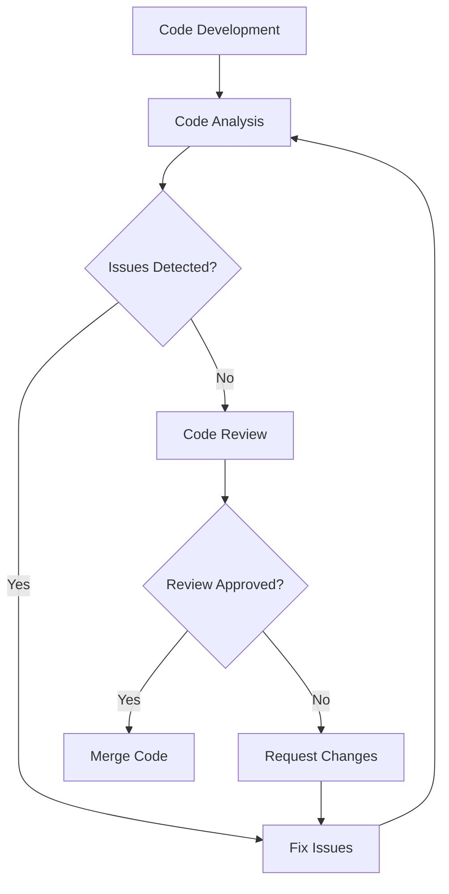

## 21.5 Code Quality and Review Practices

In the world of software development, maintaining high code quality is paramount to building robust, scalable, and maintainable applications. This is especially true in F# projects, where functional programming paradigms offer unique opportunities and challenges. In this section, we will explore the tools and practices that can help you achieve and maintain high code quality in your F# projects. We'll delve into F# analyzers, code analysis tools, CI/CD integration, and best practices for effective code reviews.

### Introduction to F# Analyzers

F# analyzers are tools designed to automatically inspect your code for potential issues, style inconsistencies, and opportunities for optimization. These tools are essential for maintaining high code quality, as they provide immediate feedback to developers, helping them identify and fix issues early in the development process.

#### What Are F# Analyzers?

F# analyzers are static analysis tools that examine your code without executing it. They look for patterns that may indicate errors, code smells, or deviations from best practices. By integrating these tools into your development workflow, you can catch issues before they become problematic, saving time and effort in the long run.

#### Benefits of Using F# Analyzers

1. **Early Detection of Errors**: Analyzers can catch syntax errors, type mismatches, and other issues before you run your code.
2. **Consistency**: They enforce coding standards and style guides, ensuring that your codebase remains consistent and easy to read.
3. **Optimization**: Analyzers can suggest performance improvements and highlight inefficient code patterns.
4. **Documentation**: They can help ensure that your code is well-documented, making it easier for others to understand and maintain.

### Setting Up Code Analysis Tools in F# Development Environments

Integrating code analysis tools into your F# development environment is a straightforward process. Here, we'll guide you through setting up some popular tools that can help you maintain code quality.

#### Popular F# Analyzers

- **FSharpLint**: A tool that checks your F# code for style and consistency issues. It can be configured to enforce your team's coding standards.
- **SonarQube**: A platform that provides continuous inspection of code quality, supporting multiple languages, including F#.
- **JetBrains Rider**: An IDE that offers built-in support for F# and includes powerful code analysis features.

#### Setting Up FSharpLint

To set up FSharpLint in your project, follow these steps:

1. **Install FSharpLint**: You can add FSharpLint to your project using the NuGet package manager. Run the following command in your terminal:

   ```shell
   dotnet add package FSharpLint
   ```

2. **Configure FSharpLint**: Create a `fsharplint.json` configuration file in the root of your project. This file allows you to customize the rules and settings for FSharpLint.

   ```json
   {
     "rules": {
       "Naming": {
         "enabled": true
       },
       "Formatting": {
         "enabled": true
       }
     }
   }
   ```

3. **Run FSharpLint**: Execute FSharpLint by running the following command:

   ```shell
   dotnet fsharplint lint
   ```

   This will analyze your code and provide feedback on any issues it detects.

#### Integrating SonarQube

SonarQube is a powerful tool for continuous code quality inspection. To integrate SonarQube with your F# project:

1. **Install SonarQube**: Download and install SonarQube from its official website. Set up a SonarQube server on your local machine or a dedicated server.

2. **Configure SonarQube**: Create a `sonar-project.properties` file in your project directory. This file contains configuration settings for SonarQube analysis.

   ```properties
   sonar.projectKey=my-fsharp-project
   sonar.sources=src
   sonar.language=fsharp
   ```

3. **Run SonarQube Analysis**: Use the SonarQube scanner to analyze your project. Run the following command:

   ```shell
   sonar-scanner
   ```

   This will send your code to the SonarQube server for analysis, and you can view the results in the SonarQube dashboard.

### Integrating Code Quality Checks into CI/CD Pipelines

Continuous Integration and Continuous Deployment (CI/CD) pipelines are essential for modern software development. Integrating code quality checks into these pipelines ensures that only high-quality code is deployed to production.

#### Setting Up a CI/CD Pipeline

To set up a CI/CD pipeline with code quality checks, follow these steps:

1. **Choose a CI/CD Platform**: Popular platforms include GitHub Actions, GitLab CI, and Azure DevOps. Choose one that fits your team's needs.

2. **Define Pipeline Stages**: A typical pipeline includes stages for building, testing, and deploying your application. Add a stage for code quality checks.

3. **Integrate Code Analysis Tools**: Use the tools we discussed earlier (e.g., FSharpLint, SonarQube) in your pipeline. Configure them to run automatically during the build process.

4. **Automate Feedback**: Set up notifications to alert developers when code quality issues are detected. This can be done through email, chat, or directly in your version control system.

#### Example CI/CD Pipeline Configuration

Here's an example of a GitHub Actions workflow that includes code quality checks using FSharpLint:

```yaml
name: CI

on:
  push:
    branches:
      - main
  pull_request:
    branches:
      - main

jobs:
  build:
    runs-on: ubuntu-latest

    steps:
    - uses: actions/checkout@v2

    - name: Set up .NET
      uses: actions/setup-dotnet@v1
      with:
        dotnet-version: '6.0.x'

    - name: Install dependencies
      run: dotnet restore

    - name: Run FSharpLint
      run: dotnet fsharplint lint

    - name: Build
      run: dotnet build --no-restore

    - name: Test
      run: dotnet test --no-build
```

### Best Practices for Conducting Thorough and Constructive Code Reviews

Code reviews are a critical part of maintaining code quality. They provide an opportunity for team members to collaborate, share knowledge, and ensure that code meets the project's standards.

#### Key Principles of Effective Code Reviews

1. **Focus on the Code, Not the Author**: Keep feedback objective and focused on the code itself. Avoid personal comments or criticisms.

2. **Be Constructive**: Provide actionable feedback that helps the author improve their code. Offer suggestions for improvement rather than just pointing out problems.

3. **Encourage Discussion**: Use code reviews as an opportunity to discuss design decisions and share knowledge. Encourage team members to ask questions and provide insights.

4. **Keep Reviews Manageable**: Review smaller changes more frequently rather than large, infrequent changes. This makes reviews more manageable and less time-consuming.

5. **Use Checklists**: Create a checklist of common issues to look for during reviews. This helps ensure consistency and thoroughness.

#### Conducting a Code Review

When conducting a code review, follow these steps:

1. **Understand the Context**: Before reviewing the code, understand the purpose of the changes. Read any associated documentation or issue descriptions.

2. **Review the Code**: Examine the code for correctness, readability, and adherence to coding standards. Look for potential bugs, performance issues, and areas for improvement.

3. **Provide Feedback**: Use inline comments to provide feedback on specific lines of code. Be clear and concise in your comments.

4. **Discuss and Iterate**: Engage in a discussion with the author if needed. Work together to address any issues and iterate on the code until it meets the project's standards.

5. **Approve or Request Changes**: Once the review is complete, either approve the changes or request further modifications.

### Common Code Issues Detected by Analyzers and How to Fix Them

Analyzers can detect a wide range of code issues. Here are some common issues and how to address them:

#### Naming Conventions

**Issue**: Inconsistent or unclear naming of variables, functions, or types.

**Solution**: Follow a consistent naming convention. Use descriptive names that convey the purpose of the variable or function.

#### Unused Variables

**Issue**: Variables that are declared but never used.

**Solution**: Remove unused variables to clean up the code and improve readability.

#### Code Duplication

**Issue**: Repeated code blocks that could be consolidated.

**Solution**: Refactor the code to eliminate duplication. Use functions or modules to encapsulate repeated logic.

#### Complex Functions

**Issue**: Functions that are too long or complex, making them difficult to understand.

**Solution**: Break complex functions into smaller, more manageable functions. Each function should have a single responsibility.

#### Lack of Documentation

**Issue**: Code that lacks comments or documentation, making it hard to understand.

**Solution**: Add comments and documentation to explain the purpose and functionality of the code. Use XML documentation for public APIs.

### The Role of Team Collaboration in Maintaining Code Standards

Maintaining high code quality is a team effort. Collaboration and communication are key to ensuring that everyone is on the same page and that code standards are consistently applied.

#### Establishing Coding Standards

1. **Define Standards**: Collaboratively define coding standards and guidelines for your team. Document these standards and make them easily accessible.

2. **Regularly Review Standards**: Periodically review and update coding standards to reflect new practices and technologies.

3. **Promote Knowledge Sharing**: Encourage team members to share knowledge and best practices. Hold regular meetings or workshops to discuss code quality and review practices.

#### Encouraging a Culture of Quality

1. **Lead by Example**: Senior developers and team leads should model good coding practices and encourage others to do the same.

2. **Foster Open Communication**: Create an environment where team members feel comfortable discussing code quality issues and asking for help.

3. **Recognize and Reward Quality**: Acknowledge and reward team members who consistently produce high-quality code and contribute to maintaining code standards.

### Try It Yourself

To solidify your understanding of code quality and review practices, try the following exercises:

1. **Set Up FSharpLint**: Install and configure FSharpLint in a sample F# project. Run the linter and fix any issues it detects.

2. **Conduct a Code Review**: Pair up with a colleague and conduct a code review on each other's code. Provide constructive feedback and discuss any issues you find.

3. **Integrate Code Quality Checks into a CI/CD Pipeline**: Set up a simple CI/CD pipeline for a sample project. Integrate FSharpLint or another code analysis tool into the pipeline.

### Visualizing Code Quality and Review Processes

To better understand the flow of code quality and review processes, let's visualize it using a flowchart:



**Figure 1**: This flowchart illustrates the process of code development, analysis, and review. It highlights the iterative nature of fixing issues and ensuring code quality before merging changes.

### Key Takeaways

- FSharp analyzers are essential tools for maintaining code quality, providing immediate feedback on potential issues.
- Integrating code analysis tools into your development environment and CI/CD pipelines ensures continuous code quality checks.
- Effective code reviews are crucial for maintaining high code standards and fostering team collaboration.
- Common code issues include inconsistent naming, unused variables, code duplication, complex functions, and lack of documentation.
- Team collaboration and communication are key to maintaining consistent coding standards and a culture of quality.

### Embrace the Journey

Remember, maintaining high code quality is an ongoing journey. By integrating the practices and tools discussed in this guide, you'll be well-equipped to produce robust, maintainable, and high-quality F# applications. Keep experimenting, stay curious, and enjoy the journey!

## Quiz Time!



### What is the primary purpose of F# analyzers?

- [x] To automatically inspect code for potential issues and style inconsistencies.
- [ ] To execute code and find runtime errors.
- [ ] To compile F# code into executable binaries.
- [ ] To provide a graphical user interface for F# development.

> **Explanation:** F# analyzers are static analysis tools that inspect code for potential issues and style inconsistencies without executing it.

### Which tool is used for continuous inspection of code quality and supports multiple languages, including F#?

- [ ] FSharpLint
- [x] SonarQube
- [ ] JetBrains Rider
- [ ] Visual Studio Code

> **Explanation:** SonarQube is a platform that provides continuous inspection of code quality and supports multiple languages, including F#.

### What is the benefit of integrating code quality checks into CI/CD pipelines?

- [x] It ensures that only high-quality code is deployed to production.
- [ ] It increases the complexity of the deployment process.
- [ ] It reduces the need for code reviews.
- [ ] It eliminates the need for testing.

> **Explanation:** Integrating code quality checks into CI/CD pipelines ensures that only high-quality code is deployed to production by automatically running analysis tools during the build process.

### Which of the following is NOT a key principle of effective code reviews?

- [ ] Focus on the code, not the author.
- [ ] Be constructive.
- [x] Avoid discussion and iteration.
- [ ] Encourage discussion.

> **Explanation:** Avoiding discussion and iteration is not a key principle of effective code reviews. Encouraging discussion and iteration is important for improving code quality.

### What is a common solution for addressing code duplication?

- [ ] Adding more comments to the code.
- [ ] Increasing the complexity of functions.
- [x] Refactoring the code to eliminate duplication.
- [ ] Ignoring the duplication.

> **Explanation:** Refactoring the code to eliminate duplication is a common solution for addressing code duplication, making the codebase cleaner and more maintainable.

### What should be included in a code review checklist?

- [x] Common issues to look for during reviews.
- [ ] Personal opinions about the code author.
- [ ] A list of unrelated projects.
- [ ] A summary of the project's budget.

> **Explanation:** A code review checklist should include common issues to look for during reviews to ensure consistency and thoroughness.

### How can team collaboration help maintain code standards?

- [x] By establishing coding standards and promoting knowledge sharing.
- [ ] By reducing communication among team members.
- [ ] By focusing solely on individual contributions.
- [ ] By avoiding regular meetings.

> **Explanation:** Team collaboration helps maintain code standards by establishing coding standards, promoting knowledge sharing, and encouraging open communication.

### What is the role of senior developers in maintaining code quality?

- [x] To model good coding practices and encourage others to do the same.
- [ ] To focus solely on their own tasks.
- [ ] To avoid participating in code reviews.
- [ ] To enforce strict rules without explanation.

> **Explanation:** Senior developers play a role in maintaining code quality by modeling good coding practices and encouraging others to do the same.

### Which of the following is a common code issue detected by analyzers?

- [x] Unused variables
- [ ] Properly documented code
- [ ] Efficient algorithms
- [ ] Consistent naming conventions

> **Explanation:** Unused variables are a common code issue detected by analyzers, as they can clutter the code and reduce readability.

### True or False: Code reviews should focus on the author rather than the code itself.

- [ ] True
- [x] False

> **Explanation:** Code reviews should focus on the code itself, not the author, to provide objective and constructive feedback.


