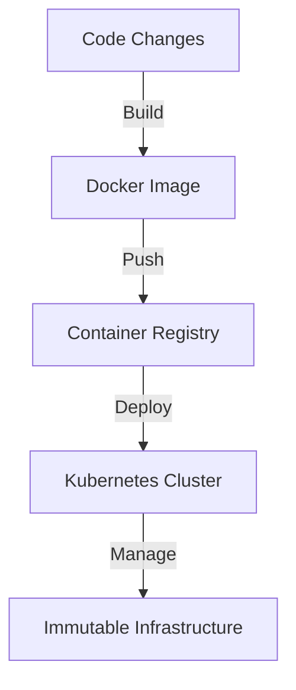

## 21.6 Immutable Infrastructure and DevOps

In the rapidly evolving landscape of software development and deployment, the concept of immutable infrastructure has emerged as a transformative approach. By applying principles of functional programming, particularly immutability, to infrastructure management, we can achieve unprecedented levels of consistency, reliability, and automation. This section delves into the intricacies of immutable infrastructure, exploring how it aligns with DevOps practices and the role of F# in this paradigm shift.

### Understanding Immutable Infrastructure

**Immutable Infrastructure** refers to a model where infrastructure components are never modified after they are deployed. Instead of updating existing servers or configurations, new versions are created and deployed, while the old ones are decommissioned. This approach contrasts with traditional mutable infrastructure, where changes are applied directly to existing systems.

#### Benefits of Immutable Infrastructure

1. **Consistency**: By ensuring that every deployment is a fresh start, immutable infrastructure eliminates configuration drift, where systems diverge from their intended state over time.

2. **Reliability**: Immutable systems are inherently more reliable, as they reduce the risk of errors introduced by manual changes.

3. **Simplified Rollbacks**: In case of failures, rolling back to a previous stable version is straightforward, as it involves redeploying the last known good configuration.

4. **Enhanced Security**: By regularly replacing infrastructure components with updated versions, security vulnerabilities are minimized.

5. **Scalability**: Immutable infrastructure supports horizontal scaling, as identical instances can be easily replicated.

### Applying Functional Patterns to Infrastructure Management

Functional programming principles, particularly those of immutability and declarative programming, align closely with the goals of immutable infrastructure. Let's explore how these principles can be applied to infrastructure management.

#### Declarative Infrastructure as Code (IaC)

Declarative programming, a core tenet of functional programming, involves specifying *what* the desired outcome is, rather than *how* to achieve it. In the context of infrastructure, this translates to Infrastructure as Code (IaC), where infrastructure configurations are defined in code and managed through version control.

**Example: Terraform Configuration**

Terraform is a popular tool for IaC that allows you to define infrastructure components declaratively. Here's a simple example of a Terraform configuration file:

```hcl
provider "aws" {
  region = "us-west-2"
}

resource "aws_instance" "web" {
  ami           = "ami-12345678"
  instance_type = "t2.micro"

  tags = {
    Name = "WebServer"
  }
}
```

In this example, we define an AWS EC2 instance with specific attributes. Terraform ensures that the infrastructure matches this configuration, applying changes as necessary.

#### Immutability in Infrastructure

Immutability in infrastructure means that once a resource is created, it is never modified. Instead, any changes result in the creation of new resources. This approach can be implemented using tools like Docker, where containers are built from immutable images.

**Example: Dockerfile for an Immutable Container**

```dockerfile
FROM nginx:latest
COPY ./html /usr/share/nginx/html
```

This Dockerfile creates an immutable image of an Nginx server with static content. Once built, the image can be deployed consistently across environments.

### Tools and Technologies Supporting Immutable Infrastructure

Several tools and technologies facilitate the implementation of immutable infrastructure, particularly when integrated with F# and functional programming principles.

#### Docker and Containerization

Docker is a cornerstone of immutable infrastructure, enabling the creation of lightweight, portable containers that encapsulate applications and their dependencies.

- **Docker Compose**: Allows you to define and run multi-container Docker applications declaratively.

#### Kubernetes for Orchestration

Kubernetes automates the deployment, scaling, and management of containerized applications, supporting immutable infrastructure by treating containers as ephemeral and replaceable.

- **Helm**: A package manager for Kubernetes that simplifies the deployment of complex applications.

#### Terraform and Infrastructure as Code

Terraform's declarative syntax and state management capabilities make it an ideal tool for managing immutable infrastructure.

- **Terraform Modules**: Enable the reuse of infrastructure configurations, promoting consistency and reducing duplication.

#### F# and Functional Programming

F# can be leveraged to write scripts and tools that automate infrastructure management, taking advantage of its functional programming features.

- **FAKE (F# Make)**: A build automation system for .NET that can be used to orchestrate infrastructure tasks.

### Challenges and Solutions in Implementing Immutable Infrastructure

While immutable infrastructure offers numerous benefits, it also presents challenges that must be addressed.

#### Challenge: Increased Complexity

Managing immutable infrastructure can introduce complexity, particularly in environments with numerous interdependent components.

**Solution**: Use orchestration tools like Kubernetes to manage dependencies and automate deployment processes.

#### Challenge: Resource Utilization

Creating new infrastructure components for every change can lead to increased resource consumption.

**Solution**: Implement efficient resource management strategies, such as using auto-scaling groups and spot instances in cloud environments.

#### Challenge: State Management

Immutable infrastructure requires careful management of stateful components, such as databases.

**Solution**: Use managed services for stateful components or implement strategies like data replication and backup.

### Impact on Deployment Consistency and Disaster Recovery

Immutable infrastructure significantly enhances deployment consistency and disaster recovery capabilities.

#### Deployment Consistency

By deploying infrastructure from version-controlled configurations, immutable infrastructure ensures that every environment is consistent with the desired state. This consistency reduces the likelihood of deployment failures and simplifies troubleshooting.

#### Disaster Recovery

Immutable infrastructure facilitates disaster recovery by enabling rapid redeployment of infrastructure components. In the event of a failure, the last known good configuration can be quickly restored, minimizing downtime and data loss.

### Try It Yourself

To gain hands-on experience with immutable infrastructure, try the following exercise:

1. **Set Up a Simple Web Application**: Use Docker to containerize a simple web application, such as a static website.

2. **Deploy with Kubernetes**: Use Kubernetes to deploy the containerized application, ensuring that it runs consistently across environments.

3. **Implement Infrastructure as Code**: Use Terraform to define the infrastructure required for the application, including networking and storage components.

4. **Automate with FAKE**: Write an F# script using FAKE to automate the deployment process, integrating Docker, Kubernetes, and Terraform.

### Visualizing Immutable Infrastructure

To better understand the flow of immutable infrastructure, let's visualize the process using a Mermaid.js diagram.



**Diagram Description**: This flowchart illustrates the process of building a Docker image from code changes, pushing it to a container registry, and deploying it to a Kubernetes cluster, resulting in immutable infrastructure.

### Conclusion

Immutable infrastructure, when combined with functional programming principles, offers a robust framework for managing modern software systems. By embracing immutability and automation, we can achieve greater consistency, reliability, and security in our deployments. As we continue to explore the potential of F# and functional programming in this domain, the possibilities for innovation and efficiency are boundless.

## Quiz Time!



### What is the primary benefit of immutable infrastructure?

- [x] Consistency
- [ ] Cost reduction
- [ ] Increased complexity
- [ ] Manual updates

> **Explanation:** Immutable infrastructure ensures consistency by eliminating configuration drift and ensuring that every deployment is a fresh start.

### Which tool is commonly used for Infrastructure as Code?

- [x] Terraform
- [ ] Docker
- [ ] Kubernetes
- [ ] Helm

> **Explanation:** Terraform is a popular tool for Infrastructure as Code, allowing infrastructure configurations to be defined declaratively.

### How does Docker support immutable infrastructure?

- [x] By creating immutable images
- [ ] By modifying existing containers
- [ ] By managing stateful components
- [ ] By automating deployments

> **Explanation:** Docker supports immutable infrastructure by creating immutable images that can be deployed consistently across environments.

### What is a challenge of implementing immutable infrastructure?

- [x] Increased complexity
- [ ] Enhanced security
- [ ] Simplified rollbacks
- [ ] Consistent deployments

> **Explanation:** Implementing immutable infrastructure can introduce complexity, particularly in managing numerous interdependent components.

### Which tool is used for orchestrating containerized applications?

- [x] Kubernetes
- [ ] Terraform
- [ ] Docker
- [ ] FAKE

> **Explanation:** Kubernetes is used for orchestrating containerized applications, automating deployment, scaling, and management.

### What is the role of FAKE in immutable infrastructure?

- [x] Automating infrastructure tasks
- [ ] Creating Docker images
- [ ] Managing stateful components
- [ ] Orchestrating containers

> **Explanation:** FAKE (F# Make) is a build automation system that can be used to automate infrastructure tasks in the context of immutable infrastructure.

### How does immutable infrastructure enhance disaster recovery?

- [x] By enabling rapid redeployment
- [ ] By reducing resource consumption
- [ ] By increasing complexity
- [ ] By modifying existing systems

> **Explanation:** Immutable infrastructure enhances disaster recovery by enabling rapid redeployment of infrastructure components, minimizing downtime and data loss.

### What is a solution for managing stateful components in immutable infrastructure?

- [x] Use managed services
- [ ] Modify existing resources
- [ ] Increase resource consumption
- [ ] Automate deployments

> **Explanation:** Using managed services for stateful components is a solution for managing state in immutable infrastructure.

### Which of the following is a benefit of immutable infrastructure?

- [x] Enhanced security
- [ ] Increased manual intervention
- [ ] Configuration drift
- [ ] Resource wastage

> **Explanation:** Immutable infrastructure enhances security by regularly replacing infrastructure components with updated versions, minimizing vulnerabilities.

### Immutable infrastructure supports horizontal scaling by:

- [x] Replicating identical instances
- [ ] Modifying existing instances
- [ ] Increasing manual updates
- [ ] Reducing resource usage

> **Explanation:** Immutable infrastructure supports horizontal scaling by replicating identical instances, allowing for easy scaling of applications.


