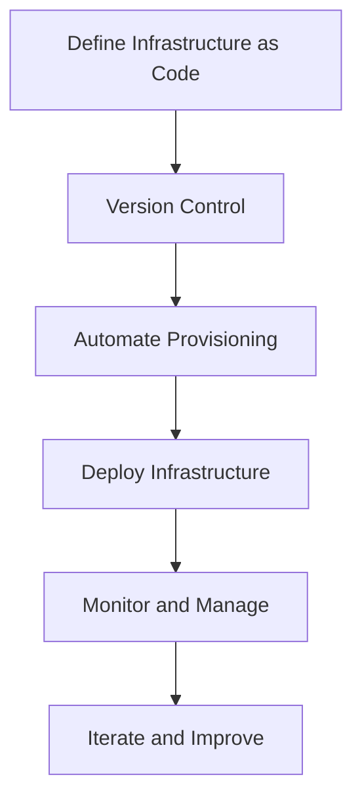

## 21.7 Infrastructure as Code (IaC)

In the realm of modern software development, Infrastructure as Code (IaC) has emerged as a pivotal practice, revolutionizing how infrastructure is managed and deployed. By treating infrastructure configuration as code, IaC enables developers and operations teams to automate and streamline the provisioning and management of resources. In this section, we will delve into the core concepts of IaC, explore its benefits, and examine how tools like Terraform and Pulumi can be integrated with F# to enhance infrastructure management.

### Understanding Infrastructure as Code

**Infrastructure as Code (IaC)** is a practice that involves managing and provisioning computing infrastructure through machine-readable definition files, rather than physical hardware configuration or interactive configuration tools. This approach allows for the automation of infrastructure setup, making it an integral part of DevOps practices.

#### Role in Modern DevOps Practices

IaC plays a crucial role in modern DevOps by bridging the gap between development and operations. It enables teams to:

- **Automate Infrastructure Provisioning**: By using code to define infrastructure, teams can automate the provisioning process, reducing manual errors and increasing efficiency.
- **Enable Continuous Integration/Continuous Deployment (CI/CD)**: IaC facilitates the integration of infrastructure changes into the CI/CD pipeline, ensuring that infrastructure updates are tested and deployed alongside application code.
- **Enhance Collaboration**: With infrastructure defined as code, development and operations teams can collaborate more effectively, using version control systems to track changes and manage configurations.

### Benefits of Infrastructure as Code

The adoption of IaC brings numerous benefits to software development and operations teams. Let's explore some of the key advantages:

#### Versioning

IaC allows infrastructure configurations to be versioned just like application code. This means that any changes to the infrastructure can be tracked, reviewed, and rolled back if necessary. Versioning provides a historical record of changes, facilitating auditability and compliance.

#### Reproducibility

With IaC, infrastructure can be easily reproduced across different environments. This ensures consistency between development, testing, and production environments, reducing the risk of environment-specific issues.

#### Collaboration

By using code to define infrastructure, teams can leverage collaboration tools such as Git to manage infrastructure changes. This promotes transparency and enables multiple team members to contribute to infrastructure development.

#### Scalability

IaC enables teams to scale infrastructure up or down based on demand. Automated scripts can be used to provision additional resources as needed, ensuring that applications can handle varying workloads.

### Tools for Infrastructure as Code

Several tools are available to implement IaC, each with its own strengths and capabilities. In this section, we will focus on Terraform and Pulumi, two popular tools that can be integrated with F# for infrastructure management.

#### Terraform

**Terraform** is an open-source tool developed by HashiCorp that allows users to define and provision infrastructure using a high-level configuration language. It supports a wide range of cloud providers and services, making it a versatile choice for managing infrastructure.

- **Declarative Language**: Terraform uses a declarative language to define infrastructure. Users specify the desired state of their infrastructure, and Terraform takes care of creating and managing the necessary resources.
- **Provider Ecosystem**: Terraform has a rich ecosystem of providers, enabling integration with various cloud platforms such as AWS, Azure, and Google Cloud.
- **State Management**: Terraform maintains a state file that tracks the current state of the infrastructure. This allows it to determine what changes need to be applied to achieve the desired state.

#### Pulumi

**Pulumi** is another powerful IaC tool that allows developers to define infrastructure using familiar programming languages, including F#. This makes it an attractive option for F# developers who want to leverage their existing skills for infrastructure management.

- **Programming Language Support**: Pulumi supports multiple programming languages, including F#, C#, and JavaScript. This allows developers to use their preferred language to define infrastructure.
- **Rich SDKs**: Pulumi provides rich SDKs for various cloud providers, enabling seamless integration with cloud services.
- **State Management**: Like Terraform, Pulumi maintains a state file to track infrastructure changes and ensure consistency.

### Integrating Terraform and Pulumi with F#

Both Terraform and Pulumi can be integrated with F# to manage infrastructure. Let's explore how this integration can be achieved and the benefits it offers.

#### Using Terraform with F#

While Terraform itself does not natively support F#, it can be used in conjunction with F# scripts to automate infrastructure provisioning. Here's how you can integrate Terraform with F#:

1. **Define Infrastructure with Terraform**: Use Terraform's configuration language to define the desired infrastructure state.

2. **Automate Terraform Commands with F#**: Use F# scripts to automate the execution of Terraform commands, such as `terraform apply` and `terraform plan`. This can be achieved using the `System.Diagnostics.Process` class in F#.

```fsharp
open System.Diagnostics

let runTerraformCommand command =
    let processStartInfo = ProcessStartInfo()
    processStartInfo.FileName <- "terraform"
    processStartInfo.Arguments <- command
    processStartInfo.RedirectStandardOutput <- true
    processStartInfo.UseShellExecute <- false

    let process = Process()
    process.StartInfo <- processStartInfo
    process.Start() |> ignore
    process.WaitForExit()

    let output = process.StandardOutput.ReadToEnd()
    printfn "%s" output

// Example: Running 'terraform apply'
runTerraformCommand "apply"
```

#### Using Pulumi with F#

Pulumi natively supports F#, allowing developers to define infrastructure using F# code. Here's how you can get started with Pulumi and F#:

1. **Install Pulumi**: Install Pulumi and the necessary cloud provider plugins.

2. **Create a Pulumi Project**: Initialize a new Pulumi project using F# as the programming language.

3. **Define Infrastructure with F#**: Use F# code to define the desired infrastructure state. Pulumi provides a rich set of SDKs for various cloud providers, making it easy to define resources.

```fsharp
open Pulumi
open Pulumi.Aws.S3

let bucket = Bucket("my-bucket", BucketArgs())

let stack = Deployment.runAsync(fun () ->
    dict [ "bucketName", bucket.Id ]
)
```

### Best Practices for Infrastructure as Code

To maximize the benefits of IaC, it's important to follow best practices when structuring and managing infrastructure code. Here are some key considerations:

#### Structuring Infrastructure Code

- **Modularize Code**: Break down infrastructure code into reusable modules. This promotes code reuse and makes it easier to manage complex infrastructure.

- **Use Variables and Outputs**: Use variables to parameterize infrastructure configurations, and outputs to expose important information about the infrastructure.

- **Organize Code by Environment**: Separate infrastructure code by environment (e.g., development, testing, production) to ensure consistency and avoid accidental changes.

#### Versioning Infrastructure Code

- **Use Version Control**: Store infrastructure code in a version control system such as Git. This enables collaboration, change tracking, and rollback capabilities.

- **Tag Releases**: Use tags to mark stable releases of infrastructure code. This provides a reference point for deployments and facilitates rollback if necessary.

### Security and Compliance Considerations

When using IaC, it's important to consider security and compliance to protect sensitive information and ensure regulatory compliance.

#### Security Best Practices

- **Use Secrets Management**: Avoid hardcoding sensitive information such as API keys and passwords in infrastructure code. Use secrets management tools to securely store and access sensitive data.

- **Implement Access Controls**: Use role-based access controls to restrict who can modify and deploy infrastructure code. This helps prevent unauthorized changes.

- **Audit Infrastructure Changes**: Regularly audit infrastructure changes to ensure compliance with security policies and identify potential vulnerabilities.

#### Compliance Considerations

- **Ensure Compliance with Regulations**: Ensure that infrastructure configurations comply with relevant regulations and standards, such as GDPR and HIPAA.

- **Document Infrastructure Configurations**: Maintain documentation of infrastructure configurations and changes to facilitate compliance audits.

### Try It Yourself

To get hands-on experience with IaC, try modifying the code examples provided in this section. Experiment with different configurations and observe the impact on the infrastructure. Here are some suggestions:

- **Modify Terraform Configuration**: Change the configuration of a Terraform resource and observe how it affects the infrastructure.

- **Extend Pulumi Project**: Add additional resources to a Pulumi project and explore how they interact with existing resources.

### Visualizing Infrastructure as Code

To better understand the flow of IaC, let's visualize the process using a flowchart. This diagram illustrates the key steps involved in defining and deploying infrastructure using IaC tools.



**Diagram Description**: This flowchart depicts the process of using Infrastructure as Code. It starts with defining infrastructure as code, followed by version control, automation of provisioning, deployment, monitoring, and continuous improvement.

### Knowledge Check

Before we conclude, let's review some key takeaways:

- **Infrastructure as Code (IaC)**: A practice that involves managing infrastructure through code, enabling automation and consistency.
- **Benefits of IaC**: Versioning, reproducibility, collaboration, and scalability.
- **Tools for IaC**: Terraform and Pulumi are popular tools that can be integrated with F# for infrastructure management.
- **Best Practices**: Modularize code, use version control, and implement security measures.

### Embrace the Journey

Remember, adopting Infrastructure as Code is a journey. As you gain experience, you'll discover new ways to optimize and enhance your infrastructure management processes. Keep experimenting, stay curious, and enjoy the journey!

## Quiz Time!



### What is Infrastructure as Code (IaC)?

- [x] A practice of managing infrastructure through machine-readable definition files
- [ ] A method of manually configuring hardware components
- [ ] A technique for optimizing application performance
- [ ] A strategy for designing user interfaces

> **Explanation:** Infrastructure as Code (IaC) is a practice that involves managing and provisioning computing infrastructure through machine-readable definition files.

### Which of the following is a benefit of IaC?

- [x] Versioning
- [x] Reproducibility
- [ ] Increased manual configuration
- [x] Collaboration

> **Explanation:** IaC provides benefits such as versioning, reproducibility, and collaboration, allowing teams to manage infrastructure efficiently.

### What is Terraform?

- [x] An open-source tool for defining and provisioning infrastructure
- [ ] A programming language for developing web applications
- [ ] A database management system
- [ ] A cloud storage service

> **Explanation:** Terraform is an open-source tool developed by HashiCorp that allows users to define and provision infrastructure using a high-level configuration language.

### How does Pulumi differ from Terraform?

- [x] Pulumi allows defining infrastructure using programming languages like F#
- [ ] Pulumi is a database management tool
- [ ] Pulumi is only used for web development
- [ ] Pulumi does not support cloud providers

> **Explanation:** Pulumi allows developers to define infrastructure using familiar programming languages, including F#, whereas Terraform uses a declarative configuration language.

### What is a best practice for structuring infrastructure code?

- [x] Modularize code
- [ ] Hardcode sensitive information
- [x] Use version control
- [ ] Avoid using variables

> **Explanation:** Best practices for structuring infrastructure code include modularizing code and using version control to manage changes.

### What should be avoided when using IaC?

- [ ] Using version control
- [x] Hardcoding sensitive information
- [ ] Modularizing code
- [ ] Implementing access controls

> **Explanation:** Hardcoding sensitive information should be avoided in IaC. Instead, use secrets management tools to securely store and access sensitive data.

### How can Terraform be integrated with F#?

- [x] By using F# scripts to automate Terraform commands
- [ ] By writing Terraform configurations in F#
- [ ] By using Terraform as a database
- [ ] By deploying F# applications with Terraform

> **Explanation:** Terraform can be integrated with F# by using F# scripts to automate the execution of Terraform commands.

### What is the purpose of the state file in Terraform and Pulumi?

- [x] To track the current state of the infrastructure
- [ ] To store application data
- [ ] To manage user authentication
- [ ] To define user interfaces

> **Explanation:** The state file in Terraform and Pulumi tracks the current state of the infrastructure, allowing the tools to determine what changes need to be applied.

### What is a key consideration for security when using IaC?

- [x] Implementing access controls
- [ ] Avoiding version control
- [ ] Hardcoding sensitive information
- [ ] Ignoring audit logs

> **Explanation:** Implementing access controls is a key consideration for security when using IaC to prevent unauthorized changes.

### True or False: IaC facilitates the integration of infrastructure changes into the CI/CD pipeline.

- [x] True
- [ ] False

> **Explanation:** True. IaC facilitates the integration of infrastructure changes into the CI/CD pipeline, ensuring that infrastructure updates are tested and deployed alongside application code.


