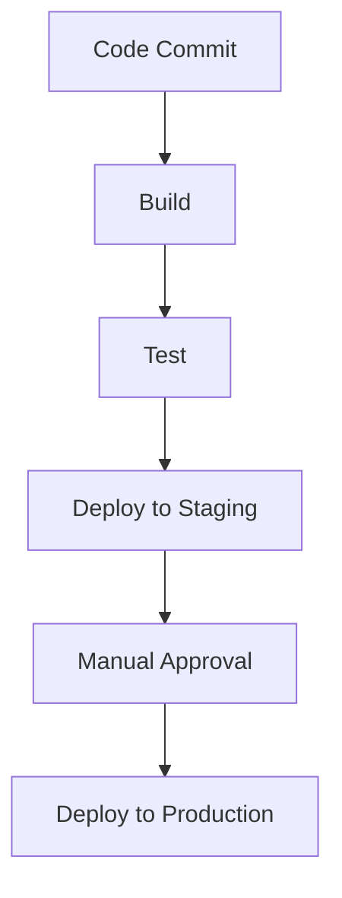

## 21.8 DevOps and CI/CD Practices in F#

In the ever-evolving landscape of software development, DevOps and Continuous Integration/Continuous Deployment (CI/CD) practices have become indispensable. They bridge the gap between development and operations, ensuring that software is delivered quickly, reliably, and sustainably. In this section, we will delve into the specifics of implementing DevOps and CI/CD practices for F# projects, providing you with the tools and knowledge to streamline your development processes.

### Understanding DevOps and CI/CD

**DevOps** is a set of practices that combines software development (Dev) and IT operations (Ops). The goal is to shorten the development lifecycle and provide continuous delivery with high software quality. **CI/CD** is a crucial part of DevOps, focusing on automating the integration and deployment of code changes.

#### Importance of DevOps and CI/CD

1. **Speed and Efficiency**: Automating repetitive tasks reduces time-to-market.
2. **Quality Assurance**: Continuous testing ensures that code changes do not break existing functionality.
3. **Collaboration**: DevOps fosters a culture of collaboration between development and operations teams.
4. **Scalability**: CI/CD pipelines can scale with the project, handling increased complexity and size.
5. **Reliability**: Automated deployments reduce the risk of human error.

### Setting Up CI/CD Pipelines for F# Applications

Let's walk through the process of setting up a CI/CD pipeline for an F# application. We'll use Azure DevOps as our primary tool, but similar steps can be adapted for other platforms like GitHub Actions or Jenkins.

#### Step 1: Version Control System (VCS)

Start by ensuring your F# project is under version control. Git is the most popular choice, and platforms like GitHub, GitLab, or Bitbucket offer excellent integration with CI/CD tools.

```bash
git init

git add .

git commit -m "Initial commit"
```

#### Step 2: Continuous Integration with Azure DevOps

Azure DevOps provides a robust platform for building CI/CD pipelines. Here's how to set up a CI pipeline for an F# project:

1. **Create a New Project**: Log in to Azure DevOps, create a new project, and link it to your Git repository.

2. **Define a Build Pipeline**:
   - Navigate to Pipelines > Builds > New Pipeline.
   - Select your repository and choose "Starter pipeline" to create a basic YAML file.

3. **Configure the YAML File**:
   - Define the build steps for your F# project. Here’s a simple example:

```yaml
trigger:
- main

pool:
  vmImage: 'ubuntu-latest'

steps:
- task: UseDotNet@2
  inputs:
    packageType: 'sdk'
    version: '6.x'
    installationPath: $(Agent.ToolsDirectory)/dotnet

- script: dotnet build --configuration Release
  displayName: 'Build Project'

- script: dotnet test
  displayName: 'Run Tests'
```

#### Step 3: Continuous Deployment

Once the CI pipeline is in place, the next step is to automate the deployment process.

1. **Release Pipeline**:
   - Navigate to Pipelines > Releases > New Pipeline.
   - Define stages for deployment, such as Development, Staging, and Production.

2. **Deployment Tasks**:
   - Add tasks to deploy your application to the desired environment. For example, deploying to Azure App Service:

```yaml
- task: AzureWebApp@1
  inputs:
    azureSubscription: '<Your Azure Subscription>'
    appName: '<Your App Name>'
    package: '$(System.DefaultWorkingDirectory)/**/*.zip'
```

### Tools and Services Compatible with F#

While Azure DevOps is a powerful tool, there are other options available for F# projects:

- **GitHub Actions**: Offers seamless integration with GitHub repositories and a wide range of pre-built actions.
- **Jenkins**: An open-source automation server that supports building, deploying, and automating any project.
- **TeamCity**: A powerful CI/CD server from JetBrains, known for its deep integration with .NET projects.

### Integrating Testing Frameworks and Deployment Scripts

Testing is a critical component of CI/CD pipelines. F# projects can leverage several testing frameworks:

- **NUnit**: A popular testing framework for .NET languages, including F#.
- **xUnit**: Known for its extensibility and support for parallel test execution.
- **FsCheck**: A property-based testing framework for F#.

#### Example: Integrating NUnit in a Pipeline

```yaml
- script: dotnet test --logger "trx;LogFileName=test_results.trx"
  displayName: 'Run NUnit Tests'
```

### Strategies for Automating Builds, Tests, and Deployments

Automation is at the heart of DevOps. Here are some strategies to enhance your CI/CD pipelines:

1. **Automated Builds**: Use triggers to automatically build the project whenever code is pushed to the repository.
2. **Automated Testing**: Integrate unit, integration, and acceptance tests to ensure code quality.
3. **Automated Deployments**: Deploy code to production environments automatically after passing all tests.

### Best Practices for Monitoring and Logging

Monitoring and logging are essential for maintaining the health of applications in production. Here are some best practices:

- **Structured Logging**: Use structured logging to capture detailed information about application behavior.
- **Centralized Logging**: Aggregate logs from different services into a centralized system for analysis.
- **Monitoring Tools**: Use tools like Azure Monitor, Prometheus, or Grafana to track application performance.

### Successful CI/CD Implementations in F# Projects

Let's look at some examples of successful CI/CD implementations in F# projects:

1. **Financial Services**: A financial services company used Azure DevOps to automate the deployment of their F#-based trading platform, reducing deployment time from hours to minutes.

2. **E-commerce Platform**: An e-commerce platform integrated GitHub Actions with their F# project to automate testing and deployment, resulting in a 30% increase in release frequency.

3. **Healthcare Application**: A healthcare application leveraged Jenkins to implement a CI/CD pipeline for their F# services, ensuring compliance with industry regulations through automated testing and deployment.

### Try It Yourself

To get hands-on experience, try setting up a CI/CD pipeline for a simple F# project. Experiment with different tools and configurations to see what works best for your workflow. Consider modifying the build and deployment scripts to suit your project's needs.

### Visualizing a CI/CD Pipeline

Below is a diagram representing a typical CI/CD pipeline flow:



This diagram illustrates the flow from code commit to deployment, highlighting key stages in the pipeline.

### Conclusion

Implementing effective DevOps and CI/CD practices in F# projects can significantly enhance your development workflow, leading to faster delivery times, improved code quality, and greater collaboration between teams. By leveraging the tools and strategies discussed in this section, you can build robust pipelines that support the continuous delivery of high-quality software.

## Quiz Time!



### What is the primary goal of DevOps?

- [x] To shorten the development lifecycle and provide continuous delivery with high software quality.
- [ ] To replace all manual processes with automated ones.
- [ ] To eliminate the need for operations teams.
- [ ] To increase the complexity of software systems.

> **Explanation:** The primary goal of DevOps is to shorten the development lifecycle and provide continuous delivery with high software quality by fostering collaboration between development and operations teams.

### Which tool is NOT commonly used for CI/CD in F# projects?

- [ ] Azure DevOps
- [ ] GitHub Actions
- [ ] Jenkins
- [x] Adobe Photoshop

> **Explanation:** Adobe Photoshop is not a tool used for CI/CD; it is a graphic design software.

### What is the purpose of a build pipeline?

- [x] To automate the process of building and testing code changes.
- [ ] To manually deploy applications to production.
- [ ] To replace version control systems.
- [ ] To design user interfaces.

> **Explanation:** A build pipeline automates the process of building and testing code changes, ensuring that new code integrates smoothly with existing codebases.

### What is the benefit of using structured logging?

- [x] It captures detailed information about application behavior.
- [ ] It reduces the size of log files.
- [ ] It eliminates the need for monitoring tools.
- [ ] It simplifies the deployment process.

> **Explanation:** Structured logging captures detailed information about application behavior, making it easier to analyze and troubleshoot issues.

### Which of the following is a testing framework compatible with F#?

- [x] NUnit
- [ ] JUnit
- [ ] Mocha
- [ ] Jasmine

> **Explanation:** NUnit is a testing framework compatible with F#, while JUnit, Mocha, and Jasmine are used for other languages.

### What is the role of a release pipeline?

- [x] To automate the deployment of applications to various environments.
- [ ] To compile source code into binaries.
- [ ] To manage version control.
- [ ] To design application interfaces.

> **Explanation:** A release pipeline automates the deployment of applications to various environments, ensuring consistent and reliable releases.

### Why is monitoring important in a production environment?

- [x] To track application performance and detect issues early.
- [ ] To replace the need for logging.
- [ ] To reduce the need for testing.
- [ ] To eliminate the need for manual deployments.

> **Explanation:** Monitoring is important in a production environment to track application performance and detect issues early, ensuring the system remains healthy and performant.

### Which of the following is a benefit of using CI/CD?

- [x] Faster delivery times and improved code quality.
- [ ] Increased manual intervention in the deployment process.
- [ ] Reduced collaboration between teams.
- [ ] Longer development cycles.

> **Explanation:** CI/CD provides faster delivery times and improved code quality by automating the integration and deployment processes.

### What does CI/CD stand for?

- [x] Continuous Integration/Continuous Deployment
- [ ] Continuous Improvement/Continuous Development
- [ ] Code Integration/Code Deployment
- [ ] Collaborative Integration/Collaborative Deployment

> **Explanation:** CI/CD stands for Continuous Integration/Continuous Deployment, focusing on automating the integration and deployment of code changes.

### True or False: DevOps practices eliminate the need for testing.

- [ ] True
- [x] False

> **Explanation:** False. DevOps practices do not eliminate the need for testing; instead, they integrate testing into the development process to ensure continuous quality assurance.


