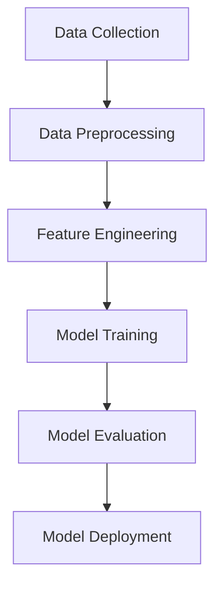

## 22.4 Machine Learning and AI Patterns in F#

In this section, we delve into the fascinating world of machine learning (ML) and artificial intelligence (AI) using F#. As expert software engineers and architects, you are already familiar with the power of functional programming. Here, we will explore how to leverage F#'s unique features to implement machine learning algorithms and AI solutions effectively.

### Overview of Machine Learning and AI Patterns

Machine learning and AI patterns provide structured approaches to solving common problems in the field. By applying these patterns, we can build systems that are more robust, scalable, and maintainable. Some of the key patterns we will explore include:

- **Strategy Pattern**: Used for selecting algorithms dynamically at runtime.
- **Pipeline Pattern**: Facilitates the sequential processing of data through various stages.
- **Observer Pattern**: Useful for monitoring changes in model performance.
- **Decorator Pattern**: Enhances models with additional capabilities without modifying their core structure.

### Implementing Machine Learning Algorithms in F#

F# offers a functional approach to implementing machine learning algorithms, allowing us to write concise and expressive code. Let's explore how to implement some common algorithms from scratch.

#### Neural Networks

Neural networks are a cornerstone of modern AI. Implementing a simple feedforward neural network in F# involves defining the network's architecture, initializing weights, and implementing forward and backward propagation.

```fsharp
open System

// Define a simple neural network layer
type Layer(weights: float[,], biases: float[]) =
    member this.Weights = weights
    member this.Biases = biases

    // Forward pass through the layer
    member this.Forward(input: float[]) =
        let z = Array.init this.Biases.Length (fun i ->
            Array.fold2 (fun acc w x -> acc + w * x) this.Biases.[i] this.Weights.[i] input)
        z |> Array.map (fun x -> 1.0 / (1.0 + exp(-x))) // Sigmoid activation

// Example usage
let weights = array2D [[0.5; -0.2]; [0.3; 0.8]]
let biases = [| 0.1; -0.1 |]
let layer = Layer(weights, biases)
let input = [| 0.6; 0.9 |]
let output = layer.Forward(input)
printfn "Layer output: %A" output
```

In this example, we define a `Layer` type that represents a neural network layer with weights and biases. The `Forward` method computes the output using the sigmoid activation function.

#### Decision Trees

Decision trees are another popular machine learning algorithm. They work by recursively splitting the data based on feature values.

```fsharp
type DecisionNode =
    | Leaf of string
    | Node of string * (float -> DecisionNode)

let rec classify (node: DecisionNode) (value: float) =
    match node with
    | Leaf label -> label
    | Node (_, decision) -> classify (decision value) value

// Example decision tree
let tree =
    Node("Feature1", fun v ->
        if v < 0.5 then Leaf "ClassA"
        else Leaf "ClassB")

let prediction = classify tree 0.3
printfn "Prediction: %s" prediction
```

Here, we define a simple decision tree using a recursive `DecisionNode` type. The `classify` function traverses the tree based on feature values to make predictions.

### Computation Expressions and Monads

F#'s computation expressions and monads are powerful tools for managing computations with stochastic elements, such as those found in machine learning.

#### Using Computation Expressions

Computation expressions allow us to define custom workflows, making it easier to handle complex computations.

```fsharp
type RandomMonad() =
    member _.Bind(x, f) = f (System.Random().NextDouble() * x)
    member _.Return(x) = x

let random = RandomMonad()

let randomWorkflow =
    random {
        let! x = 10.0
        let! y = 5.0
        return x + y
    }

printfn "Random result: %f" randomWorkflow
```

In this example, we define a `RandomMonad` that generates random numbers. The `randomWorkflow` computation expression uses this monad to perform calculations with randomness.

### Benefits of F# in Machine Learning

F# offers several advantages for machine learning tasks, particularly in handling parallel and asynchronous computations.

#### Parallel and Asynchronous Computations

F#'s asynchronous workflows and parallel processing capabilities make it well-suited for large-scale machine learning tasks.

```fsharp
open System.Threading.Tasks

let asyncComputation x =
    async {
        let! result = Task.Run(fun () -> x * x)
        return result
    }

let results = [1..10] |> List.map asyncComputation |> Async.Parallel |> Async.RunSynchronously
printfn "Squared results: %A" results
```

Here, we use F#'s `async` keyword to define an asynchronous computation that squares numbers in parallel.

### Case Studies: AI Applications in F#

Let's explore some real-world AI applications built with F#, such as natural language processing and computer vision projects.

#### Natural Language Processing (NLP)

NLP involves processing and analyzing human language data. F# can be used to implement NLP tasks, such as sentiment analysis or text classification.

```fsharp
open System.Text.RegularExpressions

let tokenize (text: string) =
    Regex.Split(text, @"\W+") |> Array.filter (fun w -> w <> "")

let text = "F# is great for machine learning!"
let tokens = tokenize text
printfn "Tokens: %A" tokens
```

In this example, we use regular expressions to tokenize a text string into words, a common preprocessing step in NLP.

#### Computer Vision

Computer vision involves analyzing and interpreting visual data. F# can be used to implement image processing tasks, such as edge detection or object recognition.

```fsharp
open System.Drawing

let detectEdges (image: Bitmap) =
    // Simple edge detection logic
    let width, height = image.Width, image.Height
    let result = new Bitmap(width, height)
    for x in 1 .. width - 2 do
        for y in 1 .. height - 2 do
            let color = image.GetPixel(x, y)
            let intensity = (int color.R + int color.G + int color.B) / 3
            result.SetPixel(x, y, Color.FromArgb(intensity, intensity, intensity))
    result

let image = new Bitmap("path/to/image.jpg")
let edges = detectEdges image
edges.Save("path/to/edges.jpg")
```

Here, we implement a simple edge detection algorithm that converts an image to grayscale based on pixel intensity.

### Integration with GPU Computing and External Libraries

For high-performance machine learning tasks, integrating with GPU computing or external ML libraries is crucial.

#### GPU Computing

F# can leverage GPU computing for intensive tasks using libraries like Alea GPU or CUDA.NET.

```fsharp
// Example of using Alea GPU for parallel computation
open Alea.CUDA

let gpuComputation (input: float[]) =
    let worker = Worker.Default
    let kernel = worker.LoadKernel(fun (x: float[]) -> x |> Array.map (fun v -> v * v))
    kernel.Launch(input)
    input
```

This example demonstrates how to use Alea GPU to perform parallel computations on an array of floats.

#### External ML Libraries

F# can also integrate with popular ML libraries like TensorFlow or ML.NET for advanced machine learning tasks.

```fsharp
open Microsoft.ML
open Microsoft.ML.Data

type IrisData = { SepalLength: float32; SepalWidth: float32; PetalLength: float32; PetalWidth: float32; Label: string }

let context = new MLContext()
let data = context.Data.LoadFromTextFile<IrisData>("iris-data.csv", hasHeader = true, separatorChar = ',')

let pipeline = context.Transforms.Conversion.MapValueToKey("Label")
let model = pipeline.Fit(data)
```

In this example, we use ML.NET to load and preprocess the Iris dataset, a common dataset in machine learning.

### Considerations for Model Evaluation and Deployment

When building machine learning models, it's essential to consider model evaluation, hyperparameter tuning, and deployment.

#### Model Evaluation

Evaluating model performance is crucial for ensuring accuracy and reliability.

```fsharp
let evaluateModel (model: ITransformer) (data: IDataView) =
    let predictions = model.Transform(data)
    let metrics = context.MulticlassClassification.Evaluate(predictions)
    printfn "Accuracy: %f" metrics.MicroAccuracy
```

Here, we evaluate a trained model's accuracy using ML.NET's evaluation metrics.

#### Hyperparameter Tuning

Hyperparameter tuning involves optimizing model parameters for better performance.

```fsharp
let tuneHyperparameters (data: IDataView) =
    let bestAccuracy = ref 0.0
    for learningRate in [0.01; 0.1; 0.2] do
        let pipeline = context.Transforms.Conversion.MapValueToKey("Label")
        let model = pipeline.Fit(data)
        let accuracy = evaluateModel model data
        if accuracy > !bestAccuracy then
            bestAccuracy := accuracy
    printfn "Best accuracy: %f" !bestAccuracy
```

This example demonstrates a simple grid search for hyperparameter tuning.

#### Deployment in Production

Deploying machine learning models in production requires careful consideration of scalability and reliability.

```fsharp
let deployModel (model: ITransformer) =
    // Serialize the model to a file
    context.Model.Save(model, data.Schema, "model.zip")
    printfn "Model deployed successfully."
```

Here, we serialize a trained model to a file for deployment.

### Visualizing Machine Learning Workflows

To better understand machine learning workflows, let's visualize the process using Mermaid.js.



This diagram illustrates the typical stages of a machine learning workflow, from data collection to deployment.

### Try It Yourself

To deepen your understanding, try modifying the code examples provided. Experiment with different neural network architectures, decision tree structures, or hyperparameter values. Observe how these changes impact the model's performance and behavior.

### Knowledge Check

- What are the benefits of using F# for machine learning tasks?
- How can computation expressions be used to manage stochastic computations?
- What are some common patterns used in machine learning and AI?

### Embrace the Journey

Remember, this is just the beginning. As you progress, you'll discover more advanced techniques and patterns in machine learning and AI. Keep experimenting, stay curious, and enjoy the journey!

## Quiz Time!



### What is the primary benefit of using the Strategy Pattern in machine learning?

- [x] It allows dynamic selection of algorithms at runtime.
- [ ] It simplifies the data preprocessing stage.
- [ ] It improves the accuracy of models.
- [ ] It reduces the computational complexity of algorithms.

> **Explanation:** The Strategy Pattern is used to dynamically select algorithms at runtime, providing flexibility in choosing the best approach for a given problem.

### How does the Pipeline Pattern benefit machine learning workflows?

- [x] It facilitates sequential data processing through various stages.
- [ ] It enhances the accuracy of machine learning models.
- [ ] It reduces the need for data preprocessing.
- [ ] It simplifies the deployment process.

> **Explanation:** The Pipeline Pattern allows for the sequential processing of data through different stages, such as preprocessing, feature engineering, and model training.

### What is a key advantage of using computation expressions in F# for machine learning?

- [x] They allow for custom workflows to handle complex computations.
- [ ] They automatically optimize model parameters.
- [ ] They simplify the integration with external libraries.
- [ ] They enhance the visualization of data.

> **Explanation:** Computation expressions in F# enable the creation of custom workflows, making it easier to manage complex computations, especially those involving stochastic elements.

### Which F# feature is particularly useful for handling parallel computations in machine learning?

- [x] Asynchronous workflows
- [ ] Pattern matching
- [ ] Type providers
- [ ] Units of measure

> **Explanation:** F#'s asynchronous workflows are particularly useful for handling parallel computations, making it well-suited for large-scale machine learning tasks.

### In the context of machine learning, what is the purpose of hyperparameter tuning?

- [x] Optimizing model parameters for better performance
- [ ] Reducing the size of the dataset
- [ ] Simplifying the model architecture
- [ ] Enhancing the interpretability of the model

> **Explanation:** Hyperparameter tuning involves optimizing model parameters to achieve better performance, often through techniques like grid search or random search.

### What is the role of the Observer Pattern in machine learning?

- [x] Monitoring changes in model performance
- [ ] Simplifying the data preprocessing stage
- [ ] Enhancing the accuracy of models
- [ ] Reducing the computational complexity of algorithms

> **Explanation:** The Observer Pattern is useful for monitoring changes in model performance, allowing for timely adjustments and improvements.

### How can F# integrate with GPU computing for machine learning tasks?

- [x] Using libraries like Alea GPU or CUDA.NET
- [ ] Leveraging type providers
- [ ] Utilizing computation expressions
- [ ] Applying pattern matching

> **Explanation:** F# can integrate with GPU computing for high-performance tasks using libraries like Alea GPU or CUDA.NET, enabling parallel processing on GPUs.

### What is a common use case for the Decorator Pattern in AI models?

- [x] Enhancing models with additional capabilities without modifying their core structure
- [ ] Simplifying the deployment process
- [ ] Reducing the size of the dataset
- [ ] Improving the interpretability of the model

> **Explanation:** The Decorator Pattern is used to enhance models with additional capabilities, such as adding new features or functionalities, without altering their core structure.

### Which of the following is a common application of F# in AI?

- [x] Natural language processing
- [ ] Hardware design
- [ ] Database management
- [ ] Network security

> **Explanation:** F# is commonly used in AI applications such as natural language processing, where its functional programming features can be leveraged for efficient data processing.

### True or False: F# is not suitable for large-scale machine learning tasks due to its functional nature.

- [ ] True
- [x] False

> **Explanation:** False. F# is well-suited for large-scale machine learning tasks, particularly due to its support for parallel and asynchronous computations, making it a powerful tool for handling complex AI workflows.


