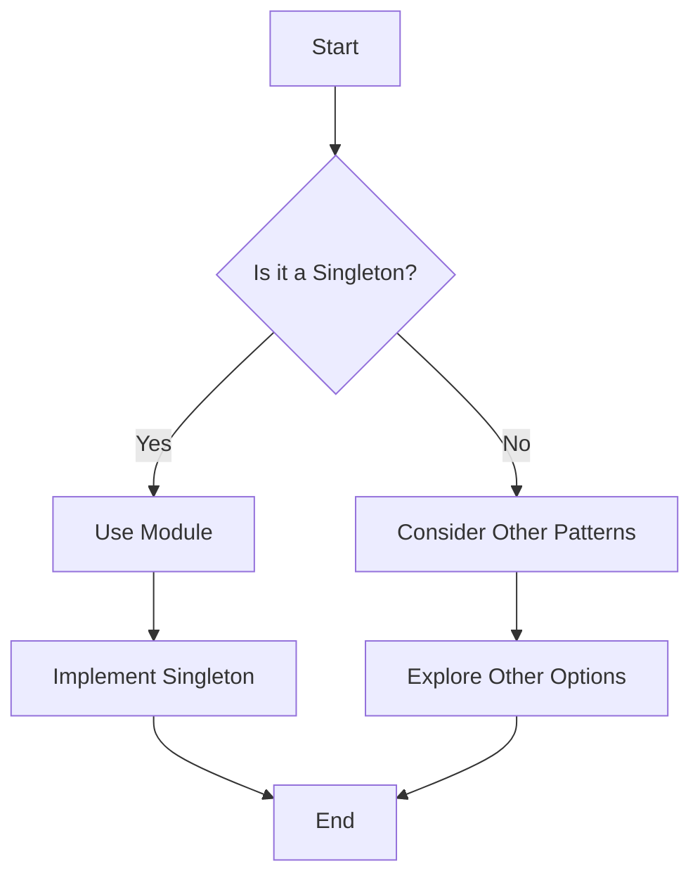

## 24.2 Bibliography and Further Reading

In this section, we provide a comprehensive list of resources for those looking to deepen their understanding of F# design patterns and related topics. This curated bibliography includes books, academic papers, online articles, blogs, and official documentation. Each entry is accompanied by a brief annotation summarizing its content and relevance, helping you navigate the wealth of information available. Whether you're an experienced software engineer or an architect, these resources are tailored to enhance your expertise in F# and functional programming.

### Books

1. **"Domain Modeling Made Functional" by Scott Wlaschin**  
   *Publisher: Pragmatic Bookshelf, 2018*  
   This book is a must-read for anyone interested in applying functional programming principles to domain modeling. Wlaschin provides practical examples in F# to illustrate how functional design patterns can simplify complex domain logic. [Link to book](https://pragprog.com/titles/swdddf/domain-modeling-made-functional/)

2. **"F# for Fun and Profit" by Scott Wlaschin**  
   *Self-published, 2015*  
   An essential resource for F# developers, this book covers a wide range of topics from basic syntax to advanced functional programming techniques. It includes practical examples and insights into how F# can be used to solve real-world problems. [Online resource](https://fsharpforfunandprofit.com/)

3. **"Functional Programming Patterns in Scala and Clojure: Write Lean Programs for the JVM" by Michael Bevilacqua-Linn**  
   *Publisher: Pragmatic Bookshelf, 2013*  
   Although not specifically about F#, this book provides valuable insights into functional programming patterns that can be applied in F#. It explores patterns such as monads, functors, and lenses, which are relevant to F# developers. [Link to book](https://pragprog.com/titles/mbfpp/functional-programming-patterns-in-scala-and-clojure/)

4. **"Real-World Functional Programming: With Examples in F# and C#" by Tomas Petricek and Jon Skeet**  
   *Publisher: Manning Publications, 2010*  
   This book bridges the gap between functional and object-oriented programming, offering practical examples in F# and C#. It covers functional concepts and patterns that are applicable to both languages. [Link to book](https://www.manning.com/books/real-world-functional-programming)

5. **"Programming F#: A Comprehensive Guide for Writing Simple Code to Solve Complex Problems" by Chris Smith**  
   *Publisher: O'Reilly Media, 2012*  
   A comprehensive guide to F#, this book provides insights into the language's features and how they can be leveraged to write efficient and maintainable code. It includes examples of design patterns implemented in F#. [Link to book](https://www.oreilly.com/library/view/programming-f/9780596800956/)

### Academic Papers

1. **"Functional Programming with F#: A Practical Guide" by Don Syme, Adam Granicz, and Antonio Cisternino**  
   *Published in Journal of Functional Programming, 2007*  
   This paper provides an in-depth exploration of F# as a functional programming language, discussing its features and how they can be used to implement design patterns effectively. [Link to paper](https://www.cambridge.org/core/journals/journal-of-functional-programming/article/functional-programming-with-f-a-practical-guide/)

2. **"Design Patterns for Functional Programming" by Jeremy Gibbons**  
   *Published in Communications of the ACM, 2002*  
   Gibbons explores how traditional design patterns can be adapted for functional programming languages like F#. This paper is a valuable resource for understanding the intersection of design patterns and functional programming. [Link to paper](https://dl.acm.org/doi/10.1145/543552.543553)

3. **"Functional Design Patterns" by Johan Jeuring and Andres Löh**  
   *Published in Lecture Notes in Computer Science, 2011*  
   This paper discusses various design patterns that are particularly suited to functional programming, providing examples and case studies in F#. [Link to paper](https://link.springer.com/chapter/10.1007/978-3-642-22973-5_4)

### Online Articles and Blogs

1. **"F# Design Patterns" by Tomas Petricek**  
   A series of blog posts that delve into various design patterns and how they can be implemented in F#. Petricek provides practical examples and insights into the benefits of using F# for design pattern implementation. [Read more](https://tomasp.net/blog/fsharp-design-patterns/)

2. **"Functional Programming Design Patterns" by Mark Seemann**  
   This article explores how functional programming principles can be applied to traditional design patterns, with examples in F#. Seemann discusses the advantages of using functional design patterns for building scalable and maintainable applications. [Read more](https://blog.ploeh.dk/2014/08/18/functional-programming-design-patterns/)

3. **"Exploring F# Design Patterns" by Dave Fancher**  
   An insightful blog series that covers various design patterns in F#, providing code examples and explanations of how these patterns can be used to solve common programming challenges. [Read more](https://davefancher.com/)

### Official Documentation

1. **F# Language Reference**  
   The official documentation for F#, providing comprehensive information on the language's syntax, features, and libraries. It is an essential resource for any F# developer. [Visit the documentation](https://docs.microsoft.com/en-us/dotnet/fsharp/)

2. **F# Software Foundation**  
   The official website of the F# Software Foundation, offering resources, tutorials, and community support for F# developers. [Visit the website](https://fsharp.org/)

3. **.NET Documentation**  
   The official documentation for the .NET platform, which includes information on using F# within the .NET ecosystem. [Visit the documentation](https://docs.microsoft.com/en-us/dotnet/)

### Blogs and Community Resources

1. **F# for Fun and Profit**  
   A community-driven website that offers tutorials, articles, and resources for F# developers. It covers a wide range of topics, from beginner to advanced levels, and is a valuable resource for learning about F# design patterns. [Visit the website](https://fsharpforfunandprofit.com/)

2. **The F# Software Foundation Blog**  
   The official blog of the F# Software Foundation, featuring articles, news, and updates about the F# language and community. [Visit the blog](https://fsharp.org/news/)

3. **F# Weekly**  
   A weekly newsletter that provides updates on the latest news, articles, and resources related to F#. It is a great way to stay informed about developments in the F# community. [Subscribe to the newsletter](https://sergeytihon.com/category/f-weekly/)

### Must-Reads and Classics

1. **"Design Patterns: Elements of Reusable Object-Oriented Software" by Erich Gamma, Richard Helm, Ralph Johnson, and John Vlissides**  
   *Publisher: Addison-Wesley, 1994*  
   Known as the "Gang of Four" book, this classic work is essential reading for understanding traditional design patterns. While it focuses on object-oriented programming, the concepts can be adapted to functional programming languages like F#. [Link to book](https://www.oreilly.com/library/view/design-patterns-elements/0201633612/)

2. **"Functional Programming in Scala" by Paul Chiusano and Rúnar Bjarnason**  
   *Publisher: Manning Publications, 2014*  
   Although not specific to F#, this book provides a deep dive into functional programming concepts and patterns that are applicable to any functional language, including F#. [Link to book](https://www.manning.com/books/functional-programming-in-scala)

### Additional Resources

1. **"The Pragmatic Programmer: Your Journey to Mastery" by Andrew Hunt and David Thomas**  
   *Publisher: Addison-Wesley, 1999*  
   This book offers timeless advice on software development practices, including design patterns and functional programming principles. It is a valuable resource for any software engineer looking to improve their craft. [Link to book](https://www.oreilly.com/library/view/the-pragmatic-programmer/9780135956977/)

2. **"Refactoring: Improving the Design of Existing Code" by Martin Fowler**  
   *Publisher: Addison-Wesley, 1999*  
   Fowler's book on refactoring is a classic in software engineering literature, providing techniques for improving code quality and design. Many of the principles discussed are applicable to functional programming and F#. [Link to book](https://www.oreilly.com/library/view/refactoring-improving-the/9780134757681/)

3. **"Clean Code: A Handbook of Agile Software Craftsmanship" by Robert C. Martin**  
   *Publisher: Prentice Hall, 2008*  
   This book emphasizes the importance of writing clean, maintainable code, with principles that are applicable to both object-oriented and functional programming. [Link to book](https://www.oreilly.com/library/view/clean-code-a/9780136083238/)

### Try It Yourself

To deepen your understanding of F# design patterns, try implementing some of the patterns discussed in the resources above. Experiment with different approaches and see how they can be applied to your own projects. Consider modifying existing examples to suit your needs or create new ones from scratch. Remember, the best way to learn is by doing!

### Visualizing F# Design Patterns

To help visualize the application of design patterns in F#, consider using tools like Mermaid.js to create diagrams that represent the structure and flow of your code. This can aid in understanding complex patterns and how they fit into your overall architecture.

### Knowledge Check

- What are some of the key benefits of using design patterns in F#?
- How can functional programming principles be applied to traditional design patterns?
- What are some resources you can use to learn more about F# design patterns?

### Embrace the Journey

Remember, mastering F# design patterns is a journey, not a destination. As you explore the resources listed above, keep experimenting, stay curious, and enjoy the process of learning and growing as a software engineer. The world of functional programming is vast and full of opportunities to innovate and create robust, scalable applications.

## Quiz Time!



### Which book is considered a must-read for understanding traditional design patterns?

- [x] "Design Patterns: Elements of Reusable Object-Oriented Software" by Erich Gamma et al.
- [ ] "Domain Modeling Made Functional" by Scott Wlaschin
- [ ] "Functional Programming in Scala" by Paul Chiusano and Rúnar Bjarnason
- [ ] "Real-World Functional Programming" by Tomas Petricek and Jon Skeet

> **Explanation:** "Design Patterns: Elements of Reusable Object-Oriented Software" by Erich Gamma et al., also known as the "Gang of Four" book, is a classic work that is essential for understanding traditional design patterns.

### What is the main focus of the book "Domain Modeling Made Functional"?

- [x] Applying functional programming principles to domain modeling
- [ ] Exploring object-oriented design patterns
- [ ] Understanding the .NET ecosystem
- [ ] Learning about concurrency in F#

> **Explanation:** "Domain Modeling Made Functional" by Scott Wlaschin focuses on applying functional programming principles to domain modeling, using practical examples in F#.

### Which resource provides a weekly update on the latest news and articles related to F#?

- [ ] F# Language Reference
- [ ] The F# Software Foundation Blog
- [x] F# Weekly
- [ ] F# for Fun and Profit

> **Explanation:** F# Weekly is a newsletter that provides updates on the latest news, articles, and resources related to F#.

### What is the primary topic of the paper "Design Patterns for Functional Programming" by Jeremy Gibbons?

- [x] Adapting traditional design patterns for functional programming languages
- [ ] Exploring concurrency patterns in F#
- [ ] Understanding the .NET framework
- [ ] Implementing object-oriented design patterns in F#

> **Explanation:** The paper "Design Patterns for Functional Programming" by Jeremy Gibbons explores how traditional design patterns can be adapted for functional programming languages like F#.

### Which online resource is a community-driven website offering tutorials and articles for F# developers?

- [ ] F# Language Reference
- [ ] The F# Software Foundation Blog
- [x] F# for Fun and Profit
- [ ] F# Weekly

> **Explanation:** F# for Fun and Profit is a community-driven website that offers tutorials, articles, and resources for F# developers.

### What is the main benefit of using design patterns in F#?

- [x] Simplifying complex domain logic
- [ ] Increasing code verbosity
- [ ] Reducing code readability
- [ ] Limiting code reuse

> **Explanation:** Design patterns in F# help simplify complex domain logic, making the code more maintainable and scalable.

### Which book emphasizes writing clean, maintainable code applicable to both object-oriented and functional programming?

- [ ] "Refactoring: Improving the Design of Existing Code" by Martin Fowler
- [x] "Clean Code: A Handbook of Agile Software Craftsmanship" by Robert C. Martin
- [ ] "The Pragmatic Programmer" by Andrew Hunt and David Thomas
- [ ] "Programming F#" by Chris Smith

> **Explanation:** "Clean Code: A Handbook of Agile Software Craftsmanship" by Robert C. Martin emphasizes writing clean, maintainable code applicable to both object-oriented and functional programming.

### Which resource is the official documentation for the F# language?

- [x] F# Language Reference
- [ ] F# for Fun and Profit
- [ ] F# Weekly
- [ ] The F# Software Foundation Blog

> **Explanation:** The F# Language Reference is the official documentation for the F# language, providing comprehensive information on its syntax, features, and libraries.

### What is the focus of the book "Real-World Functional Programming"?

- [x] Bridging the gap between functional and object-oriented programming
- [ ] Exploring concurrency in F#
- [ ] Understanding the .NET ecosystem
- [ ] Learning about design patterns in Java

> **Explanation:** "Real-World Functional Programming" by Tomas Petricek and Jon Skeet focuses on bridging the gap between functional and object-oriented programming, offering practical examples in F# and C#.

### True or False: "Functional Programming in Scala" is specific to F#.

- [ ] True
- [x] False

> **Explanation:** "Functional Programming in Scala" is not specific to F#; it provides a deep dive into functional programming concepts and patterns applicable to any functional language, including F#.


