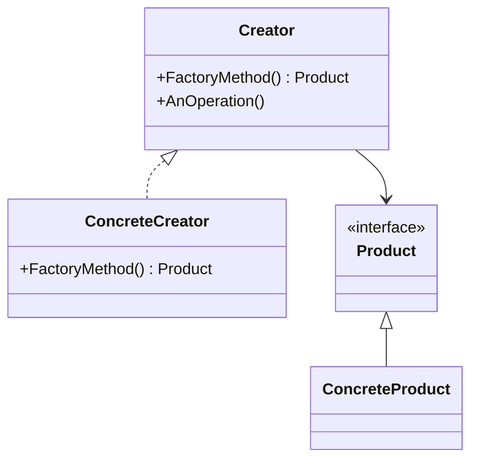
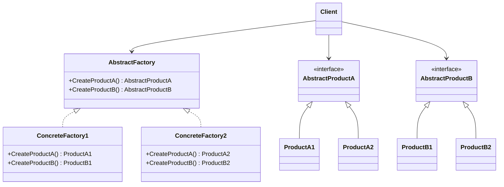

---

## Creational Patterns

### Singleton Pattern

- **Category**: Creational
- **Intent**: Ensure a class has only one instance and provide a global point of access to it.

- **Structure Diagram**:

  ```mermaid
  classDiagram
      class Singleton {
          -instance : Singleton
          -Singleton#40;#41; : constructor
          +GetInstance#40;#41; : Singleton
      }
  ```

- **Key Participants**:
  - **Singleton**: The class that maintains a static reference to the single instance and provides access.

- **Applicability**:
  - Use when exactly one instance of a class is needed across the system.
  - Manage shared resources or configurations.

- **Sample Code Snippet**:

  ```fsharp
  module Singleton =
      let instance = lazy (/* initialization code */)
      let getInstance() = instance.Force()

  // Usage
  let singleInstance = Singleton.getInstance()
  ```

- **Design Considerations**:
  - In **F#**, prefer **modules** for singleton behavior; modules are initialized once and can hold shared state.
  - Utilize the `lazy` keyword for thread-safe, lazy initialization.
  - Avoid global mutable state; consider using immutable data structures.

- **Differences and Similarities**:
  - **Singleton vs. Static Class**: Singleton can implement interfaces and support inheritance; static classes cannot.
  - **Singleton vs. Multiton**: Singleton restricts to one instance; Multiton allows multiple instances identified by keys.

---

### Simple Factory Pattern

- **Category**: Creational
- **Intent**: Encapsulate object creation logic and provide a simple interface for creating objects.

- **Structure Diagram**:

  ```mermaid
  classDiagram
      Client --> Factory
      Factory ..> Product

      class Factory {
          +CreateProduct(type) : Product
      }
      class Product {
          <<interface>>
          +Operation()
      }
      class ConcreteProductA {
          +Operation()
      }
      class ConcreteProductB {
          +Operation()
      }

      Factory --> Product
      Product <|-- ConcreteProductA
      Product <|-- ConcreteProductB
  ```

- **Key Participants**:
  - **Factory**: Contains methods to create objects.
  - **Product**: Abstract interface or base class for products.
  - **ConcreteProduct**: Specific implementations of `Product`.

- **Applicability**:
  - Use when you want to centralize object creation to avoid duplicating code.
  - To control object creation logic in one place.

- **Sample Code Snippet**:

  ```fsharp
  type Product =
      abstract member Operation: unit -> unit

  type ConcreteProductA() =
      interface Product with
          member _.Operation() = printfn "ConcreteProductA"

  type ConcreteProductB() =
      interface Product with
          member _.Operation() = printfn "ConcreteProductB"

  module Factory =
      let createProduct productType =
          match productType with
          | "A" -> ConcreteProductA() :> Product
          | "B" -> ConcreteProductB() :> Product
          | _ -> failwith "Unknown product type"

  // Usage
  let product = Factory.createProduct "A"
  product.Operation()
  ```

- **Design Considerations**:
  - In **F#**, functions are first-class; use **factory functions**.
  - Use **pattern matching** to decide which product to create.
  - Keep the factory function pure for better testability.

- **Differences and Similarities**:
  - **Simple Factory vs. Factory Method**: Simple Factory centralizes creation; Factory Method delegates creation to subclasses.

---

### Factory Method Pattern

- **Category**: Creational
- **Intent**: Define an interface for creating an object, but let subclasses decide which class to instantiate.

- **Structure Diagram**:



- **Key Participants**:
  - **Creator**: Declares the factory method.
  - **ConcreteCreator**: Overrides the factory method to produce `ConcreteProduct`.
  - **Product**: The interface or abstract class for objects the factory method creates.
  - **ConcreteProduct**: The concrete implementation.

- **Applicability**:
  - Use when a class cannot anticipate the class of objects it needs to create.
  - To delegate instantiation to subclasses.

- **Sample Code Snippet**:

  ```fsharp
  type Product =
      abstract member Operation: unit -> unit

  [<AbstractClass>]
  type Creator() =
      abstract member FactoryMethod: unit -> Product
      member this.AnOperation() =
          let product = this.FactoryMethod()
          product.Operation()

  type ConcreteCreator() =
      inherit Creator()
      override this.FactoryMethod() = ConcreteProduct() :> Product

  and ConcreteProduct() =
      interface Product with
          member _.Operation() = printfn "ConcreteProduct Operation"

  // Usage
  let creator = ConcreteCreator()
  creator.AnOperation()
  ```

- **Design Considerations**:
  - In **F#**, use **abstract classes** and **inheritance** where appropriate.
  - Alternatively, utilize **functions returning different implementations**.
  - Prefer composition over inheritance when possible.

- **Differences and Similarities**:
  - **Factory Method vs. Simple Factory**: Factory Method uses inheritance; Simple Factory uses a single function.
  - **Factory Method vs. Abstract Factory**: Factory Method creates one product; Abstract Factory creates families of products.

---

### Abstract Factory Pattern

- **Category**: Creational
- **Intent**: Provide an interface for creating families of related or dependent objects without specifying their concrete classes.

- **Structure Diagram**:



- **Key Participants**:
  - **AbstractFactory**: Declares interfaces for creating abstract products.
  - **ConcreteFactory**: Implements creation methods for specific products.
  - **AbstractProduct**: Declares an interface for a type of product.
  - **ConcreteProduct**: Implements the AbstractProduct interface.

- **Applicability**:
  - Use when a system should be independent of how its products are created.
  - To ensure that related products are used together.

- **Sample Code Snippet**:

  ```fsharp
  type IProductA =
      abstract member OperationA: unit -> string

  type IProductB =
      abstract member OperationB: unit -> string

  type AbstractFactory =
      abstract member CreateProductA: unit -> IProductA
      abstract member CreateProductB: unit -> IProductB

  type ConcreteFactory1() =
      interface AbstractFactory with
          member _.CreateProductA() = ProductA1() :> IProductA
          member _.CreateProductB() = ProductB1() :> IProductB

  and ProductA1() =
      interface IProductA with
          member _.OperationA() = "Result of ProductA1"

  and ProductB1() =
      interface IProductB with
          member _.OperationB() = "Result of ProductB1"

  // Usage
  let factory = ConcreteFactory1() :> AbstractFactory
  let productA = factory.CreateProductA()
  let productB = factory.CreateProductB()
  printfn "%s" (productA.OperationA())
  printfn "%s" (productB.OperationB())
  ```

- **Design Considerations**:
  - In **F#**, group factory functions within **modules** or use **classes** with factory methods.
  - Leverage **records** and **discriminated unions** for product definitions.
  - Use **partial application** to inject dependencies.

- **Differences and Similarities**:
  - **Abstract Factory vs. Factory Method**: Abstract Factory creates families of products; Factory Method creates a single product.
  - Often used together where Factory Methods are implemented in the Abstract Factory.

---

### Builder Pattern

- **Category**: Creational
- **Intent**: Separate the construction of a complex object from its representation, allowing the same construction process to create different representations.

- **Structure Diagram**:

  ```mermaid
  classDiagram
      Director --> Builder
      Builder <|.. ConcreteBuilder
      ConcreteBuilder --> Product

      class Director {
          +Construct#40;#41;
      }

      class Builder {
          <<interface>>
          +BuildPartA#40;#41;
          +BuildPartB#40;#41;
          +GetResult#40;#41; : Product
      }

      class ConcreteBuilder {
          +BuildPartA#40;#41;
          +BuildPartB#40;#41;
          +GetResult#40;#41; : Product
      }

      class Product
  ```

- **Key Participants**:
  - **Builder**: Specifies an abstract interface for creating parts of a Product.
  - **ConcreteBuilder**: Implements the Builder interface.
  - **Director**: Constructs an object using the Builder interface.
  - **Product**: The complex object under construction.

- **Applicability**:
  - Use when the creation process involves multiple steps.
  - When the construction process must allow different representations.

- **Sample Code Snippet**:

  ```fsharp
  type Product = { PartA: string option; PartB: string option }

  type Builder() =
      let mutable partA = None
      let mutable partB = None
      member this.BuildPartA() = partA <- Some "PartA"
      member this.BuildPartB() = partB <- Some "PartB"
      member this.GetResult() = { PartA = partA; PartB = partB }

  type Director() =
      member this.Construct(builder: Builder) =
          builder.BuildPartA()
          builder.BuildPartB()

  // Usage
  let builder = Builder()
  let director = Director()
  director.Construct(builder)
  let product = builder.GetResult()
  ```

- **Design Considerations**:
  - In **F#**, use **immutable records** with **copy-and-update** expressions.
  - Implement builders using **function chaining** or **pipelining**.
  - Enables fluent interfaces for object construction.

- **Differences and Similarities**:
  - **Builder vs. Abstract Factory**: Builder focuses on constructing a complex object step by step; Abstract Factory emphasizes families of objects.

---

### Prototype Pattern

- **Category**: Creational
- **Intent**: Specify the kinds of objects to create using a prototypical instance, and create new objects by copying this prototype.

- **Structure Diagram**:

  ```mermaid
  classDiagram
      Client --> Prototype
      Prototype <|.. ConcretePrototype1
      Prototype <|.. ConcretePrototype2

      class Prototype {
          +Clone#40;#41; : Prototype
      }

      class ConcretePrototype1 {
          +Clone#40;#41; : Prototype
      }

      class ConcretePrototype2 {
          +Clone#40;#41; : Prototype
      }
  ```

- **Key Participants**:
  - **Prototype**: Declares an interface for cloning itself.
  - **ConcretePrototype**: Implements the cloning operation.

- **Applicability**:
  - Use when the classes to instantiate are specified at runtime.
  - To avoid creating a hierarchy of factory classes.

- **Sample Code Snippet**:

  ```fsharp
  type IPrototype =
      abstract member Clone: unit -> IPrototype

  type ConcretePrototype(value: int) =
      member this.Value = value
      interface IPrototype with
          member this.Clone() = ConcretePrototype(this.Value) :> IPrototype

  // Usage
  let prototype = ConcretePrototype(5)
  let cloned = (prototype :> IPrototype).Clone() :?> ConcretePrototype
  printfn "Cloned value: %d" cloned.Value
  ```

- **Design Considerations**:
  - In **F#**, cloning is straightforward with **immutable types**.
  - Use **copy-and-update** expressions for records: `{ existingRecord with Field = newValue }`.
  - Be cautious if the object contains mutable references.

- **Differences and Similarities**:
  - **Prototype vs. Builder**: Prototype clones existing objects; Builder constructs new objects step by step.

---

### Multiton Pattern

- **Category**: Creational
- **Intent**: Ensure a class has only a limited number of instances and provide a global point of access to them.

- **Structure Diagram**:

  ```mermaid
  classDiagram
      class Multiton {
          -instances : Map<Key, Multiton>
          -Multiton#40;#41; : constructor
          +GetInstance(key) : Multiton
      }
  ```

- **Key Participants**:
  - **Multiton**: Manages instances identified by unique keys.

- **Applicability**:
  - Use when you need to manage a set of named instances.

- **Sample Code Snippet**:

  ```fsharp
  module Multiton =
      let private instances = System.Collections.Concurrent.ConcurrentDictionary<string, obj>()

      let getInstance key createInstance =
          instances.GetOrAdd(key, fun _ -> createInstance())

  // Usage
  let instance1 = Multiton.getInstance "key1" (fun () -> new obj())
  let instance2 = Multiton.getInstance "key1" (fun () -> new obj())
  printfn "Same instance: %b" (obj.ReferenceEquals(instance1, instance2))
  ```

- **Design Considerations**:
  - In **F#**, use concurrent collections like `ConcurrentDictionary`.
  - Ensure thread safety when accessing shared instances.
  - Be aware of the global state and potential memory leaks.

- **Differences and Similarities**:
  - **Multiton vs. Singleton**: Singleton restricts to one instance; Multiton allows multiple instances identified by keys.

---

### Dependency Injection

- **Category**: Creational
- **Intent**: Separate the creation of a client's dependencies from its behavior, resulting in loosely coupled code.

- **Structure Diagram**:

  ```mermaid
  classDiagram
      class Client {
          -service : Service
          +Client(service : Service)
      }

      interface Service
      class ConcreteService

      Client --> Service
      Service <|.. ConcreteService
  ```

- **Key Participants**:
  - **Client**: Depends on the `Service` but does not create it.
  - **Service**: The dependency to be injected.
  - **ConcreteService**: Implementation of `Service`.

- **Applicability**:
  - Use to promote loose coupling and easier testing.

- **Sample Code Snippet**:

  ```fsharp
  type IService =
      abstract member DoWork: unit -> unit

  type Service() =
      interface IService with
          member _.DoWork() = printfn "Service doing work"

  type Client(service: IService) =
      member _.Start() = service.DoWork()

  // Usage
  let service = Service() :> IService
  let client = Client(service)
  client.Start()
  ```

- **Design Considerations**:
  - In **F#**, use **function parameters** or **partial application** to inject dependencies.
  - Supports **constructor injection** for object-oriented designs.
  - Improves testability by allowing mocks or stubs.

- **Differences and Similarities**:
  - **Dependency Injection vs. Service Locator**: DI provides dependencies; Service Locator allows clients to request dependencies.

---

### Lazy Initialization

- **Category**: Creational
- **Intent**: Delay the creation of an object or the calculation of a value until it is needed to improve performance.

- **Structure Diagram**:

  ```mermaid
  classDiagram
      class Client {
          -lazyValue : Lazy<Value>
          +GetValue#40;#41; : Value
      }

      class Value {
          +Compute#40;#41;
      }

      Client --> Value
  ```

- **Key Participants**:
  - **Client**: Uses the lazily initialized value.
  - **Value**: The object whose creation is deferred.

- **Applicability**:
  - Use when the cost of creating an object is high and the object might not be needed.

- **Sample Code Snippet**:

  ```fsharp
  let lazyValue = lazy (printfn "Value created"; 42)

  // Usage
  printfn "Before accessing value"
  let value = lazyValue.Force()
  printfn "Value: %d" value
  ```

- **Design Considerations**:
  - In **F#**, leverage the built-in `lazy` keyword.
  - Thread-safe initialization can be controlled via `LazyThreadSafetyMode`.
  - Be cautious with side effects in lazy initializers.

- **Differences and Similarities**:
  - **Lazy Initialization vs. Virtual Proxy**: Both defer object creation; Virtual Proxy controls access, Lazy Initialization focuses on when to create.

---

## Structural Patterns

### Adapter Pattern

- **Category**: Structural
- **Intent**: Convert the interface of a class into another interface clients expect, allowing classes with incompatible interfaces to work together.

- **Structure Diagram**:

  ```mermaid
  classDiagram
      Client --> Target
      Target <|.. Adapter
      Adapter ..> Adaptee

      class Target {
          +Request#40;#41;
      }

      class Adapter {
          +Request#40;#41;
      }

      class Adaptee {
          +SpecificRequest#40;#41;
      }
  ```

- **Key Participants**:
  - **Target**: The interface expected by the client.
  - **Adapter**: Adapts the interface of the `Adaptee` to the `Target` interface.
  - **Adaptee**: An existing interface that needs adapting.

- **Applicability**:
  - Use when you want to use an existing class, and its interface does not match the one you need.
  - To create a reusable class that cooperates with unrelated or unforeseen classes.

- **Sample Code Snippet**:

  ```fsharp
  type ITarget =
      abstract member Request: unit -> string

  type Adaptee() =
      member this.SpecificRequest() = "Specific Request"

  type Adapter(adaptee: Adaptee) =
      interface ITarget with
          member this.Request() = adaptee.SpecificRequest()

  let client (target: ITarget) =
      printfn "%s" (target.Request())

  let adaptee = Adaptee()
  let adapter = Adapter(adaptee)
  client adapter
  ```

- **Design Considerations**:
  - In **F#**, use **object expressions** or **type extensions** to adapt interfaces.
  - Leverage **interfaces** and **pattern matching** for dynamic adaptation.
  - Utilize **function wrappers** to adapt functions directly.

- **Differences and Similarities**:
  - **Adapter vs. Decorator**: Adapter changes an interface; Decorator adds behavior without changing the interface.

---

### Bridge Pattern

- **Category**: Structural
- **Intent**: Decouple an abstraction from its implementation so that the two can vary independently.

- **Structure Diagram**:

  ```mermaid
  classDiagram
      Abstraction o--> Implementor
      Abstraction <|.. RefinedAbstraction
      Implementor <|.. ConcreteImplementorA
      Implementor <|.. ConcreteImplementorB

      class Abstraction {
          #implementor : Implementor
          +Operation#40;#41;
      }

      class Implementor {
          <<interface>>
          +OperationImpl#40;#41;
      }

      class RefinedAbstraction {
          +Operation#40;#41;
      }
  ```

- **Key Participants**:
  - **Abstraction**: Defines the abstraction's interface and maintains a reference to an implementor.
  - **Implementor**: Defines the interface for implementation classes.
  - **RefinedAbstraction**: Extends the interface defined by Abstraction.
  - **ConcreteImplementor**: Implements the Implementor interface.

- **Applicability**:
  - Use when both the abstractions and their implementations should be extensible.
  - To avoid permanent binding between an abstraction and its implementation.

- **Sample Code Snippet**:

  ```fsharp
  type IImplementor =
      abstract member OperationImpl: unit -> string

  type ConcreteImplementorA() =
      interface IImplementor with
          member this.OperationImpl() = "Implementation A"

  type ConcreteImplementorB() =
      interface IImplementor with
          member this.OperationImpl() = "Implementation B"

  type Abstraction(implementor: IImplementor) =
      member this.Operation() =
          implementor.OperationImpl()

  let abstractionA = Abstraction(ConcreteImplementorA())
  let abstractionB = Abstraction(ConcreteImplementorB())
  printfn "%s" (abstractionA.Operation())
  printfn "%s" (abstractionB.Operation())
  ```

- **Design Considerations**:
  - In **F#**, separate functionality using **interfaces** and **dependency injection**.
  - Use **function parameters** to inject different implementations.
  - Supports swapping implementations at runtime.

- **Differences and Similarities**:
  - **Bridge vs. Adapter**: Bridge separates abstraction from implementation; Adapter makes existing classes work together.

---

### Composite Pattern

- **Category**: Structural
- **Intent**: Compose objects into tree structures to represent part-whole hierarchies, allowing clients to treat individual objects and compositions uniformly.

- **Structure Diagram**:

  ```mermaid
  classDiagram
      Component <|.. Leaf
      Component <|.. Composite
      Composite o--> Component : children

      class Component {
          +Operation#40;#41;
      }

      class Leaf {
          +Operation#40;#41;
      }

      class Composite {
          +Operation#40;#41;
          +Add(Component)
          +Remove(Component)
          +GetChild(index) : Component
      }
  ```

- **Key Participants**:
  - **Component**: Declares the interface for objects in the composition.
  - **Leaf**: Represents leaf objects in the composition.
  - **Composite**: Defines behavior for components having children.

- **Applicability**:
  - Use when you want to represent part-whole hierarchies.
  - To allow clients to treat individual objects and compositions uniformly.

- **Sample Code Snippet**:

  ```fsharp
  type Component =
      abstract member Operation: unit -> unit

  type Leaf(name: string) =
      interface Component with
          member this.Operation() = printfn "Leaf %s" name

  type Composite(name: string) =
      let children = System.Collections.Generic.List<Component>()

      interface Component with
          member this.Operation() =
              printfn "Composite %s" name
              for child in children do
                  child.Operation()

      member this.Add(component: Component) =
          children.Add(component)

      member this.Remove(component: Component) =
          children.Remove(component)

  let leaf1 = Leaf("Leaf1") :> Component
  let leaf2 = Leaf("Leaf2") :> Component
  let composite = Composite("Composite1")
  composite.Add(leaf1)
  composite.Add(leaf2)
  (composite :> Component).Operation()
  ```

- **Design Considerations**:
  - In **F#**, use **recursive data structures** like discriminated unions.
  - Leverage **pattern matching** to traverse and process the composition.
  - Immutability ensures thread-safe operations on the composite.

- **Differences and Similarities**:
  - **Composite vs. Decorator**: Composite combines objects into tree structures; Decorator adds responsibilities to objects.

---

### Decorator Pattern

- **Category**: Structural
- **Intent**: Attach additional responsibilities to an object dynamically, providing a flexible alternative to subclassing for extending functionality.

- **Structure Diagram**:

  ```mermaid
  classDiagram
      Component <|.. Decorator
      Decorator o--> Component
      Decorator <|.. ConcreteDecorator

      class Component {
          +Operation#40;#41;
      }

      class Decorator {
          -component : Component
          +Operation#40;#41;
      }

      class ConcreteDecorator {
          +Operation#40;#41;
      }
  ```

- **Key Participants**:
  - **Component**: Defines the interface for objects that can have responsibilities added.
  - **Decorator**: Maintains a reference to a Component object.
  - **ConcreteDecorator**: Adds responsibilities to the component.

- **Applicability**:
  - Use to add responsibilities to individual objects dynamically.
  - When extension by subclassing is impractical.

- **Sample Code Snippet**:

  ```fsharp
  type Component =
      abstract member Operation: unit -> unit

  type ConcreteComponent() =
      interface Component with
          member this.Operation() = printfn "Concrete Component"

  type Decorator(component: Component) =
      interface Component with
          member this.Operation() =
              component.Operation()
              // Additional behavior

  type ConcreteDecorator(component: Component) =
      inherit Decorator(component)
      interface Component with
          member this.Operation() =
              (base :> Component).Operation()
              printfn "Concrete Decorator"

  let component = ConcreteComponent() :> Component
  let decorator = ConcreteDecorator(component) :> Component
  decorator.Operation()
  ```

- **Design Considerations**:
  - In **F#**, utilize **function composition** to add behavior.
  - Use **higher-order functions** to wrap existing functions with additional functionality.
  - Pipeline operator (`|>`) can chain decorations elegantly.

- **Differences and Similarities**:
  - **Decorator vs. Proxy**: Decorator adds responsibilities; Proxy controls access.

---

### Facade Pattern

- **Category**: Structural
- **Intent**: Provide a unified interface to a set of interfaces in a subsystem, making it easier to use.

- **Structure Diagram**:

  ```mermaid
  classDiagram
      Client --> Facade
      Facade --> SubsystemClassA
      Facade --> SubsystemClassB
      Facade --> SubsystemClassC

      class Facade {
          +Operation#40;#41;
      }

      class SubsystemClassA {
          +MethodA#40;#41;
      }

      class SubsystemClassB {
          +MethodB#40;#41;
      }

      class SubsystemClassC {
          +MethodC#40;#41;
      }
  ```

- **Key Participants**:
  - **Facade**: Provides simplified methods required by clients.
  - **Subsystem Classes**: Complex modules or subsystems that the Facade simplifies.

- **Applicability**:
  - Use when you want to provide a simple interface to a complex subsystem.
  - To decouple clients from complex subsystems.

- **Sample Code Snippet**:

  ```fsharp
  module Subsystem =
      let methodA() = printfn "Subsystem Method A"
      let methodB() = printfn "Subsystem Method B"
      let methodC() = printfn "Subsystem Method C"

  module Facade =
      let operation() =
          Subsystem.methodA()
          Subsystem.methodB()
          Subsystem.methodC()

  // Client code
  Facade.operation()
  ```

- **Design Considerations**:
  - In **F#**, use **modules** to group and simplify complex functionality.
  - Hide implementation details within the module; expose only necessary functions.
  - Improves code readability and maintainability.

- **Differences and Similarities**:
  - **Facade vs. Adapter**: Facade simplifies an interface; Adapter makes one interface compatible with another.

---

### Flyweight Pattern

- **Category**: Structural
- **Intent**: Use sharing to support large numbers of fine-grained objects efficiently.

- **Structure Diagram**:

  ```mermaid
  classDiagram
      Client --> FlyweightFactory
      FlyweightFactory --> Flyweight
      Flyweight <|.. ConcreteFlyweight
      Flyweight <|.. UnsharedFlyweight

      class Flyweight {
          +Operation(extrinsicState)
      }

      class ConcreteFlyweight {
          +Operation(extrinsicState)
      }

      class UnsharedFlyweight {
          +Operation(extrinsicState)
      }

      class FlyweightFactory {
          +GetFlyweight(key) : Flyweight
      }
  ```

- **Key Participants**:
  - **Flyweight**: Declares an interface for sharing.
  - **ConcreteFlyweight**: Implements Flyweight and shares intrinsic state.
  - **FlyweightFactory**: Creates and manages Flyweight objects.
  - **UnsharedFlyweight**: Not shared; maintains state unique to that instance.

- **Applicability**:
  - Use when an application uses a large number of objects that can be shared.
  - To reduce memory usage by sharing as much data as possible.

- **Sample Code Snippet**:

  ```fsharp
  type Flyweight(key: string) =
      // Intrinsic state
      member val Key = key with get
      member this.Operation(extrinsicState: string) =
          printfn "Flyweight %s with extrinsic state %s" this.Key extrinsicState

  module FlyweightFactory =
      let flyweights = System.Collections.Generic.Dictionary<string, Flyweight>()
      let getFlyweight key =
          if flyweights.ContainsKey(key) then
              flyweights.[key]
          else
              let flyweight = Flyweight(key)
              flyweights.Add(key, flyweight)
              flyweight

  // Client code
  let flyweight1 = FlyweightFactory.getFlyweight("A")
  flyweight1.Operation("State1")
  let flyweight2 = FlyweightFactory.getFlyweight("A")
  flyweight2.Operation("State2")
  ```

- **Design Considerations**:
  - In **F#**, use **immutable data structures** for intrinsic state.
  - Caching and sharing can be managed with **maps** and **weak references**.
  - Ensure thread safety when accessing shared instances.

- **Differences and Similarities**:
  - **Flyweight vs. Singleton**: Flyweight manages multiple shared instances; Singleton restricts to one instance.

---

### Proxy Pattern

- **Category**: Structural
- **Intent**: Provide a surrogate or placeholder for another object to control access to it.

- **Structure Diagram**:

  ```mermaid
  classDiagram
      Client --> Subject
      Subject <|.. RealSubject
      Subject <|.. Proxy
      Proxy --> RealSubject

      class Subject {
          +Request#40;#41;
      }

      class RealSubject {
          +Request#40;#41;
      }

      class Proxy {
          +Request#40;#41;
      }
  ```

- **Key Participants**:
  - **Subject**: Defines the common interface for RealSubject and Proxy.
  - **Proxy**: Controls access to the RealSubject.
  - **RealSubject**: The real object that the proxy represents.

- **Applicability**:
  - Use when you need a more versatile or sophisticated reference to an object.
  - To control access, add security, or perform lazy initialization.

- **Sample Code Snippet**:

  ```fsharp
  type ISubject =
      abstract member Request: unit -> unit

  type RealSubject() =
      interface ISubject with
          member this.Request() = printfn "RealSubject Request"

  type Proxy() =
      let realSubject = lazy (RealSubject())
      interface ISubject with
          member this.Request() =
              printfn "Proxy Request"
              (realSubject.Force() :> ISubject).Request()

  // Client code
  let subject = Proxy() :> ISubject
  subject.Request()
  ```

- **Design Considerations**:
  - In **F#**, use **lazy evaluation** for virtual proxies.
  - Implement proxies using **higher-order functions** to wrap functionality.
  - Can use **object expressions** for simple proxy implementations.

- **Differences and Similarities**:
  - **Proxy vs. Decorator**: Proxy controls access; Decorator adds behavior.

---

### Extension Pattern

- **Category**: Structural
- **Intent**: Add functionality to existing code without modification, useful when you cannot alter the original source.

- **Structure Diagram**:

  ```mermaid
  classDiagram
      class ExistingClass {
          +ExistingMethod#40;#41;
      }

      class ExistingClass_Extensions {
          +NewMethod#40;#41;
      }
  ```

- **Key Participants**:
  - **ExistingClass**: The class being extended.
  - **Extension Methods**: New methods added to the existing class.

- **Applicability**:
  - Use when you need to add methods to existing classes without modifying them.
  - To enhance libraries or third-party code.

- **Sample Code Snippet**:

  ```fsharp
  type System.String with
      member this.IsNullOrWhiteSpace() =
          String.IsNullOrWhiteSpace(this)

  // Usage
  let s = "   "
  let isEmpty = s.IsNullOrWhiteSpace()
  ```

- **Design Considerations**:
  - In **F#**, use **type extensions** to add methods to existing types.
  - Extensions must be in scope to be available; organize modules accordingly.
  - Be cautious of potential conflicts with existing methods.

- **Differences and Similarities**:
  - **Extension Pattern vs. Decorator**: Extension adds methods to a type; Decorator adds behavior to an instance.

---

### Module Pattern

- **Category**: Structural
- **Intent**: Organize code into self-contained modules for encapsulation and reusability.

- **Structure Diagram**:

  ```mermaid
  classDiagram
      class Module {
          -PrivateData
          +PublicFunction#40;#41;
      }

      Client --> Module : uses
  ```

- **Key Participants**:
  - **Module**: Encapsulates internal details and exposes a public interface.

- **Applicability**:
  - Use to encapsulate related code and data into a single unit with controlled access.
  - Promote code organization and maintainability.

- **Sample Code Snippet**:

  ```fsharp
  module MathModule =
      let private helperFunction x = x * x
      let publicFunction x = helperFunction x + x

  // Usage
  let result = MathModule.publicFunction 5
  ```

- **Design Considerations**:
  - In **F#**, modules are primary constructs for code organization.
  - Control visibility using **access modifiers** (`private`, `internal`).
  - Modules promote encapsulation and can contain types, functions, and values.

- **Differences and Similarities**:
  - **Module Pattern vs. Namespace**: Modules can contain code implementations; namespaces organize modules and types.

---


## Behavioral Patterns

### Chain of Responsibility Pattern

- **Category**: Behavioral
- **Intent**: Avoid coupling the sender of a request to its receiver by giving more than one object a chance to handle the request.

- **Structure Diagram**:

  ```mermaid
  classDiagram
      Handler <|.. ConcreteHandler1
      Handler <|.. ConcreteHandler2
      Handler o--> Handler : successor

      class Handler {
          +HandleRequest(request)
          -successor : Handler
      }
  ```

- **Key Participants**:
  - **Handler**: Defines an interface for handling requests and optionally implements the successor link.
  - **ConcreteHandler**: Handles requests it is responsible for; can access its successor.
  - **Client**: Initiates the request.

- **Applicability**:
  - Use when more than one object may handle a request.
  - To decouple senders and receivers.

- **Sample Code Snippet**:

  ```fsharp
  type Handler =
      abstract member HandleRequest: int -> unit
      abstract member SetSuccessor: Handler option -> unit

  type ConcreteHandler1() =
      let mutable successor: Handler option = None
      interface Handler with
          member this.HandleRequest(request) =
              if request < 10 then
                  printfn "Handler1 handled request %d" request
              else
                  match successor with
                  | Some s -> s.HandleRequest(request)
                  | None -> ()
          member this.SetSuccessor(s) = successor <- s

  // Similar for ConcreteHandler2
  ```

- **Design Considerations**:
  - In **F#**, implement the chain using **recursive functions** or collections of functions.
  - Use **option types** to handle the absence of a successor.
  - Ensure thread safety if handlers are stateful.

- **Differences and Similarities**:
  - **Chain of Responsibility vs. Decorator**: Chain passes requests along handlers; Decorator adds behavior to objects.

---

### Command Pattern

- **Category**: Behavioral
- **Intent**: Encapsulate a request as an object, allowing for parameterization and queuing of requests.

- **Structure Diagram**:

  ```mermaid
  classDiagram
      Invoker --> Command
      Command <|.. ConcreteCommand
      ConcreteCommand --> Receiver

      class Invoker {
          +SetCommand(Command)
          +ExecuteCommand#40;#41;
      }

      class Command {
          +Execute#40;#41;
      }

      class ConcreteCommand {
          +Execute#40;#41;
      }

      class Receiver {
          +Action#40;#41;
      }
  ```

- **Key Participants**:
  - **Command**: Declares an interface for executing an operation.
  - **ConcreteCommand**: Implements `Execute` by invoking actions on `Receiver`.
  - **Invoker**: Calls the command to execute requests.
  - **Receiver**: Knows how to perform the operations.

- **Applicability**:
  - Use to parameterize objects with operations.
  - Support undo/redo functionality.

- **Sample Code Snippet**:

  ```fsharp
  type Command =
      abstract member Execute: unit -> unit

  type Receiver() =
      member this.Action() = printfn "Receiver Action"

  type ConcreteCommand(receiver: Receiver) =
      interface Command with
          member this.Execute() = receiver.Action()

  type Invoker() =
      let mutable command: Command option = None
      member this.SetCommand(cmd: Command) = command <- Some cmd
      member this.ExecuteCommand() =
          match command with
          | Some cmd -> cmd.Execute()
          | None -> ()

  let receiver = Receiver()
  let command = ConcreteCommand(receiver)
  let invoker = Invoker()
  invoker.SetCommand(command)
  invoker.ExecuteCommand()
  ```

- **Design Considerations**:
  - In **F#**, commands can be represented as **functions**.
  - Use **immutable data** to store command parameters.
  - Facilitate serialization for undo/redo functionality.

- **Differences and Similarities**:
  - **Command vs. Strategy**: Command encapsulates a request; Strategy encapsulates an algorithm.

---

### Interpreter Pattern

- **Category**: Behavioral
- **Intent**: Define a representation for a language's grammar along with an interpreter that uses the representation to interpret sentences.

- **Structure Diagram**:

  ```mermaid
  classDiagram
      AbstractExpression <|.. TerminalExpression
      AbstractExpression <|.. NonterminalExpression
      NonterminalExpression o--> AbstractExpression

      class AbstractExpression {
          +Interpret(context)
      }

      class TerminalExpression {
          +Interpret(context)
      }

      class NonterminalExpression {
          +Interpret(context)
      }
  ```

- **Key Participants**:
  - **AbstractExpression**: Declares an interface for interpreting context.
  - **TerminalExpression**: Implements interpretation associated with terminal symbols.
  - **NonterminalExpression**: Represents non-terminal symbols and rules.
  - **Context**: Contains information that's global to the interpreter.

- **Applicability**:
  - Use when the grammar is simple and stable.
  - For small languages or command interpreters.

- **Sample Code Snippet**:

  ```fsharp
  type Expression =
      | Number of int
      | Add of Expression * Expression
      | Subtract of Expression * Expression

  let rec interpret expr =
      match expr with
      | Number n -> n
      | Add (left, right) -> interpret left + interpret right
      | Subtract (left, right) -> interpret left - interpret right

  let expression = Add(Number 5, Subtract(Number 10, Number 3))
  let result = interpret expression // Result: 12
  ```

- **Design Considerations**:
  - In **F#**, use **discriminated unions** and **pattern matching**.
  - Recursive functions elegantly handle nested expressions.
  - For complex grammars, consider parser generators.

- **Differences and Similarities**:
  - **Interpreter vs. Visitor**: Interpreter interprets expressions; Visitor separates operations from objects.

---

### Iterator Pattern

- **Category**: Behavioral
- **Intent**: Provide a way to access elements of an aggregate object sequentially without exposing its underlying representation.

- **Structure Diagram**:

  ```mermaid
  classDiagram
      Iterator <|.. ConcreteIterator
      Aggregate <|.. ConcreteAggregate
      ConcreteIterator --> ConcreteAggregate

      class Iterator {
          +First#40;#41;
          +Next#40;#41;
          +IsDone#40;#41;
          +CurrentItem#40;#41;
      }
      class Aggregate {
          +CreateIterator#40;#41; : Iterator
      }
  ```

- **Key Participants**:
  - **Iterator**: Defines the interface for accessing elements.
  - **ConcreteIterator**: Implements the Iterator interface.
  - **Aggregate**: Defines an interface for creating an Iterator.
  - **ConcreteAggregate**: Implements the Aggregate interface.

- **Applicability**:
  - Use to traverse a collection without exposing its internal structure.

- **Sample Code Snippet**:

  ```fsharp
  let collection = [1; 2; 3; 4; 5]

  // Using built-in iterator functions
  collection |> List.iter (printfn "%d")
  ```

- **Design Considerations**:
  - In **F#**, sequences (`seq<'T>`) provide built-in iteration capabilities.
  - Use **comprehensions** and **higher-order functions**.
  - Lazy sequences support efficient iteration over large data sets.

- **Differences and Similarities**:
  - **Iterator vs. Enumerator**: In .NET, iterator pattern is often implemented using IEnumerable and IEnumerator.

---


### Mediator Pattern

- **Category**: Behavioral
- **Intent**: Define an object that encapsulates how a set of objects interact, promoting loose coupling.

- **Structure Diagram**:

  ```mermaid
  classDiagram
      Mediator <|.. ConcreteMediator
      Colleague <|.. ConcreteColleague1
      Colleague <|.. ConcreteColleague2
      Colleague --> Mediator

      class Mediator {
          +Send(message, colleague)
      }

      class Colleague {
          +Send(message)
          +Receive(message)
          -mediator : Mediator
      }
  ```

- **Key Participants**:
  - **Mediator**: Defines an interface for communicating with Colleague objects.
  - **ConcreteMediator**: Implements cooperative behavior by coordinating Colleague objects.
  - **Colleague**: Communicates with other colleagues via the Mediator.

- **Applicability**:
  - Use when complex communication is needed between a set of objects.
  - To avoid tight coupling between colleagues.

- **Sample Code Snippet**:

  ```fsharp
  type Mediator =
      abstract member Send: string * Colleague -> unit

  and Colleague(mediator: Mediator) =
      member this.Mediator = mediator
      abstract member Receive: string -> unit

  type ConcreteMediator() =
      let mutable colleagues = []
      interface Mediator with
          member this.Send(message, colleague) =
              for c in colleagues do
                  if c <> colleague then c.Receive(message)
      member this.Register(colleague: Colleague) =
          colleagues <- colleague :: colleagues

  type ConcreteColleague(mediator: Mediator) =
      inherit Colleague(mediator)
      override this.Receive(message) =
          printfn "Colleague received: %s" message
      member this.Send(message) =
          this.Mediator.Send(message, this)

  let mediator = ConcreteMediator()
  let colleague1 = ConcreteColleague(mediator)
  let colleague2 = ConcreteColleague(mediator)
  mediator.Register(colleague1)
  mediator.Register(colleague2)
  colleague1.Send("Hello")
  ```

- **Design Considerations**:
  - In **F#**, use **MailboxProcessor** (agents) for message passing.
  - **Async workflows** can model asynchronous communication.
  - Decouples colleagues by centralizing communication.

- **Differences and Similarities**:
  - **Mediator vs. Observer**: Mediator centralizes communication; Observer defines a one-to-many dependency.

---

### Memento Pattern

- **Category**: Behavioral
- **Intent**: Capture and externalize an object's internal state without violating encapsulation, so that the object can be restored to this state later.

- **Structure Diagram**:

  ```mermaid
  classDiagram
      Originator --> Memento
      Caretaker --> Memento

      class Originator {
          +CreateMemento#40;#41; : Memento
          +SetMemento(m : Memento)
          -state
      }

      class Memento {
          -state
      }

      class Caretaker {
          -memento : Memento
      }
  ```

- **Key Participants**:
  - **Originator**: Creates a memento containing a snapshot of its current state.
  - **Memento**: Stores internal state of the Originator.
  - **Caretaker**: Responsible for keeping the memento.

- **Applicability**:
  - Use when you need to save and restore an object's state.
  - To implement undo/redo functionality.

- **Sample Code Snippet**:

  ```fsharp
  type Memento(state) =
      member this.State = state

  type Originator(state) =
      member val State = state with get, set
      member this.CreateMemento() = Memento(this.State)
      member this.SetMemento(memento: Memento) =
          this.State <- memento.State

  // Usage
  let originator = Originator("State1")
  let memento = originator.CreateMemento()
  originator.State <- "State2"
  originator.SetMemento(memento)
  ```

- **Design Considerations**:
  - In **F#**, immutability makes saving states straightforward.
  - Use immutable data structures for state snapshots.
  - Ensure that the memento does not expose the Originator's internal details.

- **Differences and Similarities**:
  - **Memento vs. Prototype**: Memento captures state for future restoration; Prototype copies an object for new use.

---

### Observer Pattern

- **Category**: Behavioral
- **Intent**: Define a one-to-many dependency between objects so that when one object changes state, all its dependents are notified and updated automatically.

- **Structure Diagram**:

  ```mermaid
  classDiagram
      Subject o--> Observer
      Subject <|.. ConcreteSubject
      Observer <|.. ConcreteObserver

      class Subject {
          +Attach(Observer)
          +Detach(Observer)
          +Notify#40;#41;
      }

      class Observer {
          +Update#40;#41;
      }
  ```

- **Key Participants**:
  - **Subject**: Maintains a list of observers and notifies them of changes.
  - **Observer**: Provides an updating interface for objects.
  - **ConcreteSubject**: Stores state of interest to observers.
  - **ConcreteObserver**: Updates its state to match the Subject's.

- **Applicability**:
  - Use when changes to one object require changing others.
  - To decouple subjects and observers.

- **Sample Code Snippet**:

  ```fsharp
  open System

  let subject = new Event<_>()

  subject.Publish.Add(fun data -> printfn "Observer received: %d" data)

  subject.Trigger(42)
  ```

- **Design Considerations**:
  - In **F#**, use **events** and the **IObservable** interface.
  - The **FSharp.Control.Reactive** library provides advanced features.
  - Supports functional reactive programming patterns.

- **Differences and Similarities**:
  - **Observer vs. Mediator**: Observer notifies dependents; Mediator centralizes interactions.

---

### State Pattern

- **Category**: Behavioral
- **Intent**: Allow an object to alter its behavior when its internal state changes.

- **Structure Diagram**:

  ```mermaid
  classDiagram
      Context --> State
      State <|.. ConcreteStateA
      State <|.. ConcreteStateB

      class Context {
          +Request#40;#41;
          -state : State
      }

      class State {
          +Handle(context)
      }
  ```

- **Key Participants**:
  - **Context**: Maintains an instance of a ConcreteState.
  - **State**: Defines an interface for encapsulating behavior.
  - **ConcreteState**: Implements behavior associated with a state.

- **Applicability**:
  - Use when an object's behavior depends on its state.

- **Sample Code Snippet**:

  ```fsharp
  type State =
      abstract member Handle: Context -> unit

  and Context(state: State) =
      let mutable state = state
      member this.Request() = state.Handle(this)
      member this.TransitionTo(newState: State) = state <- newState

  type ConcreteStateA() =
      interface State with
          member this.Handle(context) =
              printfn "State A handling request"
              context.TransitionTo(ConcreteStateB())

  type ConcreteStateB() =
      interface State with
          member this.Handle(context) =
              printfn "State B handling request"
              context.TransitionTo(ConcreteStateA())

  let context = Context(ConcreteStateA())
  context.Request()
  context.Request()
  ```

- **Design Considerations**:
  - In **F#**, use **discriminated unions** for simple state machines.
  - Pattern matching handles state transitions effectively.
  - Ensure immutability where possible for safety.

- **Differences and Similarities**:
  - **State vs. Strategy**: State changes behavior internally; Strategy is selected by the client.

---

### Strategy Pattern

- **Category**: Behavioral
- **Intent**: Define a family of algorithms, encapsulate each one, and make them interchangeable.

- **Structure Diagram**:

  ```mermaid
  classDiagram
      Context --> Strategy
      Strategy <|.. ConcreteStrategyA
      Strategy <|.. ConcreteStrategyB

      class Context {
          +ExecuteStrategy#40;#41;
          -strategy : Strategy
      }

      class Strategy {
          +AlgorithmInterface#40;#41;
      }
  ```

- **Key Participants**:
  - **Strategy**: Defines an interface common to all supported algorithms.
  - **ConcreteStrategy**: Implements the algorithm.
  - **Context**: Maintains a reference to a Strategy.

- **Applicability**:
  - Use when you have multiple algorithms for a task.

- **Sample Code Snippet**:

  ```fsharp
  type Strategy = int -> int -> int

  let add x y = x + y
  let multiply x y = x * y

  type Context(strategy: Strategy) =
      member this.Execute(a, b) = strategy a b

  let contextAdd = Context(add)
  let contextMultiply = Context(multiply)
  printfn "%d" (contextAdd.Execute(2, 3))       // Output: 5
  printfn "%d" (contextMultiply.Execute(2, 3))  // Output: 6
  ```

- **Design Considerations**:
  - In **F#**, strategies are naturally represented as **functions**.
  - Use **higher-order functions** to select and apply strategies.
  - Functions can be passed around and stored easily.

- **Differences and Similarities**:
  - **Strategy vs. State**: Strategy changes behavior via composition; State changes behavior via internal state.

---

### Template Method Pattern

- **Category**: Behavioral
- **Intent**: Define the skeleton of an algorithm, deferring some steps to subclasses.

- **Structure Diagram**:

  ```mermaid
  classDiagram
      AbstractClass <|.. ConcreteClass

      class AbstractClass {
          +TemplateMethod#40;#41;
          +PrimitiveOperation1#40;#41;
          +PrimitiveOperation2#40;#41;
      }

      class ConcreteClass {
          +PrimitiveOperation1#40;#41;
          +PrimitiveOperation2#40;#41;
      }
  ```

- **Key Participants**:
  - **AbstractClass**: Defines abstract primitive operations.
  - **ConcreteClass**: Implements the primitive operations.

- **Applicability**:
  - Use to implement invariant parts of an algorithm once.

- **Sample Code Snippet**:

  ```fsharp
  let templateMethod operation1 operation2 =
      printfn "Step 1"
      operation1()
      printfn "Step 2"
      operation2()
      printfn "Step 3"

  let concreteOperation1() = printfn "Concrete Operation 1"
  let concreteOperation2() = printfn "Concrete Operation 2"

  templateMethod concreteOperation1 concreteOperation2
  ```

- **Design Considerations**:
  - In **F#**, use functions with parameters for variable steps.
  - **Higher-order functions** provide flexibility.
  - Avoids need for inheritance.

- **Differences and Similarities**:
  - **Template Method vs. Strategy**: Template Method uses inheritance; Strategy uses composition.

---

### Visitor Pattern

- **Category**: Behavioral
- **Intent**: Represent an operation to be performed on elements of an object structure.

- **Structure Diagram**:

  ```mermaid
  classDiagram
      Visitor <|.. ConcreteVisitor
      Element <|.. ConcreteElement
      ObjectStructure o--> Element
      Element --> Visitor

      class Visitor {
          +VisitConcreteElement(ConcreteElement)
      }

      class Element {
          +Accept(Visitor)
      }
  ```

- **Key Participants**:
  - **Visitor**: Declares operations for each element type.
  - **ConcreteVisitor**: Implements operations.
  - **Element**: Accepts visitors.

- **Applicability**:
  - Use when operations need to be performed on objects of complex structures.

- **Sample Code Snippet**:

  ```fsharp
  type IVisitor =
      abstract member Visit: 'T -> unit

  type IElement =
      abstract member Accept: IVisitor -> unit

  type ConcreteElement(value: int) =
      interface IElement with
          member this.Accept(visitor) = visitor.Visit(this)

      member this.Value = value

  type ConcreteVisitor() =
      interface IVisitor with
          member this.Visit(element: obj) =
              match element with
              | :? ConcreteElement as e -> printfn "Visited element with value %d" e.Value
              | _ -> ()

  let elements = [ConcreteElement(1); ConcreteElement(2)]
  let visitor = ConcreteVisitor()

  for e in elements do
      (e :> IElement).Accept(visitor)
  ```

- **Design Considerations**:
  - In **F#**, pattern matching can often replace the need for Visitor.
  - Adding new element types requires updating the visitor.

- **Differences and Similarities**:
  - **Visitor vs. Strategy**: Visitor adds new operations; Strategy encapsulates algorithms.

---


### Null Object Pattern

- **Category**: Behavioral
- **Intent**: Provide an object as a surrogate for the absence of an object, implementing default behavior to avoid null references and simplify client code.

- **Structure Diagram**:

  ```mermaid
  classDiagram
      AbstractObject <|.. RealObject
      AbstractObject <|.. NullObject

      class AbstractObject {
          +Request#40;#41;
      }

      class RealObject {
          +Request#40;#41;
      }

      class NullObject {
          +Request#40;#41;
      }
  ```

- **Key Participants**:
  - **AbstractObject**: Defines the interface shared by `RealObject` and `NullObject`.
  - **RealObject**: Implements the required operations.
  - **NullObject**: Provides a default behavior or do-nothing implementation.

- **Applicability**:
  - Use when an object is expected, but sometimes no object is appropriate, and you want to avoid handling null references.
  - Simplify client code by providing a default object that can safely be used without null checks.

- **Sample Code Snippet**:

  ```fsharp
  type ILogger =
      abstract member Log: string -> unit

  type ConsoleLogger() =
      interface ILogger with
          member _.Log(message) = printfn "Log: %s" message

  type NullLogger() =
      interface ILogger with
          member _.Log(message) = () // Do nothing

  let performOperation (logger: ILogger) =
      logger.Log "Operation started"
      // Perform operation
      logger.Log "Operation completed"

  // Usage
  let logger = NullLogger() :> ILogger
  performOperation logger
  ```

- **Design Considerations**:
  - In **F#**, since null references are discouraged, the Null Object pattern can be implemented using an object that implements the required interface but provides an empty or default implementation.
  - Alternatively, consider using **option types (`Option<'T>`)** and pattern matching to handle the presence or absence of a value explicitly.
  - The Null Object pattern helps avoid repetitive null checks and keeps client code clean and robust.

- **Differences and Similarities**:
  - **Null Object vs. Option Type**: Option types require explicit handling of `Some` and `None` cases, while Null Object provides a default implementation, making client code simpler.
  - **Null Object vs. Strategy Pattern**: Both involve objects implementing the same interface, but the Null Object provides default behavior when an object is absent, whereas Strategy encapsulates interchangeable behaviors.

---

### SAGA Pattern

- **Category**: Behavioral
- **Intent**: Manage complex transactions and data consistency across distributed systems by breaking them into a series of smaller, independent steps with compensating actions.

- **Structure Diagram**:

  ```mermaid
  sequenceDiagram
      participant SagaCoordinator
      participant ServiceA
      participant ServiceB
      participant ServiceC

      SagaCoordinator->>ServiceA: Execute Step A
      ServiceA-->>SagaCoordinator: Success
      SagaCoordinator->>ServiceB: Execute Step B
      ServiceB-->>SagaCoordinator: Success
      SagaCoordinator->>ServiceC: Execute Step C
      ServiceC-->>SagaCoordinator: Failure
      Note over SagaCoordinator,ServiceC: Begin Compensation
      SagaCoordinator->>ServiceB: Compensate Step B
      SagaCoordinator->>ServiceA: Compensate Step A
  ```

- **Key Participants**:
  - **Saga Coordinator**: Orchestrates the sequence of transactions and handles compensations upon failures.
  - **Services**: Perform individual local transactions and provide compensating actions if required.

- **Applicability**:
  - Use in microservices architectures where distributed transactions are required but ACID transactions are not feasible.
  - When ensuring data consistency across services that cannot be managed through a single transaction.

- **Sample Code Snippet**:

  ```fsharp
  // Pseudo-code for Saga implementation using async workflows

  let executeSaga () = async {
      try
          do! serviceA.ExecuteStepA()
          do! serviceB.ExecuteStepB()
          do! serviceC.ExecuteStepC()
      with
      | ex ->
          // Handle failure and compensate
          do! serviceB.CompensateStepB()
          do! serviceA.CompensateStepA()
          printfn "Saga failed: %s" ex.Message
  }

  // Start the saga
  Async.Start(executeSaga())
  ```

- **Design Considerations**:
  - In **F#**, leverage **async workflows** to handle asynchronous operations and orchestrate the saga steps.
  - Implement **compensating actions** to reverse the effects of completed steps in case of failure.
  - Use **agents (`MailboxProcessor`)** to manage state and communication in a thread-safe manner.
  - Ensure that operations are **idempotent** to handle retries gracefully.

- **Differences and Similarities**:
  - **SAGA vs. Transaction**: Saga manages distributed transactions without locks, relying on eventual consistency and compensations, unlike traditional ACID transactions.
  - **SAGA vs. Workflow**: Both involve orchestrating steps, but Saga specifically addresses data consistency and failure compensation in distributed systems.

---

### Command Query Responsibility Segregation (CQRS)

- **Category**: Architectural Pattern (Behavioral Aspects)
- **Intent**: Separate read and write operations into different models to optimize scalability, performance, and security.

- **Structure Diagram**:

  ```mermaid
  graph LR
      UI -->|Command| CommandHandler
      UI -->|Query| QueryHandler
      CommandHandler -->|Update| WriteModel
      QueryHandler -->|Read| ReadModel
      WriteModel -->|Persist| WriteDatabase
      ReadModel -->|Retrieve| ReadDatabase
  ```

- **Key Participants**:
  - **Command**: An instruction to change the state of the system.
  - **CommandHandler**: Processes commands and updates the write model.
  - **Query**: A request to retrieve data without modifying it.
  - **QueryHandler**: Processes queries and retrieves data from the read model.
  - **Write Model**: Represents the state mutations of the system.
  - **Read Model**: Optimized for read operations, possibly denormalized for performance.

- **Applicability**:
  - Use when read and write operations have different performance and scalability requirements.
  - To optimize system responsiveness by separating concerns.
  - When eventual consistency between read and write models is acceptable.

- **Sample Code Snippet**:

  ```fsharp
  // Command definition
  type CreateOrderCommand = { OrderId: int; CustomerId: int; Items: string list }

  // Command handler
  let handleCreateOrder command =
      // Validate and process the command
      // Update the write model (e.g., save to the write database)
      printfn "Order %d created for customer %d" command.OrderId command.CustomerId

  // Query definition
  type GetOrderQuery = { OrderId: int }

  // Query handler
  let handleGetOrder query =
      // Retrieve data from the read model (e.g., read database)
      printfn "Retrieved order %d" query.OrderId
      // Return order details
      { query with OrderId = query.OrderId }

  // Usage
  let command = { OrderId = 1; CustomerId = 42; Items = ["Item1"; "Item2"] }
  handleCreateOrder command

  let query = { OrderId = 1 }
  let order = handleGetOrder query
  ```

- **Design Considerations**:
  - In **F#**, define commands and queries as **immutable record types**, promoting clarity and thread safety.
  - Use **type-safe function signatures** to separate command and query handlers.
  - Implement **eventual consistency** between the write and read models, possibly using **Event Sourcing** to capture changes.
  - Leverage **asynchronous processing** to update the read model in response to write operations.

- **Differences and Similarities**:
  - **CQRS vs. CRUD**: CRUD systems use the same model for reads and writes, while CQRS separates them for optimization.
  - **CQRS vs. Event Sourcing**: CQRS can be used with or without Event Sourcing; when combined, Event Sourcing provides a complete event history supporting the CQRS pattern.


---

## Functional Design Patterns

### Lenses and Prisms

- **Category**: Functional
- **Intent**: Simplify manipulation of nested immutable data structures by providing composable getters and setters.

- **Structure Diagram**:

  ```mermaid
  classDiagram
      class Lens {
          +Get(s): a
          +Set(s, a): s
          +Compose(Lens): Lens
      }
  ```

- **Key Participants**:
  - **Lens**: A composable pair of functions to focus on a part of a data structure.
  - **Prism**: Similar to Lens but used for types like discriminated unions.

- **Applicability**:
  - Use when you need to access or update deeply nested data without boilerplate code.
  - To maintain immutability while providing convenience in data manipulation.

- **Sample Code Snippet**:

  ```fsharp
  // Define a Lens type
  type Lens<'Whole, 'Part> = {
      Get : 'Whole -> 'Part
      Set : 'Whole -> 'Part -> 'Whole
  }

  // Example data structures
  type Address = { Street: string; City: string }
  type Person = { Name: string; Address: Address }

  // Lenses for Person and Address
  let addressLens = {
      Get = fun person -> person.Address
      Set = fun person addr -> { person with Address = addr }
  }

  let cityLens = {
      Get = fun addr -> addr.City
      Set = fun addr city -> { addr with City = city }
  }

  // Compose lenses to access nested properties
  let personCityLens = {
      Get = addressLens.Get >> cityLens.Get
      Set = fun person city ->
          let addr = addressLens.Get person
          let updatedAddr = cityLens.Set addr city
          addressLens.Set person updatedAddr
  }

  // Usage
  let person = { Name = "Alice"; Address = { Street = "Main St"; City = "Old Town" } }
  let city = personCityLens.Get person  // "Old Town"
  let updatedPerson = personCityLens.Set person "New City"
  ```

- **Design Considerations**:
  - In **F#**, lenses can be implemented using records or functions.
  - **Composable**: Lenses can be composed to focus on deeper structures.
  - **Immutability**: Facilitates working with immutable data efficiently.
  - **Libraries**: Consider using libraries like **Aether** or **FSharpPlus** for lens utilities.

- **Differences and Similarities**:
  - **Lenses vs. Prisms**: Lenses are for product types (e.g., records), Prisms are for sum types (e.g., discriminated unions).
  - **Lenses vs. Zippers**: Both navigate data structures, but zippers carry context for traversal.

---

### Monads in F#

- **Category**: Functional
- **Intent**: Encapsulate computations with additional context (e.g., potential failure, side effects) allowing for function composition and chaining.

#### The `Option` Monad

- **Intent**: Handle computations that might not return a value, representing absence with `None`.

- **Structure Diagram**:

  ```mermaid
  classDiagram
      class OptionMonad {
          +Bind(Option<'T>, 'T -> Option<'U>) : Option<'U>
          +Return('T) : Option<'T>
      }
  ```

- **Key Participants**:
  - **Option**: Represents a value that may or may not exist (`Some` or `None`).

- **Applicability**:
  - Use when dealing with computations where a result may be missing.
  - To avoid exceptions and explicit null checks.

- **Sample Code Snippet**:

  ```fsharp
  let divide x y =
      if y = 0 then None else Some (x / y)

  let result =
      Option.bind (divide 10 2) (fun res1 ->
      Option.bind (divide res1 0) (fun res2 ->
          Some res2))
  // result is None
  ```

- **Design Considerations**:
  - Use **computation expressions** for cleaner syntax.
  - Encourages safe handling of missing values.
  - Avoids null reference exceptions common in other languages.

- **Differences and Similarities**:
  - **Option vs. Nullable**: `Option` is language-integrated and preferred over `Nullable` types in F#.
  - **Option vs. Result**: `Option` indicates success or absence; `Result` can carry error information.

---

#### The `Result` Monad

- **Intent**: Handle computations that may succeed (`Ok`) or fail (`Error`), carrying error information.

- **Structure Diagram**:

  ```mermaid
  classDiagram
      class ResultMonad {
          +Bind(Result<'T, 'E>, 'T -> Result<'U, 'E>) : Result<'U, 'E>
          +Return('T) : Result<'T, 'E>
      }
  ```

- **Key Participants**:
  - **Result**: Represents either a success (`Ok`) with a value or a failure (`Error`) with an error.

- **Applicability**:
  - Use for computations where error information is important.
  - To model failure without exceptions.

- **Sample Code Snippet**:

  ```fsharp
  let divide x y =
      if y = 0 then Error "Division by zero" else Ok (x / y)

  let result =
      divide 10 2
      |> Result.bind (fun res1 -> divide res1 0)
  // result is Error "Division by zero"
  ```

- **Design Considerations**:
  - Use **computation expressions** (e.g., `result { }`) for readability.
  - Facilitates explicit error handling and propagation.

- **Differences and Similarities**:
  - **Result vs. Option**: `Result` provides error details; `Option` does not.
  - **Result vs. Exception**: `Result` avoids throwing exceptions, making error handling explicit.

---

#### The `Async` Monad

- **Intent**: Represent asynchronous computations, enabling composition and chaining without blocking threads.

- **Structure Diagram**:

  ```mermaid
  classDiagram
      class AsyncMonad {
          +Bind(Async<'T>, 'T -> Async<'U>) : Async<'U>
          +Return('T) : Async<'T>
          +Start(Async<'T>) : unit
      }
  ```

- **Key Participants**:
  - **Async**: Represents an asynchronous operation.

- **Applicability**:
  - Use for I/O-bound operations or any operation that should not block the main thread.
  - To write asynchronous code in a synchronous style.

- **Sample Code Snippet**:

  ```fsharp
  let asyncOperation =
      async {
          let! data = Async.Sleep 1000  // Simulate async work
          return "Result"
      }

  // Running the async computation
  asyncOperation |> Async.RunSynchronously  // "Result" after 1 second
  ```

- **Design Considerations**:
  - Use **async workflows** (`async { }`) for composing async operations.
  - Integrates with .NET `Task` via `Async.AwaitTask` and `Async.StartAsTask`.

- **Differences and Similarities**:
  - **Async vs. Task**: `Async` is F#'s built-in abstraction; interoperable with .NET tasks but provides additional functionality suited to F#.
  - **Async vs. Threading**: `Async` abstracts away thread management, making it easier to write concurrent code.

---

#### Custom Monads with Computation Expressions

- **Intent**: Create domain-specific computations by defining custom monads and using computation expressions.

- **Structure Diagram**:

  ```mermaid
  classDiagram
      class ComputationExpressionBuilder {
          +Bind(M<'T>, 'T -> M<'U>) : M<'U>
          +Return('T) : M<'T>
          +Zero#40;#41; : M<'T>
      }
  ```

- **Key Participants**:
  - **Monadic Type**: Custom type representing the computation context.
  - **Builder**: Provides methods like `Bind` and `Return` for the computation expression.

- **Applicability**:
  - Use when you need to abstract repetitive patterns in computations.
  - To provide clean syntax for complex operations.

- **Sample Code Snippet**:

  ```fsharp
  type Logging<'T> = Logging of (string list * 'T)

  type LoggingBuilder() =
      member _.Bind(Logging (logs, x), f) =
          let Logging (newLogs, y) = f x
          Logging (logs @ newLogs, y)
      member _.Return(x) = Logging ([], x)

  let logging = LoggingBuilder()

  let computation = logging {
      let! x = Logging (["Started computation"], 1)
      let! y = Logging (["Computed x"], x + 1)
      return x + y
  }

  let Logging (logs, result) = computation
  // logs = ["Started computation"; "Computed x"]
  // result = 3
  ```

- **Design Considerations**:
  - Custom monads enable embedding domain logic into computation expressions.
  - Ensure that the monad laws hold (associativity, identity).

- **Differences and Similarities**:
  - **Custom Monads vs. Built-in Monads**: Custom monads tailor behaviors to specific needs.
  - **Monads vs. Applicatives**: Monads support chaining dependent computations; applicatives work with independent computations.

---

### Functors and Applicatives

- **Category**: Functional
- **Intent**:
  - **Functors**: Apply a function over wrapped values.
  - **Applicatives**: Apply a function wrapped in a context to a value wrapped in a context.

- **Structure Diagram**:

  ```mermaid
  classDiagram
      class Functor {
          +Map(F<'T>, 'T -> 'U) : F<'U>
      }
      class Applicative {
          +Apply(F<'T -> 'U>, F<'T>) : F<'U>
          +Pure('T) : F<'T>
      }
  ```

- **Key Participants**:
  - **Functor**: Provides a `Map` function.
  - **Applicative**: Extends Functor with `Apply` and `Pure`.

- **Applicability**:
  - Use Functors when you need to apply a function to a value in a context (e.g., `Option`, `List`).
  - Use Applicatives for combining independent computations in a context.

- **Sample Code Snippet** (Applicative):

  ```fsharp
  let (<*>) f x =
      match f, x with
      | Some func, Some value -> Some (func value)
      | _ -> None

  let pure x = Some x

  let add x y = x + y

  let result = pure add <*> Some 2 <*> Some 3  // Some 5
  ```

- **Design Considerations**:
  - Applicatives are useful when you want to combine effects (e.g., validation) without chaining dependencies.
  - **FsToolkit.ErrorHandling** provides applicative operators.

- **Differences and Similarities**:
  - **Functor vs. Applicative**: Functor applies a normal function; Applicative applies a function in context.
  - **Applicative vs. Monad**: Monads handle dependent computations; Applicatives handle independent computations.

---

### Monoid Pattern

- **Category**: Functional
- **Intent**: Provide a way to combine values together with an associative binary operation and an identity element.

- **Structure Diagram**:

  ```mermaid
  classDiagram
      class Monoid {
          +Combine(a: 'T, b: 'T) : 'T
          +Zero : 'T
      }
  ```

- **Key Participants**:
  - **Monoid**: Describes types with an associative operation and an identity element.

- **Applicability**:
  - Use when you need to fold or reduce collections.
  - For operations where combining multiple elements is common.

- **Sample Code Snippet**:

  ```fsharp
  let intAdditionMonoid = {
      Combine = (+)
      Zero = 0
  }

  let sum = List.fold intAdditionMonoid.Combine intAdditionMonoid.Zero [1; 2; 3]  // 6
  ```

- **Design Considerations**:
  - The `Combine` function must be associative.
  - `Zero` must be the identity element for `Combine`.

- **Differences and Similarities**:
  - **Monoid vs. Group**: Monoids do not require inverses.
  - **Monoid vs. Semigroup**: Semigroups only require associative `Combine`, no identity.

---

### Free Monads and Tagless Final

- **Category**: Functional
- **Intent**:
  - **Free Monads**: Allow building computations as data structures, which can be interpreted in different ways.
  - **Tagless Final**: Define DSLs without building explicit data structures, using type classes.

- **Structure Diagram** (Simplified):

  ```mermaid
  classDiagram
      class Free {
          +Pure(value): Free<'F, 'A>
          +LiftF(command): Free<'F, 'A>
          +Bind(Free<'F, 'A>, 'A -> Free<'F, 'B>): Free<'F, 'B>
      }
  ```

- **Key Participants**:
  - **Free Monad**: Represents computations as data structures.
  - **Interpreter**: Processes the computation data structure.

- **Applicability**:
  - Use for building interpretable, composable, and extensible DSLs.
  - When you need to separate program description from execution.

- **Sample Code Snippet**:

  ```fsharp
  // Define instruction set
  type ConsoleInstruction<'Next> =
      | ReadLine of (string -> 'Next)
      | WriteLine of string * 'Next

  // Define Free monad
  type Free<'F,'A> =
      | Pure of 'A
      | Impure of 'F

  // Helper functions
  let liftF command = Impure command

  // Example program
  let program =
      liftF (WriteLine("Enter name:", Pure()))
      |> fun _ ->
      liftF (ReadLine(fun name ->
      liftF (WriteLine($"Hello, {name}", Pure()))))

  // Interpreter
  let rec interpret prog =
      match prog with
      | Pure _ -> ()
      | Impure (WriteLine(msg, next)) ->
          printfn "%s" msg
          interpret next
      | Impure (ReadLine next) ->
          let input = System.Console.ReadLine()
          interpret (next input)
  ```

- **Design Considerations**:
  - **Flexibility**: Different interpreters can execute the same computation in various ways (e.g., logging, testing).
  - **Performance**: May introduce overhead due to additional layers.

- **Differences and Similarities**:
  - **Free Monad vs. Monads**: Free monads represent computations as data rather than behavior.
  - **Free Monad vs. Interpreter Pattern**: Both involve externalizing and interpreting behavior.

---

### Effect Systems and Side-Effect Management

- **Category**: Functional
- **Intent**: Model side effects in a pure functional way, allowing for composability and reasoning about effects.

- **Structure Diagram**:

  ```mermaid
  classDiagram
      class Effect {
          +Run(effectfulComputation): Result
      }
      class Handler {
          +Handle(effect): Effect
      }
  ```

- **Key Participants**:
  - **Effect**: Abstraction representing side effects.
  - **Handler**: Manages and interprets effects.

- **Applicability**:
  - Use to encapsulate side effects in a pure computation.
  - To write code that is easier to test and reason about.

- **Sample Code Snippet**:

  ```fsharp
  // Pseudo-code; F# does not have built-in effect system
  // Use monads or custom abstractions to model effects

  type ConsoleEffect<'T> =
      | ReadLine of (string -> 'T)
      | WriteLine of string * 'T

  // Effectful computation
  let program =
      WriteLine("Enter name:",
      ReadLine(fun name ->
      WriteLine($"Hello, {name}", Pure())))

  // Interpret effects
  let rec run effect =
      match effect with
      | WriteLine(msg, next) ->
          printfn "%s" msg
          run next
      | ReadLine next ->
          let input = System.Console.ReadLine()
          run (next input)
      | Pure() -> ()

  // Run the program
  run program
  ```

- **Design Considerations**:
  - While not natively supported, modeling effects can be achieved using monads or similar patterns.
  - **FsToolkit.ErrorHandling** or **Chessie** can help manage effects.

- **Differences and Similarities**:
  - **Effect Systems vs. Monads**: Both handle side effects, effect systems aim for more fine-grained control.
  - **Effect Systems vs. Exceptions**: Effects make side effects explicit and composable.

---

### Advanced Error Handling Patterns

#### Validation Applicative

- **Intent**: Accumulate multiple errors during computations rather than failing at the first error.

- **Structure Diagram**:

  ```mermaid
  classDiagram
      class Validation {
          +Apply(Validation<'T -> 'U>, Validation<'T>): Validation<'U>
          +Return('T) : Validation<'T>
      }
  ```

- **Key Participants**:
  - **Validation**: Type that can represent multiple errors.

- **Applicability**:
  - Use when you need to collect all validation errors instead of stopping at the first one.

- **Sample Code Snippet**:

  ```fsharp
  type Validation<'T> =
      | Success of 'T
      | Failure of string list

  let (<*>) f x =
      match f, x with
      | Success func, Success value -> Success (func value)
      | Failure errs1, Failure errs2 -> Failure (errs1 @ errs2)
      | Failure errs, _ | _, Failure errs -> Failure errs

  let pure x = Success x

  let validateName name =
      if String.IsNullOrWhiteSpace name then Failure ["Name is required"] else Success name

  let validateAge age =
      if age < 0 then Failure ["Age cannot be negative"] else Success age

  let createPerson name age = { Name = name; Age = age }

  let personValidation =
      pure createPerson <*> validateName "" <*> validateAge (-1)
  // Failure ["Name is required"; "Age cannot be negative"]
  ```

- **Design Considerations**:
  - Applicative style allows for parallel validation and accumulation of errors.
  - Use for input validation where multiple issues need to be reported.

- **Differences and Similarities**:
  - **Validation vs. Result**: `Result` typically fails fast; `Validation` accumulates errors.
  - **Applicatives vs. Monads**: Applicatives do not depend on previous computation's results.

---

### Railway-Oriented Programming

- **Category**: Functional Error Handling
- **Intent**: Simplify error handling in function composition by treating functions as pipelines that can continue on the success track or switch to an error track.

- **Structure Diagram**:

  ```mermaid
  graph LR
      Success -- Function --> Success
      Success -- Function --> Failure
      Failure -- Pass Through --> Failure
  ```

- **Key Participants**:
  - **Functions Returning `Result`**: Each function returns a `Result` indicating success or failure.

- **Applicability**:
  - Use when composing multiple operations that can fail, and you want to avoid nested conditionals.

- **Sample Code Snippet**:

  ```fsharp
  let bind switchFunction twoTrackInput =
      match twoTrackInput with
      | Ok s -> switchFunction s
      | Error f -> Error f

  let (>=>) switchFunction1 switchFunction2 input =
      input |> switchFunction1 |> bind switchFunction2

  let validate input =
      if input > 0 then Ok input else Error "Invalid input"

  let process input = Ok (input * 2)

  let pipeline = validate >=> process

  let result = pipeline 5  // Ok 10
  ```

- **Design Considerations**:
  - Provides a linear flow of logic despite potential failures.
  - Improves code readability and maintainability.

- **Differences and Similarities**:
  - **Railway-Oriented vs. Exception Handling**: Explicit error handling replaces exceptions.
  - **Railway-Oriented vs. Monads**: It's a practical application of monadic error handling.

---

### Memoization

- **Category**: Functional Optimization
- **Intent**: Cache the results of function calls to avoid redundant computations.

- **Structure Diagram**:

  ```mermaid
  classDiagram
      class Memoization {
          +Memoize(f: 'a -> 'b) : ('a -> 'b)
      }
  ```

- **Key Participants**:
  - **Memoized Function**: Stores input-output mappings.

- **Applicability**:
  - Use for pure functions where computations are expensive and results are reused.

- **Sample Code Snippet**:

  ```fsharp
  let memoize f =
      let dict = System.Collections.Concurrent.ConcurrentDictionary<_, _>()
      fun x ->
          dict.GetOrAdd(x, fun _ -> f x)

  let rec fib n =
      if n <= 1 then 1 else fibMemo (n - 1) + fibMemo (n - 2)
  and fibMemo = memoize fib

  let result = fibMemo 40  // Efficient due to memoization
  ```

- **Design Considerations**:
  - Suitable only for pure functions.
  - Be mindful of memory usage; cache can grow indefinitely.

- **Differences and Similarities**:
  - **Memoization vs. Caching**: Memoization is a specific type of caching for function results.
  - **Memoization vs. Lazy Evaluation**: Lazy evaluation delays computation; memoization caches results.

---

### Partial Application and Currying

- **Category**: Functional
- **Intent**: Create new functions by fixing some arguments of existing functions.

- **Structure Diagram**:

  ```mermaid
  classDiagram
      class Function {
          +Partial(f: 'a -> 'b -> 'c, a: 'a) : ('b -> 'c)
      }
  ```

- **Key Participants**:
  - **Curried Function**: A function returning another function for each argument.

- **Applicability**:
  - Use to simplify function calls and create reusable functions.

- **Sample Code Snippet**:

  ```fsharp
  let add x y = x + y

  let addFive = add 5  // Partially applied function

  let result = addFive 10  // 15
  ```

- **Design Considerations**:
  - Functions in F# are curried by default.
  - Enhances code reusability and flexibility.

- **Differences and Similarities**:
  - **Partial Application vs. Currying**: Partial application fixes some arguments; currying transforms a function into nested functions.

---

### Function Composition and Pipelines

- **Category**: Functional
- **Intent**: Build complex functions by composing simpler ones, creating a pipeline of operations.

- **Structure Diagram**:

  ```mermaid
  classDiagram
      class FunctionComposition {
          +Compose(f: 'b -> 'c, g: 'a -> 'b) : 'a -> 'c
          +Pipe(value: 'a, f: 'a -> 'b) : 'b
      }
  ```

- **Key Participants**:
  - **Function Composition Operator (`>>`)**: Composes two functions.
  - **Pipeline Operator (`|>`)**: Passes a value through a sequence of functions.

- **Applicability**:
  - Use to write clear and concise code.
  - To emphasize the flow of data through functions.

- **Sample Code Snippet**:

  ```fsharp
  let multiplyByTwo x = x * 2
  let addThree x = x + 3

  // Function composition
  let combinedFunction = multiplyByTwo >> addThree

  let result = combinedFunction 5  // 13

  // Using pipelines
  let result = 5 |> multiplyByTwo |> addThree  // 13
  ```

- **Design Considerations**:
  - Pipelines improve readability by showing the flow of data.
  - Ensure functions are compatible in their input and output types.

- **Differences and Similarities**:
  - **Composition vs. Pipelines**: Composition defines new functions; pipelines apply functions to values.
  - **Left-to-right vs. Right-to-left**: Pipelines read left to right; function composition is right to left.

---

### Continuation Passing Style (CPS)

- **Category**: Functional
- **Intent**: Make control flow explicit by passing continuation functions, allowing for advanced flow control.

- **Structure Diagram**:

  ```mermaid
  classDiagram
      class CPS {
          +Function(input, continuation): unit
      }
  ```

- **Key Participants**:
  - **Continuation**: Represents the next step in computation.

- **Applicability**:
  - Use for implementing complex control structures like backtracking or coroutines.
  - To handle asynchronous operations before async workflows.

- **Sample Code Snippet**:

  ```fsharp
  let rec factorialCPS n cont =
      if n <= 1 then cont 1
      else factorialCPS (n - 1) (fun res -> cont (n * res))

  // Usage
  factorialCPS 5 (printfn "Result: %d")  // Result: 120
  ```

- **Design Considerations**:
  - Can be harder to read due to nested continuations.
  - Provides more control over execution flow.

- **Differences and Similarities**:
  - **CPS vs. Async**: CPS is a manual approach; `async` workflows abstract continuation passing.
  - **CPS vs. Tail Recursion**: Both aim to optimize recursive calls.

---

### Lazy Evaluation Patterns

- **Category**: Functional
- **Intent**: Delay computation until the result is needed, improving efficiency by avoiding unnecessary calculations.

- **Structure Diagram**:

  ```mermaid
  classDiagram
      class Lazy {
          +Force#40;#41;: 'T
      }
  ```

- **Key Participants**:
  - **Lazy Value**: Wraps computation that is executed upon access.

- **Applicability**:
  - Use when computations are expensive and may not always be needed.
  - To create infinite data structures.

- **Sample Code Snippet**:

  ```fsharp
  let lazyValue = lazy (printfn "Computing value"; 42)

  // Before accessing value
  printfn "Before Force"

  // Access the value
  let value = lazyValue.Force()  // "Computing value", value = 42

  // Subsequent access doesn't recompute
  let value2 = lazyValue.Force()  // value2 = 42
  ```

- **Design Considerations**:
  - The first access triggers computation.
  - Thread safety can be controlled with `LazyThreadSafetyMode`.

- **Differences and Similarities**:
  - **Lazy vs. Memoize**: Lazy computes once; memoize caches multiple inputs.
  - **Lazy vs. Eager Evaluation**: Lazy delays computation; eager computes immediately.

---

### Functional Data Structures

#### Persistent Data Structures

- **Intent**: Implement immutable data structures that preserve previous versions after mutations.

- **Structure Diagram**:

  ```mermaid
  classDiagram
      class PersistentList {
          +Head: 'T
          +Tail: PersistentList<'T>
          +Add(item: 'T): PersistentList<'T>
      }
  ```

- **Key Participants**:
  - **Immutable Structures**: Data structures that do not change after creation.

- **Applicability**:
  - Use when you need to maintain historical versions of data.
  - To leverage immutability for thread safety.

- **Sample Code Snippet**:

  ```fsharp
  let list1 = [1; 2; 3]
  let list2 = 0 :: list1  // list2 is [0;1;2;3], list1 is unchanged
  ```

- **Design Considerations**:
  - Structural sharing allows efficient use of memory.
  - Reduces risk of side effects.

- **Differences and Similarities**:
  - **Persistent vs. Ephemeral**: Persistent retains old versions; ephemeral overwrites data.
  - **Immutable vs. Mutable**: Immutable data cannot be changed after creation.

---

#### Zippers

- **Intent**: Navigate and update immutable data structures efficiently by keeping track of focus and context.

- **Structure Diagram**:

  ```mermaid
  classDiagram
      class Zipper {
          +Focus: 'T
          +Context: ZipperContext<'T>
          +MoveUp#40;#41;: Zipper<'T>
          +MoveDown#40;#41;: Zipper<'T>
          +Modify(f: 'T -> 'T): Zipper<'T>
      }
  ```

- **Key Participants**:
  - **Zipper**: Represents the current focus in a data structure.
  - **Context**: The path taken to reach the focus.

- **Applicability**:
  - Use for traversing and updating trees or nested structures.
  - When you need efficient, localized updates.

- **Sample Code Snippet**:

  ```fsharp
  // Simplified tree and zipper
  type Tree<'T> =
      | Node of 'T * Tree<'T> list

  type Breadcrumb<'T> =
      | Top
      | Crumb of 'T * Tree<'T> list * Breadcrumb<'T>

  type Zipper<'T> = Tree<'T> * Breadcrumb<'T>

  // Functions to navigate and modify
  // (Implementation would follow)
  ```

- **Design Considerations**:
  - Provides efficient navigation and modifications.
  - Implementing zippers can be complex.

- **Differences and Similarities**:
  - **Zipper vs. Cursor**: Both represent a position in data; zippers are functional, cursors often imperative.
  - **Zipper vs. Lens**: Zipper holds context, lens focuses on composable accessors.


---


### Category Theory Concepts in F#

- **Category**: Functional / Mathematical Abstractions

- **Intent**: Enhance software design by applying category theory concepts like categories, functors, and monads in F#, enabling more robust and composable code structures.

- **Structure Diagram**:

  ```mermaid
  classDiagram
      class Functor {
          +Map(f: 'A -> 'B, F<'A>) : F<'B>
      }
      class Applicative {
          +Pure(x: 'A) : F<'A>
          +Apply(F<'A -> 'B>, F<'A>) : F<'B>
      }
      class Monad {
          +Return(x: 'A) : M<'A>
          +Bind(M<'A>, f: 'A -> M<'B>) : M<'B>
      }
      Functor <|-- Applicative
      Applicative <|-- Monad
  ```

- **Key Participants**:
  - **Categories**: Abstract structures representing computations or data transformations.
  - **Functors**: Mappings between categories that preserve structure (e.g., `Option.map`).
  - **Monads**: Abstractions that represent computations with context (e.g., `Option`, `Async`, `Result`).
  - **Natural Transformations**: Ways of transforming one functor into another.

- **Applicability**:
  - Use when building complex, composable systems where mathematical rigor enhances reliability.
  - To model side effects, asynchronous operations, or computations with context in a structured way.
  - When you need to reason about code using mathematical principles for correctness.

- **Sample Code Snippet**:

  ```fsharp
  // Example of Functor with Option
  let optionFunctor =
      let map f opt =
          match opt with
          | Some x -> Some (f x)
          | None -> None
      map

  let increment x = x + 1
  let result = optionFunctor increment (Some 5)  // Some 6

  // Example of Monad with Option
  let optionMonad =
      let bind opt f =
          match opt with
          | Some x -> f x
          | None -> None
      let return x = Some x
      (bind, return)

  let (bind, return) = optionMonad
  let computation =
      bind (Some 5) (fun x ->
      bind (if x > 0 then Some (x * 2) else None) (fun y ->
      return (y + 3)))
  // computation is Some 13
  ```

- **Design Considerations**:
  - **Embrace Abstractions**: Leveraging category theory concepts can lead to more generalized and reusable code.
  - **Monads in F#**:
    - **Computation Expressions**: Use computation expressions (`async { }`, `seq { }`, `maybe { }`) to syntactically simplify working with monads.
    - **Custom Monads**: Define custom monads for specific computational contexts, ensuring they adhere to monadic laws.
  - **Type Safety**: F#'s strong typing facilitates the implementation of category theory abstractions.
  - **Limitations**:
    - FSharp does not support higher-kinded types, which limits direct expression of some category theory concepts compared to languages like Haskell.
    - Workarounds often involve using modules or type constraints.
  - **Functional Composition**: Encourage function composition with operators like `>>` and `<<`.

- **Differences and Similarities**:
  - **Monads vs. Applicatives**: Monads allow chaining where each computation may depend on the previous one; applicatives allow for independent computations.
  - **Functors vs. Monads**: Functors provide mapping over a context, monads add the ability to flatten nested contexts (`bind` operation).

---

## Microservices Design Patterns

### Service Discovery Pattern

- **Category**: Microservices

- **Intent**: Dynamically discover service instances in a microservices architecture to enable location transparency and distributed load balancing.

- **Structure Diagram**:

  ```mermaid
  graph LR
      ServiceInstance1 -- Registration --> ServiceRegistry
      ServiceInstance2 -- Registration --> ServiceRegistry
      Client -- Lookup --> ServiceRegistry
      Client -- Request --> ServiceInstance1
      Client -- Request --> ServiceInstance2
  ```

- **Key Participants**:
  - **Service Registry**: Maintains a dynamic list of available service instances.
  - **Service Provider**: Registers and deregisters its service instances.
  - **Service Consumer (Client)**: Queries the registry to discover service instances.

- **Applicability**:
  - Use when services are dynamically scaled, and their network locations may change.
  - Essential in environments where services must communicate without hard-coded endpoints.
  - Suitable for both self-registration and third-party registration approaches.

- **Sample Code Snippet**:

  ```fsharp
  // Example using Consul for service registration
  open Consul

  let registerService() =
      let client = new ConsulClient()
      let registration = AgentServiceRegistration(ID = "service1", Name = "MyService", Address = "localhost", Port = 5000)
      client.Agent.ServiceRegister(registration) |> Async.AwaitTask |> Async.RunSynchronously
  ```

- **Design Considerations**:
  - In **F#**, use asynchronous workflows (`async { }`) for non-blocking I/O operations during registration.
  - Leverage existing libraries (e.g., Consul or etcd clients) for service discovery.
  - Ensure that services implement health checks for accurate registry information.
  - Decide between **client-side** discovery (clients query the registry) and **server-side** discovery (a load balancer or proxy handles discovery).

- **Differences and Similarities**:
  - **Service Discovery vs. Service Locator**: Both locate services, but Service Discovery is dynamic and used in distributed systems; Service Locator is more static and typically used within the same application.
  - **Client-Side vs. Server-Side Discovery**: Client-side involves clients querying the registry; server-side offloads this responsibility to a proxy or load balancer.

---

### API Gateway Pattern

- **Category**: Microservices

- **Intent**: Provide a single entry point for clients to access various microservices, handling request routing, composition, and protocol translation.

- **Structure Diagram**:

  ```mermaid
  graph LR
      Client --> APIGateway
      APIGateway --> ServiceA
      APIGateway --> ServiceB
      APIGateway --> ServiceC
  ```

- **Key Participants**:
  - **API Gateway**: Centralized entry point that routes requests to appropriate services.
  - **Microservices**: Individual services that the gateway communicates with.
  - **Client**: Consumes the API via the gateway.

- **Applicability**:
  - Use when multiple client applications (web, mobile) require different APIs.
  - To abstract the client from the complexities of multiple services.
  - When you need to enforce security, caching, or rate-limiting policies centrally.

- **Sample Code Snippet** (Using Giraffe in F#):

  ```fsharp
  open Giraffe
  open Microsoft.AspNetCore.Http

  let proxyToService path =
      fun (next : HttpFunc) (ctx : HttpContext) ->
          task {
              let targetUrl = "http://localhost:5001" + path
              // Proxy logic to forward the request
              // Implement proxying using HttpClient or similar
              return! next ctx
          }

  let webApp =
      choose [
          route "/serviceA/*" >=> proxyToService "/serviceA"
          route "/serviceB/*" >=> proxyToService "/serviceB"
          // Additional routes and middleware
      ]

  // Setting up the API Gateway
  let configureApp (app : IApplicationBuilder) =
      app.UseGiraffe webApp
  ```

- **Design Considerations**:
  - In **F#**, use web frameworks like **Giraffe** or **Suave** to build the API Gateway.
  - Ensure the gateway does not become a bottleneck; it should be scalable.
  - Implement security measures like authentication and authorization at the gateway.
  - Be cautious of coupling the gateway too tightly with microservices; aim for loose coupling.

- **Differences and Similarities**:
  - **API Gateway vs. Reverse Proxy**: Both route requests, but an API Gateway can perform additional tasks like protocol translation and response aggregation.
  - **API Gateway vs. BFF**: Backend for Frontend (BFF) is a specialized API Gateway tailored to a specific client application's needs.

---

### API Composition and Aggregators

- **Category**: Microservices

- **Intent**: Aggregate results from multiple microservices into a single response to reduce client requests and simplify data retrieval.

- **Structure Diagram**:

  ```mermaid
    graph LR
      Client --> APIComposer
      APIComposer --> ServiceA
      APIComposer --> ServiceB
      APIComposer --> ServiceC
      APIComposer -->|Aggregate Response| Client

  ```

- **Key Participants**:
  - **API Composer**: Service that queries multiple microservices and composes the response.
  - **Microservices**: Services providing individual pieces of data.
  - **Client**: Receives the aggregated data.

- **Applicability**:
  - Use when data required by the client is distributed across multiple services.
  - To minimize the number of client requests and improve performance.
  - When response aggregation logic does not fit into the API Gateway.

- **Sample Code Snippet**:

  ```fsharp
  open FSharp.Control.Tasks.V2
  open System.Net.Http

  let httpClient = new HttpClient()

  let fetchData url =
      task {
          let! response = httpClient.GetStringAsync(url) |> Async.AwaitTask
          return response
      }

  let aggregateData () =
      task {
          let! dataA = fetchData "http://service-a/api/data"
          let! dataB = fetchData "http://service-b/api/data"
          // Combine data as needed
          let combinedData = sprintf "%s %s" dataA dataB
          return combinedData
      }
  ```

- **Design Considerations**:
  - In **F#**, use **async workflows** or **tasks** for asynchronous data fetching.
  - Handle partial failures gracefully; decide whether to proceed with partial data or fail the entire request.
  - Be mindful of the performance impact due to increased network calls.
  - Consider implementing caching mechanisms to reduce load.

- **Differences and Similarities**:
  - **API Composition vs. API Gateway**: While an API Gateway can perform some composition, complex aggregation may require a dedicated service.
  - **API Composition vs. Orchestration**: Composition focuses on data aggregation, whereas orchestration can involve complex business logic and workflow management.

---

### Backend for Frontend (BFF) Pattern

- **Category**: Microservices

- **Intent**: Create separate backend services (BFFs) tailored to the specific needs of each frontend (web, mobile), improving client performance and developer autonomy.

- **Structure Diagram**:

  ```mermaid
  graph LR
      MobileClient --> MobileBFF
      WebClient --> WebBFF
      MobileBFF --> MicroserviceA
      MobileBFF --> MicroserviceB
      WebBFF --> MicroserviceA
      WebBFF --> MicroserviceC
  ```

- **Key Participants**:
  - **Backend for Frontend (BFF)**: Service customized for a specific client application.
  - **Microservices**: Core services providing business capabilities.
  - **Clients**: Frontend applications (e.g., web app, mobile app).

- **Applicability**:
  - Use when different clients have varying requirements and interaction patterns.
  - To reduce the complexity on the client side and optimize communication protocols.
  - When teams working on different clients need autonomy.

- **Sample Code Snippet**:

  ```fsharp
  // Define BFF for mobile client
  let mobileApp =
      choose [
          route "/api/data" >=> fun next ctx ->
              task {
                  // Fetch and aggregate data specific to mobile
                  return! json { Data = "Mobile-specific data" } next ctx
              }
      ]

  // Define BFF for web client
  let webApp =
      choose [
          route "/api/data" >=> fun next ctx ->
              task {
                  // Fetch and aggregate data specific to web
                  return! json { Data = "Web-specific data" } next ctx
              }
      ]
  ```

- **Design Considerations**:
  - In **F#**, develop separate services or applications for each BFF.
  - Ensure BFFs encapsulate the client-specific logic, including data transformation and optimization.
  - Be cautious of code duplication between BFFs; abstract common logic where appropriate.
  - Monitor and scale BFFs independently based on client usage patterns.

- **Differences and Similarities**:
  - **BFF vs. API Gateway**: BFF is specific to a particular frontend, while an API Gateway is a general entry point for all clients.
  - **BFF vs. API Composition**: BFF may perform API composition but is tailored to a specific client, whereas API composition can be client-agnostic.

---

### Circuit Breaker Pattern

- **Category**: Microservices / Resilience

- **Intent**: Prevent cascading failures by wrapping requests to external services and failing fast when the service is unavailable, thus improving system stability.

- **Structure Diagram**:

  ```mermaid
  graph LR
      Client --> CircuitBreaker
      CircuitBreaker --> ExternalService
      CircuitBreaker -- Open --> FallbackResponse
  ```

- **Key Participants**:
  - **Circuit Breaker**: Monitors for failures and decides whether to allow or block requests.
  - **External Service**: The service being called, which may fail or be slow.
  - **Client**: Makes requests through the circuit breaker.

- **Applicability**:
  - Use when calling external services that may become unresponsive or fail.
  - To improve fault tolerance and prevent resource exhaustion.
  - Essential in distributed systems to handle unreliable network communication.

- **Sample Code Snippet** (Using Polly in F#):

  ```fsharp
  open Polly
  open Polly.CircuitBreaker

  let policy = Policy
                  .Handle<Exception>()
                  .CircuitBreakerAsync(
                      exceptionsAllowedBeforeBreaking = 3,
                      durationOfBreak = TimeSpan.FromSeconds 30.0)

  let executeWithCircuitBreaker operation =
      policy.ExecuteAsync(fun () -> operation)

  // Usage
  async {
      try
          let! result = executeWithCircuitBreaker (fun () -> callExternalService())
          // Process result
      with
      | :? BrokenCircuitException ->
          // Handle circuit breaker open state
          printfn "Circuit breaker is open"
  }
  ```

- **Design Considerations**:
  - In **F#**, use libraries like **Polly** (via F# wrapper libraries) for implementing circuit breakers.
  - Monitor failure rates and configure thresholds appropriately.
  - Implement fallback mechanisms or default responses when the circuit is open.
  - Beware of the impact on user experience during outages; communicate failures gracefully.

- **Differences and Similarities**:
  - **Circuit Breaker vs. Retry**: Circuit Breaker prevents further calls during failures; Retry attempts to re-call failed operations immediately.
  - **Circuit Breaker vs. Bulkhead**: Circuit Breaker isolates failing components; Bulkhead limits resource usage to prevent failures.

---

### Retry and Backoff Patterns

- **Category**: Microservices / Resilience

- **Intent**: Automatically retry failed operations with increasing delays (backoff) between attempts to handle transient failures.

- **Structure Diagram**:

  ```mermaid
  sequenceDiagram
      participant Client
      participant ExternalService

      Client->>ExternalService: Request
      ExternalService-->>Client: Failure
      Note right of Client: Wait before retry
      Client->>ExternalService: Retry Request
      ExternalService-->>Client: Success
  ```

- **Key Participants**:
  - **Client**: Initiates operations and handles retry logic.
  - **External Service**: The service that may fail transiently.
  - **Backoff Strategy**: Determines the delay before retries.

- **Applicability**:
  - Use when operations may fail due to temporary issues like network glitches or resource contention.
  - To improve robustness without manual intervention.
  - Combine with other patterns like Circuit Breaker for comprehensive resilience.

- **Sample Code Snippet** (Using Polly in F#):

  ```fsharp
  open Polly
  open FSharp.Control.Tasks.V2

  let retryPolicy = Policy
                        .Handle<Exception>()
                        .WaitAndRetryAsync(
                            retryCount = 3,
                            sleepDurationProvider = fun attempt -> TimeSpan.FromSeconds(Math.Pow(2.0, float attempt))
                        )

  let executeWithRetry operation =
      retryPolicy.ExecuteAsync(fun () -> task { return! operation })

  // Usage
  async {
      let! result = executeWithRetry (fun () -> callExternalService())
      // Process result
  }
  ```

- **Design Considerations**:
  - In **F#**, use asynchronous workflows to avoid blocking threads during retries.
  - Implement exponential backoff to avoid overwhelming the system.
  - Keep the maximum retry count reasonable to prevent extended delays.
  - Log retry attempts for monitoring and diagnostics.

- **Differences and Similarities**:
  - **Retry vs. Circuit Breaker**: Retry keeps attempting operations; Circuit Breaker stops attempts after failures.
  - **Retry vs. Fail-Fast**: Retry delays the failure; Fail-Fast immediately reports the error.

---

### Bulkhead Pattern

- **Category**: Microservices / Resilience

- **Intent**: Isolate components or resources to prevent a failure in one part of the system from cascading to others, similar to compartments in a ship.

- **Structure Diagram**:

  ```mermaid
  graph LR
      Client --> ServiceA[Service A]
      Client --> ServiceB[Service B]
      ServiceA -->|Limited Resources| ExternalService1
      ServiceB -->|Limited Resources| ExternalService2
  ```

- **Key Participants**:
  - **Bulkheads**: Resource pools or compartments limiting resource usage per component.
  - **Services**: Components that utilize resources.
  - **Client**: Makes requests to services.

- **Applicability**:
  - Use to protect critical services from being affected by failures or resource exhaustion in other services.
  - To improve system stability and fault isolation.
  - When services compete for shared resources like threads or connections.

- **Sample Code Snippet** (Conceptual):

  ```fsharp
  // Using SemaphoreSlim to limit concurrent access
  let bulkhead = new SemaphoreSlim(5)

  let executeWithBulkhead operation =
      async {
          do! bulkhead.WaitAsync() |> Async.AwaitTask
          try
              return! operation()
          finally
              bulkhead.Release() |> ignore
      }

  // Usage
  async {
      let! result = executeWithBulkhead (fun () -> callExternalService())
      // Process result
  }
  ```

- **Design Considerations**:
  - Determine appropriate resource limits based on capacity planning.
  - In **F#**, use constructs like `SemaphoreSlim` to limit concurrency.
  - Monitor performance to adjust bulkhead configurations over time.
  - Combine with other resilience patterns for comprehensive fault tolerance.

- **Differences and Similarities**:
  - **Bulkhead vs. Circuit Breaker**: Bulkhead limits resource usage; Circuit Breaker stops calls after failures.
  - **Bulkhead vs. Throttling**: Both limit resource usage, but throttling often applies to incoming requests, while bulkheads can isolate internal components.

---

### Idempotency Patterns

- **Category**: Microservices / Reliability

- **Intent**: Ensure that performing the same operation multiple times yields the same result, preventing unintended effects from duplicate requests.

- **Structure Diagram**:

  ```mermaid
  sequenceDiagram
      Client->>Service: Request with Idempotency Key
      Service-->>Client: Response
      Client->>Service: Duplicate Request with Same Key
      Service-->>Client: Same Response or Acknowledgment
  ```

- **Key Participants**:
  - **Client**: Sends requests, potentially multiple times.
  - **Service**: Processes requests idempotently, recognizing duplicates.
  - **Idempotency Key**: Unique identifier for the operation.

- **Applicability**:
  - Use when network retries can cause duplicate requests.
  - Important for operations that modify state or have side effects.
  - Essential in payment processing, order creation, or any critical transactional systems.

- **Sample Code Snippet**:

  ```fsharp
  let processRequest idempotencyKey requestData =
      // Check if the request with the given key has been processed
      if hasProcessed idempotencyKey then
          // Return cached response or acknowledgment
          getCachedResponse idempotencyKey
      else
          // Process the request
          let response = performOperation requestData
          // Cache the response associated with the idempotency key
          cacheResponse idempotencyKey response
          response
  ```

- **Design Considerations**:
  - In **F#**, ensure that service operations are stateless or manage state idempotently.
  - Store idempotency keys and responses in a durable storage for reliable detection.
  - Be aware of the storage overhead and implement cleanup policies for expired keys.
  - Use consistent hashing or database transactions to prevent race conditions.

- **Differences and Similarities**:
  - **Idempotency vs. At-Least-Once Delivery**: Idempotency handles duplicate deliveries; at-least-once delivery ensures messages are eventually processed.
  - **Idempotency vs. Exactly-Once Semantics**: Exactly-once is often impractical in distributed systems; idempotency is a practical approach to achieve similar results.

---

### API Versioning Strategies

- **Category**: Microservices / Evolution and Maintenance

- **Intent**: Manage changes in APIs by versioning, allowing clients to evolve independently and maintaining backward compatibility.

- **Structure Diagram**:

  ```mermaid
  graph LR
      ClientV1 --> APIGateway --> ServiceV1
      ClientV2 --> APIGateway --> ServiceV2
  ```

- **Key Participants**:
  - **API**: The interface exposed to clients.
  - **Version Identifiers**: Mechanisms to distinguish versions (e.g., URL path, query parameters, headers).
  - **Clients**: Consume APIs and may rely on specific versions.

- **Applicability**:
  - Use when API changes are not backward compatible.
  - To allow for incremental upgrades and client adoption.
  - When supporting multiple versions is necessary due to client diversity.

- **Sample Code Snippet**:

  ```fsharp
  let webApp =
      choose [
          route "/api/v1/resource" >=> handleV1
          route "/api/v2/resource" >=> handleV2
      ]
  ```

- **Design Considerations**:
  - In **F#**, structure your routes and handlers to accommodate versioning.
  - Decide on a versioning strategy:
    - **URI Versioning**: Include version in the URL path.
    - **Query Parameters**: Use a query parameter to specify the version.
    - **Header Versioning**: Use custom headers to indicate the API version.
  - Document API versions clearly and provide deprecation notices.
  - Automate testing for all supported versions.

- **Differences and Similarities**:
  - **Semantic Versioning vs. Date-Based Versioning**: Semantic conveys meaning about the change; date-based indicates when the change occurred.
  - **Deprecation vs. Removal**: Deprecation signals future removal; immediate removal can break clients.

---

### Sidecar and Ambassador Patterns

- **Category**: Microservices / Deployment

- **Intent**: Extend or enhance the functionality of a service by deploying helper components alongside (Sidecar) or in front of (Ambassador) the main service.

- **Structure Diagram**:

  ```mermaid
  graph LR
    subgraph Pod
        Service["Service"]
        Sidecar["Sidecar"]
    end
    Client["Client"] --> Ambassador["Ambassador"]
    Ambassador --> Service

  ```

- **Key Participants**:
  - **Service**: The primary application.
  - **Sidecar**: A helper component deployed alongside the service, sharing the same lifecycle.
  - **Ambassador**: A component that acts as a proxy, handling communication on behalf of the service.
  - **Client**: Interacts with the service through the ambassador.

- **Applicability**:
  - Use Sidecar to add functionalities like logging, monitoring, or configuration without modifying the service code.
  - Use Ambassador to offload client-related functionalities or handle cross-cutting concerns like authentication.

- **Sample Code Snippet**:

  ```yaml
  # Kubernetes deployment example with sidecar
  apiVersion: v1
  kind: Pod
  metadata:
    name: myservice-pod
  spec:
    containers:
    - name: myservice
      image: myservice:latest
    - name: logging-sidecar
      image: logging-agent:latest
  ```

- **Design Considerations**:
  - In **F#**, focus on the core service logic; delegate cross-cutting concerns to sidecars.
  - Ensure sidecars are deployed and scaled together with the main service.
  - Communication between the service and sidecar can be via localhost network interfaces or shared volumes.
  - Be cautious of increased complexity in deployment and debugging.

- **Differences and Similarities**:
  - **Sidecar vs. Ambassador**: Sidecar is deployed alongside the service; Ambassador is a proxy between the client and the service.
  - **Sidecar vs. Service Mesh**: Sidecars are often used in service mesh architectures to manage network communication.

---

### Saga Pattern

- **Category**: Microservices / Data Consistency

- **Intent**: Manage distributed transactions across multiple services using a sequence of local transactions with compensating actions in case of failures.

- **Structure Diagram**:

  ```mermaid
  sequenceDiagram
      participant SagaCoordinator
      participant ServiceA
      participant ServiceB
      participant ServiceC

      SagaCoordinator->>ServiceA: Execute Step 1
      ServiceA-->>SagaCoordinator: Success
      SagaCoordinator->>ServiceB: Execute Step 2
      ServiceB-->>SagaCoordinator: Failure
      Note over SagaCoordinator: Start Compensation
      SagaCoordinator->>ServiceA: Compensate Step 1
  ```

- **Key Participants**:
  - **Saga Coordinator**: Orchestrates the saga steps and handles compensations.
  - **Services**: Each performs a local transaction and provides a compensating action.

- **Applicability**:
  - Use when you need to maintain data consistency across multiple services without distributed transactions.
  - Suitable for long-running transactions that can tolerate eventual consistency.
  - Essential in microservices where ACID transactions are impractical.

- **Sample Code Snippet**:

  ```fsharp
  // Simplified saga orchestration
  let executeSaga () =
      async {
          try
              do! executeStep1()
              do! executeStep2()
              do! executeStep3()
          with
          | ex ->
              // Handle failure and compensate
              do! compensateStep2()
              do! compensateStep1()
              raise ex
      }
  ```

- **Design Considerations**:
  - In **F#**, use **async workflows** for orchestrating saga steps.
  - Implement **compensating actions** for each step to undo changes if necessary.
  - Choose between **orchestration-based** sagas (central coordinator) and **choreography-based** sagas (services react to events).
  - Ensure idempotency in operations to handle retries gracefully.

- **Differences and Similarities**:
  - **Saga vs. Two-Phase Commit**: Saga provides eventual consistency without locking resources; Two-Phase Commit ensures ACID properties but can lead to locking.
  - **Saga vs. Workflow**: Sagas focus on data consistency with compensations; workflows may not handle failure in the same way.

---

### Microservices Transaction Patterns

- **Category**: Microservices / Data Management

- **Intent**: Manage transactions in a microservices environment, ensuring data consistency and integrity across services.

- **Structure Diagram**:

  (No specific diagram fits all transaction patterns, but the Saga Pattern diagram applies.)

- **Key Participants**:
  - **Transaction Coordinator**: Manages the transaction across services.
  - **Services**: Participate in the transaction, often with local transactions.

- **Applicability**:
  - Use when operations span multiple services and require coordination.
  - To maintain data integrity without distributed transactions.

- **Sample Code Snippet**:

  ```fsharp
  // Using Event Sourcing and messaging for transaction coordination
  let transactionHandler events =
      events
      |> Seq.iter (fun event ->
          match event with
          | OrderPlaced orderId ->
              // Handle order placement
          | PaymentProcessed paymentId ->
              // Handle payment
          | _ -> ())
  ```

- **Design Considerations**:
  - Choose appropriate patterns like **Saga**, **Event Sourcing**, or **Distributed Transactions** based on requirements.
  - In **F#**, use functional patterns to model events and state transitions.
  - Avoid distributed transactions that require locking across services.
  - Ensure that state changes are idempotent and can handle retries.

- **Differences and Similarities**:
  - **Microservices Transactions vs. Traditional Transactions**: Traditional transactions are not practical across microservices; microservices rely on patterns like Saga.
  - **Eventual Consistency vs. Strong Consistency**: Microservices often embrace eventual consistency due to the distributed nature.

---

### Feature Toggles and Configuration Management

- **Category**: Microservices / Deployment and Release Management

- **Intent**: Enable or disable features in a microservices application dynamically without deploying new code, facilitating continuous deployment and A/B testing.

- **Structure Diagram**:

  ```mermaid
  classDiagram
      class FeatureToggle {
          +IsEnabled(featureName: string): bool
      }
      Service --> FeatureToggle
      Client --> Service
  ```

- **Key Participants**:
  - **Feature Toggle Service**: Determines whether a feature is enabled.
  - **Service**: Contains code paths that are toggled on or off.
  - **Configuration Store**: Holds the state of feature toggles.

- **Applicability**:
  - Use to deploy code with new features turned off, enabling safe releases.
  - For A/B testing, canary releases, and gradual rollouts.
  - When you need to quickly disable a feature in production.

- **Sample Code Snippet**:

  ```fsharp
  let isFeatureEnabled featureName =
      // Retrieve feature flag from configuration or database
      match getFeatureFlag featureName with
      | Some true -> true
      | _ -> false

  let handleRequest request =
      if isFeatureEnabled "NewFeature" then
          // Execute new feature code
          processNewFeature request
      else
          // Execute existing code
          processExistingFeature request
  ```

- **Design Considerations**:
  - In **F#**, use conditional expressions to toggle features.
  - Store feature flags in external configuration that can be updated without redeploying.
  - Ensure that toggles are consistent across all instances of a service.
  - Implement a cleanup process to remove stale feature flags and related code.

- **Differences and Similarities**:
  - **Feature Toggles vs. Configuration Flags**: Both control behavior dynamically; feature toggles are specifically for enabling/disabling features.
  - **Feature Toggles vs. Branching**: Toggles manage features at runtime; branching manages code changes during development.

---

### Service Mesh Patterns

- **Category**: Microservices / Networking

- **Intent**: Offload networking concerns from services to a dedicated infrastructure layer (sidecars), handling communication, security, and observability transparently.

- **Structure Diagram**:

  ```mermaid
  graph LR
      Client --> SidecarProxyA
      SidecarProxyA --> ServiceA
      ServiceA --> SidecarProxyA --> SidecarProxyB --> ServiceB
  ```

- **Key Participants**:
  - **Service Mesh**: The infrastructure layer implementing the pattern.
  - **Sidecar Proxies**: Deployed alongside services to manage network communication.
  - **Services**: Business logic components, unaware of the mesh.

- **Applicability**:
  - Use when you need to manage communication policies, load balancing, retries, and mutual TLS without modifying service code.
  - To improve observability and tracing across services.
  - When deploying in environments like Kubernetes that support service meshes (e.g., Istio, Linkerd).

- **Sample Code Snippet**:

  ```yaml
  # Kubernetes deployment with Envoy sidecar proxy
  apiVersion: v1
  kind: Pod
  metadata:
    name: myservice-pod
  spec:
    containers:
    - name: myservice
      image: myservice:latest
    - name: envoy-proxy
      image: envoyproxy/envoy:latest
      args:
      - "--config-path /etc/envoy/envoy.yaml"
  ```

- **Design Considerations**:
  - In **F#**, focus on implementing service logic; let the mesh handle communication.
  - Be aware of the added complexity and resource overhead of running sidecar proxies.
  - Configure policies and rules at the mesh level using YAML or through mesh control planes.
  - Ensure compatibility between the service mesh components and your deployment environment.

- **Differences and Similarities**:
  - **Service Mesh vs. API Gateway**: Service Mesh manages internal service-to-service communication; API Gateway handles external client requests.
  - **Service Mesh vs. Sidecar Pattern**: Service Mesh is a use of the Sidecar pattern applied to networking concerns.

---

### Containerization and Orchestration

- **Category**: Microservices / Deployment

- **Intent**: Package services into containers to isolate environments, and use orchestration tools to manage deployment, scaling, and networking.

- **Structure Diagram**:

  ```mermaid
  graph LR
      ContainerRegistry --> Orchestrator
      Orchestrator --> Nodes
      Nodes --> Containers[Service Containers]
      Clients --> IngressController --> Containers
  ```

- **Key Participants**:
  - **Containers**: Standardized units encapsulating service code and dependencies.
  - **Container Registry**: Stores images for deployment.
  - **Orchestrator**: Manages deployment and scaling (e.g., Kubernetes, Docker Swarm).
  - **Nodes**: Machines (virtual or physical) where containers run.

- **Applicability**:
  - Use to achieve consistent environments from development to production.
  - To automate deployment, scaling, and management of containerized applications.
  - When you need service isolation and efficient resource utilization.

- **Sample Code Snippet**:

  ```dockerfile
  # Dockerfile for F# service
  FROM mcr.microsoft.com/dotnet/sdk:5.0 AS build
  WORKDIR /app
  COPY . .
  RUN dotnet publish -c Release -o out

  FROM mcr.microsoft.com/dotnet/aspnet:5.0
  WORKDIR /app
  COPY --from=build /app/out .
  ENTRYPOINT ["dotnet", "MyService.dll"]
  ```

- **Design Considerations**:
  - In **F#**, ensure your application is stateless or manage state externally for scalability.
  - Use environment variables or configuration files for settings.
  - Leverage orchestration features like auto-scaling, rolling updates, and self-healing.
  - Secure images by minimizing the base image and keeping dependencies up to date.

- **Differences and Similarities**:
  - **Containerization vs. Virtualization**: Containers are more lightweight, sharing the host OS kernel.
  - **Orchestration vs. Manual Deployment**: Orchestration automates management tasks, while manual deployment is error-prone and less scalable.

---

### Event Sourcing in Microservices

- **Category**: Microservices / Data Management

- **Intent**: Record all changes to application state as a sequence of events, enabling rebuilding state and auditing.

- **Structure Diagram**:

  ```mermaid
  classDiagram
      class EventStore {
          +AppendEvent(event)
          +GetEvents(aggregateId)
      }
      Service --> EventStore
      Service : Processes Commands
      Service : Emits Events
  ```

- **Key Participants**:
  - **Events**: Immutable records of actions that have occurred.
  - **Event Store**: Repository capturing all events.
  - **Aggregate**: The entity whose state is reconstructed from events.
  - **Service**: Generates and applies events.

- **Applicability**:
  - Use when audit trails are required.
  - To enable temporal queries and state reconstruction.
  - When you need to decouple read and write models (often used with CQRS).

- **Sample Code Snippet**:

  ```fsharp
  type Event =
      | ItemAdded of itemId: Guid * quantity: int
      | ItemRemoved of itemId: Guid

  let applyEvent state event =
      match event with
      | ItemAdded (id, qty) -> addItem state id qty
      | ItemRemoved id -> removeItem state id

  let rec buildState events =
      events |> Seq.fold applyEvent initialState

  // Append event to event store
  let appendEvent event =
      // Save event to database or event store
      ()
  ```

- **Design Considerations**:
  - In **F#**, represent events using discriminated unions for clarity.
  - Ensure events are immutable and serializable.
  - Handle event versioning for changes in event definitions.
  - Consider using event streaming platforms like **Kafka** or **EventStoreDB**.

- **Differences and Similarities**:
  - **Event Sourcing vs. CRUD**: Event Sourcing records all changes; CRUD updates state directly.
  - **Event Sourcing vs. Logging**: Event Sourcing is part of the core application model; logging is supplementary.

---

### Cloud-Native and Serverless Patterns

- **Category**: Microservices / Deployment and Scalability

- **Intent**: Build applications as services that exploit cloud environments, using serverless platforms to run code without managing servers.

- **Structure Diagram**:

  ```mermaid
  graph LR
      Event --> Function
      Function --> CloudServices
      Function -- Scales Automatically --> Function
  ```

- **Key Participants**:
  - **Functions as a Service (FaaS)**: Individual functions triggered by events.
  - **Event Sources**: Triggers like HTTP requests, messages, or timers.
  - **Managed Services**: Databases, storage, and other cloud services.

- **Applicability**:
  - Use when you want to focus on code without infrastructure management.
  - To achieve automatic scaling and pay-per-use cost models.
  - Suitable for event-driven architectures and microservices.

- **Sample Code Snippet** (Azure Functions in F#):

  ```fsharp
  open Microsoft.Azure.WebJobs
  open Microsoft.AspNetCore.Http
  open FSharp.Control.Tasks.V2
  open Microsoft.AspNetCore.Mvc

  [<FunctionName("HttpTriggerFunction")>]
  let run ([<HttpTrigger(Methods = [|"GET"; "POST"|])>] req: HttpRequest) =
      task {
          return OkObjectResult("Hello from F# Azure Function")
      }
  ```

- **Design Considerations**:
  - Ensure functions are stateless or manage state externally.
  - Be aware of cold start times; use strategies like keeping functions warm for critical paths.
  - Optimize function execution time to reduce costs.
  - Monitor and log appropriately, as debugging can be more challenging in serverless environments.

- **Differences and Similarities**:
  - **Serverless vs. Containerization**: Serverless abstracts away the server entirely; containers still require managing the container environment.
  - **Serverless vs. PaaS**: Serverless offers more granular scaling and billing; Platform as a Service (PaaS) provides a managed platform but may not scale as seamlessly.


---

**Note**: Use this guide as a quick reference to understand and compare patterns, and to implement them effectively in F#.


---

## Quiz Time!



### What is the primary intent of the Singleton pattern?

- [x] Ensure a class has only one instance and provide a global point of access to it.
- [ ] Define a family of algorithms, encapsulate each one, and make them interchangeable.
- [ ] Convert the interface of a class into another interface clients expect.
- [ ] Compose objects into tree structures to represent part-whole hierarchies.

> **Explanation:** The Singleton pattern ensures a class has only one instance and provides a global point of access to it.

### Which pattern is used to convert the interface of a class into another interface clients expect?

- [ ] Singleton Pattern
- [ ] Composite Pattern
- [x] Adapter Pattern
- [ ] Strategy Pattern

> **Explanation:** The Adapter pattern is used to convert the interface of a class into another interface clients expect.

### In the Composite pattern, what is the role of the Composite class?

- [x] Compose objects into tree structures to represent part-whole hierarchies.
- [ ] Define a one-to-many dependency between objects.
- [ ] Provide a single entry point for multiple services.
- [ ] Prevent a network or service failure from cascading to other services.

> **Explanation:** The Composite class composes objects into tree structures to represent part-whole hierarchies.

### What is the main purpose of the Observer pattern?

- [ ] Define a family of algorithms, encapsulate each one, and make them interchangeable.
- [x] Define a one-to-many dependency between objects so that when one object changes state, all its dependents are notified and updated automatically.
- [ ] Ensure a class has only one instance and provide a global point of access to it.
- [ ] Convert the interface of a class into another interface clients expect.

> **Explanation:** The Observer pattern defines a one-to-many dependency between objects so that when one object changes state, all its dependents are notified and updated automatically.

### Which pattern is used to provide a single entry point for multiple services?

- [ ] Observer Pattern
- [ ] Strategy Pattern
- [x] API Gateway Pattern
- [ ] Circuit Breaker Pattern

> **Explanation:** The API Gateway pattern is used to provide a single entry point for multiple services.

### What is the primary intent of the Strategy pattern?

- [ ] Ensure a class has only one instance and provide a global point of access to it.
- [x] Define a family of algorithms, encapsulate each one, and make them interchangeable.
- [ ] Convert the interface of a class into another interface clients expect.
- [ ] Compose objects into tree structures to represent part-whole hierarchies.

> **Explanation:** The Strategy pattern defines a family of algorithms, encapsulates each one, and makes them interchangeable.

### In the context of Microservices, what is the purpose of the Circuit Breaker pattern?

- [ ] Provide a single entry point for multiple services.
- [x] Prevent a network or service failure from cascading to other services.
- [ ] Convert the interface of a class into another interface clients expect.
- [ ] Compose objects into tree structures to represent part-whole hierarchies.

> **Explanation:** The Circuit Breaker pattern prevents a network or service failure from cascading to other services.

### What is the key benefit of using the Model-View-Update (MVU) pattern?

- [ ] Ensure a class has only one instance and provide a global point of access to it.
- [ ] Define a family of algorithms, encapsulate each one, and make them interchangeable.
- [x] Manage state and UI updates in a unidirectional data flow.
- [ ] Convert the interface of a class into another interface clients expect.

> **Explanation:** The MVU pattern manages state and UI updates in a unidirectional data flow.

### Which pattern is characterized by separating core logic from external systems?

- [ ] Observer Pattern
- [ ] Strategy Pattern
- [ ] API Gateway Pattern
- [x] Hexagonal Architecture

> **Explanation:** Hexagonal Architecture is characterized by separating core logic from external systems.

### True or False: The Monad pattern is primarily used in object-oriented programming.

- [ ] True
- [x] False

> **Explanation:** False. The Monad pattern is primarily used in functional programming to handle computations that include context, such as error handling or state.



---

Remember, this cheat sheet is a starting point. As you continue to explore F# and design patterns, you'll discover new ways to apply these concepts to build robust and scalable applications. 


🛠️🚀 Keep experimenting, stay curious, and enjoy the journey! 🤔✨🌟