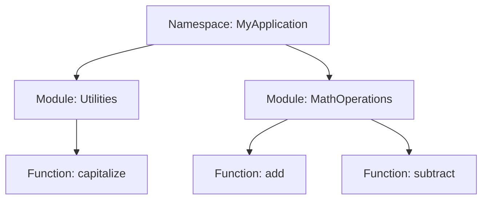

## 3.1 Modules, Namespaces, and Encapsulation

In the realm of software engineering, especially when dealing with complex systems, organizing code efficiently is paramount. F# provides powerful constructs such as modules, namespaces, and encapsulation to help developers maintain clarity and manageability in their codebases. This section delves into these constructs, illustrating their roles, benefits, and best practices.

### Understanding Modules in F#

Modules in F# are akin to containers that group together related functions, types, and values. They play a crucial role in logical structuring, allowing developers to encapsulate functionality and reduce complexity.

#### Defining and Using Modules

Modules are defined using the `module` keyword. Here's a simple example:

```fsharp
module MathOperations =

    let add x y = x + y
    let subtract x y = x - y
    let multiply x y = x * y
    let divide x y = 
        if y <> 0 then Some (x / y) else None

// Using the module
let sum = MathOperations.add 5 3
let difference = MathOperations.subtract 10 4
```

In this example, `MathOperations` is a module containing basic arithmetic operations. The module groups related functions, making the code more organized and easier to navigate.

#### Nested Modules

Modules can be nested within other modules, which is useful for further structuring code:

```fsharp
module Geometry =

    module Circle =
        let area radius = System.Math.PI * radius * radius
        let circumference radius = 2.0 * System.Math.PI * radius

    module Rectangle =
        let area length width = length * width
        let perimeter length width = 2.0 * (length + width)

// Using nested modules
let circleArea = Geometry.Circle.area 5.0
let rectanglePerimeter = Geometry.Rectangle.perimeter 5.0 10.0
```

Nested modules help in organizing code hierarchically, making it easier to manage and understand.

### The Role of Namespaces

Namespaces provide a hierarchical organization of code, especially beneficial in larger codebases where multiple modules might exist. They help avoid name collisions and clarify the context of different parts of the code.

#### Defining and Using Namespaces

Namespaces are defined using the `namespace` keyword. Unlike modules, namespaces do not contain values or functions directly; instead, they contain modules, types, and other namespaces.

```fsharp
namespace MyApplication.Utilities

module StringHelpers =
    let capitalize (s: string) = 
        if String.IsNullOrEmpty(s) then s
        else s.[0..0].ToUpper() + s.[1..].ToLower()

// Using the namespace and module
let capitalized = MyApplication.Utilities.StringHelpers.capitalize "hello"
```

In this example, `MyApplication.Utilities` is a namespace containing the `StringHelpers` module. This structure helps in organizing code logically and avoiding conflicts.

### Encapsulation: Managing Complexity and Interactions

Encapsulation is a fundamental concept in software design, aimed at managing complexity and preventing unintended interactions between different parts of a program. In F#, encapsulation is achieved through modules and access modifiers.

#### Access Modifiers in F#

F# provides several access modifiers to control the visibility of types and members within modules and namespaces:

- **`public`**: The default access level, making members accessible from anywhere.
- **`internal`**: Limits access to the current assembly.
- **`private`**: Restricts access to the containing module or type.

Here's an example demonstrating these modifiers:

```fsharp
module InternalOperations =

    let private secretFunction x = x * x

    let publicFunction x = 
        let result = secretFunction x
        printfn "The result is %d" result

// secretFunction is not accessible here
InternalOperations.publicFunction 5
```

In this example, `secretFunction` is private and cannot be accessed outside the `InternalOperations` module, ensuring that internal logic is encapsulated and protected from external interference.

### Best Practices for Structuring Modules and Namespaces

#### Naming Conventions

- **Modules**: Use PascalCase for module names, reflecting their purpose or functionality.
- **Namespaces**: Follow a hierarchical naming convention, often starting with the company or project name.

#### File Organization

- **One Module per File**: Keep each module in its own file for clarity and ease of navigation.
- **Logical Grouping**: Group related modules and namespaces in the same directory.

#### Avoiding Common Pitfalls

- **Name Collisions**: Use namespaces to prevent conflicts between modules with similar names.
- **Overly Deep Nesting**: Avoid excessive nesting of modules, which can complicate code navigation and understanding.

### Differences with Other .NET Languages

While F# modules and namespaces share similarities with those in other .NET languages, there are key differences:

- **Modules vs. Classes**: Unlike classes in C#, F# modules are not types and do not support inheritance.
- **Namespaces**: F# namespaces are purely organizational and do not contain values or functions directly.

### Applying Principles for Maintainable Codebases

By effectively using modules, namespaces, and encapsulation, developers can create clear, maintainable, and scalable codebases. These constructs help manage complexity, prevent unintended interactions, and ensure that code is organized logically.

### Try It Yourself

Experiment with the following exercises to deepen your understanding:

1. **Modify the `MathOperations` Module**: Add a function for modulus operation and test it.
2. **Create a New Namespace**: Define a new namespace for a hypothetical project and add modules for different functionalities.
3. **Experiment with Access Modifiers**: Change the access levels of functions in a module and observe the effects.

### Visualizing Modules and Namespaces

To better understand the relationships between modules and namespaces, consider the following diagram:



This diagram illustrates how namespaces and modules are organized hierarchically, with functions encapsulated within modules.

### Summary

In this section, we've explored the essential concepts of modules, namespaces, and encapsulation in F#. These constructs are vital for organizing code, managing complexity, and ensuring maintainability. By adhering to best practices and understanding the nuances of F#'s approach, developers can create robust and scalable applications.

## Quiz Time!



### What is the primary purpose of modules in F#?

- [x] To group related functions, types, and values for logical structuring.
- [ ] To provide a hierarchical organization of code.
- [ ] To control access to different parts of the code.
- [ ] To define classes and inheritance.

> **Explanation:** Modules in F# are used to group related functions, types, and values, aiding in logical structuring and organization of code.

### How do namespaces differ from modules in F#?

- [x] Namespaces provide a hierarchical organization and do not contain values or functions directly.
- [ ] Namespaces are used to group related functions, types, and values.
- [ ] Namespaces control the visibility of types and members.
- [ ] Namespaces are used to define classes and inheritance.

> **Explanation:** Namespaces in F# provide a hierarchical organization and are used to contain modules, types, and other namespaces, but they do not contain values or functions directly.

### Which access modifier in F# restricts access to the containing module or type?

- [x] private
- [ ] public
- [ ] internal
- [ ] protected

> **Explanation:** The `private` access modifier in F# restricts access to the containing module or type, ensuring encapsulation.

### What is a common pitfall to avoid when using modules and namespaces?

- [x] Overly deep nesting of modules.
- [ ] Using public access modifiers.
- [ ] Grouping related modules in the same directory.
- [ ] Using PascalCase for module names.

> **Explanation:** Overly deep nesting of modules can complicate code navigation and understanding, making it a common pitfall to avoid.

### What is the default access level for members in F#?

- [x] public
- [ ] private
- [ ] internal
- [ ] protected

> **Explanation:** The default access level for members in F# is `public`, making them accessible from anywhere.

### How can name collisions be avoided in F#?

- [x] By using namespaces.
- [ ] By using private access modifiers.
- [ ] By using nested modules.
- [ ] By using lowercase names.

> **Explanation:** Using namespaces helps avoid name collisions by providing a hierarchical organization of code.

### What is a best practice for file organization in F#?

- [x] Keep each module in its own file.
- [ ] Group all modules in a single file.
- [ ] Use lowercase names for files.
- [ ] Avoid using directories for organization.

> **Explanation:** Keeping each module in its own file is a best practice for clarity and ease of navigation in F#.

### Which of the following is NOT a characteristic of F# modules?

- [x] They support inheritance.
- [ ] They group related functions and types.
- [ ] They are not types.
- [ ] They help in logical structuring.

> **Explanation:** F# modules do not support inheritance, unlike classes in other .NET languages.

### What is the role of encapsulation in F#?

- [x] To manage complexity and prevent unintended interactions.
- [ ] To provide a hierarchical organization of code.
- [ ] To define classes and inheritance.
- [ ] To group related functions and types.

> **Explanation:** Encapsulation in F# is used to manage complexity and prevent unintended interactions between different parts of a program.

### True or False: In F#, namespaces can contain values and functions directly.

- [ ] True
- [x] False

> **Explanation:** False. In F#, namespaces do not contain values or functions directly; they contain modules, types, and other namespaces.



Remember, this is just the beginning. As you progress, you'll build more complex and interactive applications. Keep experimenting, stay curious, and enjoy the journey!
