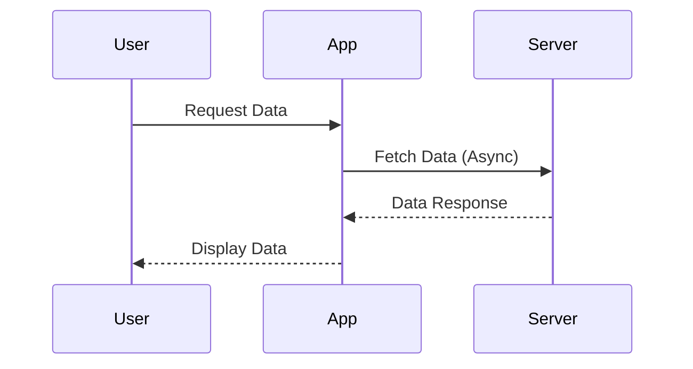

## 3.11 Asynchronous Workflows

In today's fast-paced digital landscape, building applications that are both responsive and scalable is crucial. Asynchronous programming is a key strategy in achieving these goals, allowing applications to perform non-blocking operations and efficiently manage resources. In this section, we will delve into the world of asynchronous workflows in F#, exploring how to harness the power of the `async` computation expression to build robust applications.

### Understanding Asynchronous Programming

Asynchronous programming is a paradigm that allows a program to initiate potentially time-consuming operations, such as I/O tasks, without blocking the execution of other operations. This is particularly important in scenarios where an application needs to remain responsive to user interactions while performing background tasks.

#### The Importance of Asynchronous Programming

- **Non-blocking Operations**: By performing operations asynchronously, applications can continue executing other tasks without waiting for the completion of long-running operations.
- **Improved Scalability**: Asynchronous workflows allow applications to handle more concurrent operations, making them more scalable.
- **Resource Efficiency**: Asynchronous programming can lead to better resource utilization, as threads are not tied up waiting for I/O operations to complete.

### The `async` Computation Expression in F#

F# provides a powerful abstraction for asynchronous programming through the `async` computation expression. This feature allows developers to write asynchronous code in a clear and concise manner, leveraging F#'s functional programming paradigms.

#### Basics of `async`

The `async` computation expression is a way to define asynchronous workflows. It uses several key constructs:

- **`let!`**: Awaits the result of an asynchronous operation.
- **`return`**: Returns a value from an asynchronous computation.
- **`do!`**: Executes an asynchronous operation without returning a value.

Let's look at a simple example of an asynchronous workflow in F#:

```fsharp
open System.Net

let fetchUrlAsync (url: string) = async {
    use client = new WebClient()
    let! html = client.AsyncDownloadString(Uri(url))
    return html
}
```

In this example, `fetchUrlAsync` is an asynchronous function that downloads the content of a URL. The `let!` keyword is used to await the result of the `AsyncDownloadString` method.

### Creating Asynchronous Functions

Asynchronous functions in F# are typically defined using the `async` keyword, which allows you to compose complex workflows that involve multiple asynchronous operations.

#### Example: Making Web Requests

Here's an example of how to create an asynchronous function that makes a web request:

```fsharp
let downloadPageAsync (url: string) = async {
    use client = new WebClient()
    let! content = client.AsyncDownloadString(Uri(url))
    printfn "Downloaded %d characters from %s" (content.Length) url
}
```

In this function, `AsyncDownloadString` is called to download the page content, and `let!` is used to await the result.

#### Example: Reading Files Asynchronously

Asynchronous file reading is another common use case. Here's how you can read a file asynchronously in F#:

```fsharp
open System.IO

let readFileAsync (filePath: string) = async {
    use reader = new StreamReader(filePath)
    let! content = reader.ReadToEndAsync() |> Async.AwaitTask
    return content
}
```

In this example, `ReadToEndAsync` is a .NET method that returns a `Task`, which we convert to an `Async` using `Async.AwaitTask`.

### Executing Asynchronous Workflows

Once you have defined an asynchronous workflow, you need to execute it. F# provides several ways to run asynchronous computations.

#### Using `Async.RunSynchronously`

`Async.RunSynchronously` is used to execute an asynchronous workflow and wait for its completion. This is useful in scenarios where you need to block until the result is available.

```fsharp
let result = fetchUrlAsync "http://example.com" |> Async.RunSynchronously
printfn "Fetched content: %s" result
```

#### Using `Async.Start`

`Async.Start` is used to start an asynchronous workflow without blocking the calling thread. This is useful for fire-and-forget operations.

```fsharp
downloadPageAsync "http://example.com" |> Async.Start
```

### Composing Asynchronous Operations

F# provides powerful combinators to compose multiple asynchronous operations, allowing you to manage complex workflows efficiently.

#### Using `Async.Parallel`

`Async.Parallel` allows you to run multiple asynchronous operations concurrently and wait for all of them to complete.

```fsharp
let urls = ["http://example.com"; "http://example.org"; "http://example.net"]

let downloadAllPagesAsync urls = 
    urls 
    |> List.map downloadPageAsync 
    |> Async.Parallel 
    |> Async.RunSynchronously
```

In this example, `downloadAllPagesAsync` downloads multiple pages concurrently.

#### Using `Async.Sequential`

`Async.Sequential` runs multiple asynchronous operations in sequence, waiting for each to complete before starting the next.

```fsharp
let downloadPagesSequentially urls = 
    urls 
    |> List.map downloadPageAsync 
    |> Async.Sequential 
    |> Async.RunSynchronously
```

### Exception Handling in Asynchronous Workflows

Handling exceptions in asynchronous workflows is crucial for building robust applications. F# provides mechanisms to catch and manage errors in asynchronous computations.

#### Catching Exceptions

You can use `try...with` blocks within an `async` computation to catch exceptions.

```fsharp
let safeDownloadPageAsync (url: string) = async {
    try
        let! content = downloadPageAsync url
        return Some content
    with
    | ex -> 
        printfn "Error downloading %s: %s" url ex.Message
        return None
}
```

In this example, any exceptions thrown during the download are caught, and an error message is printed.

### Interoperating with .NET's Task-Based Model

F#'s `async` workflows can interoperate with .NET's `Task`-based asynchronous model, allowing you to leverage existing .NET libraries.

#### Using `Async.AwaitTask`

`Async.AwaitTask` converts a .NET `Task` to an F# `Async`, enabling you to use `Task`-based APIs within F# workflows.

```fsharp
open System.Net.Http

let fetchWithHttpClientAsync (url: string) = async {
    use client = new HttpClient()
    let! response = client.GetStringAsync(url) |> Async.AwaitTask
    return response
}
```

#### Using `Async.StartAsTask`

`Async.StartAsTask` converts an F# `Async` to a .NET `Task`, allowing you to call F# asynchronous functions from C# or other .NET languages.

```fsharp
let task = fetchUrlAsync "http://example.com" |> Async.StartAsTask
```

### Best Practices for Cancellation Support

Supporting cancellation in asynchronous workflows is important for responsive applications. F# provides mechanisms to implement cooperative cancellation using `CancellationToken`.

#### Cooperative Cancellation

To support cancellation, you can pass a `CancellationToken` to your asynchronous workflows and periodically check for cancellation requests.

```fsharp
let cancellableDownloadAsync (url: string) (cancellationToken: CancellationToken) = async {
    use client = new WebClient()
    client.DownloadStringCompleted.Add(fun _ -> 
        if cancellationToken.IsCancellationRequested then
            printfn "Download cancelled"
    )
    let! content = client.AsyncDownloadString(Uri(url))
    return content
}
```

### Common Pitfalls in Asynchronous Programming

Asynchronous programming can introduce several challenges. Here are some common pitfalls and how to avoid them:

- **Deadlocks**: Avoid blocking calls like `Async.RunSynchronously` on the UI thread.
- **Unobserved Exceptions**: Always handle exceptions in asynchronous workflows to prevent unobserved exceptions.
- **Resource Leaks**: Ensure that resources are properly disposed of, especially in long-running asynchronous operations.

### Encouraging Asynchronous Code

Writing asynchronous code can significantly improve the responsiveness of your applications, especially in I/O-bound scenarios. By leveraging F#'s `async` workflows, you can build applications that are both efficient and scalable.

### Try It Yourself

To get hands-on experience with asynchronous workflows in F#, try modifying the examples provided:

- **Experiment with Different URLs**: Modify the `downloadPageAsync` function to download content from different URLs.
- **Add Error Handling**: Enhance the `fetchUrlAsync` function to handle network errors gracefully.
- **Implement Cancellation**: Add cancellation support to the `downloadAllPagesAsync` function using `CancellationToken`.

### Visualizing Asynchronous Workflows

To better understand the flow of asynchronous operations, let's visualize a simple workflow using Mermaid.js:



This diagram illustrates a typical asynchronous workflow where a user requests data, the application fetches it asynchronously from a server, and then displays it to the user.

### Summary

In this section, we explored the power of asynchronous workflows in F#. We covered the basics of the `async` computation expression, how to create and execute asynchronous functions, and best practices for handling exceptions and cancellations. By mastering these concepts, you can build responsive and scalable applications that efficiently manage resources and provide a seamless user experience.

## Quiz Time!



### What is the primary benefit of asynchronous programming?

- [x] Non-blocking operations
- [ ] Improved syntax
- [ ] Enhanced security
- [ ] Reduced code complexity

> **Explanation:** Asynchronous programming allows applications to perform non-blocking operations, improving responsiveness and scalability.

### Which keyword is used in F# to await the result of an asynchronous operation?

- [ ] async
- [x] let!
- [ ] do!
- [ ] return

> **Explanation:** The `let!` keyword is used in F# to await the result of an asynchronous operation within an `async` computation expression.

### How can you execute an asynchronous workflow and wait for its completion in F#?

- [ ] Async.Start
- [x] Async.RunSynchronously
- [ ] Async.Parallel
- [ ] Async.Sequential

> **Explanation:** `Async.RunSynchronously` is used to execute an asynchronous workflow and wait for its completion.

### What is the purpose of `Async.Parallel` in F#?

- [ ] To run operations sequentially
- [x] To run operations concurrently
- [ ] To handle exceptions
- [ ] To cancel operations

> **Explanation:** `Async.Parallel` is used to run multiple asynchronous operations concurrently and wait for all of them to complete.

### How can you convert a .NET Task to an F# Async?

- [ ] Async.StartAsTask
- [ ] Async.RunSynchronously
- [x] Async.AwaitTask
- [ ] Async.Parallel

> **Explanation:** `Async.AwaitTask` is used to convert a .NET Task to an F# Async, allowing you to use Task-based APIs within F# workflows.

### What is a common pitfall in asynchronous programming?

- [ ] Improved performance
- [x] Deadlocks
- [ ] Enhanced readability
- [ ] Simplified syntax

> **Explanation:** Deadlocks are a common pitfall in asynchronous programming, often caused by blocking operations on the UI thread.

### How can you support cancellation in asynchronous workflows?

- [ ] Use Async.Parallel
- [x] Use CancellationToken
- [ ] Use Async.RunSynchronously
- [ ] Use Async.StartAsTask

> **Explanation:** Supporting cancellation in asynchronous workflows can be achieved using `CancellationToken` for cooperative cancellation.

### Which F# keyword is used to execute an asynchronous operation without returning a value?

- [ ] let!
- [x] do!
- [ ] return
- [ ] async

> **Explanation:** The `do!` keyword is used in F# to execute an asynchronous operation without returning a value.

### What is the role of `Async.StartAsTask` in F#?

- [ ] To convert a Task to an Async
- [x] To convert an Async to a Task
- [ ] To run operations in parallel
- [ ] To handle exceptions

> **Explanation:** `Async.StartAsTask` is used to convert an F# Async to a .NET Task, allowing you to call F# asynchronous functions from other .NET languages.

### True or False: Asynchronous programming is only beneficial for CPU-bound operations.

- [ ] True
- [x] False

> **Explanation:** Asynchronous programming is particularly beneficial for I/O-bound operations, allowing applications to remain responsive while waiting for external resources.



Remember, mastering asynchronous workflows in F# is a journey. As you continue to explore and experiment, you'll discover new ways to enhance the responsiveness and scalability of your applications. Keep learning, stay curious, and enjoy the process!
