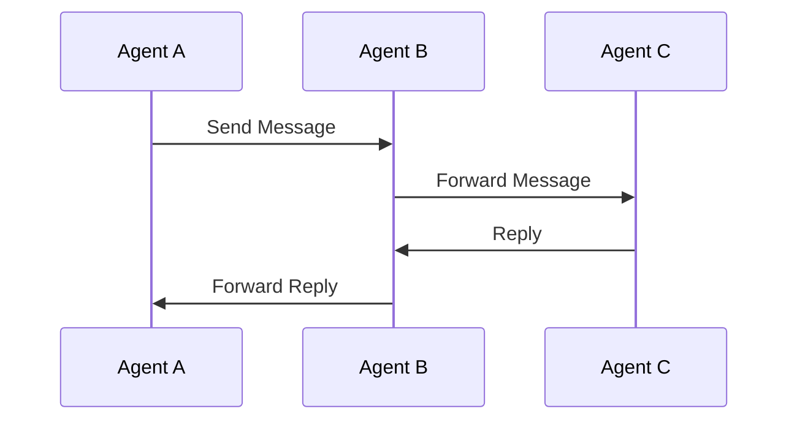

## 3.13 Agents and the Actor Model

In the realm of software development, concurrency is a fundamental challenge that developers face when building applications that need to perform multiple tasks simultaneously. As systems grow in complexity, managing concurrent operations becomes increasingly difficult. This is where the Actor Model, and specifically F#'s `MailboxProcessor`, comes into play. By leveraging these tools, we can design systems that are not only concurrent but also safe and scalable.

### Understanding Concurrency Challenges

Concurrency introduces several challenges, such as race conditions, deadlocks, and the complexity of managing shared mutable state. These issues can lead to unpredictable behavior, making it difficult to ensure the correctness and reliability of a system. Traditional concurrency models, like locks and threads, often exacerbate these problems by introducing additional layers of complexity.

The Actor Model offers a different approach by encapsulating state and behavior within actors, which communicate through message passing. This model inherently avoids shared mutable state, reducing the likelihood of race conditions and simplifying the design of concurrent systems.

### The Actor Model in F#

The Actor Model is a conceptual model that treats "actors" as the fundamental units of computation. An actor can:

- Receive messages.
- Process messages.
- Send messages to other actors.
- Create new actors.

In F#, the `MailboxProcessor` type provides a straightforward way to implement the Actor Model. It allows us to create agents that process messages asynchronously, making it easier to build concurrent applications.

### Introducing `MailboxProcessor`

`MailboxProcessor` is a core component in F# for implementing the Actor Model. It provides a message queue (mailbox) for processing messages asynchronously. Each `MailboxProcessor` runs on its own thread, allowing it to handle messages independently of other agents.

#### Creating an Agent

To create an agent using `MailboxProcessor`, we use the `MailboxProcessor.Start` method. This method initializes the agent and starts processing messages.

```fsharp
let agent = MailboxProcessor.Start(fun inbox ->
    let rec messageLoop() = async {
        let! msg = inbox.Receive()
        printfn "Received message: %s" msg
        return! messageLoop()
    }
    messageLoop()
)
```

In this example, we define an agent that continuously processes messages from its inbox. The `messageLoop` function is recursive, allowing the agent to handle messages indefinitely.

#### Message Passing

Agents communicate by sending messages to each other's mailboxes. This is done using the `Post` method.

```fsharp
agent.Post("Hello, Agent!")
```

This line sends a message to the agent we created earlier. The agent will receive the message and print it to the console.

### Designing Safe and Scalable Concurrent Systems

The Actor Model, implemented through `MailboxProcessor`, provides several advantages for designing safe and scalable systems:

- **Isolation**: Each agent has its own state and processes messages independently, reducing the risk of race conditions.
- **Scalability**: Agents can be distributed across multiple machines, allowing systems to scale horizontally.
- **Fault Tolerance**: By designing supervision hierarchies, we can manage errors and ensure system reliability.

#### Request-Response Pattern

The request-response pattern is a common communication pattern where an agent sends a request and waits for a response.

```fsharp
let requestAgent = MailboxProcessor.Start(fun inbox ->
    let rec loop() = async {
        let! (replyChannel, msg) = inbox.Receive()
        replyChannel.Reply(sprintf "Processed: %s" msg)
        return! loop()
    }
    loop()
)

let response = requestAgent.PostAndReply(fun replyChannel -> (replyChannel, "Request"))
printfn "%s" response
```

In this example, the `requestAgent` processes requests and sends responses back to the caller using a reply channel.

#### Broadcasting Pattern

Broadcasting involves sending a message to multiple agents simultaneously.

```fsharp
let broadcastAgent agents message =
    agents |> List.iter (fun agent -> agent.Post(message))

let agents = [agent1; agent2; agent3]
broadcastAgent agents "Broadcast Message"
```

This function sends a message to all agents in the list, allowing for efficient communication across multiple components.

#### Supervision Hierarchies

Supervision hierarchies allow us to manage errors by defining parent-child relationships between agents. A supervisor agent can monitor its child agents and take corrective actions if they fail.

```fsharp
let supervisor = MailboxProcessor.Start(fun inbox ->
    let rec loop() = async {
        let! msg = inbox.Receive()
        match msg with
        | "RestartChild" -> // Logic to restart child agent
        | _ -> ()
        return! loop()
    }
    loop()
)
```

In this example, the supervisor agent listens for messages and can restart child agents if necessary.

### Error Handling in Agents

Handling errors gracefully is crucial for building robust systems. Agents can handle errors by catching exceptions and taking appropriate actions.

```fsharp
let errorHandlingAgent = MailboxProcessor.Start(fun inbox ->
    let rec loop() = async {
        try
            let! msg = inbox.Receive()
            // Process message
        with
        | ex -> printfn "Error: %s" ex.Message
        return! loop()
    }
    loop()
)
```

This agent catches exceptions during message processing and logs the error, allowing the system to continue running.

### Scalability Considerations

To build scalable systems, we can create pools of agents or distribute agents across multiple machines. This allows us to handle increased loads and improve system performance.

#### Agent Pools

Agent pools involve creating multiple instances of an agent to handle messages concurrently.

```fsharp
let createAgentPool size =
    List.init size (fun _ -> MailboxProcessor.Start(fun inbox ->
        let rec loop() = async {
            let! msg = inbox.Receive()
            // Process message
            return! loop()
        }
        loop()
    ))

let agentPool = createAgentPool 10
```

This function creates a pool of 10 agents, allowing for parallel message processing.

#### Distributed Agents

Distributing agents across multiple machines can further enhance scalability. This involves setting up communication channels between agents on different nodes.

### Best Practices for Designing Agent-Based Systems

When designing systems with agents, consider the following best practices:

- **Clear Message Protocols**: Define clear and consistent message formats to ensure reliable communication.
- **Handling Backpressure**: Implement mechanisms to manage message overload and prevent system crashes.
- **Debugging Asynchronous Flows**: Use logging and monitoring tools to track message flows and identify issues.
- **Ensuring Message Ordering**: Design agents to process messages in the correct order to maintain consistency.

### Potential Complexities

Despite their advantages, agent-based systems can introduce complexities, such as debugging asynchronous message flows and ensuring message ordering. It's important to carefully design and test these systems to avoid potential pitfalls.

### Encouragement to Explore the Actor Model

The Actor Model, implemented through `MailboxProcessor`, offers a powerful paradigm for building concurrent applications. By embracing this model, we can design systems that are robust, scalable, and easy to maintain. Remember, this is just the beginning. As you progress, you'll build more complex and interactive systems. Keep experimenting, stay curious, and enjoy the journey!

### Visualizing the Actor Model

To better understand the Actor Model, let's visualize the communication between agents using a sequence diagram.



This diagram illustrates how messages are passed between agents, highlighting the flow of communication in an agent-based system.

### Try It Yourself

To deepen your understanding, try modifying the code examples provided. Experiment with different message types, error handling strategies, and scalability techniques. By doing so, you'll gain valuable insights into the power and flexibility of the Actor Model in F#.

## Quiz Time!



### What is the primary advantage of using the Actor Model for concurrency?

- [x] Avoiding shared mutable state
- [ ] Increasing code complexity
- [ ] Reducing the need for message passing
- [ ] Simplifying synchronous operations

> **Explanation:** The Actor Model avoids shared mutable state, reducing the likelihood of race conditions and simplifying concurrent system design.

### How does `MailboxProcessor` implement the Actor Model in F#?

- [x] By providing a message queue for asynchronous processing
- [ ] By using locks and threads
- [ ] By sharing state between agents
- [ ] By eliminating message passing

> **Explanation:** `MailboxProcessor` provides a message queue for asynchronous processing, allowing agents to handle messages independently.

### What method is used to send a message to an agent?

- [x] `Post`
- [ ] `Send`
- [ ] `Dispatch`
- [ ] `Transmit`

> **Explanation:** The `Post` method is used to send messages to an agent's mailbox.

### What pattern involves sending a message to multiple agents simultaneously?

- [x] Broadcasting
- [ ] Request-Response
- [ ] Supervision
- [ ] Error Handling

> **Explanation:** Broadcasting involves sending a message to multiple agents simultaneously.

### What is a key consideration when designing agent-based systems?

- [x] Clear message protocols
- [ ] Avoiding message passing
- [ ] Using shared mutable state
- [ ] Increasing code complexity

> **Explanation:** Clear message protocols ensure reliable communication between agents.

### How can agents handle errors during message processing?

- [x] By catching exceptions and logging errors
- [ ] By ignoring errors
- [ ] By using shared state
- [ ] By stopping the system

> **Explanation:** Agents can handle errors by catching exceptions and logging them, allowing the system to continue running.

### What is a benefit of creating pools of agents?

- [x] Parallel message processing
- [ ] Reducing system scalability
- [ ] Increasing message complexity
- [ ] Eliminating the need for message passing

> **Explanation:** Creating pools of agents allows for parallel message processing, improving system performance.

### What is a potential complexity of agent-based systems?

- [x] Debugging asynchronous message flows
- [ ] Simplifying synchronous operations
- [ ] Reducing code complexity
- [ ] Eliminating message ordering

> **Explanation:** Debugging asynchronous message flows can be complex in agent-based systems.

### What is the role of a supervisor agent?

- [x] To monitor and manage child agents
- [ ] To send messages to all agents
- [ ] To eliminate message passing
- [ ] To increase code complexity

> **Explanation:** A supervisor agent monitors and manages child agents, ensuring system reliability.

### The Actor Model inherently avoids shared mutable state.

- [x] True
- [ ] False

> **Explanation:** The Actor Model avoids shared mutable state, reducing the likelihood of race conditions and simplifying concurrent system design.


