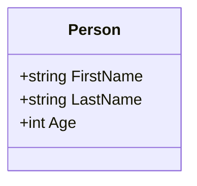
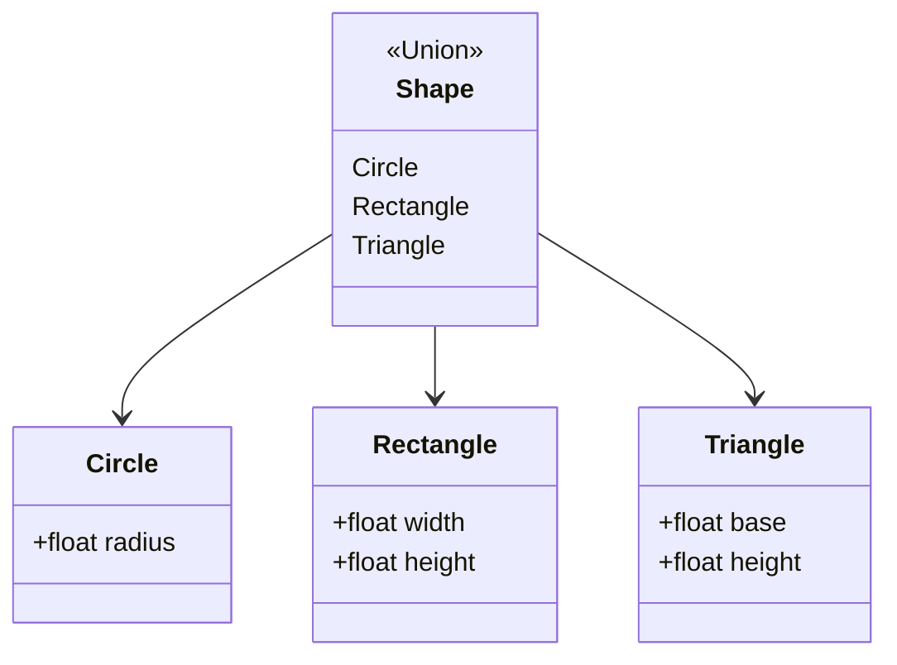

## 3.14 Records and Discriminated Unions

In the world of F#, records and discriminated unions stand as foundational pillars for data modeling. These constructs not only enhance the expressiveness and readability of your code but also align closely with functional programming paradigms, making them indispensable tools for expert software engineers and architects. In this section, we will delve into the intricacies of records and discriminated unions, exploring their syntax, usage, and the powerful patterns they enable.

### Importance of Records and Discriminated Unions

Records and discriminated unions are essential for modeling complex data structures in a declarative manner. They allow developers to define data types that are both expressive and concise, facilitating the creation of robust and maintainable systems. By leveraging these constructs, you can represent domain concepts more naturally and ensure your codebase remains adaptable to changing requirements.

### Records in F#

Records in F# are immutable by default, providing a straightforward way to define data structures with named fields. They are akin to tuples but with named fields, which enhances code readability and maintainability.

#### Defining Records

To define a record in F#, you use the `type` keyword followed by the record name and its fields enclosed in curly braces.

```fsharp
type Person = {
    FirstName: string
    LastName: string
    Age: int
}
```

This simple definition creates a `Person` type with three fields: `FirstName`, `LastName`, and `Age`.

#### Creating and Using Records

Creating an instance of a record is straightforward:

```fsharp
let johnDoe = { FirstName = "John"; LastName = "Doe"; Age = 30 }
```

Accessing fields is equally intuitive:

```fsharp
let fullName = johnDoe.FirstName + " " + johnDoe.LastName
```

#### Immutability and Copy-and-Update Expressions

Records are immutable by default, meaning once a record is created, its fields cannot be changed. However, you can create modified copies using the copy-and-update syntax.

```fsharp
let olderJohn = { johnDoe with Age = johnDoe.Age + 1 }
```

This expression creates a new `Person` record with the same `FirstName` and `LastName` but an incremented `Age`.

#### Mutable Records

While immutability is a key feature of functional programming, there are cases where mutable records are necessary. You can define mutable fields using the `mutable` keyword.

```fsharp
type MutablePerson = {
    mutable Age: int
}

let mutablePerson = { Age = 30 }
mutablePerson.Age <- 31
```

Use mutable records judiciously, as they can introduce side effects that complicate reasoning about your code.

### Discriminated Unions

Discriminated unions (DUs) are a powerful feature in F# for representing data that can take on multiple forms. They are ideal for modeling scenarios where a value can be one of several distinct cases.

#### Defining Discriminated Unions

A discriminated union is defined using the `type` keyword, followed by the union name and its cases.

```fsharp
type Shape =
    | Circle of radius: float
    | Rectangle of width: float * height: float
    | Triangle of base: float * height: float
```

This `Shape` type can represent a circle, rectangle, or triangle, each with its associated data.

#### Pattern Matching with Discriminated Unions

Pattern matching is a powerful feature that allows you to deconstruct and work with discriminated unions.

```fsharp
let describeShape shape =
    match shape with
    | Circle radius -> sprintf "Circle with radius %f" radius
    | Rectangle (width, height) -> sprintf "Rectangle with width %f and height %f" width height
    | Triangle (base, height) -> sprintf "Triangle with base %f and height %f" base height
```

This function uses pattern matching to describe a `Shape` based on its case.

#### Nested Patterns and Active Patterns

F# supports nested patterns and active patterns, which enable more complex matching scenarios.

```fsharp
let (|Even|Odd|) input =
    if input % 2 = 0 then Even else Odd

let describeNumber number =
    match number with
    | Even -> "Even number"
    | Odd -> "Odd number"
```

Active patterns allow you to define custom matching logic, enhancing the flexibility of pattern matching.

#### Single-Case Discriminated Unions

Single-case discriminated unions are a technique for adding type safety to your code. They wrap a single value in a union, providing a distinct type.

```fsharp
type EmailAddress = EmailAddress of string

let sendEmail (EmailAddress email) =
    printfn "Sending email to %s" email
```

This approach ensures that only valid email addresses are passed to functions expecting an `EmailAddress` type.

### Real-World Scenarios

Records and discriminated unions simplify complex data representations in real-world applications. Consider a financial trading system where different types of trades need to be modeled. Discriminated unions can represent various trade types, while records can capture trade details.

```fsharp
type Trade =
    | Equity of symbol: string * quantity: int
    | Forex of currencyPair: string * amount: float
    | Derivative of contract: string * expiry: DateTime

type TradeDetails = {
    Trade: Trade
    Timestamp: DateTime
    Status: string
}
```

This model allows for clear and maintainable representations of trades and their associated details.

### Serialization Considerations

When working with records and discriminated unions, serialization is an important consideration, especially for data persistence and communication between systems. F# provides libraries like `FSharp.Json` for serializing these constructs.

```fsharp
open FSharp.Json

let serializedTrade = Json.serialize { Trade = Equity("AAPL", 100); Timestamp = DateTime.Now; Status = "Open" }
let deserializedTrade = Json.deserialize<TradeDetails> serializedTrade
```

Ensure that your types are compatible with the serialization library you choose, and handle versioning and compatibility carefully.

### Benefits of F#'s Syntax

F#'s syntax for records and discriminated unions promotes readability and expressiveness. By modeling data declaratively, you can create code that closely matches domain concepts, reducing the gap between the problem space and the solution space.

### Encouraging Best Practices

As you leverage records and discriminated unions in your F# projects, focus on writing clear, maintainable, and expressive code. Use these constructs to encapsulate domain logic, enforce type safety, and simplify complex data representations.

### Try It Yourself

Experiment with the examples provided and modify them to suit your needs. Try creating your own records and discriminated unions, and explore how pattern matching can simplify your code. Consider the following challenges:

- Create a record type for a book with fields for title, author, and publication year. Use a copy-and-update expression to create a new book with an updated publication year.
- Define a discriminated union for a payment method with cases for credit card, PayPal, and bank transfer. Implement a function that processes different payment methods using pattern matching.

### Visualizing Records and Discriminated Unions

To better understand the relationships and structures of records and discriminated unions, let's visualize them using Mermaid.js diagrams.

#### Record Structure



This diagram represents the `Person` record with its fields.

#### Discriminated Union Structure



This diagram illustrates the `Shape` discriminated union and its cases.

### Knowledge Check

Before moving on, consider the following questions to test your understanding:

- What are the benefits of using records over tuples in F#?
- How do copy-and-update expressions enhance the immutability of records?
- In what scenarios would you use single-case discriminated unions?
- How can pattern matching simplify working with discriminated unions?

### Conclusion

Records and discriminated unions are powerful tools in F# for modeling data declaratively. By leveraging these constructs, you can create expressive, maintainable, and type-safe code that aligns closely with domain concepts. As you continue your journey in F#, embrace these features to simplify complex data representations and enhance the readability of your code.

## Quiz Time!



### What is a key advantage of using records over tuples in F#?

- [x] Named fields enhance code readability.
- [ ] Records are mutable by default.
- [ ] Tuples cannot be used with pattern matching.
- [ ] Records are faster to create.

> **Explanation:** Named fields in records make the code more readable and maintainable compared to tuples, which use positional access.


### How do copy-and-update expressions benefit immutable records?

- [x] They allow creating modified copies without altering the original.
- [ ] They enable direct mutation of fields.
- [ ] They automatically serialize records.
- [ ] They convert records to discriminated unions.

> **Explanation:** Copy-and-update expressions provide a way to create new records with updated fields while keeping the original record unchanged.


### Which feature of discriminated unions allows for custom matching logic?

- [ ] Copy-and-update expressions
- [x] Active patterns
- [ ] Mutable fields
- [ ] Serialization

> **Explanation:** Active patterns allow developers to define custom matching logic, enhancing the flexibility of pattern matching.


### What is a single-case discriminated union used for?

- [x] Adding type safety to a single value.
- [ ] Creating mutable data structures.
- [ ] Serializing complex data.
- [ ] Implementing inheritance.

> **Explanation:** Single-case discriminated unions wrap a single value, providing a distinct type for enhanced type safety.


### In what scenario would you use a discriminated union?

- [x] When a value can be one of several distinct cases.
- [ ] When you need mutable data.
- [ ] When you require direct field access.
- [ ] When you need to serialize data.

> **Explanation:** Discriminated unions are ideal for modeling scenarios where a value can take on multiple forms or cases.


### What is the purpose of pattern matching with discriminated unions?

- [x] To deconstruct and work with different cases.
- [ ] To serialize data structures.
- [ ] To enforce immutability.
- [ ] To create mutable records.

> **Explanation:** Pattern matching allows developers to deconstruct discriminated unions and handle each case appropriately.


### How can F#'s syntax for records and discriminated unions improve code?

- [x] By promoting readability and expressiveness.
- [ ] By enforcing mutability.
- [ ] By increasing execution speed.
- [ ] By reducing memory usage.

> **Explanation:** F#'s concise syntax for records and discriminated unions enhances readability and expressiveness, making the code more maintainable.


### What is an example of a real-world application for discriminated unions?

- [x] Modeling different types of trades in a financial system.
- [ ] Storing configuration settings.
- [ ] Implementing a logging system.
- [ ] Managing user sessions.

> **Explanation:** Discriminated unions are well-suited for representing different types of trades, each with distinct data.


### Why is serialization important for records and discriminated unions?

- [x] For data persistence and communication between systems.
- [ ] For enforcing immutability.
- [ ] For pattern matching.
- [ ] For creating mutable data structures.

> **Explanation:** Serialization is crucial for persisting data and enabling communication between systems, especially when using records and discriminated unions.


### F# records are immutable by default.

- [x] True
- [ ] False

> **Explanation:** F# records are indeed immutable by default, promoting functional programming principles and ensuring data consistency.



Remember, this is just the beginning. As you progress, you'll find more opportunities to apply records and discriminated unions in your projects. Keep experimenting, stay curious, and enjoy the journey!
