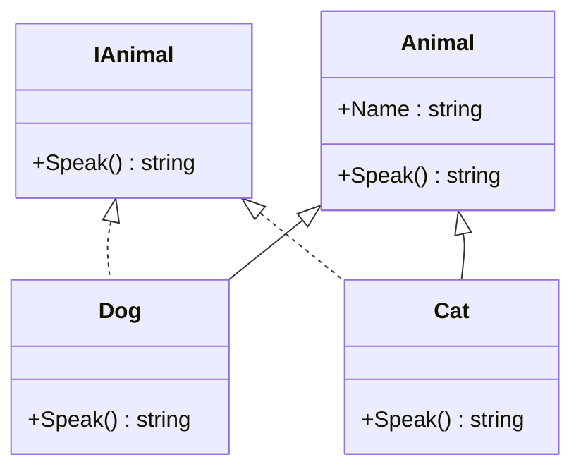

## 3.16 Object-Oriented Programming in F#

F# is primarily known as a functional programming language, but it also fully supports object-oriented programming (OOP) when needed. This duality allows developers to leverage the strengths of both paradigms, making F# a versatile choice for a wide range of applications. In this section, we will explore how F# integrates OOP concepts, including classes, interfaces, inheritance, and more, while maintaining its functional roots.

### Understanding Object-Oriented Programming in F#

Object-oriented programming is a paradigm centered around objects, which are instances of classes. These objects encapsulate data and behavior, promoting modularity and reuse. While F# emphasizes immutability and pure functions, it provides robust support for OOP, allowing developers to use classes, interfaces, and inheritance when appropriate.

#### Why Use OOP in F#?

- **Interoperability with .NET Libraries**: F# is part of the .NET ecosystem, which is heavily object-oriented. Using OOP in F# allows seamless integration with existing .NET libraries and frameworks.
- **UI Programming**: Many UI frameworks, such as WPF and WinForms, are designed with OOP in mind. F#'s OOP capabilities enable developers to work effectively with these frameworks.
- **Design Patterns**: Some design patterns, like the Singleton or Factory patterns, are naturally expressed using OOP concepts.
- **Complex Systems**: OOP can be beneficial in modeling complex systems where encapsulation and inheritance provide clear advantages.

### Defining Classes in F#

In F#, classes are defined using the `type` keyword. A class can have constructors, members, properties, and methods. Let's explore the syntax and features of F# classes.

#### Basic Class Definition

```fsharp
type Person(name: string, age: int) =
    member this.Name = name
    member this.Age = age
    member this.Introduce() =
        printfn "Hello, my name is %s and I am %d years old." this.Name this.Age
```

- **Constructors**: The parameters `(name: string, age: int)` define the primary constructor of the class.
- **Members**: `this.Name` and `this.Age` are properties that expose the constructor parameters.
- **Methods**: `Introduce` is a method that prints a greeting.

#### Secondary Constructors

F# allows secondary constructors to provide additional ways to instantiate a class.

```fsharp
type Person(name: string, age: int) =
    new() = Person("Unknown", 0) // Secondary constructor
    member this.Name = name
    member this.Age = age
    member this.Introduce() =
        printfn "Hello, my name is %s and I am %d years old." this.Name this.Age
```

### Implementing Interfaces

Interfaces define a contract that classes can implement. In F#, interfaces are defined using the `interface` keyword.

#### Defining and Implementing an Interface

```fsharp
type IAnimal =
    abstract member Speak: unit -> string

type Dog() =
    interface IAnimal with
        member this.Speak() = "Woof!"
```

- **Interface Definition**: `IAnimal` is an interface with a single method `Speak`.
- **Implementation**: `Dog` implements `IAnimal` using the `interface` keyword followed by the method implementation.

### Inheritance and Base Classes

Inheritance allows a class to inherit members from a base class. F# supports single inheritance, meaning a class can inherit from only one base class.

#### Inheriting from a Base Class

```fsharp
type Animal(name: string) =
    member this.Name = name
    abstract member Speak: unit -> string

type Cat(name: string) =
    inherit Animal(name)
    override this.Speak() = "Meow!"
```

- **Base Class**: `Animal` is a base class with an abstract method `Speak`.
- **Derived Class**: `Cat` inherits from `Animal` and overrides the `Speak` method.

### Overriding Virtual Methods

In F#, methods in a base class can be marked as `virtual`, allowing derived classes to override them.

```fsharp
type Vehicle() =
    abstract member Start: unit -> unit
    default this.Start() = printfn "Vehicle starting..."

type Car() =
    inherit Vehicle()
    override this.Start() = printfn "Car starting..."
```

- **Virtual Method**: `Start` in `Vehicle` is an abstract method with a default implementation.
- **Override**: `Car` provides its own implementation of `Start`.

### Abstract Classes

Abstract classes cannot be instantiated directly and are used to define a common interface for derived classes.

```fsharp
[<AbstractClass>]
type Shape() =
    abstract member Area: unit -> float

type Circle(radius: float) =
    inherit Shape()
    override this.Area() = System.Math.PI * radius * radius
```

- **Abstract Class**: `Shape` is an abstract class with an abstract method `Area`.
- **Concrete Class**: `Circle` inherits from `Shape` and provides an implementation for `Area`.

### Object Expressions

Object expressions are a powerful feature in F# that allow you to create anonymous implementations of interfaces or classes on the fly.

```fsharp
let myAnimal =
    { new IAnimal with
        member this.Speak() = "Roar!" }

printfn "%s" (myAnimal.Speak())
```

- **Anonymous Implementation**: `myAnimal` is an object expression implementing `IAnimal` without defining a named class.

### When to Use OOP in F#

While F# excels at functional programming, there are scenarios where OOP is beneficial:

- **Interfacing with OOP Libraries**: When working with libraries or frameworks that are designed with OOP, such as .NET libraries.
- **Stateful Applications**: In cases where managing state is necessary, such as UI applications.
- **Design Patterns**: Certain design patterns, like the Strategy or Observer patterns, are more naturally implemented using OOP.

### Combining Functional and OOP Styles

F# allows you to combine functional and OOP styles, but it's important to do so thoughtfully. Here are some guidelines:

- **Prefer Immutability**: Even when using classes, prefer immutable data structures and pure functions.
- **Encapsulation**: Use encapsulation to hide implementation details and expose only necessary interfaces.
- **Separation of Concerns**: Keep functional and OOP code separate where possible to maintain clarity and simplicity.
- **Avoid Complex Inheritance**: Overly complex inheritance hierarchies can lead to maintenance challenges.

### Potential Pitfalls

- **Over-Reliance on Mutable State**: Avoid excessive use of mutable state, which can lead to bugs and make code harder to reason about.
- **Complex Inheritance Hierarchies**: Keep inheritance hierarchies simple to avoid complications and maintain readability.
- **Mixing Paradigms Unnecessarily**: Use OOP only when it provides clear benefits, and avoid mixing paradigms without a good reason.

### Thoughtful Integration of OOP Concepts

F# provides the flexibility to use OOP concepts when they offer clear advantages. By thoughtfully integrating these concepts, you can leverage the strengths of both functional and object-oriented programming to build robust, scalable applications.

### Try It Yourself

Experiment with the code examples provided in this section. Try modifying the classes, interfaces, and methods to see how F# handles OOP concepts. Consider creating your own classes and interfaces to model real-world scenarios.

### Visualizing Object-Oriented Concepts in F#

Let's visualize the relationship between classes, interfaces, and inheritance in F# using a class diagram.



**Diagram Description**: This class diagram illustrates the relationship between the `IAnimal` interface and the `Dog` and `Cat` classes, as well as the inheritance relationship between the `Animal` base class and its derived classes.

### Knowledge Check

- **Question**: What are the benefits of using OOP in F#?
- **Exercise**: Implement a simple class hierarchy with a base class and two derived classes. Use interfaces to define common behavior.

### Conclusion

Object-oriented programming in F# provides a powerful toolset for building applications that require encapsulation, inheritance, and polymorphism. By understanding how to effectively combine functional and OOP paradigms, you can create applications that are both robust and flexible. Remember to use OOP judiciously, leveraging F#'s strengths in functional programming to maintain clarity and simplicity.

## Quiz Time!



### What is the primary purpose of using object-oriented programming in F#?

- [x] To leverage .NET interoperability and UI frameworks
- [ ] To replace functional programming entirely
- [ ] To avoid using functional paradigms
- [ ] To simplify basic arithmetic operations

> **Explanation:** Object-oriented programming in F# is primarily used to leverage .NET interoperability and UI frameworks, not to replace functional programming entirely.

### How do you define a class in F#?

- [x] Using the `type` keyword
- [ ] Using the `class` keyword
- [ ] Using the `interface` keyword
- [ ] Using the `module` keyword

> **Explanation:** In F#, classes are defined using the `type` keyword, which allows you to create types with constructors, members, and methods.

### What is an object expression in F#?

- [x] An anonymous implementation of an interface or class
- [ ] A way to define a new class
- [ ] A method of creating a singleton
- [ ] A technique for inheritance

> **Explanation:** An object expression in F# provides an anonymous implementation of an interface or class, allowing for quick and flexible object creation.

### What is the main advantage of using interfaces in F#?

- [x] To define a contract for classes to implement
- [ ] To enforce inheritance hierarchies
- [ ] To create immutable data structures
- [ ] To simplify arithmetic operations

> **Explanation:** Interfaces in F# are used to define a contract that classes can implement, ensuring that certain methods are available.

### In F#, how do you override a virtual method?

- [x] Using the `override` keyword
- [ ] Using the `virtual` keyword
- [ ] Using the `abstract` keyword
- [ ] Using the `new` keyword

> **Explanation:** The `override` keyword is used in F# to provide a new implementation for a virtual method in a derived class.

### What is a potential pitfall of using OOP in F#?

- [x] Over-reliance on mutable state
- [ ] Simplifying code readability
- [ ] Enhancing functional purity
- [ ] Improving arithmetic operations

> **Explanation:** A potential pitfall of using OOP in F# is over-reliance on mutable state, which can lead to bugs and make code harder to reason about.

### What is the benefit of using abstract classes in F#?

- [x] To define a common interface for derived classes
- [ ] To create immutable data structures
- [ ] To simplify arithmetic operations
- [ ] To enforce strict inheritance

> **Explanation:** Abstract classes in F# are used to define a common interface for derived classes, ensuring that certain methods are implemented.

### How can you maintain a clean separation between functional and OOP code in F#?

- [x] By keeping functional and OOP code separate where possible
- [ ] By mixing paradigms without a clear reason
- [ ] By using mutable state extensively
- [ ] By avoiding encapsulation

> **Explanation:** Maintaining a clean separation between functional and OOP code in F# involves keeping them separate where possible to maintain clarity and simplicity.

### What is a secondary constructor in F#?

- [x] An additional way to instantiate a class
- [ ] A method for overriding virtual methods
- [ ] A technique for implementing interfaces
- [ ] A type of object expression

> **Explanation:** A secondary constructor in F# provides an additional way to instantiate a class, offering flexibility in object creation.

### True or False: F# supports multiple inheritance.

- [ ] True
- [x] False

> **Explanation:** F# supports single inheritance, meaning a class can inherit from only one base class, unlike multiple inheritance.



Remember, this is just the beginning. As you progress, you'll build more complex and interactive applications by effectively combining functional and object-oriented paradigms in F#. Keep experimenting, stay curious, and enjoy the journey!
