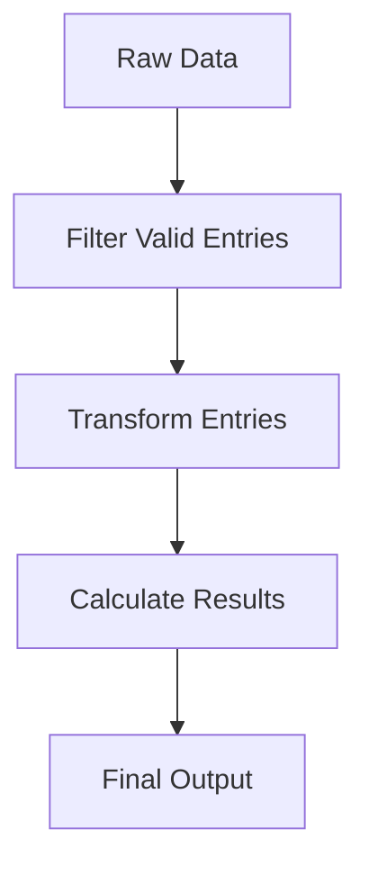

## 3.18 Writing Idiomatic F# Code

In the world of F#, writing idiomatic code is not just about following a set of rules; it's about embracing the language's functional paradigm and leveraging its unique features to produce clean, expressive, and maintainable code. This section will guide you through the conventions and styles that define idiomatic F# code, offering tips and examples to help you refine your coding style and contribute to a vibrant F# community.

### Embracing F#'s Functional Paradigm

F# is a functional-first language, which means it encourages the use of functions as the primary building blocks of your code. This paradigm shift from object-oriented programming requires a different mindset, focusing on immutability, pure functions, and expressions over statements.

#### Immutability and Pure Functions

Immutability is a cornerstone of functional programming. By avoiding mutable state, you can write code that is easier to reason about and less prone to bugs. In F#, values are immutable by default, and you should strive to maintain this immutability throughout your code.

```fsharp
let add x y = x + y  // A pure function with no side effects
```

Pure functions, which do not rely on or alter external state, are another key concept. They make your code more predictable and easier to test.

#### Expressions Over Statements

F# is an expression-oriented language, meaning that most constructs return a value. This allows you to write more concise and expressive code.

```fsharp
let result = if x > 0 then "Positive" else "Non-positive"
```

By using expressions, you can avoid unnecessary statements and focus on the flow of data through your program.

### Naming Conventions

Consistent naming conventions are crucial for readability and maintainability. In F#, the following conventions are commonly used:

- **Functions and Values**: Use lowercase with underscores or camelCase (e.g., `calculate_sum`, `processData`).
- **Types and Modules**: Use PascalCase (e.g., `Person`, `DataProcessor`).

Adhering to these conventions helps create a consistent codebase that is easy to navigate and understand.

### Leveraging F# Operators

F# provides powerful operators that enhance code readability and expressiveness. Two of the most important are the pipe (`|>`) and composition (`>>`, `<<`) operators.

#### Pipe Operator (`|>`)

The pipe operator allows you to pass the result of one function as the input to another, creating a clear and linear flow of data.

```fsharp
let processData data =
    data
    |> filterValidEntries
    |> transformEntries
    |> calculateResults
```

#### Composition Operators (`>>`, `<<`)

Composition operators enable you to combine functions into a single function, promoting modularity and reuse.

```fsharp
let processAndCalculate = transformEntries >> calculateResults
```

Using these operators can make your code more intuitive and easier to follow.

### Minimizing Type Annotations

F#'s type inference system is robust, often allowing you to omit explicit type annotations. However, there are cases where adding annotations can improve readability or clarify intent.

```fsharp
let calculateArea (radius: float) : float =
    Math.PI * radius * radius
```

Use type annotations judiciously, balancing clarity with conciseness.

### Organizing Code for Modularity

Organizing your code into small, reusable functions and modules promotes modularity and testability. Each function should have a single responsibility, making it easier to understand and test.

```fsharp
module MathOperations =
    let add x y = x + y
    let subtract x y = x - y
```

Modules help encapsulate related functionality, improving code organization and readability.

### Formatting for Readability

Consistent formatting is essential for maintaining a readable codebase. Follow these guidelines to enhance readability:

- **Indentation**: Use consistent indentation to delineate code blocks.
- **Line Breaks**: Break long lines to avoid horizontal scrolling.
- **Alignment**: Align related code elements for visual clarity.

```fsharp
let calculateTotal price quantity discount =
    let subtotal = price * quantity
    let total = subtotal - discount
    total
```

### Writing Self-Documenting Code

Self-documenting code uses meaningful names and clear abstractions to convey intent without excessive comments.

```fsharp
let calculateDiscountedPrice price discount =
    price - (price * discount)
```

While comments can be helpful, strive to write code that is understandable on its own.

### Avoiding Anti-Patterns

Certain anti-patterns can hinder the readability and maintainability of your code. Avoid these common pitfalls:

- **Overusing Exceptions**: Use exceptions for exceptional cases, not control flow.
- **Complex Functions**: Break down complex functions into smaller, more manageable pieces.

### Recommended Resources

To further refine your F# coding style, consider exploring the following resources:

- [F# Style Guide](https://docs.microsoft.com/en-us/dotnet/fsharp/style-guide/)
- [F# Community Guidelines](https://fsharp.org/guides/style-guide/)

### Continual Improvement

Writing idiomatic F# code is a journey. As you gain experience, continually refine your style and embrace the principles of functional programming. By doing so, you'll contribute to a vibrant and consistent F# community.

### Try It Yourself

Experiment with the following code example by modifying the functions or adding new ones to see how the use of idiomatic F# practices can improve code clarity and maintainability.

```fsharp
let processData data =
    data
    |> List.filter (fun x -> x > 0)
    |> List.map (fun x -> x * 2)
    |> List.sum

let result = processData [1; -2; 3; 4]
printfn "The result is %d" result
```

Try adding a function to calculate the average of the processed data or modify the filtering criteria to see how the code adapts.

### Visualizing F# Code Flow

To better understand the flow of data in F# code, consider the following diagram illustrating the use of the pipe operator:



This flowchart represents the linear progression of data through a series of transformations, highlighting the clarity and simplicity of using the pipe operator.

### Knowledge Check

To reinforce your understanding of idiomatic F# code, consider the following questions:

1. What are the benefits of using pure functions in F#?
2. How does the pipe operator enhance code readability?
3. Why is immutability important in functional programming?
4. What are some common naming conventions in F#?
5. How can you organize code to promote modularity and testability?

### Embrace the Journey

Remember, writing idiomatic F# code is just the beginning. As you progress, you'll build more complex and interactive applications. Keep experimenting, stay curious, and enjoy the journey!

## Quiz Time!



### What is a key benefit of using pure functions in F#?

- [x] They make code more predictable and easier to test.
- [ ] They allow for mutable state.
- [ ] They require more complex syntax.
- [ ] They improve performance by using side effects.

> **Explanation:** Pure functions do not rely on or alter external state, making them predictable and easier to test.

### Which operator in F# is used to pass the result of one function to another?

- [x] Pipe (`|>`)
- [ ] Composition (`>>`)
- [ ] Concatenation (`++`)
- [ ] Assignment (`=`)

> **Explanation:** The pipe operator (`|>`) is used to pass the result of one function as the input to another, creating a clear and linear flow of data.

### Why is immutability important in functional programming?

- [x] It helps prevent bugs by avoiding mutable state.
- [ ] It allows for more complex data structures.
- [ ] It requires less memory.
- [ ] It is necessary for object-oriented programming.

> **Explanation:** Immutability helps prevent bugs by avoiding mutable state, making code easier to reason about.

### What naming convention is typically used for types and modules in F#?

- [x] PascalCase
- [ ] camelCase
- [ ] snake_case
- [ ] kebab-case

> **Explanation:** Types and modules in F# typically use PascalCase for consistency and readability.

### How can you organize code to promote modularity and testability?

- [x] By organizing code into small, reusable functions and modules.
- [ ] By using global variables extensively.
- [ ] By writing long, complex functions.
- [ ] By avoiding the use of functions.

> **Explanation:** Organizing code into small, reusable functions and modules promotes modularity and testability.

### What is the purpose of the composition operators (`>>`, `<<`) in F#?

- [x] To combine functions into a single function.
- [ ] To concatenate strings.
- [ ] To assign values to variables.
- [ ] To create loops.

> **Explanation:** Composition operators (`>>`, `<<`) are used to combine functions into a single function, promoting modularity and reuse.

### What should you avoid when writing idiomatic F# code?

- [x] Overusing exceptions for control flow.
- [ ] Using pure functions.
- [ ] Leveraging immutability.
- [ ] Writing self-documenting code.

> **Explanation:** Overusing exceptions for control flow is an anti-pattern and should be avoided in idiomatic F# code.

### What is a key feature of self-documenting code?

- [x] It uses meaningful names and clear abstractions.
- [ ] It relies heavily on comments.
- [ ] It uses complex syntax.
- [ ] It is difficult to read.

> **Explanation:** Self-documenting code uses meaningful names and clear abstractions to convey intent without excessive comments.

### Why is it beneficial to minimize explicit type annotations in F#?

- [x] F#'s type inference system is robust, often allowing you to omit them.
- [ ] It makes the code harder to read.
- [ ] It is required for all functions.
- [ ] It improves performance.

> **Explanation:** F#'s type inference system is robust, often allowing you to omit explicit type annotations, making the code cleaner and more concise.

### True or False: The pipe operator (`|>`) is used to concatenate strings in F#.

- [ ] True
- [x] False

> **Explanation:** The pipe operator (`|>`) is not used for string concatenation; it is used to pass the result of one function as the input to another.


