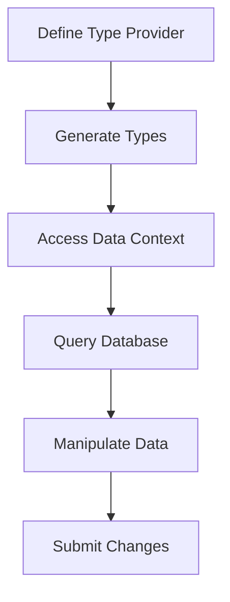

## 3.2 Type Providers

In the realm of F# programming, type providers stand out as a groundbreaking feature that significantly enhances the way developers interact with external data sources. By offering type-safe access and reducing boilerplate code, type providers streamline data integration tasks, making them indispensable for modern software engineers and architects. In this section, we will delve into the concept of type providers, explore their benefits, and demonstrate their practical application through comprehensive examples.

### Understanding Type Providers

Type providers are a unique feature of F# that enable developers to access external data sources in a type-safe manner. They act as bridges between F# code and data sources such as databases, web services, and file formats. By generating types and methods at compile-time, type providers allow developers to interact with data as if it were native to the language, providing IntelliSense support and compile-time error checking.

#### Key Benefits of Type Providers

1. **Type Safety**: Type providers ensure that data access is type-safe, reducing runtime errors and increasing code reliability.
2. **Reduced Boilerplate Code**: By automatically generating types and methods, type providers eliminate the need for repetitive code, enhancing productivity.
3. **Compile-Time Error Checking**: Errors are caught at compile-time, providing immediate feedback and reducing debugging time.
4. **IntelliSense Support**: Developers benefit from IntelliSense, which offers code completion and documentation, making it easier to work with complex data structures.

### Built-in Type Providers in F#

F# comes with several built-in type providers that cater to common data access needs. Let's explore some of these type providers and their applications.

#### SQL Type Provider

The SQL type provider allows F# developers to interact with SQL databases seamlessly. It generates types based on the database schema, enabling type-safe queries and operations.

```fsharp
#r "nuget: FSharp.Data.SqlClient"

open FSharp.Data.Sql

// Define the connection string
let connectionString = "Data Source=.;Initial Catalog=MyDatabase;Integrated Security=True"

// Create a type provider for SQL
type Sql = SqlDataProvider<ConnectionString = connectionString, DatabaseVendor = Common.DatabaseProviderTypes.MSSQLSERVER>

// Access the database context
let ctx = Sql.GetDataContext()

// Query the database
let customers = 
    query {
        for customer in ctx.Dbo.Customers do
        select customer
    } |> Seq.toList

// Print customer names
customers |> List.iter (fun c -> printfn "Customer: %s" c.Name)
```

In this example, the SQL type provider generates types based on the `Customers` table, allowing us to perform type-safe queries and access customer data with IntelliSense support.

#### REST API Type Provider

The REST API type provider simplifies interaction with RESTful web services by generating types from JSON or XML responses.

```fsharp
#r "nuget: FSharp.Data"

open FSharp.Data

// Define the type provider for a REST API
type Weather = JsonProvider<"https://api.weatherapi.com/v1/current.json?key=YOUR_API_KEY&q=London">

// Fetch weather data
let weather = Weather.Load("https://api.weatherapi.com/v1/current.json?key=YOUR_API_KEY&q=London")

// Print temperature
printfn "Temperature in London: %f" weather.Current.TempC
```

Here, the JSON type provider generates types based on the JSON structure of the weather API response, enabling us to access weather data with type safety and IntelliSense.

#### CSV Type Provider

The CSV type provider allows developers to work with CSV files as strongly-typed data, making it easy to process and analyze tabular data.

```fsharp
#r "nuget: FSharp.Data"

open FSharp.Data

// Define the type provider for a CSV file
type SalesData = CsvProvider<"sales_data.csv">

// Load the CSV file
let sales = SalesData.Load("sales_data.csv")

// Print sales records
for record in sales.Rows do
    printfn "Product: %s, Quantity: %d" record.Product record.Quantity
```

In this example, the CSV type provider reads the `sales_data.csv` file and generates types based on the file's structure, allowing us to access and manipulate sales records with ease.

### Setting Up and Using a Type Provider

Let's walk through the process of setting up and using a type provider in an F# project. We'll use the SQL type provider as an example.

#### Step 1: Install the Required Package

First, ensure that you have the necessary package installed. For the SQL type provider, you can use the `FSharp.Data.SqlClient` package.

```shell
dotnet add package FSharp.Data.SqlClient
```

#### Step 2: Reference the Package in Your Code

Add a reference to the package in your F# script or project file.

```fsharp
#r "nuget: FSharp.Data.SqlClient"
```

#### Step 3: Define the Type Provider

Define the type provider by specifying the connection string and other parameters.

```fsharp
type Sql = SqlDataProvider<ConnectionString = connectionString, DatabaseVendor = Common.DatabaseProviderTypes.MSSQLSERVER>
```

#### Step 4: Access the Data Context

Create an instance of the data context to interact with the database.

```fsharp
let ctx = Sql.GetDataContext()
```

#### Step 5: Query and Manipulate Data

Use the generated types and methods to query and manipulate data.

```fsharp
let customers = 
    query {
        for customer in ctx.Dbo.Customers do
        select customer
    } |> Seq.toList
```

### Consuming Data from a Type Provider

Once you have set up a type provider, consuming data becomes straightforward. You can query, filter, and manipulate data using the generated types and methods.

#### Querying Data

Use LINQ-like queries to retrieve data from the data source.

```fsharp
let highValueCustomers = 
    query {
        for customer in ctx.Dbo.Customers do
        where (customer.TotalPurchases > 1000.0)
        select customer
    } |> Seq.toList
```

#### Manipulating Data

You can also perform data manipulation operations such as inserts, updates, and deletes.

```fsharp
// Insert a new customer
let newCustomer = ctx.Dbo.Customers.Create()
newCustomer.Name <- "John Doe"
newCustomer.TotalPurchases <- 500.0
ctx.SubmitUpdates()

// Update an existing customer
let customerToUpdate = ctx.Dbo.Customers |> Seq.find (fun c -> c.Name = "John Doe")
customerToUpdate.TotalPurchases <- 1500.0
ctx.SubmitUpdates()

// Delete a customer
let customerToDelete = ctx.Dbo.Customers |> Seq.find (fun c -> c.Name = "John Doe")
ctx.Dbo.Customers.DeleteOnSubmit(customerToDelete)
ctx.SubmitUpdates()
```

### Enhancing Productivity with Type Providers

Type providers significantly enhance developer productivity by providing features such as IntelliSense support and immediate feedback. This allows developers to focus on business logic rather than data access boilerplate.

#### IntelliSense Support

With type providers, IntelliSense offers code completion and documentation, making it easier to work with complex data structures.

#### Immediate Feedback

Compile-time error checking provides immediate feedback, allowing developers to catch errors early in the development process.

### Scenarios for Type Providers

Type providers are particularly beneficial in scenarios such as rapid prototyping, working with dynamic data sources, and integrating with external systems.

#### Rapid Prototyping

Type providers enable quick access to data sources, making them ideal for prototyping and experimentation.

#### Dynamic Data Sources

When working with dynamic data sources such as REST APIs, type providers offer a flexible and type-safe way to access and manipulate data.

#### Integration with External Systems

Type providers simplify integration with external systems by providing a consistent and type-safe interface for data access.

### Community-Contributed Type Providers

In addition to built-in type providers, the F# community has contributed numerous type providers for various data sources. These can be found on platforms such as GitHub and NuGet.

#### Finding Community Type Providers

Explore community-contributed type providers on platforms like GitHub and NuGet to find solutions for specific data access needs.

#### Incorporating Community Type Providers

Incorporate community type providers into your projects by following the documentation and installation instructions provided by the contributors.

### Potential Limitations and Considerations

While type providers offer numerous benefits, there are potential limitations and considerations to keep in mind.

#### Performance Implications

Type providers may introduce performance overhead, especially when working with large data sets or complex queries. It's important to profile and optimize your code as needed.

#### Security Concerns

When accessing external data sources, consider security implications such as data privacy and access control. Ensure that sensitive data is handled securely.

### Encouraging Experimentation

We encourage you to experiment with type providers to simplify data access and integration tasks. By leveraging type providers, you can enhance productivity, reduce errors, and streamline your development workflow.

### Try It Yourself

To get hands-on experience with type providers, try modifying the code examples provided in this section. Experiment with different data sources, queries, and manipulations to see how type providers can simplify your data access tasks.

## Visualizing Type Providers

To better understand how type providers work, let's visualize the process of accessing a SQL database using a type provider.



**Figure 1**: Visualizing the process of using a SQL type provider to access and manipulate data.

## Quiz Time!



### What is the primary benefit of using type providers in F#?

- [x] Type-safe access to external data sources
- [ ] Faster runtime performance
- [ ] Easier debugging of runtime errors
- [ ] Simplified user interface design

> **Explanation:** Type providers offer type-safe access to external data sources, reducing runtime errors and enhancing code reliability.

### Which of the following is a built-in type provider in F#?

- [x] SQL Type Provider
- [ ] GraphQL Type Provider
- [ ] SOAP Type Provider
- [ ] CSV Type Provider

> **Explanation:** The SQL Type Provider is a built-in type provider in F# that allows interaction with SQL databases.

### How do type providers enhance developer productivity?

- [x] By reducing boilerplate code and providing IntelliSense support
- [ ] By increasing the speed of data processing
- [ ] By simplifying the user interface design
- [ ] By improving the aesthetics of the code

> **Explanation:** Type providers reduce boilerplate code and provide IntelliSense support, making it easier to work with complex data structures.

### What is a potential limitation of using type providers?

- [x] Performance overhead
- [ ] Lack of type safety
- [ ] Increased runtime errors
- [ ] Difficulty in debugging

> **Explanation:** Type providers may introduce performance overhead, especially when working with large data sets or complex queries.

### Which scenario is particularly suitable for using type providers?

- [x] Rapid prototyping
- [ ] User interface design
- [ ] Graphics rendering
- [ ] Audio processing

> **Explanation:** Type providers are ideal for rapid prototyping as they enable quick access to data sources.

### What is the role of IntelliSense in type providers?

- [x] To offer code completion and documentation
- [ ] To improve runtime performance
- [ ] To simplify the user interface
- [ ] To enhance graphics rendering

> **Explanation:** IntelliSense provides code completion and documentation, making it easier to work with complex data structures.

### How can community-contributed type providers be found?

- [x] On platforms like GitHub and NuGet
- [ ] In the F# standard library
- [ ] Through the Visual Studio Marketplace
- [ ] In the Windows Store

> **Explanation:** Community-contributed type providers can be found on platforms like GitHub and NuGet.

### What is a key consideration when using type providers with external data sources?

- [x] Security implications
- [ ] User interface design
- [ ] Graphics performance
- [ ] Audio quality

> **Explanation:** Security implications such as data privacy and access control are important considerations when using type providers with external data sources.

### True or False: Type providers eliminate the need for all runtime error handling.

- [ ] True
- [x] False

> **Explanation:** While type providers reduce runtime errors by providing type-safe access, they do not eliminate the need for all runtime error handling.

### What is the first step in setting up a type provider in an F# project?

- [x] Install the required package
- [ ] Define the data context
- [ ] Query the database
- [ ] Manipulate the data

> **Explanation:** The first step in setting up a type provider is to install the required package.



Remember, this is just the beginning. As you progress, you'll build more complex and interactive applications with F#. Keep experimenting, stay curious, and enjoy the journey!
