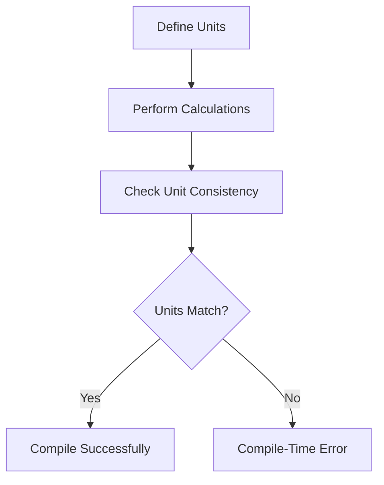

## 3.3 Units of Measure

In the world of software engineering, especially in domains like scientific computing, engineering simulations, and finance, ensuring the correctness of numerical computations is paramount. F# provides a powerful feature called **Units of Measure** that enhances type safety by attaching physical units to numeric types. This feature helps prevent the mixing of incompatible units and catches potential errors at compile-time, thus reducing runtime errors and increasing the reliability of your applications.

### Understanding Units of Measure in F#

Units of Measure in F# are a way to associate physical units (such as meters, seconds, or kilograms) with numeric types. This association allows the compiler to enforce unit correctness, ensuring that operations involving these units are dimensionally consistent. For example, adding meters to seconds would result in a compile-time error, preventing logical mistakes that could lead to incorrect results.

#### Purpose and Benefits

- **Type Safety**: Units of Measure add an extra layer of type safety by ensuring that only compatible units are used together in calculations.
- **Error Prevention**: By catching unit mismatches at compile-time, you can prevent costly errors that might otherwise only be discovered during testing or production.
- **Code Clarity**: Attaching units to numbers makes the code more readable and self-documenting, as it clearly indicates the expected dimensions of the values.

### Defining Custom Units of Measure

In F#, you can define custom units of measure using the `[<Measure>]` attribute. This attribute is applied to a type declaration, and it allows you to create new units that can be used in your calculations.

```fsharp
// Define custom units of measure
[<Measure>] type m // meters
[<Measure>] type s // seconds
[<Measure>] type kg // kilograms

// Use units in variable declarations
let distance = 100.0<m> // 100 meters
let time = 9.58<s> // 9.58 seconds
let mass = 75.0<kg> // 75 kilograms
```

In this example, we've defined three units: meters (`m`), seconds (`s`), and kilograms (`kg`). We then use these units to annotate numeric literals, creating values with specific units.

### Performing Calculations with Units

Once you've defined units, you can perform various calculations, such as multiplication, division, and exponentiation, while maintaining unit correctness.

#### Multiplication and Division

```fsharp
// Calculate speed as distance divided by time
let speed = distance / time // Resulting unit: m/s

// Calculate force using mass and acceleration
let acceleration = 9.81<m/s^2> // Acceleration due to gravity
let force = mass * acceleration // Resulting unit: kg m/s^2
```

In the above code, dividing distance by time yields a speed with units of meters per second (`m/s`). Similarly, multiplying mass by acceleration results in a force with units of kilograms meters per second squared (`kg m/s^2`).

#### Exponentiation

Units of Measure also support exponentiation, allowing you to express derived units.

```fsharp
// Calculate area as distance squared
let area = distance * distance // Resulting unit: m^2

// Calculate volume as distance cubed
let volume = distance * distance * distance // Resulting unit: m^3
```

### Compile-Time Unit Enforcement

One of the key advantages of using Units of Measure in F# is that the compiler enforces unit correctness. This means that any attempt to perform operations with incompatible units will result in a compile-time error.

```fsharp
// Attempting to add distance and time results in a compile-time error
let invalidOperation = distance + time // Error: Units of measure 'm' and 's' do not match
```

This compile-time checking ensures that you catch errors early in the development process, reducing the likelihood of bugs related to unit mismatches.

### Real-World Applications

Units of Measure are particularly useful in fields where precise calculations are critical. Here are a few examples:

- **Engineering Simulations**: Ensure that calculations involving physical quantities like force, pressure, and energy are dimensionally consistent.
- **Scientific Computing**: Perform accurate calculations in physics, chemistry, and biology by enforcing unit correctness.
- **Finance**: Use units to represent currencies and interest rates, preventing errors in financial calculations.

### Handling Unit Conversions and Derived Units

In many cases, you may need to convert between different units or work with derived units. F# allows you to define conversion functions and derived units to handle these scenarios.

#### Unit Conversions

To convert between units, you can define conversion functions that take advantage of F#'s type system.

```fsharp
// Define a conversion function from meters to kilometers
let metersToKilometers (distance: float<m>) : float<km> =
    distance / 1000.0<km/m>

// Convert 1000 meters to kilometers
let distanceInKilometers = metersToKilometers 1000.0<m>
```

In this example, we define a function `metersToKilometers` that converts a distance in meters to kilometers. The function uses the conversion factor of 1000 meters per kilometer to perform the conversion.

#### Derived Units

You can also define derived units by combining existing units.

```fsharp
// Define a derived unit for velocity
[<Measure>] type km // kilometers
[<Measure>] type h // hours

let velocity = 60.0<km/h> // 60 kilometers per hour
```

Here, we define a derived unit for velocity in kilometers per hour (`km/h`). This allows us to express speeds in a more familiar unit for certain applications.

### Limitations and Considerations

While Units of Measure provide significant benefits, there are some limitations to be aware of:

- **Limited Numeric Types**: Units of Measure are not supported for all numeric types in F#. For example, the `decimal` type does not support units.
- **Complexity**: In some cases, the additional complexity of managing units may outweigh the benefits, especially for simple calculations.
- **Interoperability**: When interfacing with other languages or libraries that do not support units, you may need to strip units from values.

### Encouragement to Use Units of Measure

Despite these limitations, Units of Measure are a powerful tool for writing safer numerical code. By leveraging this feature, you can prevent costly errors, improve code readability, and ensure the correctness of your calculations. We encourage you to explore the use of Units of Measure in your projects and experience the benefits firsthand.

### Try It Yourself

To get a feel for how Units of Measure work in F#, try modifying the code examples provided. Experiment with defining your own units, performing calculations, and observing how the compiler enforces unit correctness. This hands-on approach will deepen your understanding and help you apply these concepts to your own projects.

```fsharp
// Define your own units and perform calculations
[<Measure>] type ft // feet
[<Measure>] type min // minutes

let height = 30.0<ft> // 30 feet
let duration = 5.0<min> // 5 minutes

// Try performing an invalid operation and observe the compiler error
// let invalidOperation = height + duration // Uncomment to see the error
```

### Visualizing Units of Measure

To better understand the relationships between units and their operations, let's visualize a simple flowchart that demonstrates how units interact during calculations.



This flowchart illustrates the process of defining units, performing calculations, checking unit consistency, and the resulting outcomes based on whether the units match.

### Quiz Time!



### What is the primary benefit of using Units of Measure in F#?

- [x] Enhancing type safety by preventing unit mismatches
- [ ] Improving runtime performance
- [ ] Simplifying code syntax
- [ ] Reducing memory usage

> **Explanation:** Units of Measure enhance type safety by ensuring that only compatible units are used together, preventing unit mismatches.

### How do you define a custom unit of measure in F#?

- [x] Using the `[<Measure>]` attribute
- [ ] Using the `unit` keyword
- [ ] Using the `type` keyword
- [ ] Using the `measure` keyword

> **Explanation:** Custom units of measure are defined using the `[<Measure>]` attribute in F#.

### What happens if you try to add two values with incompatible units in F#?

- [x] A compile-time error occurs
- [ ] A runtime error occurs
- [ ] The values are automatically converted
- [ ] The operation is ignored

> **Explanation:** F# enforces unit correctness at compile-time, resulting in a compile-time error if incompatible units are used together.

### Which of the following is a limitation of Units of Measure in F#?

- [x] Not supported for all numeric types
- [ ] Cannot be used in scientific computing
- [ ] Increases runtime complexity
- [ ] Requires external libraries

> **Explanation:** Units of Measure are not supported for all numeric types, such as `decimal`.

### How can you perform unit conversions in F#?

- [x] By defining conversion functions
- [ ] By using the `convert` keyword
- [ ] By using the `cast` operator
- [ ] By using the `unit` keyword

> **Explanation:** Unit conversions can be performed by defining conversion functions that take advantage of F#'s type system.

### What is the result of dividing a distance in meters by a time in seconds?

- [x] A speed with units of meters per second (m/s)
- [ ] A speed with units of seconds per meter (s/m)
- [ ] A distance with units of meters (m)
- [ ] A time with units of seconds (s)

> **Explanation:** Dividing distance by time results in a speed with units of meters per second (m/s).

### Which of the following is a real-world application of Units of Measure?

- [x] Engineering simulations
- [ ] String manipulation
- [ ] File I/O operations
- [ ] User interface design

> **Explanation:** Units of Measure are particularly useful in fields like engineering simulations, where precise calculations are critical.

### What is a derived unit in F#?

- [x] A unit created by combining existing units
- [ ] A unit defined using the `derive` keyword
- [ ] A unit that cannot be used in calculations
- [ ] A unit that is automatically generated

> **Explanation:** A derived unit is created by combining existing units, such as velocity in kilometers per hour (km/h).

### How does F# enforce unit correctness?

- [x] By checking units at compile-time
- [ ] By checking units at runtime
- [ ] By using external validation libraries
- [ ] By ignoring unit mismatches

> **Explanation:** F# enforces unit correctness by checking units at compile-time, preventing unit mismatches.

### True or False: Units of Measure can be used with the `decimal` type in F#.

- [ ] True
- [x] False

> **Explanation:** Units of Measure are not supported for the `decimal` type in F#.



Remember, this is just the beginning of your journey with Units of Measure in F#. As you progress, you'll discover more ways to leverage this feature to write safer, more reliable code. Keep experimenting, stay curious, and enjoy the journey!
