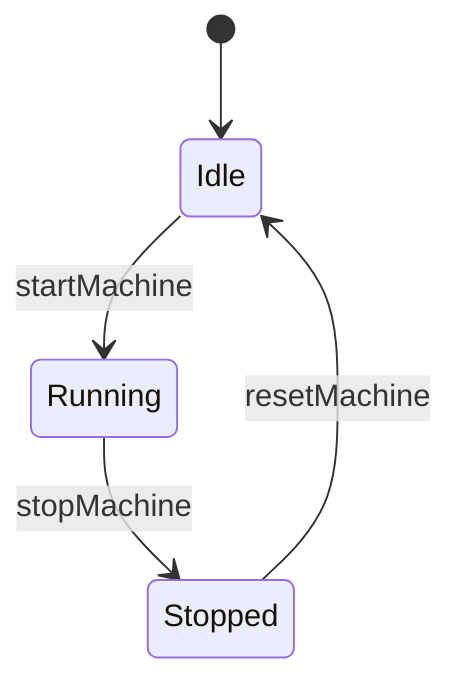

## 3.4 Advanced Type-Level Programming

In the realm of F# programming, type-level programming is a powerful technique that allows developers to enforce compile-time guarantees, ensuring that certain errors are caught before the code is even run. This section delves into advanced type-level programming concepts, focusing on phantom types and generic constraints. These tools enable developers to encode more information in the type system, enhancing type safety and reducing runtime errors.

### Introduction to Type-Level Programming

Type-level programming involves using the type system to enforce constraints and invariants in your code. By leveraging the type system, you can catch errors at compile time, leading to more robust and reliable software. This approach is particularly beneficial in functional programming languages like F#, where types play a crucial role in defining program behavior.

### Phantom Types: Adding Type Safety Without Runtime Overhead

Phantom types are a fascinating concept in type-level programming. They allow you to add additional type information to your code without affecting the runtime representation of your data. This means you can use phantom types to enforce constraints and invariants at compile time, without incurring any runtime cost.

#### What Are Phantom Types?

Phantom types are types that have type parameters that do not appear in the runtime representation of the type. These type parameters are used solely for compile-time checks and do not affect the actual data structure. This allows you to encode additional information in your types, enabling more precise type checking.

#### Example: Representing States with Phantom Types

Consider a scenario where you have a system with different states, such as authenticated and unauthenticated states. You can use phantom types to represent these states, ensuring that certain operations are only performed in the appropriate state.

```fsharp
// Define the phantom types for states
type Authenticated
type Unauthenticated

// Define a user type with a phantom type parameter
type User<'State> = { Name: string }

// Function to authenticate a user
let authenticate (user: User<Unauthenticated>) : User<Authenticated> =
    // Perform authentication logic here
    { Name = user.Name }

// Function to perform an action that requires authentication
let performSecureAction (user: User<Authenticated>) =
    printfn "Performing secure action for %s" user.Name

// Usage example
let unauthenticatedUser = { Name = "Alice" }
let authenticatedUser = authenticate unauthenticatedUser
performSecureAction authenticatedUser
```

In this example, the `User` type has a phantom type parameter that indicates the user's state. The `authenticate` function transitions a user from the `Unauthenticated` state to the `Authenticated` state, and the `performSecureAction` function can only be called with an authenticated user. This ensures that secure actions are only performed on authenticated users, and this constraint is enforced at compile time.

#### Preventing Invalid Operations with Phantom Types

Phantom types can also be used to prevent invalid operations by encoding constraints into the type system. For example, you can use phantom types to ensure that certain operations are only performed on valid data.

```fsharp
// Define phantom types for valid and invalid data
type Valid
type Invalid

// Define a data type with a phantom type parameter
type Data<'State> = { Value: int }

// Function to validate data
let validateData (data: Data<Invalid>) : Data<Valid> =
    // Perform validation logic here
    { Value = data.Value }

// Function to process valid data
let processData (data: Data<Valid>) =
    printfn "Processing data with value %d" data.Value

// Usage example
let invalidData = { Value = 42 }
let validData = validateData invalidData
processData validData
```

In this example, the `Data` type has a phantom type parameter that indicates whether the data is valid or invalid. The `validateData` function transitions data from the `Invalid` state to the `Valid` state, and the `processData` function can only be called with valid data. This ensures that only validated data is processed, and this constraint is enforced at compile time.

### Generic Constraints: Limiting Types for Greater Control

Generic constraints in F# allow you to limit the types that can be used with generic functions or types. By specifying constraints, you can ensure that only types that meet certain criteria are allowed, providing greater control over your code.

#### What Are Generic Constraints?

Generic constraints are conditions that you can apply to generic type parameters, specifying the requirements that a type must meet to be used with a generic function or type. These constraints can include requiring a type to implement an interface, inherit from a class, or have a specific member.

#### Applying Generic Constraints

Let's explore how to apply generic constraints in F#.

##### Requiring an Interface

You can use generic constraints to require that a type implements a specific interface. This ensures that the type has certain methods or properties available.

```fsharp
// Define an interface
type IPrintable =
    abstract member Print: unit -> unit

// Define a function with a generic constraint
let printItem<'T when 'T :> IPrintable> (item: 'T) =
    item.Print()

// Define a type that implements the interface
type Document() =
    interface IPrintable with
        member this.Print() = printfn "Printing document"

// Usage example
let doc = Document()
printItem doc
```

In this example, the `printItem` function has a generic constraint that requires the type `'T` to implement the `IPrintable` interface. This ensures that the `Print` method is available on the `item` parameter.

##### Inheriting from a Class

You can also use generic constraints to require that a type inherits from a specific class. This ensures that the type has access to the members of the base class.

```fsharp
// Define a base class
type BaseClass() =
    member this.BaseMethod() = printfn "Base method"

// Define a function with a generic constraint
let callBaseMethod<'T when 'T :> BaseClass> (item: 'T) =
    item.BaseMethod()

// Define a derived class
type DerivedClass() =
    inherit BaseClass()

// Usage example
let derived = DerivedClass()
callBaseMethod derived
```

In this example, the `callBaseMethod` function has a generic constraint that requires the type `'T` to inherit from the `BaseClass`. This ensures that the `BaseMethod` is available on the `item` parameter.

### Type-Safe Builders and State Machines with Phantom Types

Phantom types can be used to implement type-safe builders and state machines, ensuring that operations are performed in the correct order and state transitions are valid.

#### Type-Safe Builders

A type-safe builder is a design pattern that uses phantom types to enforce the correct sequence of method calls when constructing an object. This ensures that all required steps are performed before the object is created.

```fsharp
// Define phantom types for builder states
type Start
type Part1
type Part2
type Complete

// Define a builder type with phantom type parameters
type Builder<'State> = { Parts: string list }

// Define builder methods with state transitions
let startBuilder () : Builder<Start> =
    { Parts = [] }

let addPart1 (builder: Builder<Start>) : Builder<Part1> =
    { Parts = "Part1" :: builder.Parts }

let addPart2 (builder: Builder<Part1>) : Builder<Part2> =
    { Parts = "Part2" :: builder.Parts }

let completeBuilder (builder: Builder<Part2>) : Builder<Complete> =
    { Parts = "Complete" :: builder.Parts }

// Usage example
let builder = startBuilder()
let builderWithPart1 = addPart1 builder
let builderWithPart2 = addPart2 builderWithPart1
let complete = completeBuilder builderWithPart2
```

In this example, the `Builder` type has phantom type parameters that represent the state of the builder. The builder methods transition the builder through different states, ensuring that parts are added in the correct order. The `completeBuilder` method can only be called when all required parts have been added, enforcing this constraint at compile time.

#### State Machines

Phantom types can also be used to implement state machines, ensuring that state transitions are valid and operations are performed in the correct state.

```fsharp
// Define phantom types for states
type Idle
type Running
type Stopped

// Define a state machine type with phantom type parameters
type Machine<'State> = { State: string }

// Define state transition methods
let startMachine (machine: Machine<Idle>) : Machine<Running> =
    { State = "Running" }

let stopMachine (machine: Machine<Running>) : Machine<Stopped> =
    { State = "Stopped" }

let resetMachine (machine: Machine<Stopped>) : Machine<Idle> =
    { State = "Idle" }

// Usage example
let idleMachine = { State = "Idle" }
let runningMachine = startMachine idleMachine
let stoppedMachine = stopMachine runningMachine
let resetMachine = resetMachine stoppedMachine
```

In this example, the `Machine` type has phantom type parameters that represent the state of the machine. The state transition methods ensure that transitions are valid, and operations are only performed in the appropriate state. This constraint is enforced at compile time, preventing invalid state transitions.

### Benefits of Advanced Type-Level Programming

Advanced type-level programming offers several benefits, including:

- **Compile-Time Safety**: By encoding constraints and invariants in the type system, you can catch errors at compile time, reducing the risk of runtime errors.
- **Reduced Runtime Checks**: With constraints enforced at compile time, you can eliminate many runtime checks, leading to cleaner and more efficient code.
- **Improved Code Clarity**: By using types to represent states and configurations, you can make your code more expressive and easier to understand.

### Potential Complexities and Verbosity

While advanced type-level programming offers many benefits, it can also introduce complexities and verbosity. Here are some considerations:

- **Increased Complexity**: Encoding constraints in the type system can make your code more complex, especially for developers unfamiliar with type-level programming.
- **Verbosity**: Using phantom types and generic constraints can lead to more verbose code, as you need to define additional types and constraints.
- **Learning Curve**: Understanding and applying advanced type-level programming techniques requires a solid understanding of F#'s type system and functional programming principles.

### Best Practices and Guidelines

To effectively use advanced type-level programming in F#, consider the following best practices:

- **Use Phantom Types Judiciously**: Only use phantom types when they provide clear benefits, such as enforcing constraints or improving code clarity.
- **Keep It Simple**: Avoid overcomplicating your code with unnecessary type-level programming. Use these techniques to solve specific problems, not as a default approach.
- **Document Your Code**: Clearly document the purpose and usage of phantom types and generic constraints to help other developers understand your code.
- **Balance Type Safety and Complexity**: Strive to find a balance between type safety and code complexity. Use type-level programming to enhance safety without making your code overly complex.

### Try It Yourself

To gain a deeper understanding of advanced type-level programming, try modifying the code examples provided in this section. Experiment with different phantom types and generic constraints to see how they affect the behavior and safety of your code. Consider creating your own type-safe builders or state machines to practice these techniques.

### Visualizing Phantom Types and State Machines

To better understand how phantom types and state machines work, let's visualize a simple state machine using Mermaid.js.



This diagram represents the state transitions of a machine, with states `Idle`, `Running`, and `Stopped`. The transitions `startMachine`, `stopMachine`, and `resetMachine` move the machine between states, ensuring that operations are performed in the correct state.

### References and Links

For further reading on advanced type-level programming in F#, consider the following resources:

- [F# for Fun and Profit: Phantom Types](https://fsharpforfunandprofit.com/posts/phantom-types/)
- [Microsoft Docs: F# Generic Constraints](https://docs.microsoft.com/en-us/dotnet/fsharp/language-reference/generics/constraints)
- [F# Language Reference: Type Providers](https://docs.microsoft.com/en-us/dotnet/fsharp/tutorials/type-providers/)

### Knowledge Check

To reinforce your understanding of advanced type-level programming, consider the following questions:

1. What are phantom types, and how do they enhance type safety?
2. How can generic constraints be used to limit the types that can be used with a generic function or type?
3. What are some benefits of using type-safe builders and state machines with phantom types?
4. What are some potential complexities introduced by advanced type-level programming?
5. How can you balance type safety and code complexity when using advanced type-level programming techniques?

### Embrace the Journey

Remember, mastering advanced type-level programming is a journey. As you progress, you'll gain a deeper understanding of how to leverage F#'s type system to create robust and reliable software. Keep experimenting, stay curious, and enjoy the journey!

## Quiz Time!



### What are phantom types used for in F#?

- [x] To add compile-time type information without affecting runtime representation
- [ ] To improve runtime performance
- [ ] To simplify code syntax
- [ ] To automatically generate code

> **Explanation:** Phantom types are used to add compile-time type information without affecting the runtime representation of data, enhancing type safety.

### How do phantom types help prevent invalid operations?

- [x] By encoding constraints into the type system
- [ ] By performing runtime checks
- [ ] By simplifying code logic
- [ ] By automatically fixing errors

> **Explanation:** Phantom types help prevent invalid operations by encoding constraints into the type system, ensuring that certain operations are only performed on valid data.

### What is a generic constraint in F#?

- [x] A condition that limits the types that can be used with a generic function or type
- [ ] A runtime check for type safety
- [ ] A way to simplify code syntax
- [ ] A method for improving performance

> **Explanation:** A generic constraint is a condition that limits the types that can be used with a generic function or type, ensuring that only types meeting certain criteria are allowed.

### How can you require a type to implement an interface using generic constraints?

- [x] By specifying the interface in the generic constraint
- [ ] By using runtime checks
- [ ] By adding a type annotation
- [ ] By using reflection

> **Explanation:** You can require a type to implement an interface by specifying the interface in the generic constraint, ensuring that the type has the necessary methods or properties.

### What are some benefits of using type-safe builders with phantom types?

- [x] Enforcing the correct sequence of method calls
- [x] Reducing runtime errors
- [ ] Simplifying code logic
- [ ] Automatically generating code

> **Explanation:** Type-safe builders with phantom types enforce the correct sequence of method calls and reduce runtime errors by ensuring that all required steps are performed before an object is created.

### What is a potential drawback of using advanced type-level programming?

- [x] Increased code complexity
- [ ] Reduced type safety
- [ ] Slower runtime performance
- [ ] Lack of compile-time checks

> **Explanation:** A potential drawback of using advanced type-level programming is increased code complexity, as encoding constraints in the type system can make the code more complex.

### How can you balance type safety and code complexity when using advanced type-level programming?

- [x] By using type-level programming techniques judiciously
- [ ] By avoiding type-level programming altogether
- [ ] By relying on runtime checks
- [ ] By simplifying code syntax

> **Explanation:** You can balance type safety and code complexity by using type-level programming techniques judiciously, applying them only when they provide clear benefits.

### What is a state machine, and how can phantom types be used to implement it?

- [x] A system that transitions between states, with phantom types ensuring valid transitions
- [ ] A way to improve runtime performance
- [ ] A method for simplifying code logic
- [ ] A tool for automatically generating code

> **Explanation:** A state machine is a system that transitions between states, and phantom types can be used to ensure that transitions are valid and operations are performed in the correct state.

### What is the purpose of documenting code that uses phantom types and generic constraints?

- [x] To help other developers understand the purpose and usage of these techniques
- [ ] To improve runtime performance
- [ ] To simplify code syntax
- [ ] To automatically generate code

> **Explanation:** Documenting code that uses phantom types and generic constraints helps other developers understand the purpose and usage of these techniques, making the code more maintainable.

### True or False: Phantom types affect the runtime representation of data.

- [ ] True
- [x] False

> **Explanation:** False. Phantom types do not affect the runtime representation of data; they are used solely for compile-time checks.


