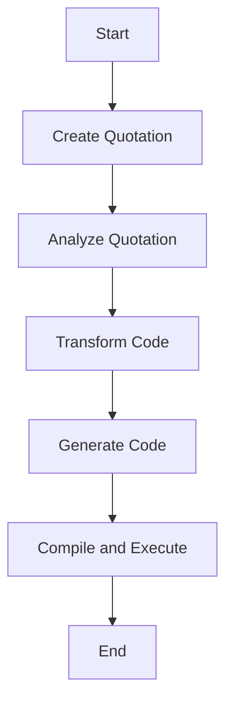

## 3.5 Metaprogramming and Code Generation

In the realm of software engineering, metaprogramming and code generation stand as powerful techniques that enable developers to write programs that can manipulate or generate other programs. This capability can significantly enhance productivity, reduce boilerplate code, and improve expressiveness. In this section, we will delve into the concepts of metaprogramming and code generation in F#, focusing on quotations, domain-specific languages (DSLs), and the tools that support these advanced techniques.

### Understanding Metaprogramming

**Metaprogramming** is the practice of writing programs that can read, generate, analyze, or transform other programs. This approach allows developers to automate repetitive tasks, enforce coding standards, and create more flexible and reusable code. In F#, metaprogramming is facilitated by features such as quotations, which enable the representation of code as data structures.

#### Purpose of Metaprogramming

The primary purpose of metaprogramming is to enhance the capabilities of a programming language by allowing it to manipulate its own code. This can lead to several benefits:

- **Automation**: Automate repetitive coding tasks, reducing the likelihood of human error.
- **Flexibility**: Create more adaptable code that can change behavior at runtime.
- **Expressiveness**: Develop domain-specific languages that provide more intuitive syntax for specific problem domains.
- **Optimization**: Generate optimized code based on runtime conditions or configurations.

### F# Quotations: Representing Code as Data

F# introduces the concept of **quotations**, which are a powerful feature for metaprogramming. Quotations allow code to be represented as data structures that can be analyzed or transformed. This capability is essential for tasks such as code generation, optimization, and the creation of DSLs.

#### Creating Quotations

Quotations in F# are created using the `<@ ... @>` syntax. This syntax captures the code within the brackets as an abstract syntax tree (AST), which can then be manipulated programmatically.

```fsharp
open Microsoft.FSharp.Quotations

// Define a simple quotation
let expr = <@ 1 + 2 @>

// Print the quotation
printfn "Quotation: %A" expr
```

In this example, the expression `1 + 2` is captured as a quotation, allowing it to be treated as a data structure.

#### Extracting Information from Quotations

Once a quotation is created, it can be analyzed to extract information about the code it represents. This is useful for tasks such as generating documentation, performing static analysis, or transforming code.

```fsharp
open Microsoft.FSharp.Quotations.Patterns

// Analyze the quotation
let analyzeQuotation q =
    match q with
    | SpecificCall(_, _, [arg1; arg2]) ->
        printfn "This is a binary operation with arguments: %A and %A" arg1 arg2
    | _ -> printfn "Unknown expression"

// Apply the analysis function
analyzeQuotation expr
```

In this example, we use pattern matching to analyze the structure of the quotation and extract its components.

### Code Generation with Quotations

One of the most powerful applications of quotations is code generation. By representing code as data, we can dynamically generate and compile expressions at runtime. This is particularly useful for scenarios where code needs to be optimized or customized based on runtime conditions.

#### Generating and Compiling Expressions

F# allows the compilation of quotations into executable code using the `FSharp.Quotations.Evaluator` library. This library provides the tools necessary to evaluate and execute quotations at runtime.

```fsharp
open FSharp.Quotations.Evaluator

// Define a quotation for a function
let addQuotation = <@ fun x y -> x + y @>

// Compile and execute the quotation
let addFunction = addQuotation.Compile() :?> (int -> int -> int)
let result = addFunction 3 4

printfn "Result of compiled function: %d" result
```

In this example, we define a quotation for a function that adds two numbers, compile it, and execute it at runtime.

### Domain-Specific Languages (DSLs) in F#

A **domain-specific language (DSL)** is a specialized language designed to express solutions in a particular domain. F#'s features, such as quotations and type providers, make it an excellent choice for building internal DSLs that can simplify complex problem domains.

#### Building Internal DSLs

Internal DSLs are embedded within a host language, leveraging its syntax and capabilities. F#'s expressive syntax and powerful type system make it ideal for creating DSLs that are both intuitive and efficient.

**Example: A DSL for Defining Workflows**

Consider a DSL for defining workflows, where each step in the workflow is represented as a function.

```fsharp
type WorkflowBuilder() =
    member _.Bind(x, f) = f x
    member _.Return(x) = x

let workflow = WorkflowBuilder()

let myWorkflow =
    workflow {
        let! step1 = <@ printfn "Step 1: Initialize" @>
        let! step2 = <@ printfn "Step 2: Process" @>
        let! step3 = <@ printfn "Step 3: Finalize" @>
        return step3
    }

// Execute the workflow
myWorkflow
```

In this example, we define a simple DSL for workflows using computation expressions. Each step in the workflow is represented as a quotation, allowing for flexible execution and analysis.

### Tools and Libraries for Metaprogramming in F#

Several tools and libraries support metaprogramming in F#, providing additional functionality for code generation and analysis.

#### FSharp.Quotations.Evaluator

The `FSharp.Quotations.Evaluator` library enables the compilation and execution of quotations at runtime. It is a valuable tool for scenarios where dynamic code execution is required.

#### FSharp.Compiler.Service

The `FSharp.Compiler.Service` library provides access to the F# compiler's internals, allowing for advanced code analysis and manipulation. This library is essential for building tools that require deep integration with the F# language.

### Benefits of Metaprogramming and Code Generation

Metaprogramming and code generation offer several benefits that can significantly enhance the development process:

- **Reduced Boilerplate**: Automate repetitive coding tasks, reducing the amount of boilerplate code.
- **Improved Expressiveness**: Create more expressive code that closely aligns with the problem domain.
- **Increased Productivity**: Automate complex tasks, allowing developers to focus on higher-level design and logic.
- **Dynamic Optimization**: Generate optimized code based on runtime conditions or configurations.

### Challenges and Considerations

While metaprogramming offers significant benefits, it also introduces challenges that must be carefully managed:

- **Increased Complexity**: Metaprogramming can lead to more complex code that is harder to understand and maintain.
- **Potential for Hard-to-Read Code**: Code that generates other code can be difficult to read and debug.
- **Performance Overhead**: Dynamic code generation and execution can introduce performance overhead.

### Responsible Use of Metaprogramming

To balance the power and maintainability of metaprogramming, it's essential to use these techniques responsibly:

- **Keep It Simple**: Use metaprogramming only when it provides clear benefits over traditional approaches.
- **Document Thoroughly**: Provide comprehensive documentation to help others understand the metaprogramming logic.
- **Test Extensively**: Ensure that generated code is thoroughly tested to prevent runtime errors.

### Try It Yourself

To gain hands-on experience with metaprogramming in F#, try modifying the code examples provided in this section. Experiment with creating your own quotations, analyzing them, and generating code dynamically. Consider building a simple DSL for a domain you're familiar with, such as a configuration language or a task automation script.

### Visualizing Metaprogramming Concepts

To better understand the flow and structure of metaprogramming in F#, let's visualize the process of creating and analyzing quotations using a flowchart.



**Figure 1: Flowchart of Metaprogramming Process in F#**

This flowchart illustrates the steps involved in metaprogramming with F#, from creating quotations to analyzing, transforming, generating, and executing code.

### Conclusion

Metaprogramming and code generation in F# offer powerful tools for enhancing productivity and expressiveness in software development. By leveraging quotations and DSLs, developers can create flexible and efficient code that aligns closely with problem domains. However, it's crucial to use these techniques responsibly, balancing their power with maintainability and readability. As you continue to explore metaprogramming in F#, remember to experiment, document, and test your code thoroughly.

## Quiz Time!



### What is the primary purpose of metaprogramming?

- [x] To enable programs to manipulate or generate other programs
- [ ] To improve the performance of algorithms
- [ ] To simplify user interfaces
- [ ] To enhance security features

> **Explanation:** Metaprogramming allows programs to manipulate or generate other programs, enhancing flexibility and automation.

### How are quotations represented in F#?

- [x] As abstract syntax trees (ASTs)
- [ ] As plain text strings
- [ ] As binary code
- [ ] As compiled assemblies

> **Explanation:** Quotations in F# are represented as abstract syntax trees, allowing them to be analyzed and transformed.

### Which library is used to compile and execute quotations at runtime in F#?

- [x] FSharp.Quotations.Evaluator
- [ ] Newtonsoft.Json
- [ ] System.Linq.Expressions
- [ ] Microsoft.FSharp.Collections

> **Explanation:** The FSharp.Quotations.Evaluator library is used to compile and execute quotations at runtime.

### What is a domain-specific language (DSL)?

- [x] A specialized language designed for a specific domain
- [ ] A general-purpose programming language
- [ ] A markup language for web development
- [ ] A scripting language for automation

> **Explanation:** A DSL is a specialized language designed to express solutions in a particular domain.

### What is a key benefit of using DSLs in F#?

- [x] Improved expressiveness for specific problem domains
- [ ] Increased hardware compatibility
- [ ] Simplified user authentication
- [ ] Enhanced graphics rendering

> **Explanation:** DSLs improve expressiveness by providing syntax tailored to specific problem domains.

### What is a potential challenge of metaprogramming?

- [x] Increased complexity and harder-to-read code
- [ ] Reduced code execution speed
- [ ] Limited language support
- [ ] Incompatibility with databases

> **Explanation:** Metaprogramming can lead to increased complexity and code that is harder to read and maintain.

### How can metaprogramming improve productivity?

- [x] By automating repetitive coding tasks
- [ ] By reducing the need for testing
- [ ] By eliminating the need for documentation
- [ ] By simplifying database queries

> **Explanation:** Metaprogramming automates repetitive coding tasks, allowing developers to focus on higher-level design.

### What should be considered when using metaprogramming?

- [x] Balance power with maintainability and readability
- [ ] Focus solely on performance improvements
- [ ] Avoid using any external libraries
- [ ] Prioritize graphical user interfaces

> **Explanation:** It's important to balance the power of metaprogramming with maintainability and readability.

### What is the role of the FSharp.Compiler.Service library?

- [x] Provides access to the F# compiler's internals for advanced analysis
- [ ] Compiles C# code into F#
- [ ] Manages database connections
- [ ] Generates user interfaces

> **Explanation:** The FSharp.Compiler.Service library provides access to the F# compiler's internals for advanced code analysis and manipulation.

### True or False: Metaprogramming can only be used for code generation.

- [ ] True
- [x] False

> **Explanation:** Metaprogramming can be used for various purposes, including code analysis, transformation, and optimization, not just code generation.


