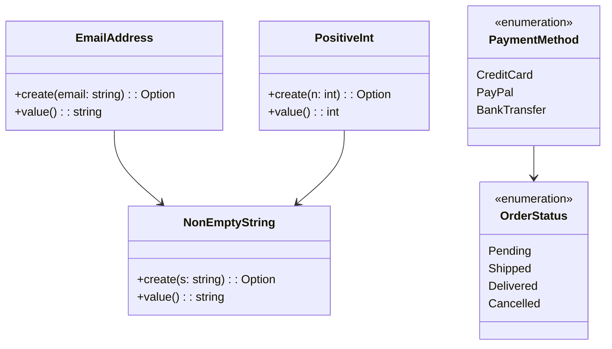

## 3.6 Type-Driven Design

In the realm of software engineering, the design of a system is paramount to its success. Type-driven design is a powerful approach that leverages the type system of a language to model domain logic, enforce constraints, and create self-documenting code. In F#, a language renowned for its expressive type system, type-driven design becomes a natural and effective strategy for building robust applications.

### The Philosophy of Type-Driven Design

Type-driven design is rooted in the philosophy that types are not just a means to categorize data but are integral to the architecture of a system. By using types to encapsulate domain logic, developers can ensure that only valid states are representable, thus reducing runtime errors and enhancing code clarity.

- **Modeling Domain Logic**: Types are used to represent business concepts and rules, ensuring that the code aligns closely with the domain it serves.
- **Enforcing Constraints**: By defining types that encapsulate constraints, such as `EmailAddress` or `PositiveInt`, we prevent invalid data from entering the system.
- **Self-Documenting Code**: Well-designed types serve as documentation, making the codebase easier to understand and maintain.

### Leveraging F#'s Rich Type System

F# offers a rich type system that allows developers to represent business concepts with precision. This includes basic types, records, discriminated unions, and more. Let's explore how these features can be harnessed in type-driven design.

#### Designing Types to Encapsulate Domain Rules

One of the key aspects of type-driven design is creating types that encapsulate domain rules. This involves defining types that inherently enforce constraints and business logic.

**Example: EmailAddress**

```fsharp
type EmailAddress = private EmailAddress of string

module EmailAddress =
    let create (email: string) =
        if System.Text.RegularExpressions.Regex.IsMatch(email, @"^\S+@\S+\.\S+$") then
            Some (EmailAddress email)
        else
            None

    let value (EmailAddress email) = email
```

In this example, the `EmailAddress` type is defined as a single-case discriminated union with a private constructor. This ensures that an `EmailAddress` can only be created through the `create` function, which validates the input.

**Example: NonEmptyString**

```fsharp
type NonEmptyString = private NonEmptyString of string

module NonEmptyString =
    let create (s: string) =
        if String.IsNullOrWhiteSpace(s) then None
        else Some (NonEmptyString s)

    let value (NonEmptyString s) = s
```

Here, a `NonEmptyString` type is defined to ensure that strings are not empty or whitespace. This type encapsulates the constraint, preventing invalid strings from being used.

**Example: PositiveInt**

```fsharp
type PositiveInt = private PositiveInt of int

module PositiveInt =
    let create (n: int) =
        if n > 0 then Some (PositiveInt n)
        else None

    let value (PositiveInt n) = n
```

The `PositiveInt` type ensures that only positive integers are represented. This is achieved by restricting the creation of `PositiveInt` instances to valid values.

### Using Discriminated Unions for Domain Modeling

Discriminated unions are a powerful feature in F# that allow you to represent different states or variations within a domain model. They are particularly useful for modeling scenarios where a value can be one of several distinct types.

**Example: PaymentMethod**

```fsharp
type PaymentMethod =
    | CreditCard of cardNumber: string * expiryDate: string
    | PayPal of email: string
    | BankTransfer of accountNumber: string * bankCode: string
```

In this example, the `PaymentMethod` type can represent different ways of making a payment. Each case in the discriminated union captures the specific data needed for that payment method.

**Example: OrderStatus**

```fsharp
type OrderStatus =
    | Pending
    | Shipped of trackingNumber: string
    | Delivered of deliveryDate: System.DateTime
    | Cancelled of reason: string
```

The `OrderStatus` type models the different states an order can be in. This makes it easy to handle each state appropriately in the application logic.

### Preventing Invalid States with Types

A key advantage of type-driven design is the ability to prevent invalid states or values from being representable in the system. By carefully designing types, we can ensure that only valid data is constructed and manipulated.

**Example: Safe Division**

```fsharp
type NonZeroInt = private NonZeroInt of int

module NonZeroInt =
    let create (n: int) =
        if n <> 0 then Some (NonZeroInt n)
        else None

    let value (NonZeroInt n) = n

let safeDivide (x: int) (y: NonZeroInt) =
    x / NonZeroInt.value y
```

In this example, the `NonZeroInt` type ensures that division by zero is impossible, as the divisor must be a non-zero integer.

### Single-Case Discriminated Unions for Semantic Types

Single-case discriminated unions are a useful tool for creating semantic types. These types provide meaningful names and encapsulate specific constraints or logic.

**Example: Semantic Types**

```fsharp
type UserId = UserId of int
type ProductId = ProductId of int
```

By using single-case discriminated unions, we can create types that convey specific meanings, such as `UserId` and `ProductId`. This enhances code readability and reduces the likelihood of errors.

### Self-Documenting Code and Reduced Runtime Checks

Type-driven design leads to more self-documenting code, as the types themselves convey important information about the data and its constraints. This reduces the need for runtime checks and error handling, as many potential issues are caught at compile time.

**Example: Self-Documenting Function Signature**

```fsharp
let processOrder (orderId: OrderId) (payment: PaymentMethod) (status: OrderStatus) =
    // Function implementation
```

The function signature clearly indicates the types of data expected, making the code easier to understand and use correctly.

### Potential Trade-offs and Balancing Type Complexity

While type-driven design offers many benefits, it also comes with potential trade-offs. Designing comprehensive types can increase upfront development time and complexity. It's important to balance the richness of the type system with practical development needs.

#### Tips for Balancing Type Complexity

- **Start Simple**: Begin with simple types and gradually introduce more complex types as needed.
- **Iterate and Refine**: Continuously refine types based on evolving domain requirements.
- **Avoid Over-Engineering**: Focus on capturing essential domain logic without over-complicating the type system.
- **Use Type Aliases**: Simplify complex types with type aliases for readability.

### Encouraging Critical Thinking in Domain Modeling

Type-driven design encourages developers to think critically about their domain and how types can effectively model it. By understanding the domain deeply and leveraging F#'s type system, developers can create software that is both robust and aligned with business needs.

### Try It Yourself

To deepen your understanding of type-driven design, try modifying the code examples provided. Experiment with creating new types that encapsulate different domain rules or constraints. Consider how these types can be used to simplify and enhance your application logic.

### Visualizing Type-Driven Design

To better understand the concepts of type-driven design, let's visualize how types can model domain logic and prevent invalid states.



This diagram illustrates how different types can be used to model domain logic and ensure data integrity.

### References and Further Reading

- [F# Language Reference](https://docs.microsoft.com/en-us/dotnet/fsharp/language-reference/)
- [Domain Modeling Made Functional](https://pragprog.com/titles/swdddf/domain-modeling-made-functional/)
- [F# for Fun and Profit: Domain Modeling](https://fsharpforfunandprofit.com/ddd/)

### Knowledge Check

- How can type-driven design improve code readability and maintainability?
- What are the benefits of using discriminated unions in domain modeling?
- How do single-case discriminated unions enhance semantic clarity in code?
- What are some potential trade-offs of type-driven design?

### Conclusion

Type-driven design is a powerful approach that leverages F#'s rich type system to model domain logic, enforce constraints, and create self-documenting code. By thoughtfully designing types, developers can build robust applications that align closely with business needs. As you continue your journey in F#, remember to embrace the power of types and let them guide your design decisions.

## Quiz Time!



### What is the primary goal of type-driven design?

- [x] To model domain logic and enforce constraints using types
- [ ] To optimize runtime performance
- [ ] To simplify syntax and reduce code size
- [ ] To enhance graphical user interfaces

> **Explanation:** Type-driven design focuses on using types to model domain logic and enforce constraints, ensuring that only valid states are representable in the system.

### How do discriminated unions benefit domain modeling in F#?

- [x] They allow representation of different states or variations within a domain model
- [ ] They simplify arithmetic operations
- [ ] They enhance string manipulation capabilities
- [ ] They improve file I/O operations

> **Explanation:** Discriminated unions in F# enable the representation of different states or variations within a domain model, making it easier to handle complex scenarios.

### What is a single-case discriminated union used for?

- [x] Creating semantic types that convey specific meanings
- [ ] Simplifying mathematical calculations
- [ ] Enhancing graphical rendering
- [ ] Improving network communication

> **Explanation:** Single-case discriminated unions are used to create semantic types that convey specific meanings, enhancing code readability and reducing errors.

### What is a potential trade-off of type-driven design?

- [x] Increased upfront design time and complexity
- [ ] Reduced code readability
- [ ] Decreased runtime performance
- [ ] Limited support for concurrency

> **Explanation:** Type-driven design can increase upfront design time and complexity due to the need for comprehensive type definitions.

### How can type-driven design reduce runtime checks?

- [x] By ensuring constraints are enforced at compile time through types
- [ ] By optimizing loop iterations
- [ ] By enhancing memory allocation strategies
- [ ] By reducing network latency

> **Explanation:** Type-driven design reduces runtime checks by enforcing constraints at compile time, ensuring that only valid data is constructed and manipulated.

### What is a benefit of using types like `EmailAddress` or `PositiveInt`?

- [x] They encapsulate domain rules and constraints
- [ ] They improve graphical rendering
- [ ] They enhance file compression
- [ ] They simplify database queries

> **Explanation:** Types like `EmailAddress` or `PositiveInt` encapsulate domain rules and constraints, preventing invalid data from entering the system.

### How can type-driven design lead to self-documenting code?

- [x] By using types that convey important information about data and constraints
- [ ] By reducing the number of comments needed
- [ ] By optimizing code execution speed
- [ ] By enhancing user interface design

> **Explanation:** Type-driven design leads to self-documenting code by using types that convey important information about data and constraints, making the codebase easier to understand.

### What is a key consideration when balancing type complexity?

- [x] Avoiding over-engineering while capturing essential domain logic
- [ ] Maximizing the number of types used
- [ ] Reducing the number of functions
- [ ] Enhancing graphical user interfaces

> **Explanation:** When balancing type complexity, it's important to avoid over-engineering while capturing essential domain logic to maintain code clarity and maintainability.

### How can developers start implementing type-driven design?

- [x] Begin with simple types and gradually introduce more complex types as needed
- [ ] Focus solely on optimizing runtime performance
- [ ] Prioritize graphical design elements
- [ ] Reduce the number of types used

> **Explanation:** Developers can start implementing type-driven design by beginning with simple types and gradually introducing more complex types as needed, refining them based on domain requirements.

### True or False: Type-driven design can help prevent invalid states from being representable in a system.

- [x] True
- [ ] False

> **Explanation:** True. Type-driven design helps prevent invalid states from being representable in a system by using types to enforce constraints and model domain logic.




