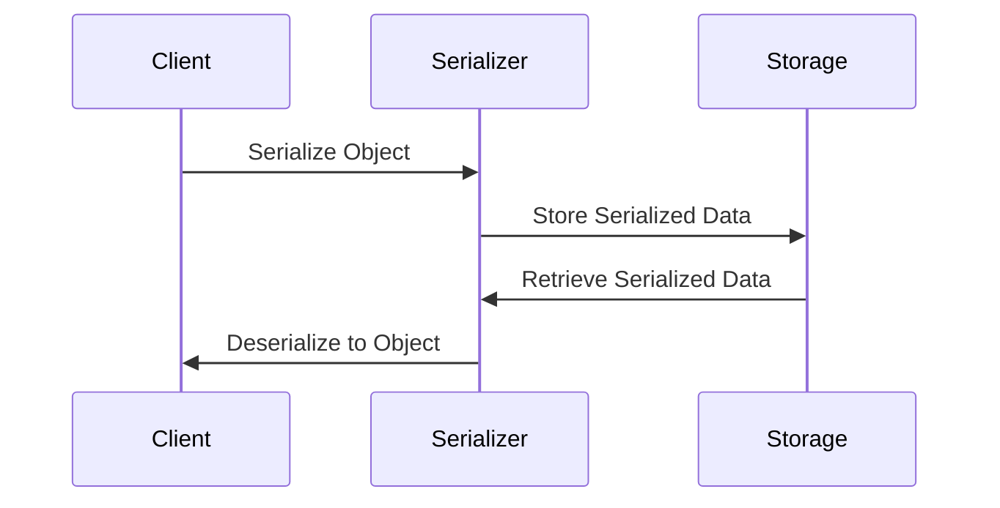

## 3.7 Serialization and Deserialization

Serialization is a crucial aspect of modern software development, enabling data persistence, communication between distributed systems, and interoperability across different platforms and languages. In the context of F#, serialization presents unique challenges and opportunities due to its functional nature and rich type system. In this section, we will explore the intricacies of serializing and deserializing F# data structures, manage versioning and compatibility, and utilize popular libraries such as FSharp.Json, Newtonsoft.Json, and System.Text.Json.

### The Need for Serialization

Serialization is the process of converting an object into a format that can be easily stored or transmitted, and deserialization is the reverse process of reconstructing the object from this format. This is essential for:

- **Persisting Data**: Storing objects in files or databases for later retrieval.
- **Communication**: Transmitting data between services in distributed systems.
- **Interoperability**: Sharing data across different platforms and languages.

### Challenges in Serializing F# Data Structures

F# offers powerful data structures like records, discriminated unions, and functional types, which can pose challenges during serialization:

- **Discriminated Unions**: Representing complex variants in a serialized format.
- **Functional Types**: Handling functions and closures, which are not directly serializable.
- **Options and Lists**: Managing collections and optional values with potential nullability issues.

### Popular Serialization Libraries for F#

Several libraries facilitate serialization in F#, each with its own strengths:

- **FSharp.Json**: Tailored for F#, offering seamless integration with F# types.
- **Newtonsoft.Json**: A widely-used library with extensive customization options.
- **System.Text.Json**: A high-performance library included in .NET Core, offering a modern API.

### Serializing and Deserializing F# Data Structures

Let's explore how to serialize and deserialize common F# data structures using these libraries.

#### Serializing Records

Records are a fundamental F# data structure, ideal for representing immutable data.

```fsharp
type Person = {
    Name: string
    Age: int
}

let person = { Name = "Alice"; Age = 30 }

// Using FSharp.Json
open FSharp.Json

let json = Json.serialize person
printfn "Serialized JSON: %s" json

let deserializedPerson = Json.deserialize<Person> json
printfn "Deserialized Person: %A" deserializedPerson
```

#### Serializing Lists and Options

Lists and options are common in F# for handling collections and optional values.

```fsharp
let names = ["Alice"; "Bob"; "Charlie"]
let maybeAge = Some 30

let jsonNames = Json.serialize names
let jsonMaybeAge = Json.serialize maybeAge

printfn "Serialized List: %s" jsonNames
printfn "Serialized Option: %s" jsonMaybeAge

let deserializedNames = Json.deserialize<string list> jsonNames
let deserializedMaybeAge = Json.deserialize<int option> jsonMaybeAge

printfn "Deserialized List: %A" deserializedNames
printfn "Deserialized Option: %A" deserializedMaybeAge
```

#### Serializing Discriminated Unions

Discriminated unions allow for expressive data modeling, but require careful handling during serialization.

```fsharp
type Shape =
    | Circle of radius: float
    | Rectangle of width: float * height: float

let shape = Circle 5.0

let jsonShape = Json.serialize shape
printfn "Serialized Shape: %s" jsonShape

let deserializedShape = Json.deserialize<Shape> jsonShape
printfn "Deserialized Shape: %A" deserializedShape
```

### Custom Serialization Scenarios

Custom serialization allows for fine-grained control over the serialization process, such as renaming properties or handling missing fields.

#### Controlling Property Names

You can customize property names using attributes or configuration settings in libraries like Newtonsoft.Json.

```fsharp
type Product = {
    [<JsonProperty("product_name")>]
    Name: string
    Price: float
}

let product = { Name = "Laptop"; Price = 999.99 }
let jsonProduct = JsonConvert.SerializeObject(product)
printfn "Serialized Product: %s" jsonProduct
```

#### Handling Missing Fields

Handling missing fields gracefully is crucial for robust deserialization.

```fsharp
type User = {
    Username: string
    Email: string option
}

let jsonWithMissingEmail = """{ "Username": "johndoe" }"""
let user = JsonConvert.DeserializeObject<User>(jsonWithMissingEmail)
printfn "Deserialized User: %A" user
```

### Versioning Strategies

As applications evolve, data structures may change, necessitating strategies for managing versioning and ensuring compatibility.

#### Adding Fields

Adding new fields should not break existing serialized data. Use optional types or default values to handle missing data.

```fsharp
type UserV1 = {
    Username: string
}

type UserV2 = {
    Username: string
    Email: string option
}

let oldJson = """{ "Username": "johndoe" }"""
let userV2 = JsonConvert.DeserializeObject<UserV2>(oldJson)
printfn "Deserialized User V2: %A" userV2
```

#### Renaming Properties

Renaming properties requires careful handling to maintain backward compatibility. Use attributes or configuration settings to map old names to new ones.

```fsharp
type CustomerV1 = {
    Name: string
}

type CustomerV2 = {
    [<JsonProperty("Name")>]
    FullName: string
}

let oldJson = """{ "Name": "Jane Doe" }"""
let customerV2 = JsonConvert.DeserializeObject<CustomerV2>(oldJson)
printfn "Deserialized Customer V2: %A" customerV2
```

### Ensuring Compatibility

Ensuring backward and forward compatibility is essential for seamless data exchange and system upgrades.

#### Backward Compatibility

Ensure that new versions of your application can read data serialized by older versions. Use optional fields and default values to handle missing data gracefully.

#### Forward Compatibility

Design your serialization format to allow older versions of your application to ignore unknown fields. This can be achieved by using flexible deserialization settings.

### Security Concerns in Serialization

Serialization can introduce security vulnerabilities if not handled carefully. Consider the following best practices:

- **Validate Input**: Always validate and sanitize input data before deserialization to prevent injection attacks.
- **Limit Deserialization**: Avoid deserializing data from untrusted sources. If necessary, use secure libraries and configurations.
- **Minimize Payload Size**: Reduce the size of serialized data to minimize the attack surface and improve performance.

### Best Practices for Serialization

To ensure efficient and secure serialization, consider the following best practices:

- **Plan Early**: Consider serialization needs during the design phase to avoid costly refactoring later.
- **Choose the Right Library**: Select a serialization library that best fits your project's requirements and constraints.
- **Optimize Performance**: Profile and optimize serialization performance, especially in high-throughput systems.
- **Document Changes**: Keep detailed documentation of changes to data structures and serialization formats.

### Try It Yourself

Experiment with the code examples provided in this section. Try modifying the data structures, adding new fields, or changing property names to see how the serialization and deserialization processes are affected. This hands-on approach will deepen your understanding of serialization in F#.

### Visualizing Serialization Workflows

To better understand the serialization process, let's visualize the workflow using a sequence diagram.



**Diagram Description**: This sequence diagram illustrates the serialization workflow, where a client serializes an object, stores the serialized data, retrieves it, and deserializes it back into an object.

### Knowledge Check

- What are the challenges of serializing discriminated unions in F#?
- How can you handle missing fields during deserialization?
- What strategies can you use to ensure backward compatibility in serialized data formats?
- Why is it important to validate input data before deserialization?

### Conclusion

Serialization and deserialization are essential components of modern software systems, enabling data persistence, communication, and interoperability. By understanding the challenges and opportunities presented by F#'s functional data structures, you can effectively serialize and deserialize data while ensuring compatibility and security. Remember to plan for serialization needs early in your project and choose the appropriate libraries and strategies to meet your requirements.

## Quiz Time!



### What is serialization?

- [x] The process of converting an object into a format for storage or transmission.
- [ ] The process of converting a string into an object.
- [ ] The process of encrypting data for security.
- [ ] The process of compressing data to save space.

> **Explanation:** Serialization is the process of converting an object into a format that can be easily stored or transmitted.

### Which F# data structure can pose challenges during serialization?

- [x] Discriminated Unions
- [ ] Tuples
- [ ] Arrays
- [ ] Strings

> **Explanation:** Discriminated Unions can pose challenges during serialization due to their complex variant representations.

### Which library is tailored for F# serialization?

- [x] FSharp.Json
- [ ] Newtonsoft.Json
- [ ] System.Text.Json
- [ ] Json.NET

> **Explanation:** FSharp.Json is tailored for F# and offers seamless integration with F# types.

### How can you handle missing fields during deserialization?

- [x] Use optional types or default values.
- [ ] Ignore the missing fields.
- [ ] Throw an exception.
- [ ] Use reflection to fill in missing data.

> **Explanation:** Using optional types or default values allows you to handle missing fields gracefully during deserialization.

### What is a strategy for ensuring backward compatibility in serialized data?

- [x] Use optional fields and default values.
- [ ] Remove old fields.
- [ ] Rename properties frequently.
- [ ] Avoid using serialization.

> **Explanation:** Using optional fields and default values helps ensure backward compatibility by allowing new versions to handle missing data.

### Why is it important to validate input data before deserialization?

- [x] To prevent injection attacks.
- [ ] To improve performance.
- [ ] To reduce payload size.
- [ ] To ensure backward compatibility.

> **Explanation:** Validating input data before deserialization helps prevent injection attacks and other security vulnerabilities.

### What is a benefit of minimizing payload size in serialization?

- [x] Improved performance and reduced attack surface.
- [ ] Increased data integrity.
- [ ] Easier debugging.
- [ ] Enhanced security.

> **Explanation:** Minimizing payload size improves performance and reduces the attack surface, enhancing security.

### What should you consider when choosing a serialization library?

- [x] Project requirements and constraints.
- [ ] The popularity of the library.
- [ ] The size of the library's documentation.
- [ ] The number of contributors to the library.

> **Explanation:** Choosing a serialization library should be based on project requirements and constraints to ensure it meets your needs.

### How can you ensure forward compatibility in serialized data?

- [x] Allow older versions to ignore unknown fields.
- [ ] Remove old fields.
- [ ] Use reflection to handle unknown data.
- [ ] Avoid using serialization.

> **Explanation:** Allowing older versions to ignore unknown fields ensures forward compatibility by preventing errors when encountering new data.

### Serialization can introduce security vulnerabilities if not handled carefully.

- [x] True
- [ ] False

> **Explanation:** Serialization can introduce security vulnerabilities, such as injection attacks, if not handled carefully.



Remember, this is just the beginning. As you progress, you'll build more complex and interactive systems. Keep experimenting, stay curious, and enjoy the journey!
