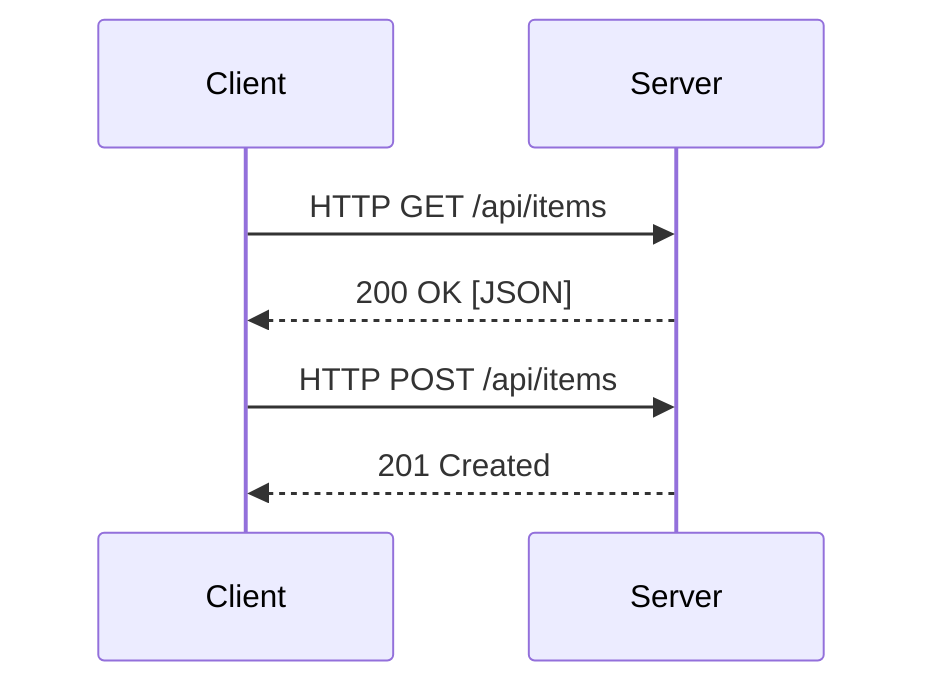

## 3.8 Communication Protocols and Network Programming

In the modern era of software development, network programming and communication protocols are essential components of distributed systems. As systems become more interconnected, the ability to efficiently and securely communicate across networks is paramount. In this section, we'll explore how F# can be leveraged to implement various communication protocols, focusing on RESTful services, gRPC, and WebSockets. We'll also touch on best practices for ensuring robust and secure network communications.

### Importance of Network Programming and Communication Protocols

Network programming is the backbone of distributed systems, enabling different components to interact seamlessly. Communication protocols define the rules and conventions for data exchange, ensuring interoperability and reliability. As software architects and engineers, understanding these protocols and how to implement them effectively in F# is crucial for building scalable and maintainable systems.

### Building RESTful Services in F#

REST (Representational State Transfer) is a widely used architectural style for designing networked applications. It relies on stateless communication and standard HTTP methods, making it simple and flexible. In F#, several frameworks facilitate the creation of RESTful services, including Giraffe, Saturn, and Suave.

#### Overview of F# Frameworks for RESTful Services

- **Giraffe**: A functional web framework for building rich web applications in F#. It integrates seamlessly with ASP.NET Core, providing a powerful platform for building RESTful services.
- **Saturn**: Built on top of Giraffe, Saturn offers a more opinionated approach, emphasizing convention over configuration.
- **Suave**: A lightweight, composable web server that allows for rapid development of web services.

#### Setting Up a Simple REST API

Let's walk through setting up a simple REST API using Giraffe.

1. **Create a New F# Project**: Start by creating a new F# project using the .NET CLI.

   ```bash
   dotnet new giraffe -n MyGiraffeApp
   ```

2. **Define Routes**: In Giraffe, routes are defined using the `choose` function, which allows for pattern matching on HTTP requests.

   ```fsharp
   open Giraffe

   let webApp =
       choose [
           GET >=> route "/" >=> text "Welcome to Giraffe!"
           GET >=> route "/api/items" >=> json [ "Item1"; "Item2" ]
           POST >=> route "/api/items" >=> bindJson<MyItem> (fun item -> json item)
       ]
   ```

3. **Handle HTTP Requests and Responses**: Use the `json` and `text` functions to handle JSON and plain text responses.

4. **Run the Application**: Use the `dotnet run` command to start the server and test your API endpoints.

#### Serialization Formats: JSON and XML

Serialization is the process of converting data structures into a format that can be easily transmitted over a network. JSON and XML are two common serialization formats used in APIs.

- **JSON**: Lightweight and easy to read, JSON is the preferred format for most modern APIs. In F#, you can use libraries like `Newtonsoft.Json` or `FSharp.Json` for JSON serialization and deserialization.
- **XML**: While less common in new applications, XML is still used in many legacy systems. F# provides built-in support for XML through the `System.Xml` namespace.

Here's an example of serializing and deserializing JSON in F#:

```fsharp
open Newtonsoft.Json

type MyItem = { Name: string; Quantity: int }

let serialize item =
    JsonConvert.SerializeObject(item)

let deserialize json =
    JsonConvert.DeserializeObject<MyItem>(json)
```

### Introducing gRPC for Efficient Communication

gRPC is a high-performance, open-source framework for remote procedure calls (RPC). It uses Protocol Buffers for serialization, providing a strongly-typed, efficient communication mechanism between services.

#### Advantages of gRPC

- **Performance**: gRPC uses HTTP/2, enabling multiplexing and reducing latency.
- **Strong Typing**: Protocol Buffers enforce a strict schema, reducing errors and improving interoperability.
- **Streaming**: Supports client, server, and bidirectional streaming, making it ideal for real-time applications.

#### Defining Service Contracts with Protocol Buffers

Protocol Buffers (Protobuf) is a language-agnostic binary serialization format. To define a gRPC service, you create a `.proto` file that specifies the service methods and message types.

```proto
syntax = "proto3";

service ItemService {
  rpc GetItem (ItemRequest) returns (ItemResponse);
}

message ItemRequest {
  int32 id = 1;
}

message ItemResponse {
  string name = 1;
  int32 quantity = 2;
}
```

#### Implementing gRPC Services and Clients in F#

1. **Generate Code**: Use the `protoc` compiler to generate F# code from the `.proto` file.

   ```bash
   protoc --proto_path=./protos --csharp_out=./generated --grpc_out=./generated --plugin=protoc-gen-grpc=grpc_csharp_plugin ./protos/item.proto
   ```

2. **Implement the Service**: Define the service logic in F#.

   ```fsharp
   open Grpc.Core
   open Generated

   type ItemServiceImpl() =
       inherit ItemService.ItemServiceBase()

       override this.GetItem(request, context) =
           Task.FromResult(ItemResponse(Name = "Sample Item", Quantity = 10))
   ```

3. **Create a Client**: Use the generated client code to interact with the service.

   ```fsharp
   let channel = new Channel("localhost:50051", ChannelCredentials.Insecure)
   let client = new ItemService.ItemServiceClient(channel)

   let request = ItemRequest(Id = 1)
   let response = client.GetItem(request)

   printfn "Item: %s, Quantity: %d" response.Name response.Quantity
   ```

### Setting Up WebSocket Connections in F#

WebSockets provide a full-duplex communication channel over a single TCP connection, enabling real-time data exchange between clients and servers.

#### Using FSharp.Control.Websockets

FSharp.Control.Websockets is a library that simplifies working with WebSockets in F#. Here's how to set up a basic WebSocket server and client.

1. **Create a WebSocket Server**:

   ```fsharp
   open System.Net.WebSockets
   open FSharp.Control.Websockets

   let server = WebSocketServer("http://localhost:8080")

   server.OnMessage.Add(fun (socket, message) ->
       printfn "Received: %s" message
       socket.SendAsync("Echo: " + message) |> ignore
   )

   server.Start()
   ```

2. **Create a WebSocket Client**:

   ```fsharp
   open System.Net.WebSockets
   open FSharp.Control.Websockets

   let client = WebSocketClient("ws://localhost:8080")

   client.ConnectAsync() |> Async.RunSynchronously
   client.SendAsync("Hello, WebSocket!") |> ignore

   client.OnMessage.Add(fun message ->
       printfn "Received from server: %s" message
   )
   ```

### Other Protocols and Technologies

While REST, gRPC, and WebSockets are among the most commonly used protocols, there are others worth mentioning:

- **MQTT**: A lightweight messaging protocol ideal for IoT applications.
- **SignalR**: A library for adding real-time web functionality to applications, allowing server-side code to push content to clients instantly.

### Best Practices for Secure and Robust Network Communications

1. **Secure Communication**: Use TLS/SSL to encrypt data in transit, protecting against eavesdropping and man-in-the-middle attacks.
2. **Error Handling**: Implement robust error handling and retry mechanisms to ensure reliability in distributed environments.
3. **Rate Limiting**: Protect services from abuse by implementing rate limiting and throttling.
4. **Logging and Monitoring**: Use logging and monitoring tools to track network activity and diagnose issues.

### Visualizing Network Communication

To better understand the flow of data in network communications, let's visualize a typical RESTful service architecture using a sequence diagram.



This diagram illustrates the interaction between a client and a server in a RESTful service, highlighting the request and response cycle.

### Try It Yourself

Experiment with the code examples provided in this section. Try modifying the REST API to add new endpoints or change the serialization format. Implement a gRPC service with additional methods or set up a WebSocket connection to handle more complex messages. By experimenting with these examples, you'll gain a deeper understanding of network programming in F#.

### Summary

In this section, we've explored the fundamentals of network programming and communication protocols in F#. We've covered how to build RESTful services using frameworks like Giraffe, Saturn, and Suave, and delved into the advantages of gRPC for efficient, strongly-typed communication. We've also seen how to set up WebSocket connections for real-time data exchange. By following best practices for secure and robust network communications, you can build distributed systems that are both reliable and scalable.

## Quiz Time!



### What is the primary advantage of using gRPC over REST?

- [x] Strongly-typed communication
- [ ] Simplicity
- [ ] Human-readable messages
- [ ] Statelessness

> **Explanation:** gRPC uses Protocol Buffers for strongly-typed communication, which reduces errors and improves interoperability.

### Which F# framework is built on top of Giraffe and emphasizes convention over configuration?

- [ ] Suave
- [x] Saturn
- [ ] Nancy
- [ ] WebSharper

> **Explanation:** Saturn is built on top of Giraffe and provides a more opinionated approach to building web applications.

### What serialization format is preferred for most modern APIs?

- [ ] XML
- [x] JSON
- [ ] YAML
- [ ] CSV

> **Explanation:** JSON is lightweight and easy to read, making it the preferred format for most modern APIs.

### What is the main benefit of using WebSockets?

- [ ] Stateless communication
- [ ] HTTP/2 support
- [x] Real-time, bidirectional communication
- [ ] Simplicity

> **Explanation:** WebSockets provide a full-duplex communication channel, enabling real-time, bidirectional communication between clients and servers.

### Which protocol is ideal for IoT applications due to its lightweight nature?

- [x] MQTT
- [ ] HTTP
- [ ] FTP
- [ ] SMTP

> **Explanation:** MQTT is a lightweight messaging protocol designed for constrained devices, making it ideal for IoT applications.

### What is the purpose of using TLS/SSL in network communications?

- [ ] To compress data
- [x] To encrypt data in transit
- [ ] To speed up data transfer
- [ ] To simplify data parsing

> **Explanation:** TLS/SSL encrypts data in transit, protecting against eavesdropping and man-in-the-middle attacks.

### Which library can be used in F# for adding real-time web functionality?

- [ ] Giraffe
- [ ] Saturn
- [ ] Suave
- [x] SignalR

> **Explanation:** SignalR is a library for adding real-time web functionality to applications, allowing server-side code to push content to clients instantly.

### What is the role of Protocol Buffers in gRPC?

- [ ] To provide human-readable messages
- [x] To define service contracts and message types
- [ ] To encrypt messages
- [ ] To compress messages

> **Explanation:** Protocol Buffers define service contracts and message types, enabling strongly-typed communication in gRPC.

### What is a common practice to protect services from abuse?

- [ ] Using XML
- [ ] Disabling logging
- [x] Implementing rate limiting
- [ ] Ignoring errors

> **Explanation:** Rate limiting and throttling are common practices to protect services from abuse and ensure fair usage.

### True or False: WebSockets use a single TCP connection for communication.

- [x] True
- [ ] False

> **Explanation:** WebSockets provide a full-duplex communication channel over a single TCP connection, enabling efficient real-time data exchange.


