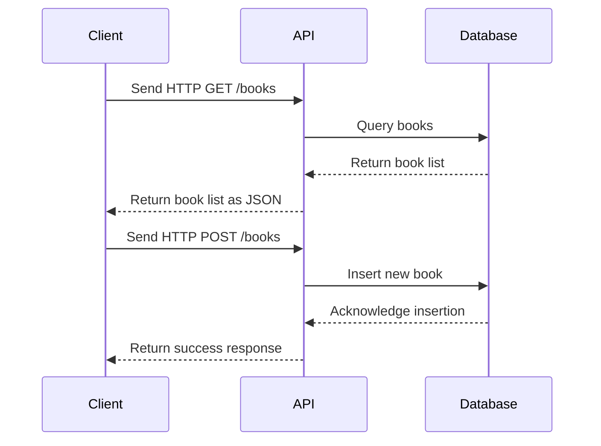

## 3.9 API Design and Documentation

In today's interconnected world, APIs (Application Programming Interfaces) are the backbone of software systems, enabling communication between different software components. Designing and documenting APIs effectively is crucial for ensuring they are easy to use, maintain, and extend. In this section, we will explore the principles of API design in F#, how to document APIs using Swagger/OpenAPI, and compare different API paradigms like REST, GraphQL, and gRPC.

### Principles of Good API Design

Good API design is essential for creating APIs that are intuitive, easy to use, and maintainable. Here are some key principles to consider:

1. **Simplicity**: Keep APIs simple and focused on solving specific problems. Avoid unnecessary complexity that could confuse users.

2. **Consistency**: Use consistent naming conventions, data formats, and error handling across your API. This makes it easier for developers to understand and use your API.

3. **Discoverability**: Design APIs that are easy to explore and understand. Provide clear documentation and examples to help developers get started quickly.

4. **Proper Use of HTTP Semantics**: When designing RESTful APIs, use HTTP methods (GET, POST, PUT, DELETE) and status codes appropriately to convey the intended actions and results.

#### Applying These Principles in F#

F# is a functional-first language that offers several features to help you design clear and intuitive APIs. Here are some ways to leverage F# for API design:

- **Type Safety**: Use F#'s strong type system to define clear and concise data models. This helps prevent errors and makes your API more predictable.

- **Pattern Matching**: Use pattern matching to handle different request types and responses, making your API logic more readable and maintainable.

- **Function Composition**: Leverage function composition to build complex API logic from smaller, reusable functions.

- **Pipelining**: Use F#'s pipelining feature to create clear and readable code that processes requests in a series of steps.

#### Example: Designing a Simple REST API in F#

Let's design a simple REST API for managing a list of books. We'll use F# to define the data model and implement the API logic.

```fsharp
open System
open System.Collections.Generic

type Book = {
    Id: Guid
    Title: string
    Author: string
    PublishedYear: int
}

let books = new Dictionary<Guid, Book>()

let getBooks () =
    books.Values

let addBook (book: Book) =
    books.Add(book.Id, book)

let updateBook (id: Guid) (updatedBook: Book) =
    if books.ContainsKey(id) then
        books.[id] <- updatedBook

let deleteBook (id: Guid) =
    books.Remove(id) |> ignore
```

In this example, we define a `Book` type and a dictionary to store books. We then implement functions to get, add, update, and delete books.

### Documenting APIs with Swagger/OpenAPI

Effective API documentation is crucial for helping developers understand how to use your API. Swagger/OpenAPI is a popular framework for documenting APIs, providing a standard way to describe API endpoints, request/response formats, and more.

#### Integrating Swagger/OpenAPI in F# Projects

To generate Swagger/OpenAPI documentation for your F# API, you can use libraries like Swashbuckle or NSwag. These libraries automatically generate documentation based on your API code.

Here's how you can integrate Swagger/OpenAPI documentation into an F# project using Swashbuckle:

1. **Install Swashbuckle**: Add the Swashbuckle.AspNetCore NuGet package to your project.

2. **Configure Swagger**: In your `Startup.fs` file, configure Swagger in the `ConfigureServices` and `Configure` methods.

```fsharp
open Microsoft.AspNetCore.Builder
open Microsoft.Extensions.DependencyInjection

let configureServices (services: IServiceCollection) =
    services.AddControllers() |> ignore
    services.AddSwaggerGen() |> ignore

let configure (app: IApplicationBuilder) =
    app.UseSwagger() |> ignore
    app.UseSwaggerUI(fun c -> c.SwaggerEndpoint("/swagger/v1/swagger.json", "My API V1")) |> ignore
    app.UseRouting()
    app.UseEndpoints(fun endpoints -> endpoints.MapControllers() |> ignore)
```

3. **Annotate Your API**: Use attributes to annotate your API endpoints, providing additional information for the Swagger documentation.

```fsharp
open Microsoft.AspNetCore.Mvc

[<ApiController>]
[<Route("api/[controller]")>]
type BooksController() =
    inherit ControllerBase()

    [<HttpGet>]
    member _.Get() =
        getBooks()

    [<HttpPost>]
    member _.Post([<FromBody>] book: Book) =
        addBook(book)
        CreatedAtAction("Get", new { id = book.Id }, book)
```

By following these steps, you can generate comprehensive Swagger documentation for your F# API, making it easier for developers to understand and use.

#### Automating Documentation Generation

Keeping API documentation in sync with the code can be challenging. Automating documentation generation ensures that your documentation is always up-to-date. Tools like Swashbuckle and NSwag can automatically generate Swagger/OpenAPI documentation from your code, reducing the risk of discrepancies.

### Comparing API Paradigms: REST, GraphQL, and gRPC

Different API paradigms offer unique strengths and use cases. Let's compare REST, GraphQL, and gRPC to help you choose the right approach for your F# application.

#### REST

REST (Representational State Transfer) is a widely used architectural style for designing networked applications. It leverages HTTP methods and status codes to perform CRUD operations on resources.

**Strengths**:
- Simplicity and familiarity
- Wide support across platforms and languages
- Statelessness, which improves scalability

**Use Cases**:
- Public APIs with broad client support
- Simple CRUD operations

#### GraphQL

GraphQL is a query language for APIs that allows clients to request specific data, reducing over-fetching and under-fetching.

**Strengths**:
- Flexibility in data retrieval
- Strongly typed schema
- Efficient data fetching

**Use Cases**:
- APIs with complex data relationships
- Applications requiring precise data fetching

#### Implementing GraphQL in F#

To implement GraphQL services in F#, you can use libraries like FSharp.Data.GraphQL. Here's a simple example:

```fsharp
open FSharp.Data.GraphQL
open FSharp.Data.GraphQL.Types

type BookType =
    Define.Object<Book>(
        name = "Book",
        fields = [
            Define.Field("id", Guid, fun _ book -> book.Id)
            Define.Field("title", String, fun _ book -> book.Title)
            Define.Field("author", String, fun _ book -> book.Author)
            Define.Field("publishedYear", Int, fun _ book -> book.PublishedYear)
        ])

let schema = Schema(query = Define.Object("Query", fields = [
    Define.Field("books", ListOf BookType, resolve = fun _ -> getBooks())
]))
```

In this example, we define a `BookType` and a GraphQL schema with a query to fetch books.

#### gRPC

gRPC is a high-performance RPC (Remote Procedure Call) framework that uses HTTP/2 for transport and Protocol Buffers for serialization.

**Strengths**:
- High performance and efficiency
- Strong typing with Protocol Buffers
- Bidirectional streaming support

**Use Cases**:
- Microservices communication
- Real-time applications requiring low latency

### Choosing the Right API Style

When choosing an API style, consider factors such as performance needs, client requirements, and ecosystem support. Here are some guidelines:

- **Performance Needs**: If performance is critical, consider gRPC for its efficiency and low latency.
- **Client Requirements**: If your API needs to support a wide range of clients, REST may be the best choice due to its broad compatibility.
- **Data Complexity**: For APIs with complex data relationships, GraphQL offers flexibility and efficiency in data retrieval.

### Best Practices for API Versioning and Maintenance

As your API evolves, it's important to manage versioning and handle deprecations gracefully. Here are some best practices:

- **Versioning**: Use version numbers in your API URLs or headers to indicate different versions.
- **Deprecations**: Provide clear deprecation notices and timelines for removing old features.
- **Backward Compatibility**: Strive to maintain backward compatibility to avoid breaking existing clients.

### Improving Developer Experience and Adoption

Good API design and documentation play a crucial role in improving developer experience and adoption. By providing clear, consistent, and well-documented APIs, you make it easier for developers to integrate with your system, leading to increased usage and satisfaction.

### Try It Yourself

To deepen your understanding, try modifying the code examples provided. For instance, add new fields to the `Book` type, implement additional API endpoints, or experiment with different API paradigms. This hands-on approach will help reinforce the concepts discussed in this section.

### Visualizing API Design Concepts

To better understand the flow of API requests and responses, let's visualize the process using a sequence diagram.



This diagram illustrates the interaction between a client, an API, and a database for fetching and adding books.

### Conclusion

Designing and documenting APIs in F# requires a deep understanding of both the language's features and the principles of good API design. By leveraging F#'s strengths, such as its type system and functional programming capabilities, you can create APIs that are clear, intuitive, and easy to maintain. Additionally, using tools like Swagger/OpenAPI ensures that your documentation is comprehensive and up-to-date, improving the overall developer experience.

## Quiz Time!



### Which principle is crucial for good API design?

- [x] Simplicity
- [ ] Complexity
- [ ] Ambiguity
- [ ] Inconsistency

> **Explanation:** Simplicity is crucial for good API design as it ensures that the API is easy to understand and use.

### What feature of F# helps prevent errors in API design?

- [x] Type Safety
- [ ] Dynamic Typing
- [ ] Weak Typing
- [ ] Lack of Types

> **Explanation:** F#'s strong type system helps prevent errors by ensuring that data models are clear and predictable.

### Which library can be used to generate Swagger documentation in F#?

- [x] Swashbuckle
- [ ] Newtonsoft.Json
- [ ] EntityFramework
- [ ] AutoMapper

> **Explanation:** Swashbuckle is a library that can be used to generate Swagger documentation for APIs.

### What is a key strength of GraphQL?

- [x] Flexibility in data retrieval
- [ ] High latency
- [ ] Complexity in usage
- [ ] Lack of typing

> **Explanation:** GraphQL offers flexibility in data retrieval, allowing clients to request specific data.

### Which API paradigm is known for high performance and efficiency?

- [x] gRPC
- [ ] REST
- [ ] SOAP
- [ ] GraphQL

> **Explanation:** gRPC is known for its high performance and efficiency, making it suitable for microservices communication.

### What should be considered when choosing an API style?

- [x] Performance needs
- [ ] Personal preference
- [ ] Random selection
- [ ] Ignoring client requirements

> **Explanation:** Performance needs, client requirements, and ecosystem support should be considered when choosing an API style.

### How can API documentation be kept in sync with the code?

- [x] Automating documentation generation
- [ ] Manually updating documentation
- [ ] Ignoring documentation
- [ ] Using outdated tools

> **Explanation:** Automating documentation generation ensures that the documentation is always up-to-date with the code.

### What is a best practice for handling API deprecations?

- [x] Provide clear deprecation notices
- [ ] Ignore old features
- [ ] Remove features without notice
- [ ] Keep all features forever

> **Explanation:** Providing clear deprecation notices and timelines helps manage API changes gracefully.

### What is the main benefit of using Swagger/OpenAPI?

- [x] Standardized API documentation
- [ ] Increased complexity
- [ ] Reduced clarity
- [ ] Lack of support

> **Explanation:** Swagger/OpenAPI provides standardized API documentation, making it easier for developers to understand and use the API.

### True or False: REST APIs are always the best choice for all applications.

- [ ] True
- [x] False

> **Explanation:** REST APIs are not always the best choice for all applications. The choice depends on factors like performance needs, data complexity, and client requirements.


