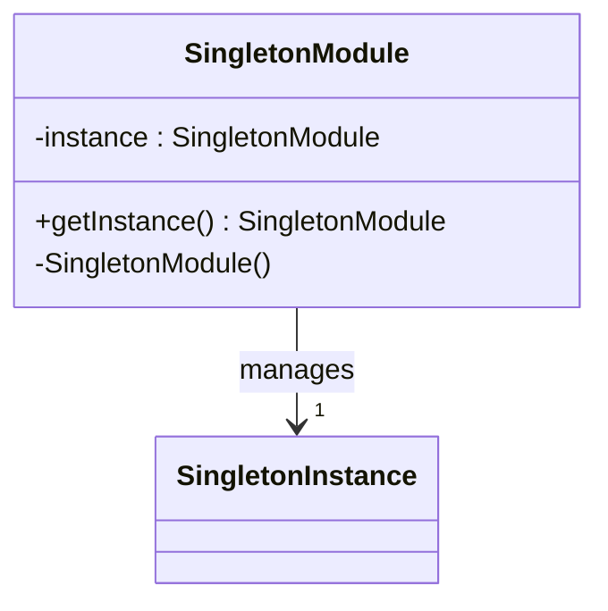

## 4.2 Singleton Pattern

In the realm of software design patterns, the Singleton pattern is a well-known creational pattern that restricts the instantiation of a class to a single object. This concept is particularly prevalent in object-oriented programming (OOP) where managing the lifecycle of objects is a central concern. However, in functional programming languages like F#, the need for Singleton patterns is often reduced due to the inherent characteristics of immutability and statelessness. In this section, we will explore the Singleton pattern, its relevance in F#, and how it can be effectively implemented using F# modules.

### Understanding the Singleton Pattern

The Singleton pattern is designed to ensure that a class has only one instance and provides a global point of access to that instance. This is particularly useful in scenarios where a single instance is required to coordinate actions across the system, such as in logging, configuration management, or connection pooling.

#### Purpose of the Singleton Pattern

- **Controlled Access to a Single Instance**: The primary purpose of the Singleton pattern is to control access to a single instance of a class. This ensures that no more than one instance exists, thereby preventing conflicts and ensuring consistency.
- **Global Access Point**: By providing a global access point, the Singleton pattern makes it easy to access the single instance from anywhere in the application.
- **Resource Management**: In scenarios where resources are limited or expensive to create, the Singleton pattern helps in managing these resources efficiently.

### Singleton Pattern in Functional Programming

In functional programming, the need for the Singleton pattern is often diminished due to the principles of immutability and statelessness. Functional languages like F# encourage the use of pure functions and immutable data structures, which naturally reduce the need for managing object lifecycles.

#### Why Singleton is Less Common in Functional Programming

- **Immutability**: In functional programming, data is immutable, meaning it cannot be changed once created. This reduces the need for controlling object instances since shared state is minimized.
- **Statelessness**: Functional programming emphasizes statelessness, where functions do not rely on or alter external state. This further reduces the need for Singleton patterns, as state management is not a primary concern.
- **Higher-Order Functions**: Functional programming leverages higher-order functions to manage behavior, reducing the need for single-instance objects.

### Implementing Singleton Pattern in F# Using Modules

In F#, modules naturally act as single instances. A module is a collection of functions, types, and values that can be used to encapsulate state or functionality that should only exist once. This makes modules an ideal candidate for implementing the Singleton pattern in F#.

#### Using Modules as Singletons

F# modules are inherently single-instance, meaning they are initialized once and can be accessed globally. This aligns with the Singleton pattern's goal of providing a single point of access.

```fsharp
module Logger =
    let private logFile = "log.txt"

    let log message =
        // Append the message to the log file
        System.IO.File.AppendAllText(logFile, message + "\n")

// Usage
Logger.log "This is a log message."
```

In the example above, the `Logger` module encapsulates logging functionality. The `logFile` is a private value, ensuring that it is not accessible outside the module. The `log` function appends messages to the log file, demonstrating how a module can encapsulate functionality that should only exist once.

#### Thread Safety and Module Initialization

F# ensures that modules are initialized in a thread-safe manner. This means that the initialization of a module is guaranteed to occur only once, even in concurrent applications. This is achieved through the use of lazy initialization, where the module is initialized the first time it is accessed.

```fsharp
module Config =
    let private configValue = lazy (System.IO.File.ReadAllText("config.json"))

    let getConfig () =
        configValue.Value

// Usage
let config = Config.getConfig()
```

In this example, the `Config` module uses lazy initialization to read the configuration file. The `configValue` is a `lazy` value, ensuring that the file is read only once, even if accessed concurrently.

### Scenarios for Singleton Pattern in F#

While the need for Singleton patterns is reduced in functional programming, there are scenarios where it is still appropriate in F#:

- **Interfacing with External Resources**: When interacting with external resources such as databases or file systems, a Singleton pattern can help manage connections or access points.
- **Shared Caches**: In applications where caching is necessary, a Singleton pattern can be used to maintain a shared cache across the application.

#### Example: Singleton for Database Connection

```fsharp
module Database =
    let private connectionString = "Data Source=myServerAddress;Initial Catalog=myDataBase;User Id=myUsername;Password=myPassword;"

    let private connection = lazy (new System.Data.SqlClient.SqlConnection(connectionString))

    let getConnection () =
        connection.Value

// Usage
let dbConnection = Database.getConnection()
```

In this example, the `Database` module manages a single database connection using lazy initialization. The `connection` is a `lazy` value, ensuring that the connection is established only once.

### Best Practices for Singleton Pattern in F#

When implementing the Singleton pattern in F#, it is important to adhere to best practices to ensure that single-instance components remain pure and side-effect-free whenever possible:

- **Maintain Purity**: Ensure that the functionality encapsulated in the Singleton is pure, meaning it does not rely on or alter external state.
- **Minimize Side Effects**: Avoid side effects within the Singleton. If side effects are necessary, document them clearly and manage them responsibly.
- **Consider Functional Alternatives**: Before implementing a Singleton, consider functional alternatives such as higher-order functions or immutable data structures.

### Caution Against Overusing Singleton Pattern

While the Singleton pattern can be useful, it is important to avoid overusing it. Over-reliance on Singletons can lead to tightly coupled code and make testing difficult. Consider the following points:

- **Evaluate Necessity**: Assess whether a Singleton is truly necessary or if a functional alternative would suffice.
- **Avoid Global State**: Singletons can introduce global state, which is contrary to functional programming principles. Use them judiciously.
- **Ensure Testability**: Design Singletons in a way that they can be easily tested, avoiding dependencies on external state.

### Visualizing Singleton Pattern in F#

To better understand how the Singleton pattern fits into the functional programming paradigm, let's visualize the concept using a diagram.



**Diagram Description**: The diagram illustrates a Singleton module managing a single instance. The `getInstance` method provides access to the instance, while the `instance` variable holds the single instance. This encapsulation ensures that only one instance exists, aligning with the Singleton pattern's purpose.

### Try It Yourself

To solidify your understanding of the Singleton pattern in F#, try modifying the code examples provided:

- **Experiment with Lazy Initialization**: Modify the `Config` module to read from a different file format, such as XML or YAML. Observe how lazy initialization ensures thread safety.
- **Create a Singleton for a Shared Cache**: Implement a module that manages a shared cache for frequently accessed data. Consider how immutability can be leveraged to maintain consistency.

### Knowledge Check

To reinforce your understanding of the Singleton pattern in F#, consider the following questions:

- What are the primary purposes of the Singleton pattern?
- How do F# modules naturally align with the Singleton pattern?
- Why is the need for Singleton patterns reduced in functional programming?
- What are some scenarios where a Singleton might still be appropriate in F#?
- What are the best practices for implementing Singletons in F#?

### Embrace the Journey

Remember, this is just the beginning. As you progress, you'll discover more ways to leverage functional programming principles to create robust and maintainable applications. Keep experimenting, stay curious, and enjoy the journey!

## Quiz Time!



### What is the primary purpose of the Singleton pattern?

- [x] To ensure a class has only one instance and provide a global point of access.
- [ ] To create multiple instances of a class.
- [ ] To manage memory allocation for objects.
- [ ] To enhance the performance of a program.

> **Explanation:** The Singleton pattern is designed to ensure that a class has only one instance and provides a global point of access to that instance.

### Why is the need for the Singleton pattern reduced in functional programming?

- [x] Because functional programming emphasizes immutability and statelessness.
- [ ] Because functional programming does not support object-oriented concepts.
- [ ] Because functional programming languages do not allow global variables.
- [ ] Because functional programming is not used in large applications.

> **Explanation:** In functional programming, the principles of immutability and statelessness reduce the need for managing object lifecycles, thereby diminishing the need for Singleton patterns.

### How do F# modules naturally align with the Singleton pattern?

- [x] F# modules are initialized once and can be accessed globally, acting as single instances.
- [ ] F# modules can create multiple instances of a class.
- [ ] F# modules are not related to the Singleton pattern.
- [ ] F# modules are used to manage memory allocation.

> **Explanation:** F# modules are inherently single-instance, meaning they are initialized once and can be accessed globally, aligning with the Singleton pattern's goal of providing a single point of access.

### What is a scenario where a Singleton might still be appropriate in F#?

- [x] When interfacing with external resources like databases.
- [ ] When creating multiple instances of a class.
- [ ] When managing local variables.
- [ ] When writing simple scripts.

> **Explanation:** A Singleton pattern might still be appropriate in F# when interfacing with external resources such as databases or file systems, where a single instance is beneficial for managing connections or access points.

### What is a best practice for implementing Singletons in F#?

- [x] Ensure that the functionality encapsulated in the Singleton is pure and side-effect-free.
- [ ] Use global variables extensively within the Singleton.
- [ ] Avoid using lazy initialization.
- [ ] Implement Singletons for every module.

> **Explanation:** It is important to ensure that the functionality encapsulated in the Singleton is pure and side-effect-free whenever possible, adhering to functional programming principles.

### What is lazy initialization in F#?

- [x] A technique to defer the creation of an object until it is needed.
- [ ] A method to create multiple instances of a class.
- [ ] A way to enhance the performance of a program.
- [ ] A technique to manage memory allocation.

> **Explanation:** Lazy initialization is a technique used to defer the creation of an object until it is needed, ensuring that resources are used efficiently.

### How does F# ensure thread safety for modules?

- [x] By using lazy initialization to ensure modules are initialized only once.
- [ ] By creating multiple instances of modules.
- [ ] By using global variables within modules.
- [ ] By avoiding the use of modules in concurrent applications.

> **Explanation:** F# ensures thread safety for modules by using lazy initialization, which guarantees that modules are initialized only once, even in concurrent applications.

### What is a potential drawback of overusing the Singleton pattern?

- [x] It can lead to tightly coupled code and make testing difficult.
- [ ] It enhances the performance of a program.
- [ ] It simplifies memory management.
- [ ] It reduces the need for global variables.

> **Explanation:** Overusing the Singleton pattern can lead to tightly coupled code and make testing difficult, as it introduces global state and dependencies.

### What is the role of immutability in reducing the need for Singletons?

- [x] Immutability reduces the need for shared state, minimizing the need for Singletons.
- [ ] Immutability increases the need for Singletons.
- [ ] Immutability is unrelated to the need for Singletons.
- [ ] Immutability enhances the performance of Singletons.

> **Explanation:** Immutability reduces the need for shared state, which in turn minimizes the need for Singletons, as there is less need to manage object lifecycles.

### True or False: F# modules can be used to encapsulate state or functionality that should only exist once.

- [x] True
- [ ] False

> **Explanation:** True. F# modules are inherently single-instance and can be used to encapsulate state or functionality that should only exist once, aligning with the Singleton pattern's purpose.


