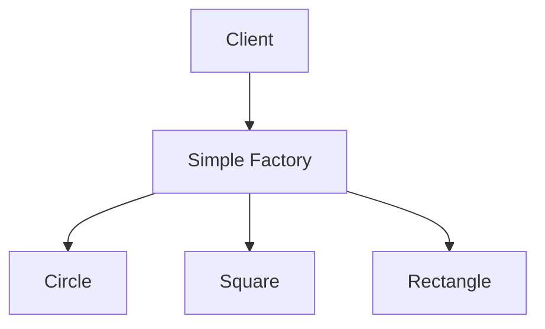

## 4.3.1 Simple Factory Pattern

In the realm of software design, the Simple Factory Pattern is a foundational creational pattern that centralizes the logic for creating objects. This pattern is particularly useful in scenarios where a system needs to instantiate objects of different types but wants to abstract away the instantiation logic from the client code. In this section, we will delve into how the Simple Factory Pattern can be effectively implemented in F#, leveraging the language's functional programming features such as type inference and pattern matching.

### Introduction to the Simple Factory Pattern

The Simple Factory Pattern is not a formal design pattern but a programming idiom that provides a simple interface for creating instances of different classes. It encapsulates the instantiation logic within a single function or module, allowing clients to request objects without needing to know the details of their creation.

#### Role of the Simple Factory Pattern

The primary role of the Simple Factory Pattern is to centralize the creation logic of objects. By doing so, it offers several advantages:

- **Encapsulation of Creation Logic**: The pattern hides the complexities involved in creating objects, providing a clean interface for clients.
- **Improved Maintainability**: Changes to the creation logic or the types of objects being created can be made in one place without affecting client code.
- **Flexibility**: The factory can be easily extended to create new types of objects as requirements evolve.

### Implementing the Simple Factory Pattern in F#

In F#, functions can serve as factories by returning different types or instances based on input parameters. This approach aligns well with F#'s functional programming paradigm, where functions are first-class citizens.

#### Using Functions as Factories

In F#, a simple factory can be implemented as a function that takes parameters and returns an instance of a type. Let's explore this with an example.

```fsharp
// Define a discriminated union for different shapes
type Shape =
    | Circle of radius: float
    | Square of side: float
    | Rectangle of width: float * height: float

// Factory function to create shapes
let createShape shapeType dimensions =
    match shapeType with
    | "Circle" -> Circle dimensions
    | "Square" -> Square dimensions
    | "Rectangle" -> Rectangle dimensions
    | _ -> failwith "Unknown shape type"

// Example usage
let circle = createShape "Circle" 5.0
let square = createShape "Square" 4.0
let rectangle = createShape "Rectangle" (3.0, 6.0)
```

In this example, `createShape` is a factory function that takes a `shapeType` string and `dimensions` as input and returns an instance of the `Shape` discriminated union. The function uses pattern matching to determine which type of shape to create based on the `shapeType`.

#### Benefits of Factory Functions

Factory functions offer several benefits, especially in a functional programming language like F#:

- **Type Inference**: F#'s powerful type inference system reduces the need for explicit type annotations, making the code cleaner and easier to read.
- **Pattern Matching**: The use of pattern matching simplifies the logic for selecting which type of object to create.
- **Immutability**: By default, objects created using factory functions can be immutable, aligning with functional programming principles.
- **Decoupling**: The creation logic is decoupled from the client code, allowing for easier changes and extensions.

### Advanced Example: Factory with Interfaces

Let's consider a more advanced example where we use interfaces to define a contract for the objects created by the factory.

```fsharp
// Define an interface for shapes
type IShape =
    abstract member Area: unit -> float

// Implement the interface for different shapes
type Circle(radius: float) =
    interface IShape with
        member this.Area() = System.Math.PI * radius * radius

type Square(side: float) =
    interface IShape with
        member this.Area() = side * side

type Rectangle(width: float, height: float) =
    interface IShape with
        member this.Area() = width * height

// Factory function to create shapes
let createShape shapeType dimensions =
    match shapeType with
    | "Circle" -> Circle dimensions :> IShape
    | "Square" -> Square dimensions :> IShape
    | "Rectangle" -> Rectangle dimensions :> IShape
    | _ -> failwith "Unknown shape type"

// Example usage
let circle = createShape "Circle" 5.0
let square = createShape "Square" 4.0
let rectangle = createShape "Rectangle" (3.0, 6.0)

// Calculate areas
let circleArea = (circle :?> IShape).Area()
let squareArea = (square :?> IShape).Area()
let rectangleArea = (rectangle :?> IShape).Area()
```

In this example, we define an `IShape` interface with an `Area` method. Each concrete shape class implements this interface, providing its own implementation of the `Area` method. The factory function `createShape` returns objects as `IShape`, allowing clients to interact with them through the interface.

### Visualizing the Simple Factory Pattern

To better understand the flow of the Simple Factory Pattern, let's visualize it using a Mermaid.js diagram.



**Diagram Description**: The diagram illustrates how the client interacts with the Simple Factory, which in turn creates instances of different shapes (Circle, Square, Rectangle) based on the input parameters.

### Try It Yourself

To deepen your understanding, try modifying the code examples:

- **Add a new shape**: Implement a `Triangle` type and extend the factory function to create triangles.
- **Enhance the interface**: Add a `Perimeter` method to the `IShape` interface and implement it in each shape class.
- **Refactor the factory**: Experiment with different ways to structure the factory function, such as using a dictionary to map shape types to creation functions.

### Knowledge Check

Before we wrap up, let's reinforce what we've learned:

- **What is the primary role of the Simple Factory Pattern?**
  - To centralize object creation logic and provide a simple interface for clients.

- **How does F#'s type inference benefit factory functions?**
  - It reduces the need for explicit type annotations, making the code cleaner.

- **What is the advantage of using pattern matching in factory functions?**
  - It simplifies the logic for selecting which type of object to create.

### Conclusion

The Simple Factory Pattern is a powerful tool for centralizing object creation logic, and F#'s functional programming features make it particularly effective. By using functions as factories, we can leverage type inference, pattern matching, and immutability to create flexible and maintainable code. As you continue to explore F# and design patterns, remember to experiment and adapt these concepts to fit your specific needs.

## Quiz Time!



### What is the primary role of the Simple Factory Pattern?

- [x] To centralize object creation logic and provide a simple interface for clients.
- [ ] To manage the lifecycle of objects.
- [ ] To enforce a strict hierarchy of classes.
- [ ] To optimize memory usage.

> **Explanation:** The Simple Factory Pattern centralizes the logic for creating objects, providing a simple interface for clients to request instances without knowing the details of their creation.

### How does F#'s type inference benefit factory functions?

- [x] It reduces the need for explicit type annotations, making the code cleaner.
- [ ] It automatically generates factory functions.
- [ ] It enforces strict type hierarchies.
- [ ] It optimizes runtime performance.

> **Explanation:** F#'s type inference reduces the need for explicit type annotations, which simplifies the code and makes it more readable.

### What is the advantage of using pattern matching in factory functions?

- [x] It simplifies the logic for selecting which type of object to create.
- [ ] It enforces strict type hierarchies.
- [ ] It optimizes runtime performance.
- [ ] It automatically generates factory functions.

> **Explanation:** Pattern matching allows for concise and clear logic to determine which type of object to create based on input parameters.

### In the provided example, what does the `createShape` function return?

- [x] An instance of the `Shape` discriminated union.
- [ ] A string representing the shape type.
- [ ] A list of shape instances.
- [ ] A boolean indicating success or failure.

> **Explanation:** The `createShape` function returns an instance of the `Shape` discriminated union based on the input parameters.

### What is a benefit of using interfaces in the Simple Factory Pattern?

- [x] They allow for polymorphic behavior and interaction through a common contract.
- [ ] They automatically generate factory functions.
- [x] They enforce strict type hierarchies.
- [ ] They optimize runtime performance.

> **Explanation:** Interfaces allow for polymorphic behavior, enabling objects to be interacted with through a common contract, which is useful in the Simple Factory Pattern.

### How can the Simple Factory Pattern improve maintainability?

- [x] By centralizing creation logic, changes can be made in one place without affecting client code.
- [ ] By enforcing strict type hierarchies.
- [ ] By optimizing runtime performance.
- [ ] By automatically generating factory functions.

> **Explanation:** Centralizing the creation logic in a factory function allows for changes to be made in one place, improving maintainability.

### What is a potential modification you can try with the provided code example?

- [x] Add a new shape type and extend the factory function to create it.
- [ ] Remove the pattern matching logic.
- [x] Implement a new interface for shapes.
- [ ] Optimize runtime performance.

> **Explanation:** Adding a new shape type and extending the factory function to create it is a practical modification to try.

### What does the `createShape` function use to determine which type of shape to create?

- [x] Pattern matching on the `shapeType` string.
- [ ] A list of shape instances.
- [ ] A boolean flag.
- [ ] A complex algorithm.

> **Explanation:** The `createShape` function uses pattern matching on the `shapeType` string to determine which type of shape to create.

### What does the `IShape` interface define in the advanced example?

- [x] A contract for shapes with an `Area` method.
- [ ] A list of shape instances.
- [ ] A boolean flag.
- [ ] A complex algorithm.

> **Explanation:** The `IShape` interface defines a contract for shapes with an `Area` method, allowing for polymorphic behavior.

### True or False: The Simple Factory Pattern is a formal design pattern.

- [x] False
- [ ] True

> **Explanation:** The Simple Factory Pattern is not a formal design pattern but a programming idiom that provides a simple interface for creating instances of different classes.


