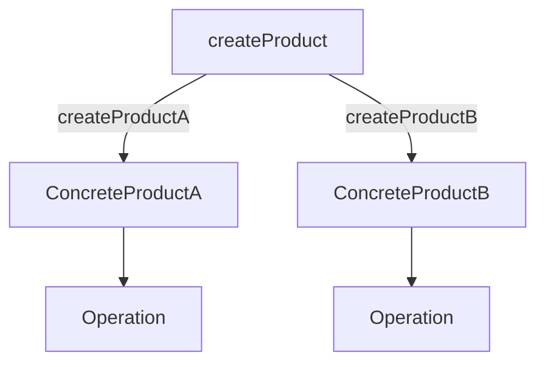

## 4.3.2 Factory Method Pattern

In this section, we delve into the Factory Method Pattern, a creational design pattern traditionally used in object-oriented programming (OOP) to create objects through inheritance. We will explore how this pattern can be adapted to F#, a functional programming language, using higher-order functions and partial application. This approach allows for extensibility and customization without relying on class hierarchies, offering simpler abstractions and reduced boilerplate code.

### Understanding the Factory Method Pattern

The Factory Method Pattern is a creational design pattern that defines an interface for creating an object but allows subclasses to alter the type of objects that will be created. This pattern promotes loose coupling by eliminating the need to instantiate classes directly, thus adhering to the Dependency Inversion Principle.

#### Traditional OOP Implementation

In OOP, the Factory Method Pattern is typically implemented through inheritance. A base class defines the factory method, which is overridden by subclasses to create specific instances.

```csharp
// C# Example of Factory Method Pattern
public abstract class Creator
{
    public abstract IProduct FactoryMethod();
}

public class ConcreteCreatorA : Creator
{
    public override IProduct FactoryMethod()
    {
        return new ConcreteProductA();
    }
}

public class ConcreteCreatorB : Creator
{
    public override IProduct FactoryMethod()
    {
        return new ConcreteProductB();
    }
}
```

In this example, `Creator` is an abstract class with a factory method `FactoryMethod()`. Subclasses `ConcreteCreatorA` and `ConcreteCreatorB` override this method to create specific products.

### Adapting the Factory Method Pattern in F#

In F#, we can adapt the Factory Method Pattern using higher-order functions and partial application. This approach leverages F#'s functional capabilities to achieve similar extensibility and decoupling without subclassing.

#### Higher-Order Functions and Partial Application

Higher-order functions are functions that take other functions as arguments or return them as results. Partial application refers to the process of fixing a number of arguments to a function, producing another function of smaller arity.

#### Implementing Factory Method Pattern in F#

Let's explore how we can implement the Factory Method Pattern in F# using higher-order functions.

```fsharp
// Define a type for products
type IProduct =
    abstract member Operation: unit -> string

// Concrete product implementations
type ConcreteProductA() =
    interface IProduct with
        member this.Operation() = "Result from ConcreteProductA"

type ConcreteProductB() =
    interface IProduct with
        member this.Operation() = "Result from ConcreteProductB"

// Factory method using higher-order functions
let createProduct factoryMethod =
    factoryMethod()

// Factory methods for each product
let createProductA () = ConcreteProductA() :> IProduct
let createProductB () = ConcreteProductB() :> IProduct

// Usage
let productA = createProduct createProductA
let productB = createProduct createProductB

printfn "%s" (productA.Operation())
printfn "%s" (productB.Operation())
```

In this example, `createProduct` is a higher-order function that takes a factory method as an argument. `createProductA` and `createProductB` are factory methods that create instances of `ConcreteProductA` and `ConcreteProductB`, respectively.

### Extensibility and Decoupling in F#

The functional approach to the Factory Method Pattern in F# provides several advantages:

1. **Simpler Abstractions**: By using functions instead of classes, we reduce the complexity associated with class hierarchies.
2. **Reduced Boilerplate Code**: F#'s concise syntax and functional constructs minimize the amount of code needed to implement the pattern.
3. **Extensibility**: New product types can be added by simply defining new factory methods without modifying existing code.
4. **Decoupling**: The creation logic is decoupled from the product interface, promoting loose coupling.

### Advantages of the Functional Approach

The functional approach to implementing the Factory Method Pattern in F# offers several benefits over the traditional OOP approach:

- **Flexibility**: Functions can be easily composed and reused, providing flexibility in how objects are created and managed.
- **Immutability**: F# encourages immutability, reducing the risk of side effects and improving code reliability.
- **Type Safety**: F#'s strong type system ensures that factory methods return the correct product types, catching errors at compile time.

### Visualizing the Factory Method Pattern in F#

To better understand the flow of the Factory Method Pattern in F#, let's visualize it using a Mermaid.js diagram.



This diagram illustrates how the `createProduct` function takes different factory methods (`createProductA` and `createProductB`) to create instances of `ConcreteProductA` and `ConcreteProductB`, respectively. Each product then performs its `Operation`.

### Try It Yourself

To deepen your understanding, try modifying the code examples:

- **Add a New Product Type**: Define a new product type and a corresponding factory method. Use the `createProduct` function to create an instance of your new product.
- **Experiment with Partial Application**: Modify the factory methods to accept parameters and use partial application to create customized product instances.

### Knowledge Check

- **What are higher-order functions, and how do they relate to the Factory Method Pattern in F#?**
- **How does partial application enhance the flexibility of factory methods in F#?**
- **What are the advantages of using functions over classes for implementing the Factory Method Pattern in F#?**

### Conclusion

The Factory Method Pattern, when adapted to F#, leverages the power of functional programming to provide a flexible, extensible, and decoupled approach to object creation. By using higher-order functions and partial application, we can achieve the benefits of the pattern without the complexity of class hierarchies. As you continue to explore F# and functional design patterns, remember that the journey is ongoing. Keep experimenting, stay curious, and enjoy the process of learning and applying these powerful concepts.

## Quiz Time!



### What is the primary purpose of the Factory Method Pattern?

- [x] To define an interface for creating objects, allowing subclasses to alter the type of objects created.
- [ ] To create a single instance of a class.
- [ ] To encapsulate a group of individual factories.
- [ ] To provide a simplified interface to a complex system.

> **Explanation:** The Factory Method Pattern defines an interface for creating objects, allowing subclasses to alter the type of objects created, promoting loose coupling.

### How does F# adapt the Factory Method Pattern?

- [x] By using higher-order functions and partial application.
- [ ] By using class hierarchies and inheritance.
- [ ] By using global variables.
- [ ] By using singleton instances.

> **Explanation:** F# adapts the Factory Method Pattern using higher-order functions and partial application, leveraging functional programming constructs.

### What is a higher-order function?

- [x] A function that takes other functions as arguments or returns them as results.
- [ ] A function that is defined at a higher level of abstraction.
- [ ] A function that operates on higher data types.
- [ ] A function that is more efficient than lower-order functions.

> **Explanation:** A higher-order function is one that takes other functions as arguments or returns them as results, enabling functional composition and abstraction.

### What is partial application in F#?

- [x] The process of fixing a number of arguments to a function, producing another function of smaller arity.
- [ ] The process of applying a function to all elements of a list.
- [ ] The process of partially executing a function.
- [ ] The process of creating a partial copy of a function.

> **Explanation:** Partial application involves fixing some arguments of a function, resulting in a new function with fewer arguments.

### What are the advantages of using functions over classes in F#?

- [x] Simpler abstractions and reduced boilerplate code.
- [ ] Increased complexity and more boilerplate code.
- [ ] Less flexibility and more coupling.
- [ ] More side effects and less reliability.

> **Explanation:** Using functions in F# leads to simpler abstractions, reduced boilerplate code, and increased flexibility and decoupling.

### How does the functional approach promote immutability?

- [x] By encouraging the use of immutable data structures and reducing side effects.
- [ ] By allowing global state changes.
- [ ] By using mutable variables extensively.
- [ ] By relying on inheritance and polymorphism.

> **Explanation:** The functional approach promotes immutability by encouraging the use of immutable data structures and reducing side effects, leading to more reliable code.

### What is the role of the `createProduct` function in the F# example?

- [x] It is a higher-order function that takes a factory method as an argument to create a product.
- [ ] It is a class that instantiates products directly.
- [ ] It is a global variable that holds product instances.
- [ ] It is a method that modifies product attributes.

> **Explanation:** The `createProduct` function is a higher-order function that takes a factory method as an argument to create a product, demonstrating the Factory Method Pattern in F#.

### What is the benefit of decoupling creation logic from the product interface?

- [x] It promotes loose coupling and flexibility in object creation.
- [ ] It makes the code more complex and harder to maintain.
- [ ] It reduces the ability to extend the system.
- [ ] It increases the dependency on specific product implementations.

> **Explanation:** Decoupling creation logic from the product interface promotes loose coupling and flexibility, allowing for easier extension and maintenance.

### How can new product types be added in the F# implementation?

- [x] By defining new factory methods without modifying existing code.
- [ ] By modifying the existing product interface.
- [ ] By changing the `createProduct` function.
- [ ] By adding new subclasses to the existing class hierarchy.

> **Explanation:** New product types can be added by defining new factory methods, which does not require changes to existing code, enhancing extensibility.

### True or False: The functional approach to the Factory Method Pattern in F# relies heavily on subclassing.

- [ ] True
- [x] False

> **Explanation:** False. The functional approach in F# does not rely on subclassing; instead, it uses higher-order functions and partial application to achieve extensibility and decoupling.


