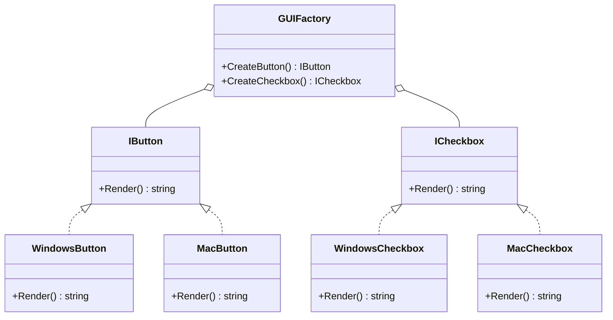

## 4.3.3 Abstract Factory Pattern

In the realm of software design patterns, the Abstract Factory Pattern stands out as a powerful tool for creating families of related objects without specifying their concrete classes. This pattern is particularly useful in scenarios where a system needs to be independent of how its objects are created, composed, and represented. In this section, we will delve into the Abstract Factory Pattern, explore its implementation in F#, and understand its benefits in enhancing modularity and flexibility in software systems.

### Understanding the Abstract Factory Pattern

The Abstract Factory Pattern provides an interface for creating families of related or dependent objects without specifying their concrete classes. This pattern is a creational pattern, which means it deals with object creation mechanisms, trying to create objects in a manner suitable to the situation.

#### Purpose and Use Cases

The primary purpose of the Abstract Factory Pattern is to encapsulate a group of individual factories that have a common theme. It is often used when:

- A system should be independent of how its products are created, composed, and represented.
- A system should be configured with one of multiple families of products.
- A family of related product objects is designed to be used together, and you need to enforce this constraint.
- You want to provide a library of products, and you want to reveal just their interfaces, not their implementations.

### Implementing Abstract Factory in F#

In F#, we can represent an abstract factory using records of functions or modules containing related creation functions. This approach leverages F#'s functional programming capabilities to create flexible and interchangeable factories.

#### Using Records of Functions

A common way to implement the Abstract Factory Pattern in F# is by using records of functions. This method allows us to define a set of creation functions that can be easily swapped out or modified.

```fsharp
// Define interfaces for products
type IButton =
    abstract member Render: unit -> string

type ICheckbox =
    abstract member Render: unit -> string

// Concrete implementations of products
type WindowsButton() =
    interface IButton with
        member _.Render() = "Rendering a Windows button."

type MacButton() =
    interface IButton with
        member _.Render() = "Rendering a Mac button."

type WindowsCheckbox() =
    interface ICheckbox with
        member _.Render() = "Rendering a Windows checkbox."

type MacCheckbox() =
    interface ICheckbox with
        member _.Render() = "Rendering a Mac checkbox."

// Abstract factory represented as a record of functions
type GUIFactory = {
    CreateButton: unit -> IButton
    CreateCheckbox: unit -> ICheckbox
}

// Concrete factories
let windowsFactory = {
    CreateButton = fun () -> WindowsButton() :> IButton
    CreateCheckbox = fun () -> WindowsCheckbox() :> ICheckbox
}

let macFactory = {
    CreateButton = fun () -> MacButton() :> IButton
    CreateCheckbox = fun () -> MacCheckbox() :> ICheckbox
}

// Client code
let renderUI (factory: GUIFactory) =
    let button = factory.CreateButton()
    let checkbox = factory.CreateCheckbox()
    printfn "%s" (button.Render())
    printfn "%s" (checkbox.Render())

// Usage
renderUI windowsFactory
renderUI macFactory
```

In this example, we define interfaces for `IButton` and `ICheckbox`, along with their concrete implementations for Windows and Mac. The `GUIFactory` record contains functions to create these products. We then define concrete factories `windowsFactory` and `macFactory` that implement these functions. The client code uses a factory to create and render the UI components.

#### Using Modules

Another approach is to use modules to encapsulate the creation logic. This method provides a more organized structure, especially when dealing with larger systems.

```fsharp
// Define interfaces for products
type IButton =
    abstract member Render: unit -> string

type ICheckbox =
    abstract member Render: unit -> string

// Concrete implementations of products
type WindowsButton() =
    interface IButton with
        member _.Render() = "Rendering a Windows button."

type MacButton() =
    interface IButton with
        member _.Render() = "Rendering a Mac button."

type WindowsCheckbox() =
    interface ICheckbox with
        member _.Render() = "Rendering a Windows checkbox."

type MacCheckbox() =
    interface ICheckbox with
        member _.Render() = "Rendering a Mac checkbox."

// Abstract factory represented as a module
module GUIFactory =
    let createWindowsFactory() = 
        { CreateButton = fun () -> WindowsButton() :> IButton
          CreateCheckbox = fun () -> WindowsCheckbox() :> ICheckbox }

    let createMacFactory() = 
        { CreateButton = fun () -> MacButton() :> IButton
          CreateCheckbox = fun () -> MacCheckbox() :> ICheckbox }

// Client code
let renderUI (factory: GUIFactory) =
    let button = factory.CreateButton()
    let checkbox = factory.CreateCheckbox()
    printfn "%s" (button.Render())
    printfn "%s" (checkbox.Render())

// Usage
renderUI (GUIFactory.createWindowsFactory())
renderUI (GUIFactory.createMacFactory())
```

In this version, we encapsulate the factory creation logic within the `GUIFactory` module. This approach can help in organizing the code better and making it more maintainable.

### Benefits of the Abstract Factory Pattern

The Abstract Factory Pattern offers several benefits, especially when implemented in a functional language like F#:

- **Modularity**: By encapsulating the creation logic, the pattern promotes modularity and separation of concerns.
- **Interchangeability**: Different factories can be easily swapped out, allowing for different configurations (e.g., testing vs. production).
- **Scalability**: As new product families are added, new factories can be created without altering existing code.
- **Maintainability**: The use of records and modules makes the codebase easier to maintain and extend.

### Visualizing the Abstract Factory Pattern

To better understand the Abstract Factory Pattern, let's visualize the relationships between the components using a class diagram.



This diagram illustrates how the `GUIFactory` interacts with the `IButton` and `ICheckbox` interfaces and their concrete implementations.

### Try It Yourself

To deepen your understanding of the Abstract Factory Pattern, try modifying the code examples:

- **Add a new product type**: Introduce a new product type, such as `ISlider`, and implement it for both Windows and Mac.
- **Create a new factory**: Implement a new factory for a different platform, such as Linux, and integrate it with the existing system.
- **Experiment with modules**: Refactor the code to use modules for organizing the factory logic and observe the differences in code structure.

### Knowledge Check

- What are the core components of the Abstract Factory Pattern?
- How does the Abstract Factory Pattern enhance modularity and flexibility?
- What are the advantages of using records of functions in F# for implementing the Abstract Factory Pattern?

### Conclusion

The Abstract Factory Pattern is a versatile and powerful design pattern that enhances the modularity, flexibility, and maintainability of software systems. By leveraging F#'s functional programming features, we can implement this pattern in a way that is both elegant and efficient. As you continue to explore design patterns in F#, remember to experiment, adapt, and apply these concepts to your projects to unlock their full potential.

## Quiz Time!



### What is the primary purpose of the Abstract Factory Pattern?

- [x] To provide an interface for creating families of related objects without specifying their concrete classes.
- [ ] To ensure a class has only one instance.
- [ ] To separate the construction of a complex object from its representation.
- [ ] To define a family of interchangeable algorithms.

> **Explanation:** The Abstract Factory Pattern provides an interface for creating families of related or dependent objects without specifying their concrete classes.

### How can the Abstract Factory Pattern be represented in F#?

- [x] Using records of functions or modules containing related creation functions.
- [ ] Using classes with static methods.
- [ ] Using inheritance and polymorphism.
- [ ] Using a single function that returns different types.

> **Explanation:** In F#, the Abstract Factory Pattern can be represented using records of functions or modules containing related creation functions, leveraging F#'s functional programming capabilities.

### What is a benefit of using the Abstract Factory Pattern?

- [x] Enhanced modularity and ease of swapping implementations.
- [ ] Simplified code with fewer lines.
- [ ] Improved performance and speed.
- [ ] Reduced memory usage.

> **Explanation:** The Abstract Factory Pattern enhances modularity and makes it easier to swap implementations, providing flexibility in configuring systems.

### Which of the following is a concrete implementation of the IButton interface in the provided example?

- [x] WindowsButton
- [ ] GUIFactory
- [ ] ICheckbox
- [ ] MacFactory

> **Explanation:** `WindowsButton` is a concrete implementation of the `IButton` interface in the provided example.

### What is the role of the GUIFactory record in the code example?

- [x] It contains functions to create instances of related products.
- [ ] It defines the user interface layout.
- [ ] It manages user input and events.
- [ ] It handles database connections.

> **Explanation:** The `GUIFactory` record contains functions to create instances of related products, such as buttons and checkboxes.

### How does the Abstract Factory Pattern support testing?

- [x] By allowing interchangeable factories for different contexts, such as testing vs. production.
- [ ] By reducing the number of test cases needed.
- [ ] By automatically generating test data.
- [ ] By simplifying the test setup process.

> **Explanation:** The Abstract Factory Pattern supports testing by allowing interchangeable factories for different contexts, such as testing vs. production.

### What is a potential use case for the Abstract Factory Pattern?

- [x] Configuring a system with one of multiple families of products.
- [ ] Ensuring a class has only one instance.
- [ ] Separating the construction of a complex object from its representation.
- [ ] Defining a family of interchangeable algorithms.

> **Explanation:** A potential use case for the Abstract Factory Pattern is configuring a system with one of multiple families of products.

### Which of the following is a key feature of the Abstract Factory Pattern?

- [x] It provides an interface for creating families of related objects.
- [ ] It ensures a class has only one instance.
- [ ] It separates the construction of a complex object from its representation.
- [ ] It defines a family of interchangeable algorithms.

> **Explanation:** A key feature of the Abstract Factory Pattern is that it provides an interface for creating families of related objects.

### True or False: The Abstract Factory Pattern is a structural pattern.

- [ ] True
- [x] False

> **Explanation:** False. The Abstract Factory Pattern is a creational pattern, not a structural pattern.

### What is the advantage of using modules for implementing the Abstract Factory Pattern in F#?

- [x] It provides a more organized structure, especially for larger systems.
- [ ] It reduces the number of lines of code.
- [ ] It improves runtime performance.
- [ ] It simplifies error handling.

> **Explanation:** Using modules for implementing the Abstract Factory Pattern in F# provides a more organized structure, especially for larger systems.


