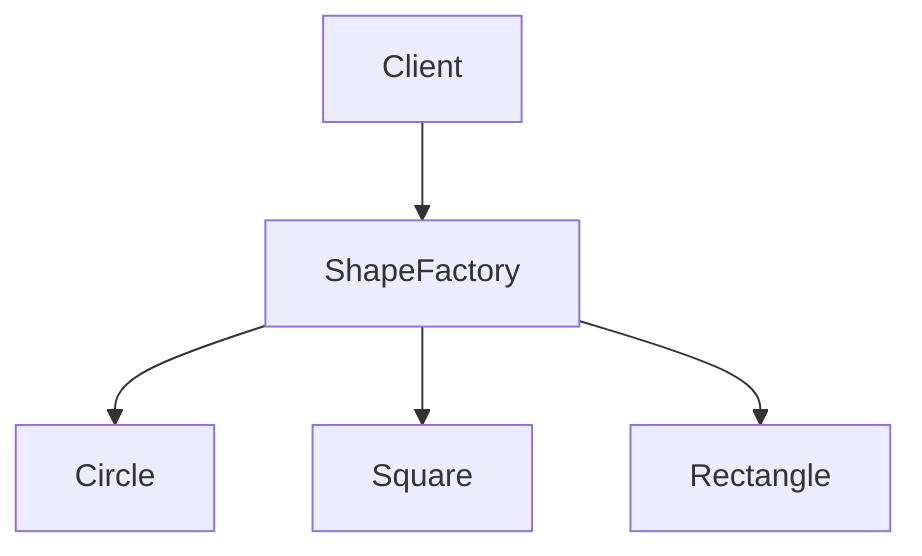
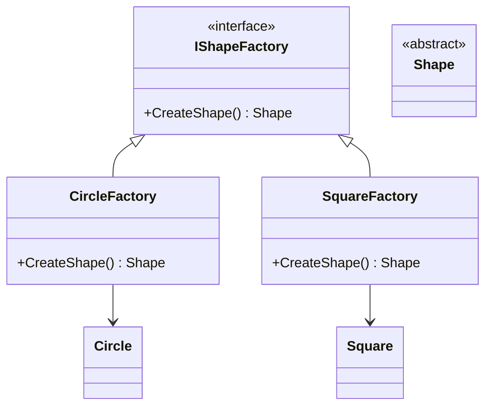
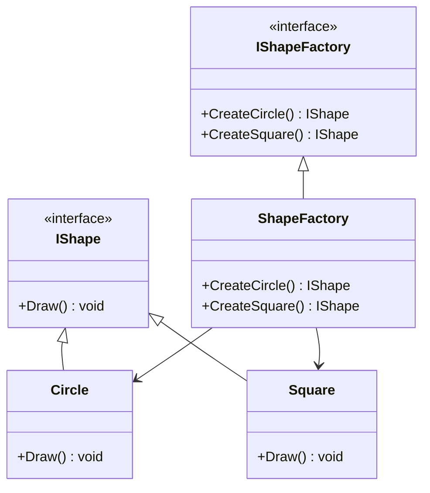

## 4.3 Factory Patterns

In the realm of software design, Factory Patterns are a cornerstone for managing object creation. They provide a way to encapsulate the instantiation logic, allowing developers to create objects without specifying the exact class of the object that will be created. This is particularly useful in scenarios where the system needs to be flexible and scalable, as it decouples the client code from the concrete classes it needs to instantiate.

### Introduction to Factory Patterns

Factory Patterns are part of the Creational Design Patterns family, which focuses on object creation mechanisms. The primary goal of these patterns is to create objects in a manner suitable to the situation. In F#, a language that emphasizes functional programming, Factory Patterns can be adapted to leverage the language's unique features such as immutability, first-class functions, and type inference.

#### Why Use Factory Patterns?

1. **Encapsulation of Creation Logic**: Factory Patterns encapsulate the logic required to create objects, which can help in maintaining and extending code.
2. **Decoupling**: They decouple the client code from the concrete classes, promoting loose coupling and enhancing system flexibility.
3. **Scalability**: By abstracting the creation process, Factory Patterns allow for easy scalability and modification of the system.
4. **Consistency**: They ensure that objects are created in a consistent manner, which can be important for maintaining system integrity.

### Types of Factory Patterns

There are several types of Factory Patterns, each serving different purposes and use cases. In this section, we will explore the following:

- **Simple Factory Pattern**: Encapsulates object creation logic in functions.
- **Factory Method Pattern**: Defines an interface for creating objects, but allows subclasses to alter the type of objects that will be created.
- **Abstract Factory Pattern**: Provides an interface for creating families of related or dependent objects without specifying their concrete classes.

Let's delve into each of these patterns and see how they can be implemented in F#.

### Simple Factory Pattern

The Simple Factory Pattern is the most straightforward of the Factory Patterns. It involves creating a function or a module that encapsulates the logic for creating objects. This pattern is not a formal design pattern but rather a programming idiom.

#### Implementing Simple Factory Pattern in F#

In F#, we can implement a Simple Factory using functions or modules. Let's consider a scenario where we need to create different types of `Shape` objects.

```fsharp
type Shape =
    | Circle of radius: float
    | Square of side: float
    | Rectangle of width: float * height: float

module ShapeFactory =
    let createShape shapeType dimensions =
        match shapeType with
        | "Circle" -> Circle dimensions
        | "Square" -> Square dimensions
        | "Rectangle" -> Rectangle dimensions
        | _ -> failwith "Unknown shape type"

// Usage
let circle = ShapeFactory.createShape "Circle" 5.0
let square = ShapeFactory.createShape "Square" 4.0
```

In this example, the `ShapeFactory` module encapsulates the logic for creating different shapes. This approach centralizes the creation logic, making it easier to manage and extend.

#### Advantages and Disadvantages

**Advantages:**
- **Centralized Creation Logic**: All creation logic is centralized in one place.
- **Ease of Use**: Simple to implement and use.

**Disadvantages:**
- **Limited Flexibility**: Not suitable for complex object creation scenarios.
- **No Subclassing**: Does not support subclassing or polymorphism.

### Factory Method Pattern

The Factory Method Pattern provides a way to delegate the instantiation of objects to subclasses. It defines an interface for creating an object, but allows subclasses to alter the type of objects that will be created.

#### Implementing Factory Method Pattern in F#

In F#, the Factory Method Pattern can be implemented using interfaces and classes, or by leveraging discriminated unions and functions.

```fsharp
type IShapeFactory =
    abstract member CreateShape: unit -> Shape

type CircleFactory() =
    interface IShapeFactory with
        member this.CreateShape() = Circle 5.0

type SquareFactory() =
    interface IShapeFactory with
        member this.CreateShape() = Square 4.0

// Usage
let circleFactory = CircleFactory() :> IShapeFactory
let circle = circleFactory.CreateShape()

let squareFactory = SquareFactory() :> IShapeFactory
let square = squareFactory.CreateShape()
```

In this example, we define an interface `IShapeFactory` with a method `CreateShape`. The `CircleFactory` and `SquareFactory` classes implement this interface, providing their own implementation of the `CreateShape` method.

#### Advantages and Disadvantages

**Advantages:**
- **Polymorphism**: Supports polymorphism and subclassing.
- **Flexibility**: Allows subclasses to alter the type of objects that will be created.

**Disadvantages:**
- **Complexity**: More complex than the Simple Factory Pattern.
- **Overhead**: May introduce additional overhead due to subclassing.

### Abstract Factory Pattern

The Abstract Factory Pattern provides an interface for creating families of related or dependent objects without specifying their concrete classes. This pattern is particularly useful when a system needs to be independent of how its objects are created.

#### Implementing Abstract Factory Pattern in F#

In F#, the Abstract Factory Pattern can be implemented using interfaces and classes, or by leveraging modules and functions.

```fsharp
type IShape =
    abstract member Draw: unit -> unit

type Circle() =
    interface IShape with
        member this.Draw() = printfn "Drawing a Circle"

type Square() =
    interface IShape with
        member this.Draw() = printfn "Drawing a Square"

type IShapeFactory =
    abstract member CreateCircle: unit -> IShape
    abstract member CreateSquare: unit -> IShape

type ShapeFactory() =
    interface IShapeFactory with
        member this.CreateCircle() = Circle() :> IShape
        member this.CreateSquare() = Square() :> IShape

// Usage
let factory = ShapeFactory() :> IShapeFactory
let circle = factory.CreateCircle()
circle.Draw()

let square = factory.CreateSquare()
square.Draw()
```

In this example, the `IShapeFactory` interface defines methods for creating `Circle` and `Square` objects. The `ShapeFactory` class implements this interface, providing concrete implementations for the creation methods.

#### Advantages and Disadvantages

**Advantages:**
- **Family of Objects**: Suitable for creating families of related objects.
- **Decoupling**: Decouples the client code from the concrete classes.

**Disadvantages:**
- **Complexity**: More complex than the Factory Method Pattern.
- **Overhead**: May introduce additional overhead due to multiple interfaces and classes.

### Visualizing Factory Patterns

To better understand the relationships and flow of Factory Patterns, let's visualize them using Mermaid.js diagrams.

#### Simple Factory Pattern Diagram



**Description**: This diagram illustrates the Simple Factory Pattern, where the client interacts with the `ShapeFactory` to create different shapes.

#### Factory Method Pattern Diagram



**Description**: This diagram illustrates the Factory Method Pattern, where the `IShapeFactory` interface is implemented by `CircleFactory` and `SquareFactory`.

#### Abstract Factory Pattern Diagram



**Description**: This diagram illustrates the Abstract Factory Pattern, where the `IShapeFactory` interface is implemented by `ShapeFactory`, which creates `Circle` and `Square` objects.

### Try It Yourself

Now that we've explored the Factory Patterns in F#, it's time to experiment with the code. Try modifying the examples to create additional shapes or add new factories. Consider implementing a new pattern, such as a `TriangleFactory`, and see how it integrates with the existing architecture.

### Knowledge Check

Let's reinforce our understanding of Factory Patterns with some questions:

1. What are the main benefits of using Factory Patterns in software design?
2. How does the Factory Method Pattern differ from the Simple Factory Pattern?
3. What are the advantages of using the Abstract Factory Pattern?
4. Can you think of a scenario where a Simple Factory Pattern might be more appropriate than a Factory Method Pattern?

### Conclusion

Factory Patterns are a powerful tool in the software engineer's arsenal, providing a way to manage object creation in a flexible and scalable manner. By encapsulating the creation logic, these patterns promote loose coupling and enhance system maintainability. As you continue to explore F# and its capabilities, remember that the journey of mastering design patterns is ongoing. Keep experimenting, stay curious, and enjoy the process of building robust and elegant software solutions.

## Quiz Time!



### What is the primary purpose of Factory Patterns?

- [x] To encapsulate object creation logic
- [ ] To improve performance
- [ ] To simplify user interfaces
- [ ] To enhance security

> **Explanation:** Factory Patterns encapsulate the logic for creating objects, allowing for more flexible and maintainable code.

### Which pattern allows subclasses to alter the type of objects that will be created?

- [ ] Simple Factory Pattern
- [x] Factory Method Pattern
- [ ] Abstract Factory Pattern
- [ ] Singleton Pattern

> **Explanation:** The Factory Method Pattern allows subclasses to alter the type of objects that will be created by implementing the creation method.

### What is a disadvantage of the Simple Factory Pattern?

- [ ] It is too complex
- [x] It has limited flexibility
- [ ] It requires too many classes
- [ ] It is not suitable for polymorphism

> **Explanation:** The Simple Factory Pattern has limited flexibility and does not support subclassing or polymorphism.

### How does the Abstract Factory Pattern differ from the Factory Method Pattern?

- [x] It provides an interface for creating families of related objects
- [ ] It is simpler to implement
- [ ] It does not use interfaces
- [ ] It is specific to one type of object

> **Explanation:** The Abstract Factory Pattern provides an interface for creating families of related or dependent objects without specifying their concrete classes.

### Which diagram best represents the Simple Factory Pattern?

- [x] A flowchart showing the client interacting with a factory to create objects
- [ ] A class diagram with multiple interfaces
- [ ] A sequence diagram with multiple steps
- [ ] A state diagram with transitions

> **Explanation:** A flowchart is suitable for representing the Simple Factory Pattern, showing the client interacting with a factory to create objects.

### What is an advantage of using Factory Patterns?

- [x] They promote loose coupling
- [ ] They increase code complexity
- [ ] They require more memory
- [ ] They reduce code readability

> **Explanation:** Factory Patterns promote loose coupling by decoupling the client code from the concrete classes.

### Which pattern is most suitable for creating a family of related objects?

- [ ] Simple Factory Pattern
- [ ] Factory Method Pattern
- [x] Abstract Factory Pattern
- [ ] Singleton Pattern

> **Explanation:** The Abstract Factory Pattern is suitable for creating families of related or dependent objects.

### What is a key feature of the Factory Method Pattern?

- [x] It supports polymorphism
- [ ] It is the simplest pattern
- [ ] It does not use interfaces
- [ ] It is specific to one type of object

> **Explanation:** The Factory Method Pattern supports polymorphism by allowing subclasses to define the type of objects that will be created.

### True or False: The Simple Factory Pattern is a formal design pattern.

- [ ] True
- [x] False

> **Explanation:** The Simple Factory Pattern is not a formal design pattern but rather a programming idiom.

### What should you try modifying in the provided code examples?

- [x] Add new shapes or factories
- [ ] Remove all comments
- [ ] Change variable names
- [ ] Delete the factory modules

> **Explanation:** Modifying the code to add new shapes or factories helps in understanding and experimenting with Factory Patterns.


