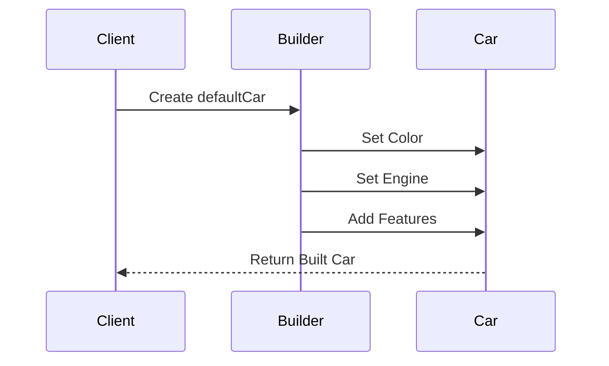

## 4.4 Builder Pattern

In the realm of software design, the Builder pattern is a creational pattern that provides a flexible solution for constructing complex objects. This pattern is particularly useful when an object requires numerous optional parameters or when the construction process involves multiple steps. In F#, the Builder pattern can be elegantly implemented using functional programming techniques such as function composition, partial application, and pipelines. Let's delve into how we can leverage these features to construct objects in a clear, maintainable, and immutable manner.

### Understanding the Builder Pattern

The Builder pattern separates the construction of a complex object from its representation, allowing the same construction process to create different representations. This is particularly useful in scenarios where an object can be configured in numerous ways, with various optional and mandatory parameters.

#### Key Concepts:
- **Step-by-Step Construction**: The object is constructed incrementally, with each step adding or modifying a part of the object.
- **Fluent Interface**: A method chaining technique that allows for more readable code.
- **Immutability**: Each step returns a new instance of the object, preserving immutability.

### Implementing the Builder Pattern in F#

In F#, we can implement the Builder pattern using immutable data structures and functional programming constructs. Here's how we can achieve this:

#### Function Composition and Partial Application

Function composition and partial application are powerful tools in F# that allow us to build complex functions from simpler ones. They are particularly useful in implementing the Builder pattern, as they enable us to construct objects step by step.

**Function Composition**: Combines two or more functions into a single function. In F#, this is done using the `>>` operator.

**Partial Application**: Fixes a few arguments of a function, returning a new function that takes the remaining arguments.

#### Example: Building a Complex Object

Let's consider an example where we need to build a `Car` object with various optional parameters such as color, engine type, and additional features.

```fsharp
type Car = {
    Color: string option
    Engine: string option
    Features: string list
}

let defaultCar = { Color = None; Engine = None; Features = [] }

let setColor color car = { car with Color = Some color }
let setEngine engine car = { car with Engine = Some engine }
let addFeature feature car = { car with Features = feature :: car.Features }

let buildCar =
    defaultCar
    |> setColor "Red"
    |> setEngine "V8"
    |> addFeature "Sunroof"
    |> addFeature "Leather seats"
```

In this example, we define a `Car` type with optional parameters and a list of features. We then create a series of functions (`setColor`, `setEngine`, `addFeature`) that modify the `Car` object. Using pipelines (`|>`), we chain these functions to construct the desired `Car` object.

### Creating a Fluent API

A fluent API allows for more readable and expressive code by chaining method calls. In F#, we can achieve this using pipelines. This approach not only improves readability but also maintains immutability.

```fsharp
let carBuilder =
    defaultCar
    |> setColor "Blue"
    |> setEngine "Electric"
    |> addFeature "Autopilot"
    |> addFeature "Heated seats"
```

By chaining functions with pipelines, we create a fluent interface that is easy to read and understand.

### Handling Optional and Mandatory Parameters

In many cases, objects have both optional and mandatory parameters. It's crucial to ensure that all mandatory parameters are set before the object is constructed. In F#, we can use options and default values to manage this.

#### Example: Mandatory Parameters

```fsharp
type CarBuilder = {
    Color: string option
    Engine: string option
    Features: string list
}

let createCar builder =
    match builder.Color, builder.Engine with
    | Some color, Some engine -> Some { Color = color; Engine = engine; Features = builder.Features }
    | _ -> None

let carBuilderWithMandatory =
    { Color = Some "Green"; Engine = Some "Hybrid"; Features = [] }
    |> addFeature "GPS"
    |> createCar
```

In this example, we define a `CarBuilder` type with optional fields. The `createCar` function checks if the mandatory fields (`Color` and `Engine`) are set before creating the `Car` object.

### Integrating Validation

Validation is an essential part of the building process to ensure object consistency. In F#, we can integrate validation logic into the builder functions.

#### Example: Validation

```fsharp
let validateColor color =
    if color = "Pink" then failwith "Pink is not a valid color" else color

let setColorWithValidation color car =
    { car with Color = Some (validateColor color) }

let validatedCar =
    defaultCar
    |> setColorWithValidation "Blue"
    |> setEngine "Diesel"
    |> addFeature "Sunroof"
```

In this example, we add a validation step to the `setColor` function to ensure that only valid colors are set.

### Benefits of the Functional Approach

The functional approach to the Builder pattern offers several advantages:

- **Immutability**: Each step returns a new instance, ensuring that the original object remains unchanged.
- **Thread Safety**: Immutability inherently provides thread safety, as there are no side effects.
- **Clarity**: The use of pipelines and function composition results in clear and readable code.

### Encouraging the Use of Builder Functions

Builder functions are a powerful tool for managing complexity and improving code maintainability. By breaking down the construction process into smaller, reusable functions, we can create flexible and robust solutions.

#### Try It Yourself

Experiment with the following modifications to the code examples:

- Add a new optional parameter, such as `Transmission`, and integrate it into the builder functions.
- Implement a validation step for the `Engine` type to ensure only specific types are allowed.
- Create a function that resets the `Features` list to an empty state.

### Visualizing the Builder Pattern

To better understand the flow of the Builder pattern, let's visualize the process using a sequence diagram.



This diagram illustrates the sequence of steps involved in constructing a `Car` object using the Builder pattern.

### Conclusion

The Builder pattern in F# offers a flexible and powerful way to construct complex objects. By leveraging function composition, partial application, and pipelines, we can create clear, maintainable, and immutable solutions. As you continue to explore F# and functional programming, remember to embrace these techniques to manage complexity and enhance your codebase.

## Quiz Time!



### What is the primary purpose of the Builder pattern?

- [x] To construct complex objects step by step.
- [ ] To enforce immutability in objects.
- [ ] To simplify object serialization.
- [ ] To enhance object inheritance.

> **Explanation:** The Builder pattern is designed to construct complex objects step by step, allowing for flexible configuration.

### How does F# implement the Builder pattern effectively?

- [x] Using function composition and partial application.
- [ ] By leveraging inheritance and polymorphism.
- [ ] Through the use of abstract classes.
- [ ] By employing reflection.

> **Explanation:** F# uses function composition and partial application to implement the Builder pattern, making it suitable for functional programming.

### What is a key benefit of using pipelines in F# for the Builder pattern?

- [x] They create a fluent API for chaining functions.
- [ ] They enforce strict type checking.
- [ ] They enhance runtime performance.
- [ ] They simplify error handling.

> **Explanation:** Pipelines in F# create a fluent API, allowing for easy chaining of builder functions and improving code readability.

### How can optional parameters be handled in the Builder pattern?

- [x] By using options and default values.
- [ ] By creating separate builder classes.
- [ ] By using global variables.
- [ ] By implementing reflection.

> **Explanation:** Optional parameters can be managed using options and default values, ensuring flexibility in object construction.

### What is an advantage of the functional approach to the Builder pattern?

- [x] Immutability and thread safety.
- [ ] Increased use of global state.
- [ ] Simplified inheritance structures.
- [ ] Enhanced polymorphism.

> **Explanation:** The functional approach ensures immutability and thread safety, as each step returns a new instance without side effects.

### What does function composition allow in the Builder pattern?

- [x] Combining multiple functions into a single function.
- [ ] Defining classes with multiple constructors.
- [ ] Implementing interfaces dynamically.
- [ ] Creating mutable objects.

> **Explanation:** Function composition allows combining multiple functions into a single function, facilitating step-by-step object construction.

### How can validation be integrated into the Builder pattern?

- [x] By adding validation logic to builder functions.
- [ ] By using global exception handlers.
- [ ] By implementing custom exception classes.
- [ ] By relying on runtime type checks.

> **Explanation:** Validation logic can be integrated into builder functions to ensure object consistency during construction.

### What is a common use case for the Builder pattern?

- [x] Constructing objects with numerous optional parameters.
- [ ] Implementing singleton objects.
- [ ] Managing database connections.
- [ ] Serializing objects to JSON.

> **Explanation:** The Builder pattern is commonly used for constructing objects with numerous optional parameters, allowing for flexible configuration.

### What is the role of partial application in the Builder pattern?

- [x] Fixing a few arguments of a function, returning a new function.
- [ ] Creating abstract classes with default implementations.
- [ ] Implementing dynamic method dispatch.
- [ ] Managing object lifecycles.

> **Explanation:** Partial application fixes a few arguments of a function, returning a new function that takes the remaining arguments, aiding in object construction.

### True or False: The Builder pattern in F# inherently provides thread safety.

- [x] True
- [ ] False

> **Explanation:** The Builder pattern in F# inherently provides thread safety due to its reliance on immutability and functional constructs.


