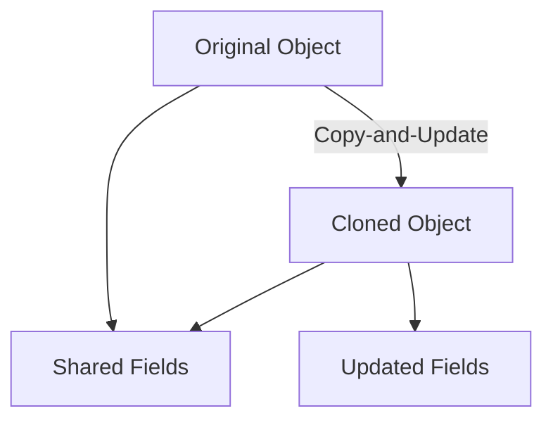

## 4.5 Prototype Pattern

In the realm of software design patterns, the Prototype Pattern is a creational pattern that focuses on the concept of cloning objects. This pattern is particularly useful when the cost of creating a new instance of a class is more expensive than copying an existing instance. In this section, we will delve into the Prototype Pattern, exploring its application in F# and how the language's features make cloning both straightforward and efficient.

### Understanding the Prototype Pattern

The Prototype Pattern is traditionally used to create new objects by cloning existing ones. This approach avoids the overhead associated with instantiating new objects from scratch, which can be resource-intensive, especially in systems where object creation is frequent and complex.

#### Traditional Use Cases

In object-oriented programming (OOP), the Prototype Pattern is often employed in scenarios where:

- **Complex Object Creation**: Objects require significant setup or configuration, making direct instantiation costly.
- **Performance Optimization**: Cloning is faster than creating new instances, especially when the initialization involves complex computations or resource allocations.
- **Dynamic Object Creation**: The system needs to create objects at runtime without knowing their exact types beforehand.

### The F# Advantage: Immutable Data Structures

F# is a functional-first language that emphasizes immutability and functional programming paradigms. This makes the implementation of the Prototype Pattern both intuitive and efficient. Let's explore how F#'s immutable data structures facilitate object cloning.

#### Copy-and-Update Expressions

In F#, records and discriminated unions are immutable by default. To "clone" an object and modify specific fields, we use copy-and-update expressions. This feature allows us to create a new instance of a record with some fields updated, leveraging structural sharing to minimize memory usage.

Here's a simple example:

```fsharp
type Person = { Name: string; Age: int; Address: string }

let originalPerson = { Name = "Alice"; Age = 30; Address = "123 Elm St" }

// Clone the original person and update the age
let updatedPerson = { originalPerson with Age = 31 }

// Output the updated person
printfn "Updated Person: %A" updatedPerson
```

In this example, `updatedPerson` is a clone of `originalPerson`, with the `Age` field updated. The rest of the fields are shared with the original, demonstrating efficient memory usage through structural sharing.

### Benefits of Structural Sharing

Structural sharing is a key concept in functional programming that allows for efficient memory usage. When we clone an object in F#, only the modified parts are duplicated, while the unchanged parts are shared between the original and the clone. This approach reduces the overhead of cloning and enhances performance.

#### Performance and Memory Efficiency

- **Reduced Memory Footprint**: Only the modified fields are stored separately, while the rest are shared.
- **Faster Cloning**: Copy-and-update operations are typically faster than deep copying in OOP, as they avoid duplicating the entire object.

### Scenarios for Prototype Pattern in F#

The Prototype Pattern is applicable in various scenarios within F#, particularly when dealing with configurations or settings that require slight modifications.

#### Example: Configuration Management

Consider a scenario where we have a base configuration for an application, and we need to create multiple variations with minor tweaks.

```fsharp
type AppConfig = { DatabaseUrl: string; MaxConnections: int; Timeout: int }

let baseConfig = { DatabaseUrl = "http://localhost:5432"; MaxConnections = 100; Timeout = 30 }

// Clone the base configuration and modify the timeout
let devConfig = { baseConfig with Timeout = 60 }

// Clone the base configuration and modify the database URL
let prodConfig = { baseConfig with DatabaseUrl = "http://prod-db:5432" }

// Output the configurations
printfn "Dev Config: %A" devConfig
printfn "Prod Config: %A" prodConfig
```

In this example, `devConfig` and `prodConfig` are clones of `baseConfig`, each with specific modifications. This approach is efficient and maintains the immutability of the original configuration.

### Immutability: No Deep or Shallow Copy Concerns

One of the significant advantages of using the Prototype Pattern in F# is the absence of deep and shallow copy concerns. Since data structures are immutable, there is no risk of unintended side effects when cloning objects. Each clone is a distinct entity, ensuring data integrity and consistency.

### Cloning Types with Reference Semantics

While F# excels at handling immutable data, there are cases where you may need to clone types with reference semantics or external resources. In such scenarios, careful consideration is required to ensure that resources are managed correctly.

#### Handling External Resources

When cloning objects that manage external resources (e.g., file handles, network connections), it's crucial to implement proper resource management to avoid leaks or conflicts. This may involve explicitly copying or resetting resource states.

### Simplicity and Efficiency in Functional Programming

The Prototype Pattern in F# exemplifies the simplicity and efficiency of functional programming. By leveraging immutable data structures and structural sharing, we can achieve efficient cloning without the complexities often associated with OOP.

### Try It Yourself

To deepen your understanding, try modifying the code examples provided. Experiment with different record types and explore how copy-and-update expressions can be used to clone and modify objects efficiently. Consider scenarios in your projects where the Prototype Pattern could enhance performance and maintainability.

### Visualizing the Prototype Pattern

To better understand the Prototype Pattern in F#, let's visualize the process using a diagram. This will help illustrate how structural sharing works in practice.



**Caption**: This diagram illustrates the cloning process using the Prototype Pattern in F#. The original object is cloned, with shared fields remaining unchanged and only the updated fields being stored separately.

### References and Further Reading

For more information on the Prototype Pattern and its application in F#, consider exploring the following resources:

- [F# Language Reference](https://docs.microsoft.com/en-us/dotnet/fsharp/)
- [Functional Programming in F#](https://fsharpforfunandprofit.com/)
- [Design Patterns: Elements of Reusable Object-Oriented Software](https://en.wikipedia.org/wiki/Design_Patterns)

### Knowledge Check

Before we conclude, let's reinforce what we've learned about the Prototype Pattern in F#:

- **What is the Prototype Pattern?** A creational pattern used to clone objects.
- **How does F# facilitate cloning?** Through immutable data structures and copy-and-update expressions.
- **What are the benefits of structural sharing?** Reduced memory usage and faster cloning.
- **Why is immutability advantageous in cloning?** It eliminates deep and shallow copy concerns.

### Embrace the Journey

Remember, mastering design patterns in F# is a journey. As you continue to explore and apply these patterns, you'll gain deeper insights into functional programming and its benefits. Keep experimenting, stay curious, and enjoy the process of building robust and efficient applications.

## Quiz Time!



### What is the primary purpose of the Prototype Pattern?

- [x] To create new objects by cloning existing ones
- [ ] To encapsulate object creation logic
- [ ] To define a family of algorithms
- [ ] To separate abstraction from implementation

> **Explanation:** The Prototype Pattern is used to create new objects by cloning existing ones, avoiding the overhead of instantiation.

### How does F# handle cloning of immutable data structures?

- [x] Through copy-and-update expressions
- [ ] By using deep copy methods
- [ ] By implementing custom clone methods
- [ ] By leveraging inheritance

> **Explanation:** F# uses copy-and-update expressions to efficiently clone immutable data structures.

### What is structural sharing in F#?

- [x] A technique to share unchanged parts of data structures between clones
- [ ] A method to share code between modules
- [ ] A way to manage memory allocation
- [ ] A pattern for organizing code

> **Explanation:** Structural sharing allows unchanged parts of data structures to be shared between clones, reducing memory usage.

### Why is immutability beneficial in cloning?

- [x] It eliminates concerns about deep and shallow copies
- [ ] It increases the complexity of cloning
- [ ] It requires additional memory allocation
- [ ] It complicates resource management

> **Explanation:** Immutability ensures that cloned objects are distinct, eliminating deep and shallow copy concerns.

### Which of the following is a scenario where the Prototype Pattern is applicable in F#?

- [x] Duplicating configurations with slight modifications
- [ ] Implementing a singleton instance
- [ ] Managing concurrent operations
- [ ] Abstracting implementation details

> **Explanation:** The Prototype Pattern is useful for duplicating configurations with slight modifications, leveraging F#'s immutability.

### What is the advantage of using copy-and-update expressions in F#?

- [x] Efficient cloning with minimal memory usage
- [ ] Simplified error handling
- [ ] Enhanced type safety
- [ ] Improved runtime performance

> **Explanation:** Copy-and-update expressions allow for efficient cloning with minimal memory usage due to structural sharing.

### How does F# ensure data integrity when cloning objects?

- [x] By using immutable data structures
- [ ] By implementing custom validation logic
- [ ] By enforcing strict type constraints
- [ ] By using runtime checks

> **Explanation:** F#'s immutable data structures ensure data integrity, as cloned objects are distinct and cannot be modified.

### What is a potential challenge when cloning types with reference semantics in F#?

- [x] Managing external resources
- [ ] Ensuring type safety
- [ ] Implementing custom clone methods
- [ ] Handling concurrent modifications

> **Explanation:** Cloning types with reference semantics may require careful management of external resources to avoid conflicts.

### True or False: In F#, deep and shallow copy concerns are eliminated due to immutability.

- [x] True
- [ ] False

> **Explanation:** True. Immutability in F# eliminates deep and shallow copy concerns, as cloned objects are distinct and immutable.

### Which of the following is NOT a benefit of the Prototype Pattern in F#?

- [ ] Efficient cloning
- [ ] Reduced memory usage
- [ ] Faster object creation
- [x] Increased code complexity

> **Explanation:** The Prototype Pattern in F# simplifies cloning and reduces memory usage without increasing code complexity.


