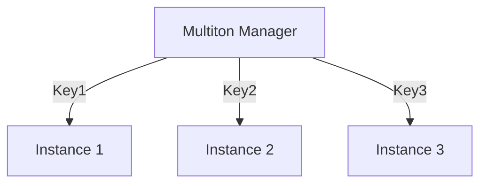

## 4.6 Multiton Pattern

In the realm of software design patterns, the Multiton pattern stands out as a sophisticated approach to managing multiple instances of a class, each identified by a unique key. Unlike the Singleton pattern, which restricts the instantiation of a class to a single object, the Multiton pattern allows for a controlled number of instances, each associated with a specific identifier. This pattern is particularly useful in scenarios where you need to manage a collection of related objects, such as database connections, configuration settings, or resource pools.

### Understanding the Multiton Pattern

The Multiton pattern is essentially an extension of the Singleton pattern. While the Singleton pattern ensures that a class has only one instance, the Multiton pattern allows for multiple instances, each identified by a unique key. This pattern is implemented using a map (or dictionary) to store and retrieve instances based on these keys. 

#### Comparison with Singleton Pattern

- **Singleton Pattern**: Ensures a class has only one instance and provides a global point of access to it.
- **Multiton Pattern**: Manages multiple instances of a class, each identified by a unique key, and provides access to them through a map.

The key difference lies in the management of instances. While the Singleton pattern is suitable for scenarios where a single instance suffices, the Multiton pattern is ideal for managing a set of instances that need to be accessed and managed individually.

### Implementing the Multiton Pattern in F#

In F#, we can leverage immutable maps to implement the Multiton pattern. Immutable maps provide a thread-safe way to store and retrieve instances based on unique identifiers. Let's explore how to implement a Multiton pattern using F#.

#### Using Immutable Maps

F#'s immutable maps are a natural fit for implementing the Multiton pattern. They provide a functional approach to managing collections of key-value pairs, ensuring thread safety and immutability.

```fsharp
module MultitonExample =

    open System.Collections.Immutable

    // Define a type for the instances managed by the Multiton
    type Resource = { Id: string; Data: string }

    // Define a map to store instances
    let mutable instanceMap = ImmutableDictionary<string, Resource>.Empty

    // Function to get or create an instance
    let getInstance key =
        match instanceMap.TryGetValue(key) with
        | true, instance -> instance
        | false, _ ->
            // Create a new instance if it doesn't exist
            let newInstance = { Id = key; Data = "Resource Data" }
            instanceMap <- instanceMap.Add(key, newInstance)
            newInstance

    // Example usage
    let resource1 = getInstance "resource1"
    let resource2 = getInstance "resource2"
    let resource1Again = getInstance "resource1"

    printfn "Resource 1: %A" resource1
    printfn "Resource 2: %A" resource2
    printfn "Resource 1 Again: %A" resource1Again
```

In this example, we define a `Resource` type to represent the instances managed by the Multiton. We use an `ImmutableDictionary` to store these instances, ensuring that the map is thread-safe and immutable. The `getInstance` function retrieves an existing instance or creates a new one if it doesn't exist.

### Initialization Strategies

The Multiton pattern can be initialized either eagerly or lazily, each with its own implications.

#### Eager Initialization

In eager initialization, all instances are created at the start. This approach is simple and ensures that all instances are available immediately. However, it can lead to unnecessary resource consumption if not all instances are needed.

```fsharp
let initializeEagerly keys =
    keys |> List.iter (fun key ->
        let _ = getInstance key
        ())
```

#### Lazy Initialization

Lazy initialization creates instances only when they are needed. This approach is more resource-efficient but requires additional logic to handle instance creation.

```fsharp
let getInstanceLazy key =
    match instanceMap.TryGetValue(key) with
    | true, instance -> instance
    | false, _ ->
        let newInstance = { Id = key; Data = "Resource Data" }
        instanceMap <- instanceMap.Add(key, newInstance)
        newInstance
```

### Use Cases for the Multiton Pattern

The Multiton pattern is particularly useful in scenarios where you need to manage a collection of related objects. Here are some common use cases:

- **Caching**: Store and retrieve cached data identified by unique keys.
- **Database Connections**: Manage a pool of database connections, each identified by a connection string.
- **Resource Pooling**: Manage a pool of resources, such as threads or sockets, identified by unique identifiers.

### Synchronization Considerations

While immutable maps provide thread safety, there may be scenarios where you need to use mutable maps for performance reasons. In such cases, synchronization mechanisms, such as locks or concurrent collections, are necessary to ensure thread safety.

```fsharp
open System.Collections.Concurrent

let mutable concurrentMap = ConcurrentDictionary<string, Resource>()

let getInstanceConcurrent key =
    concurrentMap.GetOrAdd(key, fun _ -> { Id = key; Data = "Resource Data" })
```

### Potential Pitfalls

While the Multiton pattern offers several advantages, it also comes with potential pitfalls:

- **Memory Consumption**: If instances are not properly managed or disposed of, they can lead to increased memory consumption.
- **Complexity**: Managing a collection of instances can add complexity to the codebase.

### Evaluating the Necessity of the Multiton Pattern

Before implementing the Multiton pattern, it's important to evaluate its necessity. Consider F#'s functional alternatives, such as using higher-order functions or leveraging F#'s type system to manage instances.

### Try It Yourself

To deepen your understanding of the Multiton pattern, try modifying the code examples provided. Experiment with different initialization strategies, such as eager or lazy initialization. Consider implementing additional functionality, such as disposing of instances when they are no longer needed.

### Visualizing the Multiton Pattern

Let's visualize the Multiton pattern using a diagram to illustrate the relationship between keys and instances.



In this diagram, the Multiton Manager is responsible for managing instances identified by keys. Each key maps to a unique instance, allowing for efficient management of related objects.

### Knowledge Check

- What is the primary difference between the Singleton and Multiton patterns?
- How can F#'s immutable maps be used to implement the Multiton pattern?
- What are the advantages and disadvantages of eager and lazy initialization?
- In what scenarios is the Multiton pattern particularly useful?
- What synchronization considerations should be taken into account when using mutable maps?

### Embrace the Journey

Remember, mastering design patterns is an ongoing journey. As you continue to explore the Multiton pattern and other design patterns, you'll gain a deeper understanding of how to architect robust, scalable, and maintainable applications using F#. Keep experimenting, stay curious, and enjoy the journey!

## Quiz Time!



### What is the primary difference between the Singleton and Multiton patterns?

- [x] Singleton manages one instance, Multiton manages multiple instances identified by keys.
- [ ] Singleton manages multiple instances, Multiton manages one instance.
- [ ] Both manage a single instance.
- [ ] Both manage multiple instances without keys.

> **Explanation:** The Singleton pattern ensures a class has only one instance, while the Multiton pattern manages multiple instances identified by unique keys.

### How can F#'s immutable maps be used in the Multiton pattern?

- [x] To store and retrieve instances based on unique identifiers.
- [ ] To ensure instances are mutable.
- [ ] To create instances eagerly.
- [ ] To manage a single instance.

> **Explanation:** Immutable maps in F# provide a thread-safe way to store and retrieve instances based on unique identifiers, making them ideal for the Multiton pattern.

### What is a potential disadvantage of eager initialization in the Multiton pattern?

- [x] It can lead to unnecessary resource consumption.
- [ ] It ensures all instances are available immediately.
- [ ] It simplifies the implementation.
- [ ] It reduces memory consumption.

> **Explanation:** Eager initialization creates all instances at the start, which can lead to unnecessary resource consumption if not all instances are needed.

### In what scenarios is the Multiton pattern particularly useful?

- [x] Caching, database connections, resource pooling.
- [ ] Single-instance management.
- [ ] Stateless services.
- [ ] Immutable data structures.

> **Explanation:** The Multiton pattern is useful for managing collections of related objects, such as cached data, database connections, or resource pools.

### What synchronization mechanism can be used with mutable maps in the Multiton pattern?

- [x] Locks or concurrent collections.
- [ ] Immutable maps.
- [ ] Lazy initialization.
- [ ] Eager initialization.

> **Explanation:** When using mutable maps, synchronization mechanisms like locks or concurrent collections are necessary to ensure thread safety.

### What is a potential pitfall of the Multiton pattern?

- [x] Increased memory consumption if instances are not managed properly.
- [ ] Simplified codebase.
- [ ] Reduced complexity.
- [ ] Single-instance management.

> **Explanation:** If instances are not properly managed or disposed of, the Multiton pattern can lead to increased memory consumption.

### How does lazy initialization benefit the Multiton pattern?

- [x] It creates instances only when needed, conserving resources.
- [ ] It creates all instances at the start.
- [ ] It simplifies the implementation.
- [ ] It ensures all instances are available immediately.

> **Explanation:** Lazy initialization creates instances only when they are needed, which is more resource-efficient.

### What is a key consideration when using the Multiton pattern in F#?

- [x] Evaluating the necessity of the pattern and considering functional alternatives.
- [ ] Ensuring all instances are mutable.
- [ ] Using eager initialization exclusively.
- [ ] Avoiding the use of maps.

> **Explanation:** It's important to evaluate the necessity of the Multiton pattern and consider F#'s functional alternatives before implementation.

### How can you modify the provided code to dispose of instances when they are no longer needed?

- [x] Implement a disposal mechanism to remove instances from the map.
- [ ] Use eager initialization.
- [ ] Ensure all instances are immutable.
- [ ] Avoid using maps.

> **Explanation:** To manage memory consumption, implement a disposal mechanism to remove instances from the map when they are no longer needed.

### True or False: The Multiton pattern is a functional programming pattern.

- [ ] True
- [x] False

> **Explanation:** The Multiton pattern is not inherently functional; it can be implemented in both object-oriented and functional programming languages, but it requires careful consideration in functional languages like F# to maintain immutability and thread safety.


