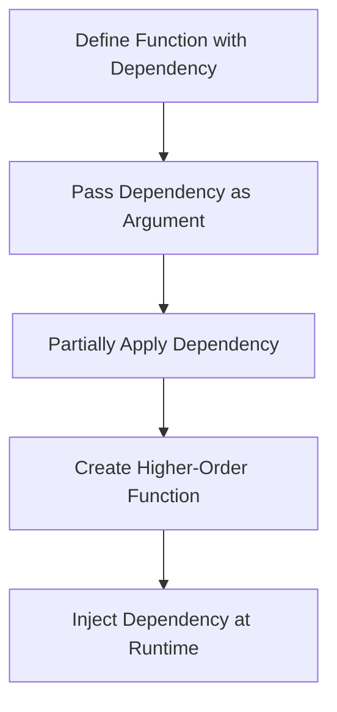

## 4.7 Dependency Injection

In the realm of software design, Dependency Injection (DI) is a powerful pattern that promotes loosely coupled code and enhances testability. While traditionally associated with Object-Oriented Programming (OOP), DI can be effectively implemented in functional programming languages like F#. In this section, we will explore how F# leverages its functional features to achieve DI naturally and idiomatically.

### Understanding Dependency Injection

Dependency Injection is a design pattern used to implement Inversion of Control (IoC), allowing a program to follow the Dependency Inversion Principle. This principle states that high-level modules should not depend on low-level modules; both should depend on abstractions. DI facilitates this by decoupling the creation of an object from its behavior, thereby allowing dependencies to be injected at runtime rather than being hardcoded.

#### Benefits of Dependency Injection

- **Loosely Coupled Code**: By decoupling dependencies, DI allows for more flexible and maintainable code.
- **Improved Testability**: Dependencies can be easily mocked or stubbed during testing, allowing for isolated unit tests.
- **Enhanced Flexibility**: Changes to dependencies can be made without altering the dependent code.

### Dependency Injection in OOP

In OOP, DI is often implemented using frameworks and IoC containers that automatically resolve dependencies. These frameworks provide various methods of injection, such as constructor injection, setter injection, and interface injection. While these tools are powerful, they can introduce complexity and implicit behavior that may not align with the principles of functional programming.

### Functional Alternatives in F#

In F#, we can achieve DI by leveraging functional programming techniques such as passing dependencies explicitly as function arguments, using partial application, and currying. These approaches emphasize explicitness over implicitness, aligning with the functional programming paradigm.

#### Passing Dependencies as Function Arguments

One of the simplest ways to implement DI in F# is by passing dependencies directly as function arguments. This approach is straightforward and makes dependencies explicit, enhancing code readability and maintainability.

```fsharp
// Define a dependency
let logger message = printfn "Log: %s" message

// Define a function that uses the dependency
let processData logger data =
    logger "Processing data..."
    // Process the data
    data |> List.map (fun x -> x * 2)

// Inject the dependency
let result = processData logger [1; 2; 3]
```

In this example, the `logger` function is passed as a dependency to `processData`, making it easy to replace or mock during testing.

#### Partial Application and Currying

Partial application and currying are powerful techniques in functional programming that allow us to inject dependencies into functions by fixing some of their arguments.

```fsharp
// Define a function with multiple parameters
let processData logger data =
    logger "Processing data..."
    data |> List.map (fun x -> x * 2)

// Partially apply the logger dependency
let processWithLogger = processData logger

// Use the partially applied function
let result = processWithLogger [1; 2; 3]
```

Here, `processWithLogger` is a new function created by partially applying the `logger` dependency to `processData`. This technique simplifies the code and makes it easier to manage dependencies.

#### Higher-Order Functions

Higher-order functions, which take other functions as arguments or return them as results, can also be used to implement DI in F#.

```fsharp
// Define a higher-order function that accepts a dependency
let createProcessor logger =
    let process data =
        logger "Processing data..."
        data |> List.map (fun x -> x * 2)
    process

// Create a processor with the logger dependency
let processWithLogger = createProcessor logger

// Use the processor
let result = processWithLogger [1; 2; 3]
```

In this example, `createProcessor` is a higher-order function that returns a new function with the `logger` dependency bound. This approach enhances modularity and reusability.

### Benefits of Functional Dependency Injection

- **Simplicity**: Functional DI is straightforward and avoids the complexity of DI frameworks.
- **Transparency**: Dependencies are explicit, making the code easier to understand and maintain.
- **Ease of Testing**: Dependencies can be easily replaced or mocked, facilitating unit testing.

### Aligning with Functional Programming Principles

Functional programming emphasizes explicitness, immutability, and pure functions. By passing dependencies explicitly and using techniques like partial application, F# developers can achieve DI in a way that aligns with these principles.

#### Explicitness Over Implicitness

Functional DI makes dependencies explicit, reducing the risk of hidden side effects and improving code clarity.

#### Immutability and Pure Functions

By injecting dependencies as arguments, functions remain pure and free from side effects, enhancing reliability and predictability.

### When to Use a Lightweight DI Container

While functional DI is often sufficient, there are scenarios where a lightweight DI container might be helpful, such as when managing complex dependency graphs or integrating with existing OOP codebases.

#### Integrating DI Containers with Functional Code

F# can interoperate with .NET DI containers, allowing developers to leverage existing tools while maintaining functional principles.

```fsharp
// Example of integrating a DI container
open Microsoft.Extensions.DependencyInjection

let configureServices (services: IServiceCollection) =
    services.AddSingleton<ILogger, ConsoleLogger>()
    services.AddSingleton<IProcessor, DataProcessor>()

let serviceProvider = configureServices (new ServiceCollection()).BuildServiceProvider()

let logger = serviceProvider.GetService<ILogger>()
let processor = serviceProvider.GetService<IProcessor>()
```

In this example, we use the .NET `IServiceCollection` to configure services and resolve dependencies, demonstrating how F# can integrate with DI containers when needed.

### Encouraging Functional Dependency Injection

To fully embrace functional programming in F#, we encourage leveraging its features for DI. By using explicit arguments, partial application, and higher-order functions, developers can create flexible, maintainable, and testable code without the overhead of complex frameworks.

### Try It Yourself

Experiment with the code examples provided by modifying the dependencies or adding new functionality. For instance, try replacing the `logger` function with a mock implementation or adding additional processing steps to the `processData` function.

### Visualizing Dependency Injection

To better understand how DI works in F#, let's visualize the process using a flowchart.



This flowchart illustrates the steps involved in implementing DI in F#, from defining functions with dependencies to injecting them at runtime.

### References and Further Reading

- [Dependency Injection in .NET](https://docs.microsoft.com/en-us/dotnet/core/extensions/dependency-injection)
- [Functional Programming in F#](https://fsharp.org/)
- [Partial Application and Currying](https://en.wikipedia.org/wiki/Currying)

### Knowledge Check

- What are the benefits of using Dependency Injection in F#?
- How does functional DI differ from traditional DI in OOP?
- What are some techniques used in F# to achieve DI?

### Embrace the Journey

Remember, this is just the beginning. As you progress, you'll discover more ways to leverage F#'s functional features to create robust and maintainable applications. Keep experimenting, stay curious, and enjoy the journey!

## Quiz Time!



### What is a primary benefit of Dependency Injection?

- [x] Loosely coupled code
- [ ] Increased code complexity
- [ ] Hardcoded dependencies
- [ ] Reduced flexibility

> **Explanation:** Dependency Injection promotes loosely coupled code, making it easier to maintain and test.

### How is Dependency Injection typically implemented in OOP?

- [x] Using frameworks and IoC containers
- [ ] By hardcoding dependencies
- [ ] Through global variables
- [ ] With manual dependency resolution

> **Explanation:** In OOP, DI is commonly implemented using frameworks and IoC containers that manage dependencies automatically.

### What is a functional alternative to DI frameworks in F#?

- [x] Passing dependencies as function arguments
- [ ] Using global state
- [ ] Hardcoding dependencies
- [ ] Ignoring dependencies

> **Explanation:** In F#, dependencies can be passed as function arguments, making them explicit and easy to manage.

### Which technique allows injecting dependencies by fixing some function arguments?

- [x] Partial application
- [ ] Global variables
- [ ] Interface injection
- [ ] Dependency resolution

> **Explanation:** Partial application allows injecting dependencies by fixing some of the function's arguments.

### What is a benefit of using higher-order functions for DI?

- [x] Enhanced modularity and reusability
- [ ] Increased complexity
- [ ] Hardcoded dependencies
- [ ] Reduced testability

> **Explanation:** Higher-order functions enhance modularity and reusability by allowing functions to accept and return other functions.

### How does functional DI align with functional programming principles?

- [x] By emphasizing explicitness and immutability
- [ ] By using global state
- [ ] Through implicit behavior
- [ ] By hardcoding dependencies

> **Explanation:** Functional DI aligns with functional programming principles by making dependencies explicit and maintaining immutability.

### When might a lightweight DI container be helpful in F#?

- [x] When managing complex dependency graphs
- [ ] When hardcoding dependencies
- [ ] For simple applications
- [ ] When avoiding DI

> **Explanation:** A lightweight DI container can be helpful when managing complex dependency graphs or integrating with existing OOP codebases.

### What is a key advantage of passing dependencies explicitly in F#?

- [x] Improved code readability and maintainability
- [ ] Increased code complexity
- [ ] Reduced flexibility
- [ ] Hardcoded dependencies

> **Explanation:** Passing dependencies explicitly improves code readability and maintainability by making them clear and easy to manage.

### Which F# feature can be used to create functions with dependencies bound?

- [x] Higher-order functions
- [ ] Global variables
- [ ] Interface injection
- [ ] Hardcoded dependencies

> **Explanation:** Higher-order functions can be used to create functions with dependencies bound, enhancing modularity and reusability.

### True or False: Functional DI requires complex frameworks to manage dependencies.

- [x] False
- [ ] True

> **Explanation:** Functional DI does not require complex frameworks; it can be achieved using F#'s functional features like explicit arguments and higher-order functions.


