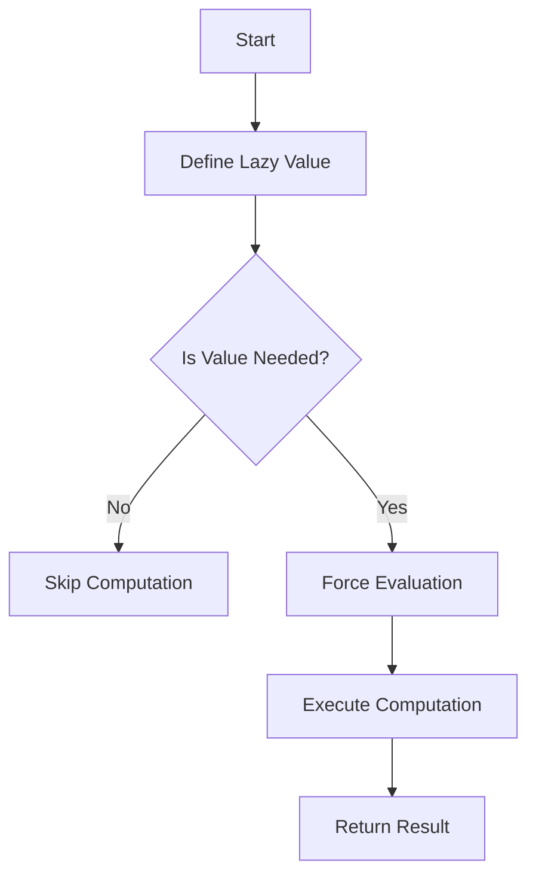

## 4.8 Lazy Initialization

In the realm of software engineering, efficient resource management is paramount. One powerful technique to achieve this is **Lazy Initialization**. This pattern defers the creation of an object or the execution of a computation until it is actually needed, optimizing both resource usage and application performance.

### Understanding Lazy Initialization

Lazy Initialization is a design pattern used to delay the instantiation of an object until the point at which it is needed. This can lead to significant performance improvements, especially in scenarios where the initialization process is resource-intensive or the object may not be used at all during the program's execution.

#### Advantages of Lazy Initialization

1. **Optimized Resource Usage**: By deferring the creation of objects, applications can save memory and CPU resources, particularly when dealing with expensive operations or large data sets.
2. **Improved Performance**: Applications can benefit from faster startup times since resources are allocated only when necessary.
3. **Reduced Load Times**: In scenarios where not all components are needed immediately, lazy initialization can help reduce initial load times.
4. **Scalability**: It allows applications to scale more effectively by managing resources dynamically.

### The `lazy` Keyword in F#

In F#, lazy initialization is facilitated by the `lazy` keyword. This keyword creates a lazy value, which is a computation that is not executed until its result is needed. Let's explore how to use the `lazy` keyword to create and manage lazy values.

#### Creating Lazy Values

To create a lazy value in F#, you use the `lazy` keyword followed by an expression. This expression is not evaluated immediately but is instead stored as a computation to be executed later.

```fsharp
let lazyValue = lazy (printfn "Computing..."; 42)
```

In this example, the expression `printfn "Computing..."; 42` is wrapped in a lazy computation. The message "Computing..." will not be printed until the lazy value is evaluated.

#### Forcing Evaluation

To evaluate a lazy value and obtain its result, you use the `Lazy.force` function. This triggers the computation and returns the result.

```fsharp
let result = Lazy.force lazyValue
```

Upon calling `Lazy.force`, the message "Computing..." is printed, and the result `42` is returned.

### Preventing Unnecessary Computations

Lazy evaluation is particularly useful in preventing unnecessary computations. Consider a scenario where you have a computationally expensive operation that may not always be needed.

```fsharp
let expensiveComputation = lazy (printfn "Performing expensive computation"; 1000 * 1000)

let useComputation condition =
    if condition then
        let result = Lazy.force expensiveComputation
        printfn "Result: %d" result
    else
        printfn "Computation not needed"
```

In this example, the expensive computation is only performed if the `condition` is true, avoiding unnecessary processing.

### Use Cases for Lazy Initialization

Lazy Initialization is versatile and can be applied in various scenarios:

1. **Loading Configuration Data**: Delay loading configuration files until they are needed, reducing startup time.
2. **Initializing Heavy Resources**: Postpone the initialization of heavy resources like database connections or large data structures until they are required.
3. **Implementing Infinite Sequences**: Generate elements of an infinite sequence on-demand, conserving memory.

#### Example: Lazy Configuration Loading

```fsharp
let loadConfig = lazy (printfn "Loading configuration"; ["key1", "value1"; "key2", "value2"])

let getConfigValue key =
    let config = Lazy.force loadConfig
    List.tryFind (fun (k, _) -> k = key) config
```

Here, the configuration is only loaded when `getConfigValue` is called for the first time.

### Handling Exceptions in Lazy Evaluation

When using lazy initialization, it's crucial to handle exceptions that may occur during the evaluation of a lazy value. If an exception is thrown, it will propagate when the lazy value is forced.

```fsharp
let riskyComputation = lazy (raise (System.Exception("Error during computation")))

try
    let result = Lazy.force riskyComputation
    printfn "Result: %d" result
with
| ex -> printfn "Caught exception: %s" ex.Message
```

In this example, the exception is caught and handled gracefully.

### Thread Safety Considerations

When lazy values are accessed from multiple threads, thread safety becomes a concern. F#'s `Lazy<T>` type is thread-safe by default, meaning that the computation is only executed once, even if multiple threads attempt to force the value simultaneously.

```fsharp
let threadSafeLazyValue = lazy (printfn "Thread-safe computation"; 42)

let parallelAccess () =
    [1..10]
    |> List.map (fun _ -> async { return Lazy.force threadSafeLazyValue })
    |> Async.Parallel
    |> Async.RunSynchronously
    |> ignore
```

In this example, the computation is performed only once, despite being accessed concurrently by multiple threads.

### Memory Management and Retaining References

One potential issue with lazy initialization is retaining references longer than necessary, leading to memory leaks. To mitigate this, ensure that lazy values are released when no longer needed.

#### Example: Releasing Lazy Values

```fsharp
let createLazyValue () =
    let lazyValue = lazy (printfn "Creating resource"; new System.IO.MemoryStream())
    lazyValue

let useLazyValue () =
    let lazyValue = createLazyValue()
    let resource = Lazy.force lazyValue
    resource.Dispose()
```

In this example, the resource is disposed of after use, preventing memory leaks.

### Best Practices for Lazy Initialization

1. **Combine with Immutability**: Use lazy initialization with immutable data structures to ensure predictable behavior.
2. **Balance Complexity**: Weigh the performance gains against the added complexity of managing lazy values.
3. **Monitor Resource Usage**: Keep an eye on memory and CPU usage to ensure lazy initialization is providing the desired benefits.

### Try It Yourself

To deepen your understanding of lazy initialization, try modifying the examples provided:

- Change the condition in the `useComputation` function to see how it affects the execution of the expensive computation.
- Experiment with different types of resources in the `createLazyValue` function and observe how they are managed.
- Implement a lazy value that generates an infinite sequence and explore how it can be used in practice.

### Visualizing Lazy Initialization

To better understand the flow of lazy initialization, let's visualize the process using a diagram.



**Diagram Description**: This flowchart illustrates the process of lazy initialization. The lazy value is defined, and the computation is only executed if the value is needed, optimizing resource usage.

### Conclusion

Lazy Initialization is a powerful pattern that can significantly enhance the efficiency and performance of your F# applications. By deferring computations until necessary, you can optimize resource usage, reduce load times, and improve scalability. However, it's crucial to balance these benefits with the complexity introduced by lazy values, ensuring that your applications remain maintainable and efficient.

Remember, this is just the beginning. As you continue to explore and experiment with lazy initialization, you'll uncover new ways to optimize your applications and create more efficient, scalable software solutions. Keep experimenting, stay curious, and enjoy the journey!

## Quiz Time!



### What is the primary advantage of lazy initialization?

- [x] Optimizes resource usage by deferring object creation until needed.
- [ ] Simplifies code by reducing the number of lines.
- [ ] Increases the speed of all computations.
- [ ] Ensures thread safety by default.

> **Explanation:** Lazy initialization optimizes resource usage by delaying the creation of objects until they are actually needed, which can lead to performance improvements.

### How do you create a lazy value in F#?

- [x] Using the `lazy` keyword followed by an expression.
- [ ] By declaring a variable with `let mutable`.
- [ ] Using the `async` keyword.
- [ ] By wrapping the expression in a `try...with` block.

> **Explanation:** In F#, you create a lazy value using the `lazy` keyword followed by the expression you want to defer.

### How can you force the evaluation of a lazy value in F#?

- [x] Using the `Lazy.force` function.
- [ ] By calling `evaluate` on the lazy value.
- [ ] By using the `force` keyword.
- [ ] By accessing the value directly.

> **Explanation:** The `Lazy.force` function is used to evaluate a lazy value and obtain its result.

### What should you consider when using lazy initialization in a multi-threaded environment?

- [x] Ensure thread safety, as lazy values may be accessed from multiple threads.
- [ ] Avoid using lazy values altogether.
- [ ] Use only immutable data structures.
- [ ] Ensure lazy values are always evaluated in the main thread.

> **Explanation:** In a multi-threaded environment, it's important to ensure that lazy values are thread-safe, as they may be accessed concurrently.

### What is a potential downside of lazy initialization?

- [x] Retaining references longer than necessary, leading to memory leaks.
- [ ] Increasing the complexity of simple computations.
- [ ] Making code less readable.
- [ ] Reducing the overall performance of the application.

> **Explanation:** Lazy initialization can lead to memory leaks if references to lazy values are retained longer than necessary.

### Which of the following is a common use case for lazy initialization?

- [x] Loading configuration data only when needed.
- [ ] Initializing all resources at application startup.
- [ ] Performing computations in parallel.
- [ ] Simplifying error handling.

> **Explanation:** Lazy initialization is commonly used to load configuration data only when it is needed, optimizing resource usage.

### How can you handle exceptions in lazy evaluation?

- [x] Use a `try...with` block around the `Lazy.force` call.
- [ ] Avoid using lazy values in scenarios where exceptions might occur.
- [ ] Use the `catch` keyword within the lazy expression.
- [ ] Ensure the lazy value is always evaluated successfully.

> **Explanation:** Exceptions can be handled by using a `try...with` block around the `Lazy.force` call to catch and manage any errors.

### What is a best practice when using lazy initialization?

- [x] Combine lazy initialization with immutability for predictable behavior.
- [ ] Use lazy initialization for all computations.
- [ ] Avoid using lazy initialization in performance-critical applications.
- [ ] Always evaluate lazy values at application startup.

> **Explanation:** Combining lazy initialization with immutability ensures predictable behavior and helps manage complexity.

### Why might lazy initialization improve application performance?

- [x] It reduces initial load times by deferring resource allocation.
- [ ] It simplifies the codebase, making it easier to maintain.
- [ ] It increases the speed of all computations.
- [ ] It ensures that all resources are initialized at startup.

> **Explanation:** Lazy initialization can improve performance by reducing initial load times and deferring resource allocation until necessary.

### True or False: Lazy values in F# are thread-safe by default.

- [x] True
- [ ] False

> **Explanation:** Lazy values in F# are thread-safe by default, meaning that the computation is only executed once, even if accessed by multiple threads.


